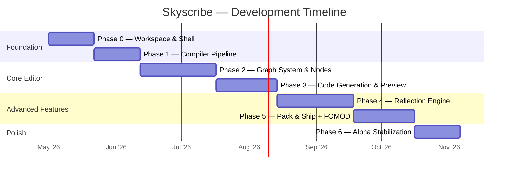

# Skyscribe — Project Roadmap
> **Skyrim Visual Script IDE** | Native C++/ImGui Modding Toolchain
> Status: `PRE-ALPHA` | Last Updated: 2026-05-01

---

## Table of Contents

1. [Vision](#1-vision)
2. [Tech Stack & Compatibility Matrix](#2-tech-stack--compatibility-matrix)
3. [Architecture Overview](#3-architecture-overview)
4. [C++ Project Structure](#4-c-project-structure)
5. [External Dependencies](#5-external-dependencies)
6. [Milestone Overview](#6-milestone-overview)
7. [Phase Details](#7-phase-details)
8. [Built-in Node Library](#8-built-in-node-library)
9. [Papyrus Language Coverage](#9-papyrus-language-coverage)
10. [Multi-Script Project Model](#10-multi-script-project-model)
11. [Code Generation Edge Cases](#11-code-generation-edge-cases)
12. [Script Identity Model](#12-script-identity-model)
13. [Testing Strategy](#13-testing-strategy)
14. [FOMOD & Distribution Packaging](#14-fomod--distribution-packaging)
15. [Node Versioning & Migration](#15-node-versioning--migration)
16. [Performance Budgets](#16-performance-budgets)
17. [VCS Friendliness](#17-vcs-friendliness)
18. [Node Definition System](#18-node-definition-system)
19. [User-Defined Functions](#19-user-defined-functions)
20. [Compiler Flag Files](#20-compiler-flag-files)
21. [Property System](#21-property-system)
22. [Settings Schema](#22-settings-schema)
23. [Undo/Redo Architecture](#23-undoredo-architecture)
24. [Tool Palette UX & Node Picker](#24-tool-palette-ux--node-picker)
25. [Compiler Import Directories](#25-compiler-import-directories)
26. [BSA v105 Binary Format](#26-bsa-v105-binary-format)
27. [Clipboard — Copy, Cut & Paste](#27-clipboard--copy-cut--paste)
28. [Canvas UX — Navigation, Selection & Alignment](#28-canvas-ux--navigation-selection--alignment)
29. [In-App Lint & Error Display](#29-in-app-lint--error-display)
32. [First-Run Wizard](#32-first-run-wizard)
33. [Project Save / Open / New Lifecycle](#33-project-save--open--new-lifecycle)
34. [Unsaved Changes & Autosave](#34-unsaved-changes--autosave)
35. [Canvas Tab Management](#35-canvas-tab-management)
36. [Compiler Output Parsing](#36-compiler-output-parsing)
37. [Pin Type System Completeness](#37-pin-type-system-completeness)
38. [None / Null Handling in Code Generation](#38-none--null-handling-in-code-generation)
39. [Window Layout & Docking Persistence](#39-window-layout--docking-persistence)
42. [Node Inspector / Properties Panel](#42-node-inspector--properties-panel)
43. [Script Compilation Order & Dependency Resolution](#43-script-compilation-order--dependency-resolution)
44. [Output `.pex` File Targeting](#44-output-pex-file-targeting)
45. [CompilerWrapper Error Handling](#45-compilerwrapper-error-handling)
46. [Settings UI Layout](#46-settings-ui-layout)
47. [New Project Template System](#47-new-project-template-system)
48. [Comment / Annotation Nodes](#48-comment--annotation-nodes)
49. [Node Grouping / Frame Nodes](#49-node-grouping--frame-nodes)
50. [Help System & About Dialog](#50-help-system--about-dialog)
53. [Execution-Flow Linearization Algorithm](#53-execution-flow-linearization-algorithm)
54. [If / Else & While Code Generation](#54-if--else--while-code-generation)
55. [Variable Scope Model](#55-variable-scope-model)
56. [Cross-Script Function References](#56-cross-script-function-references)
57. [Pre-Compile Validation Checklist](#57-pre-compile-validation-checklist)
58. [Project Panel Interactions](#58-project-panel-interactions)
59. [SKSE Node Library Auto-Discovery](#59-skse-node-library-auto-discovery)
60. [Canvas Node Search](#60-canvas-node-search)
61. [Timer Node Pattern](#61-timer-node-pattern)
64. [Self Pin & Self Keyword](#64-self-pin--self-keyword)
65. [Papyrus Import Statement Generation](#65-papyrus-import-statement-generation)
66. [Event Parameter Output Pins](#66-event-parameter-output-pins)
67. [Parent Method Call Pattern](#67-parent-method-call-pattern)
68. [None Literal Node](#68-none-literal-node)
69. [Math & Logic Operator Code Generation](#69-math--logic-operator-code-generation)
70. [SE vs AE Compilation Target](#70-se-vs-ae-compilation-target)
71. [String Operations & Number-to-String Conversion](#71-string-operations--number-to-string-conversion)
72. [Temp Variable Reuse & Multi-Consumer Codegen](#72-temp-variable-reuse--multi-consumer-codegen)
73. [Per-Canvas Zoom & Pan Persistence](#73-per-canvas-zoom--pan-persistence)
74. [Inline Text Edit Undo Granularity](#74-inline-text-edit-undo-granularity)
75. [Compiler Invocation Sequence](#75-compiler-invocation-sequence)
76. [Cross-Script Clipboard Paste](#76-cross-script-clipboard-paste)
77. [Wire Drag Snapping & Pin Feedback](#77-wire-drag-snapping--pin-feedback)
78. [Accessibility](#78-accessibility)
79. [Telemetry & Data Privacy](#79-telemetry--data-privacy)
80. [Node, Pin & Connection Identity](#80-node-pin--connection-identity)
81. [Project File Schema Reference](#81-project-file-schema-reference)
82. [Flatbuffers Binary Save Format](#82-flatbuffers-binary-save-format)
83. [Compile Output Overwrite Policy](#83-compile-output-overwrite-policy)
84. [No-Project-Open UI State](#84-no-project-open-ui-state)
85. [Array Type & Iteration Design (v1.x Preview)](#85-array-type--iteration-design-v1x-preview)
86. [Canvas Background Context Menu](#86-canvas-background-context-menu)
87. [Output Panel Behaviour Details](#87-output-panel-behaviour-details)
88. [Recent Projects Access](#88-recent-projects-access)
89. [Window Title Bar Format](#89-window-title-bar-format)
90. [Keyboard Shortcut Master List](#90-keyboard-shortcut-master-list)
91. [Autosave Write Semantics & Status Indicator](#91-autosave-write-semantics--status-indicator)
92. [Settings File Corruption & Recovery](#92-settings-file-corruption--recovery)
93. [Per-Tab Undo Stack Architecture](#93-per-tab-undo-stack-architecture)
94. [Wire Routing Algorithm](#94-wire-routing-algorithm)
95. [Grid Visibility & Node Snapping Algorithm](#95-grid-visibility--node-snapping-algorithm)
96. [Font, Distribution & Update Mechanism](#96-font-distribution--update-mechanism)
97. [Script Identity Bar UI, Tooltips & Disabled Nodes](#97-script-identity-bar-ui-tooltips--disabled-nodes)
98. [Return Node Specification](#98-return-node-specification)
99. [Compile-All Sequencing & Parallelism](#99-compile-all-sequencing--parallelism)
100. [Status Bar Layout](#100-status-bar-layout)
101. [Save As Flow & Autosave File Disposition](#101-save-as-flow--autosave-file-disposition)
102. [Conditional Data-Flow Pattern & New Project Template Flow](#102-conditional-data-flow-pattern--new-project-template-flow)
103. [Cast Node Specification](#103-cast-node-specification)
104. [Multi-Node Delete & Wire Cleanup](#104-multi-node-delete--wire-cleanup)
105. [Reroute Nodes, Struct Nodes & Array Scope Boundary](#105-reroute-nodes-struct-nodes--array-scope-boundary)
106. [Node Context Menu, Forward-Incompatible Schema & Arrow Key Behaviour](#106-node-context-menu-forward-incompatible-schema--arrow-key-behaviour)
107. [Champollion Integration & Decompiled Import Workflow](#107-champollion-integration--decompiled-import-workflow)
108. [EditorID Catalog & xEdit / Plugin Data Integration](#108-editorid-catalog--xedit--plugin-data-integration)
109. [Papyrus Log Tracing & Visual Debugging](#109-papyrus-log-tracing--visual-debugging)
110. [Build & Deploy to Mod Organizer 2](#110-build--deploy-to-mod-organizer-2)
111. [Data-Driven Framework Outputs (SPID / BOS / KID)](#111-data-driven-framework-outputs-spid--bos--kid)
62. [Risk Register](#62-risk-register)
63. [Glossary](#63-glossary)

---

## 1. Vision

**Skyscribe** is a native, high-performance Visual Script IDE targeting *The Elder Scrolls V: Skyrim Special/Anniversary Edition* modders. It bridges the gap between visual, node-based logic and the Papyrus scripting ecosystem — handling code generation, compilation, dependency tracking, and mod packaging in one unified tool.

### Core Value Propositions

```
┌─────────────────────────────────────────────────────────────────────────┐
│                                                                         │
│   NO-CODE ENTRY         TRANSPARENT              ONE-CLICK SHIP         │
│   ─────────────         ───────────              ────────────           │
│   Blueprint-style       Live .psc preview        Full mod packaging     │
│   node graph            teaches Papyrus          .zip / .bsa / FOMOD    │
│   replaces manual       while you build          from inside the IDE    │
│   authoring                                                             │
│                         REFLECTION                                      │
│                         ──────────                                      │
│                         Import any .psc                                 │
│                         → instant nodes                                 │
│                         for 3rd-party mods                              │
└─────────────────────────────────────────────────────────────────────────┘
```

### Target Audiences

| Audience | Pain Point Solved |
|----------|-------------------|
| **Creative beginners** | Papyrus syntax and toolchain setup are blocking creativity |
| **Experienced scripters** | Rapid prototyping without manual boilerplate |
| **SKSE developers** | Expose C++ DLL functions visually to the community |

---

## 2. Tech Stack & Compatibility Matrix

### Resolved Stack

| Component | Library | Version | License | Repo |
|-----------|---------|---------|---------|------|
| Language | C++ | **C++17** min | — | `std::filesystem` required |
| Build System | CMake | **≥ 3.21** | BSD | cmake.org |
| Package Manager | vcpkg | latest | MIT | microsoft/vcpkg |
| UI Framework | Dear ImGui (docking) | ≥ 1.90 | MIT | ocornut/imgui |
| Node Editor | imgui-node-editor | latest | MIT | thedmd/imgui-node-editor |
| Code Editor | ImGuiColorTextEdit | latest | MIT | santaclose/ImGuiColorTextEdit |
| Graphics Backend | DirectX 11 | D3D11 | — | Windows SDK |
| JSON | nlohmann/json | ≥ 3.11 | MIT | nlohmann/json |
| Binary Serialization | Flatbuffers | ≥ 23.x | Apache-2.0 | google/flatbuffers |
| Metadata DB | SQLite | ≥ 3.45 | Public Domain | sqlite.org |
| Archiving | libarchive | ≥ 3.7 | BSD-2 | libarchive/libarchive |
| Testing | Catch2 | ≥ 3.x | BSL-1.0 | catchorg/Catch2 |

### Compatibility Decisions

> **imgui-node-editor** chosen over ImNodes — supports zoom/pan, Blueprint-style theming, and style overrides. ImNodes is too minimal for a professional surface.

> **DirectX 11 fixed** — DX12 removed. ImGui's DX12 backend is boilerplate-heavy with zero visual gain for a 2D tool.

> **SQLite + Flatbuffers have separate, non-overlapping roles:**
> - SQLite → queryable metadata cache for scanned `.psc` signatures
> - Flatbuffers → fast binary project files (`.skyscribe`)

> **`.ba2` removed** — Skyrim SE/AE uses `.bsa` v105 only. `.ba2` is Fallout 4/Starfield.

> **santaclose/ImGuiColorTextEdit** — original BalazsJako repo is abandoned and incompatible with recent ImGui.

> **C++17 minimum** — needed for `std::filesystem`, structured bindings, `std::optional`.

> **Catch2** added — required for the testing strategy defined in §13.

---

## 3. Architecture Overview

### Component Diagram

```
╔═════════════════════════════════════════════════════════════════════════╗
║                          Skyscribe Application                          ║
║                                                                         ║
║  ┌────────────────┐    ┌───────────────────────┐    ┌───────────────┐  ║
║  │  Tool Palette  │    │     Graph Editor       │    │ Live Preview  ║  ║
║  │                │    │  (imgui-node-editor)   │    │ (ColorTextEdit║  ║
║  │  [Built-in]    │◄───│                        │───►│ + Papyrus     ║  ║
║  │  [SKSE]        │    │  ScriptNode            │    │   Lexer)      ║  ║
║  │  [3rd Party]   │    │  Pin  Connection       │    │               ║  ║
║  └────────────────┘    └──────────┬────────────┘    └───────────────┘  ║
║                                   │                                     ║
║                          ┌────────▼────────┐                           ║
║                          │ Code Generation  │                           ║
║                          │ Graph Traversal  │                           ║
║                          │ → String Builder │                           ║
║                          │ → Dirty Flag     │                           ║
║                          └───┬─────┬────┬──┘                           ║
║                              │     │    │                               ║
║              ┌───────────────┘     │    └──────────────────┐           ║
║              ▼                     ▼                        ▼           ║
║  ┌──────────────────┐  ┌──────────────────┐  ┌────────────────────┐   ║
║  │ Compiler Wrapper │  │ Reflection Engine│  │   Pack & Ship      ║   ║
║  │                  │  │                  │  │                    ║   ║
║  │  CreateProcess   │  │  .psc Lexer      │  │  VFS Tracker       ║   ║
║  │  → .pex output   │  │  AST Parser      │  │  Dep. Analyzer     ║   ║
║  │  stderr capture  │  │  SQLite Cache    │  │  libarchive        ║   ║
║  └──────────────────┘  │  Type Registry   │  │  FOMOD Generator   ║   ║
║                         └──────────────────┘  └────────────────────┘   ║
╚═════════════════════════════════════════════════════════════════════════╝
```

### Data Flow

```
  User Action (drag / connect / type)
          │
          ▼
    Graph Mutation
    (ScriptNode / Pin / Connection)
          │
          ▼
    ┌─────────────┐
    │  Dirty Flag │  ◄── only regenerate on actual change
    └──────┬──────┘
           │
           ▼
    Graph Traversal
    (DFS from Event Node along Execution-Flow)
           │
           ├──► String Builder ──► .psc string ──► ImGuiColorTextEdit
           │
           └──► [ Compile Button ] ──► CompilerWrapper
                                               │
                                               ▼
                                    PapyrusCompiler.exe
                                               │
                                        .pex bytecode
```

### Project File Layout (on disk)

```
MyMod/                          ← project root
├── MyMod.skyscribe             ← Flatbuffers binary (graph + settings)
├── MyMod.skyscribe.json        ← VCS-friendly JSON mirror (auto-generated)
├── metadata.db                 ← SQLite cache (gitignored)
├── scripts/
│   ├── source/
│   │   ├── MyQuestScript.psc   ← generated Papyrus source
│   │   └── MyActorScript.psc
│   └── compiled/
│       ├── MyQuestScript.pex   ← compiled bytecode
│       └── MyActorScript.pex
└── dist/
    ├── MyMod.zip               ← ready-to-install archive
    └── MyMod-fomod/            ← optional FOMOD package
```

---

## 4. C++ Project Structure

```
skyscribe/
├── CMakeLists.txt
├── vcpkg.json
├── vcpkg-configuration.json
│
├── src/
│   ├── main.cpp                        ← entry point, app loop
│   │
│   ├── app/
│   │   ├── Application.h / .cpp        ← top-level orchestrator
│   │   ├── Settings.h / .cpp           ← persistent config (config.json)
│   │   └── Logger.h / .cpp             ← LOG_INFO / LOG_WARN / LOG_ERR
│   │
│   ├── ui/
│   │   ├── MainWindow.h / .cpp         ← ImGui docking layout
│   │   ├── GraphEditorPanel.h / .cpp   ← node canvas (imgui-node-editor)
│   │   ├── ToolPalettePanel.h / .cpp   ← searchable node sidebar
│   │   ├── PreviewPanel.h / .cpp       ← live .psc viewer
│   │   ├── CompilerOutputPanel.h/.cpp  ← compiler stdout/stderr
│   │   ├── SettingsDialog.h / .cpp     ← path configuration
│   │   └── FirstRunWizard.h / .cpp     ← first-launch setup
│   │
│   ├── graph/
│   │   ├── ScriptGraph.h / .cpp        ← top-level graph container
│   │   ├── ScriptNode.h / .cpp         ← node definition + pin list
│   │   ├── Pin.h / .cpp                ← typed pin (exec / data)
│   │   ├── Connection.h / .cpp         ← pin-to-pin link
│   │   ├── NodeRegistry.h / .cpp       ← all known node types
│   │   └── UndoStack.h / .cpp          ← command pattern undo/redo
│   │
│   ├── codegen/
│   │   ├── GraphTraversal.h / .cpp     ← DFS execution-flow walker
│   │   ├── PapyrusStringBuilder.h/.cpp ← emits .psc text
│   │   ├── DirtyFlag.h                 ← change-tracking helper
│   │   └── PapyrusLexer.h / .cpp       ← syntax highlighting tokens
│   │
│   ├── parser/
│   │   ├── Lexer.h / .cpp              ← .psc tokenizer
│   │   ├── AstParser.h / .cpp          ← builds AST from tokens
│   │   ├── AstNodes.h                  ← AST node types (structs)
│   │   └── TypeRegistry.h / .cpp       ← inheritance + assignability
│   │
│   ├── reflection/
│   │   ├── ReflectionEngine.h / .cpp   ← orchestrates import pipeline
│   │   ├── MetadataCache.h / .cpp      ← SQLite read/write layer
│   │   └── DynamicNodeFactory.h / .cpp ← AST → NodeRegistry entries
│   │
│   ├── compiler/
│   │   └── CompilerWrapper.h / .cpp    ← CreateProcess + result capture
│   │
│   ├── packaging/
│   │   ├── VirtualFileSystem.h / .cpp  ← project file tracker
│   │   ├── DependencyAnalyzer.h / .cpp ← graph → required mods list
│   │   ├── ArchiveBuilder.h / .cpp     ← libarchive .zip wrapper
│   │   ├── BsaPacker.h / .cpp          ← BSA v105 writer
│   │   ├── FomodGenerator.h / .cpp     ← ModuleConfig.xml emitter
│   │   └── ManifestWriter.h / .cpp     ← info.xml / requirements.txt
│   │
│   └── serialization/
│       ├── ProjectSerializer.h / .cpp  ← Flatbuffers .skyscribe r/w
│       └── JsonMirror.h / .cpp         ← VCS JSON export
│
├── tests/
│   ├── CMakeLists.txt
│   ├── test_codegen.cpp
│   ├── test_parser.cpp
│   ├── test_type_registry.cpp
│   ├── test_graph_serialization.cpp
│   └── test_packaging.cpp
│
├── assets/
│   └── fonts/                          ← embedded ImGui fonts
│
└── third_party/                        ← vcpkg / git submodules
    ├── imgui/
    ├── imgui-node-editor/
    └── ImGuiColorTextEdit/
```

### Module Dependency Rules

```
  ui  ──────────────►  graph
   │                     │
   │                     ▼
   │                  codegen  ◄──  parser
   │                     │
   └──────────────►  compiler
                         
  reflection  ──────►  parser
       │
       ▼
  packaging  ──────►  graph (read-only VFS view)

  serialization  ──►  graph (read/write)

  app  ─────────────► everything (orchestration only)
```

> **Rule:** No module except `app` may include from more than two other modules. `ui` never directly calls `packaging` — it goes through `app`.

### 4.1 Addendum — Files Added by Later Sections

The original §4 tree was written before §84–§111 were planned. The following files must be added to the layout. All paths are relative to `src/`.

**`ui/` additions:**

| File | Added by | Purpose |
|------|----------|---------|
| `ProjectPanel.h / .cpp` | §10, §35 | Project Panel sidebar (script/library/spec hierarchy) |
| `InspectorPanel.h / .cpp` | §21, §38 | Property inspector for selected node pins and defaults |
| `WelcomeCard.h / .cpp` | §84 | No-project-open welcome screen with recent projects list |
| `LogViewerPanel.h / .cpp` | §109 | Log Viewer tab: tail worker bridge, line styling, click-to-navigate |
| `ImportResultsPanel.h / .cpp` | §107.7 | "Import Results" dockable panel for batch `.pex` import outcomes |

**`graph/` additions:**

| File | Added by | Purpose |
|------|----------|---------|
| `DistributionSpec.h / .cpp` | §111 | Distribution Spec graph container (data-only declarative nodes) |

**`codegen/` additions:**

| File | Added by | Purpose |
|------|----------|---------|
| `SourceMapWriter.h / .cpp` | §109.2 | Emits `{ScriptName}.skyscribe.map.json` alongside compiled `.psc` |
| `SpidEmitter.h / .cpp` | §111 | SPID `_DISTR.ini` line emitter |
| `BosEmitter.h / .cpp` | §111 | BOS `_SWAP.ini` line emitter |
| `KidEmitter.h / .cpp` | §111 | KID `_KID.ini` line emitter |
| `DistributionEmitter.h` | §111 | Abstract base class / interface for all distribution emitters |

**`compiler/` additions:**

| File | Added by | Purpose |
|------|----------|---------|
| `ChampollionWrapper.h / .cpp` | §107 | `CreateProcess` wrapper for `Champollion.exe`; stdout/stderr capture |

**`reflection/` additions:**

| File | Added by | Purpose |
|------|----------|---------|
| `EditorIdCatalog.h / .cpp` | §108 | SQLite-backed EditorID catalog: import, query, duplicate resolution |
| `LibraryImportManager.h / .cpp` | §107 | Manages `libraries[]` lifecycle: add, remove, hash-check, stale reconcile |

**`packaging/` additions:**

| File | Added by | Purpose |
|------|----------|---------|
| `DeployManager.h / .cpp` | §110 | Mirror-to-MO2 deploy: compile trigger, manifest r/w, clean owned files |

**`tests/` additions:**

| File | Added by |
|------|----------|
| `test_champollion.cpp` | §107 |
| `test_editor_id_catalog.cpp` | §108 |
| `test_log_source_map.cpp` | §109.2 |
| `test_build_deploy.cpp` | §110 |
| `test_distribution_spec.cpp` | §111 |

**Updated module dependency diagram** (additions highlighted with `*`):

```
  ui  ──────────────►  graph
   │                     │
   │                     ▼
   │                  codegen  ◄──  parser
   │                     │
   └──────────────►  compiler
   
  * ui  ─────────────►  reflection   (EditorID picker, library panel)
  * ui  ─────────────►  packaging    (via app only — DeployManager)

  reflection  ──────►  parser
       │
       ▼
  packaging  ──────►  graph (read-only VFS view)
  * packaging  ─────►  codegen       (distribution emitters)

  serialization  ──►  graph (read/write)

  app  ─────────────► everything (orchestration only)
```

> **Rule preserved:** `ui` still never directly calls `packaging` — the `DeployManager` is invoked through `app`. The `ui` → `reflection` edge is new and valid (EditorID picker and library panel read from catalog; no write path from `ui` to `reflection`).

---

## 5. External Dependencies

> These are **not** managed by vcpkg — the user must configure them in the Settings UI.

| Dependency | Role | Acquire From |
|------------|------|-------------|
| **Skyrim Creation Kit** | Ships `PapyrusCompiler.exe` + flag files | Steam / Bethesda Launcher |
| **Skyrim SE/AE `Data/` folder** | Source import, output staging | Skyrim install directory |
| **SKSE64** (optional) | Reflection of SKSE Papyrus sources | skse.silverlock.org |
| **Windows 10 / 11** | D3D11, `CreateProcess`, Win32 API | Hard OS requirement |

---

## 6. Milestone Overview



### Milestone Summary

| # | Milestone | Exit Criteria |
|---|-----------|---------------|
| **M0** | Workspace & Build Shell | App window opens; DX11 + ImGui renders at ≥60fps |
| **M1** | Compiler Integration | `.psc` → `.pex` round-trip confirmed in-app |
| **M2** | Interactive Node Graph | Nodes drag; pins connect with type safety; JSON save/load |
| **M3** | Live Papyrus Preview | Graph change → `.psc` update in real time |
| **M4** | Reflection Engine | Third-party `.psc` produces usable palette nodes |
| **M5** | Pack & Ship + FOMOD | One-click generates `.zip` and FOMOD package |
| **M6** | Alpha Release | No P0 bugs; crash reporter active; first-run wizard works |

---

## 7. Phase Details

### Phase 0 — Workspace & Build Shell

| Task | ID | Priority | Definition of Done |
|------|----|----------|--------------------|
| CMakeLists.txt with vcpkg toolchain | 0.1 | P0 | `cmake --preset release` succeeds on a clean machine |
| vcpkg manifest (`vcpkg.json`) | 0.2 | P0 | All libs resolve and build without manual steps |
| DX11 + ImGui main loop | 0.3 | P0 | Window opens, renders ≥60fps, closes cleanly |
| ImGui Docking layout (3-panel) | 0.4 | P0 | Palette / Graph Editor / Preview panels visible & resizable |
| Logger (`LOG_INFO`, `LOG_WARN`, `LOG_ERR`) | 0.5 | P1 | Writes to in-app console panel and `skyscribe.log` on disk |

**`vcpkg.json` (Phase 0):**
```json
{
  "name": "skyscribe",
  "version-string": "0.1.0",
  "dependencies": [
    "imgui[docking-experimental,dx11-binding,win32-binding]",
    "nlohmann-json",
    "catch2"
  ]
}
```

---

### Phase 1 — Papyrus Compiler Pipeline

| Task | ID | Priority | Definition of Done |
|------|----|----------|--------------------|
| Settings UI (paths + validation) | 1.1 | P0 | Paths persisted to `config.json`; invalid paths shown in red |
| `CompilerWrapper` class | 1.2 | P0 | Wraps `CreateProcess`; captures stdout/stderr; structured result |
| Compiler output panel | 1.3 | P0 | Errors shown with script name + line number; clickable |
| "Hello World" compile test | 1.4 | P0 | Hardcoded `Event OnInit()` compiles to `.pex` |
| Missing CK error handling | 1.5 | P1 | Graceful message + link to CK download if exe not found |

> **Prerequisite:** Creation Kit installed and configured in Settings.

---

### Phase 2 — Graph System & Node Architecture

| Task | ID | Priority | Definition of Done |
|------|----|----------|--------------------|
| `ScriptNode`, `Pin`, `Connection` structs | 2.1 | P0 | Stable integer IDs; Catch2 unit-testable |
| Execution-Flow pins | 2.2 | P0 | Triangle pins; only exec→exec connections permitted |
| Data-Flow pins with type safety | 2.3 | P0 | Type enum on Pin; incompatible types visually rejected |
| `imgui-node-editor` canvas | 2.4 | P0 | Nodes render, drag, connect; zoom/pan works |
| Built-in node library (see §8) | 2.5 | P1 | All nodes in §8 available in palette |
| JSON graph serialization | 2.6 | P0 | Save → close → reload = identical graph state |
| Undo/redo stack | 2.7 | P1 | Ctrl+Z / Ctrl+Y for add, delete, connect, disconnect |
| Multi-graph project support (see §10) | 2.8 | P0 | Project contains named script list; each has its own canvas |

---

### Phase 3 — Code Generation & Live Preview

| Task | ID | Priority | Definition of Done |
|------|----|----------|--------------------|
| Graph traversal (DFS, exec-flow) | 3.1 | P0 | Deterministic ordered statement list from Event node |
| Papyrus String Builder | 3.2 | P0 | Emits `ScriptName`, `Extends`, `Property`, `Event`/`EndEvent`, indentation |
| Variable hoisting | 3.3 | P0 | All temps declared at script top before first use |
| Edge-case handling (see §11) | 3.4 | P0 | Cycles, disconnected nodes, null pins all handled gracefully |
| Dirty-flag system | 3.5 | P1 | Regenerates only on graph mutation, not every frame |
| Papyrus lexer for syntax highlighting | 3.6 | P1 | Keywords, types, strings, comments highlighted correctly |
| Script Identity panel (see §12) | 3.7 | P0 | `ScriptName` + `Extends` editable per-canvas |
| Editable preview (manual override) | 3.8 | P2 | User can hand-edit generated code; re-sync is opt-in |

---

### Phase 4 — Reflection Engine

| Task | ID | Priority | Definition of Done |
|------|----|----------|--------------------|
| `.psc` Lexer (tokenizer) | 4.1 | P0 | Correctly tokenizes all Papyrus keyword categories |
| AST Parser | 4.2 | P0 | Extracts `Function`, `Event`, `Property`, `Extends` |
| Type registry + inheritance | 4.3 | P0 | `IsAssignableTo(child, parent)` resolves via table |
| SQLite metadata cache | 4.4 | P0 | Persists parsed data; re-scan skipped if file hash unchanged |
| Dynamic node factory | 4.5 | P0 | Each function → palette node with correct typed pins |
| Bulk import dialog | 4.6 | P1 | User points to `Data/Scripts/Source/`; all `.psc` processed |
| SKSE64 source pack support | 4.7 | P1 | All SKSE Papyrus sources parse without errors |
| Library versioning (see §15) | 4.8 | P1 | Imported libraries tagged with a SHA-256 fingerprint |

---

### Phase 5 — Pack & Ship

| Task | ID | Priority | Definition of Done |
|------|----|----------|--------------------|
| VFS tracker | 5.1 | P0 | Tracks all `.psc`/`.pex` owned by project |
| Dependency analyzer | 5.2 | P0 | Identifies 3rd-party nodes used; outputs requirement list |
| `info.xml` / `requirements.txt` manifest | 5.3 | P0 | Correct names + versions for all dependencies |
| `.zip` archive builder (libarchive) | 5.4 | P0 | `ModName.zip` with correct `Data/Scripts/` layout |
| FOMOD generator (see §14) | 5.5 | P1 | `ModuleConfig.xml` + `info.xml` for MO2/Vortex install |
| BSA v105 packer | 5.6 | P2 | Valid `.bsa` accepted by Skyrim SE/AE |
| Pre-flight validation | 5.7 | P1 | Warns: uncompiled scripts, missing deps, invalid paths |

---

### Phase 6 — Alpha Stabilization

| Task | ID | Priority | Definition of Done |
|------|----|----------|--------------------|
| Portable release packaging | 6.1 | P0 | Single-folder portable `.zip`; no registry writes |
| Crash reporter | 6.2 | P1 | Unhandled exceptions write `crash.log` with stack context |
| First-run setup wizard | 6.3 | P0 | Guides user through CK path config on first launch |
| In-app update checker | 6.4 | P2 | Pings GitHub Releases API; notifies on new version |
| Node tooltip system | 6.5 | P1 | Every built-in node has a description on hover |

---

## 8. Built-in Node Library

> Exhaustive catalogue of nodes that ship with Skyscribe. All others come from the Reflection Engine.

### Node Visual Convention

```
┌─────────────────────────────────┐
│  ▶  OnActivate      [EVENT]     │   ← Category color in header
├─────────────────────────────────┤
│  ──  Exec In     Exec Out  ──  │   ← White triangle exec pins
│  ○   akActionRef  (Actor)       │   ← Typed data output pin
│  ○   akTarget     (ObjRef)      │
└─────────────────────────────────┘

  ●  = Data Input pin   (left side, filled)
  ○  = Data Output pin  (right side, empty)
  ▶  = Exec Input pin
  ──  = Exec Output pin
```

### Event Nodes — green header

| Node | Papyrus Event | Output Pins |
|------|--------------|-------------|
| `OnInit` | `Event OnInit()` | — |
| `OnActivate` | `Event OnActivate(ObjectReference akActionRef)` | `akActionRef: Actor` |
| `OnLoad` | `Event OnLoad()` | — |
| `OnUnload` | `Event OnUnload()` | — |
| `OnDeath` | `Event OnDeath(Actor akKiller)` | `akKiller: Actor` |
| `OnHit` | `Event OnHit(ObjectReference akAggressor, ...)` | `akAggressor: ObjRef`, `akWeapon: Weapon` |
| `OnEquipped` | `Event OnEquipped(Actor akActor)` | `akActor: Actor` |
| `OnUnequipped` | `Event OnUnequipped(Actor akActor)` | `akActor: Actor` |
| `OnCombatStateChanged` | `Event OnCombatStateChanged(Actor akTarget, int aiCombatState)` | `akTarget: Actor`, `aiCombatState: Int` |
| `OnTimer` | `Event OnTimer(int aiTimerID)` | `aiTimerID: Int` |
| `OnUpdateGameTime` | `Event OnUpdateGameTime()` | — |
| `OnStageSet` | `Event OnStageSet(int auiStageID, int auiItemID)` | `auiStageID: Int`, `auiItemID: Int` |

### Control Flow Nodes — grey header

| Node | Papyrus Construct | Notes |
|------|------------------|-------|
| `If / Else` | `If ... ElseIf ... Else ... EndIf` | Two exec outputs: True / False |
| `While Loop` | `While ... EndWhile` | Loop body exec + exit exec |
| `Return` | `Return` | Terminates execution flow |
| `Sequence` | *(implicit ordering)* | Fan-out: one exec in → multiple exec out in sequence |

### Variable Nodes — blue header

| Node | Papyrus Construct | Notes |
|------|------------------|-------|
| `Set Variable` | `myVar = value` | Generic assignment |
| `Get Variable` | reads variable | Output typed to variable type |
| `Declare Local` | `Type varName` | Hoisted to script top automatically |
| `Literal Int` | integer constant | Output: `Int` |
| `Literal Float` | float constant | Output: `Float` |
| `Literal String` | string constant | Output: `String` |
| `Literal Bool` | true / false | Output: `Bool` |
| `Cast` | `varName as Type` | Explicit Papyrus cast |

### Math & Logic Nodes — orange header

| Node | Expression | Output |
|------|-----------|--------|
| `Add (Int)` | `a + b` | `Int` |
| `Subtract (Int)` | `a - b` | `Int` |
| `Multiply (Int)` | `a * b` | `Int` |
| `Divide (Int)` | `a / b` | `Int` |
| `Modulo` | `a % b` | `Int` |
| `Add (Float)` | `a + b` | `Float` |
| `Multiply (Float)` | `a * b` | `Float` |
| `And` | `a && b` | `Bool` |
| `Or` | `a \|\| b` | `Bool` |
| `Not` | `!a` | `Bool` |
| `Equal` | `a == b` | `Bool` |
| `Not Equal` | `a != b` | `Bool` |
| `Greater Than` | `a > b` | `Bool` |
| `Less Than` | `a < b` | `Bool` |

### Debug Nodes — red header

| Node | Papyrus Call |
|------|-------------|
| `Notification` | `Debug.Notification(akMessage)` |
| `Message Box` | `Debug.MessageBox(akMessage)` |
| `Trace` | `Debug.Trace(akMessage, aiSeverity)` |

### Actor Nodes — purple header

| Node | Papyrus Call | Notes |
|------|-------------|-------|
| `Get Player` | `Game.GetPlayer()` | Output: `Actor` |
| `Get Form By ID` | `Game.GetForm(aiFormID)` | Output: `Form` |
| `Apply Spell` | `akTarget.AddSpell(akSpell)` | |
| `Remove Spell` | `akTarget.RemoveSpell(akSpell)` | |
| `Is Dead` | `akActor.IsDead()` | Output: `Bool` |
| `Get Level` | `akActor.GetLevel()` | Output: `Int` |
| `Resurrect` | `akActor.Resurrect()` | |
| `Get Actor Value` | `akActor.GetActorValue(asAVName)` | Output: `Float` |
| `Set Actor Value` | `akActor.SetActorValue(asAVName, afValue)` | |

### Quest / Story Nodes — yellow header

| Node | Papyrus Call |
|------|-------------|
| `Set Stage` | `akQuest.SetStage(aiStage)` |
| `Get Stage` | `akQuest.GetStage()` |
| `Is Stage Done` | `akQuest.IsStageDone(aiStage)` |
| `Complete Quest` | `akQuest.CompleteQuest()` |
| `Start Quest` | `akQuest.Start()` |

### Utility / Timer Nodes — teal header

| Node | Papyrus Call | Notes |
|------|-------------|-------|
| `Start Timer` | `StartTimer(afInterval, aiTimerID)` | Fires `OnTimer` event |
| `Cancel Timer` | `CancelTimer(aiTimerID)` | |
| `Start Timer (Game Time)` | `StartTimerGameTime(afInterval, aiTimerID)` | In real-time hours |
| `Wait` | `Utility.Wait(afSeconds)` | Blocking; use sparingly |
| `Random Int` | `Utility.RandomInt(aiMin, aiMax)` | Output: `Int` |
| `Random Float` | `Utility.RandomFloat(afMin, afMax)` | Output: `Float` |

---

## 9. Papyrus Language Coverage

> Defines exactly which Papyrus features Skyscribe supports at each release tier.

### Coverage Matrix

| Feature | v1.0 Alpha | v1.x Planned | Notes |
|---------|:---:|:---:|-------|
| `ScriptName` / `Extends` | ✅ | ✅ | Core — see §12 |
| Events | ✅ | ✅ | Full catalogue in §8 |
| Function calls (native) | ✅ | ✅ | Via built-in + reflected nodes |
| `If / ElseIf / Else` | ✅ | ✅ | |
| `While` loop | ✅ | ✅ | |
| `Return` | ✅ | ✅ | |
| Local variable declaration | ✅ | ✅ | Auto-hoisted |
| `Property` declaration | ✅ | ✅ | Auto / conditional |
| Arithmetic & logic operators | ✅ | ✅ | See §8 Math nodes |
| Explicit `Cast` | ✅ | ✅ | |
| `String` concatenation | ⚠️ | ✅ | Via helper node in v1.x |
| Arrays | ❌ | ✅ | Planned post-alpha |
| `Struct` (AE only) | ❌ | ✅ | Requires AE detection |
| Custom Events (`CustomEvent`) | ❌ | ✅ | Cross-script signaling |
| `RegisterForUpdate` / timers | ✅ | ✅ | Via Timer nodes |
| `RegisterForMenu` / UI events | ❌ | ⚠️ | Low priority; complex |
| `Guard` blocks (SKSE) | ❌ | ⚠️ | SKSE-specific extension |
| Cross-script function calls | ❌ | ✅ | Requires §10 project model |
| Inline lambdas | ❌ | ❌ | Not visually representable |

**Legend:** ✅ Supported · ⚠️ Partial / Planned · ❌ Not supported

### Scope Boundary

```
  IN SCOPE (v1.0)                     OUT OF SCOPE (v1.0)
  ─────────────────                   ───────────────────
  Single-script logic                 Cross-script function calls
  Standard Papyrus events             UI / menu events
  SKSE node reflection                Guard blocks / SKSE syntax extensions
  Quest / Actor / Utility APIs        Arrays
  Properties & variables              Structs (AE Struct feature)
  Timers                              Inline lambdas / closures
```

---

## 10. Multi-Script Project Model

> A mod is almost never a single script. This section defines how Skyscribe manages projects with multiple `.psc` files.

### Concepts

| Concept | Definition |
|---------|------------|
| **Project** | A single `.skyscribe` file containing N named scripts |
| **Script** | One named canvas with its own `ScriptName`, `Extends`, and node graph |
| **Script Reference Node** | A read-only cross-script call node pointing to another script in the same project |

### Project Structure Example

```
Project: "MyDungeon"
│
├── Script: "MyDungeonQuestScript"     (extends Quest)
│     ├── OnInit node
│     ├── SetStage node
│     └── → Calls "MyDungeonActorScript::StartEncounter"
│
├── Script: "MyDungeonActorScript"     (extends Actor)
│     ├── OnActivate node
│     └── StartEncounter  (user-defined function node)
│
└── Script: "MyDungeonTriggerScript"   (extends ObjectReference)
      └── OnTriggerEnter node
```

### Project Panel UI

```
┌────────────────────────────────────────────────────────────┐
│  Project: MyDungeon                          [+ New Script] │
├────────────────────────────────────────────────────────────┤
│  Scripts                                                    │
│  ├── 📄 MyDungeonQuestScript      [Quest]   [✏] [🗑]       │
│  ├── 📄 MyDungeonActorScript      [Actor]   [✏] [🗑]       │
│  └── 📄 MyDungeonTriggerScript    [ObjRef]  [✏] [🗑]       │
│                                                             │
│  Active Canvas: MyDungeonQuestScript                        │
└────────────────────────────────────────────────────────────┘
```

### Cross-Script Call Node

```
┌──────────────────────────────────────┐
│ 📄 MyDungeonActorScript    [SCRIPT]  │
├──────────────────────────────────────┤
│  ▶  In                 Exec Out  ── │
│  ●  akTarget  (Actor)               │
└──────────────────────────────────────┘
 Emits: (akTarget as MyDungeonActorScript).StartEncounter()
```

---

## 11. Code Generation Edge Cases

> Defined behavior for all non-happy-path graph states. The code generator must handle every case without crashing.

### Edge Case Table

| Case | Detection | Behavior |
|------|-----------|----------|
| **Cycle in execution-flow** | DFS back-edge | Halt traversal; emit `; [ERROR: Cycle detected]`; show red warning in UI |
| **Disconnected exec node** | Exec-in pin has no incoming connection | Skip node; optionally show yellow "unreachable" highlight |
| **Unconnected data input pin** | Input data pin has no connection | Use pin's **default value** if defined; else emit `; [WARNING: unconnected pin]` and use zero/empty/None |
| **Duplicate Event node** | Two `OnInit` nodes on same canvas | Show red badge on duplicate; block compilation |
| **Empty graph** | No nodes present | Emit minimal valid script: `ScriptName X extends Y` |
| **No Event node** | Canvas has nodes but no Event | Emit only Properties/declarations; no `Event` block |
| **Circular data-flow** | Pin → ... → same pin | Reject connection at UI level; tooltip: "Circular data dependency" |
| **Type mismatch (runtime)** | Should be prevented by UI | Assert in debug; log + skip in release |

### Cycle Detection Visualized

```
  [OnInit] ──► [SetStage] ──► [If: Stage > 10]
                                      │
                               True ──┘
                                      │
                                      ▼
                               [SetStage] ──────────────────┐
                                                            │
                                      ▲                     │
                                      └── back to [If] ─────┘
                                                       ❌ CYCLE
```

The traversal marks visited nodes. On re-visiting a node via exec-flow, it halts and marks the offending connection in red in the UI.

---

## 12. Script Identity Model

> Every Papyrus script requires a `ScriptName` and an `Extends` parent. This section defines how the user sets these in Skyscribe.

### Identity Bar

Each canvas has a **Script Identity Bar** pinned at the top:

```
┌──────────────────────────────────────────────────────────────────────┐
│  ScriptName: [ MyQuestScript           ]   Extends: [ Quest      ▼ ] │
│               └── auto-sanitizes spaces      └── filtered type picker │
└──────────────────────────────────────────────────────────────────────┘
```

### Validation Rules

| Field | Constraints | On Violation |
|-------|-------------|-------------|
| `ScriptName` | Alphanumeric + `_`; no spaces; ≤ 128 chars | Red border + tooltip; spaces auto-converted to `_` |
| `Extends` | Must match a known type in `TypeRegistry` | Dropdown filtered by known types; free-text fallback for custom types |

### Effect on Generated Code

```papyrus
ScriptName MyQuestScript
Extends Quest

; Auto-generated Properties appear here

Event OnInit()
    ; node graph output
EndEvent
```

If `Extends` is empty, Skyscribe emits no `Extends` line and shows a yellow warning badge — the compiler will imply `Form`.

### Base Type Hierarchy (built-in)

```
Form
 ├── ObjectReference
 │    ├── Actor
 │    │    └── (PlayerRef — singleton, not a type)
 │    ├── Activator
 │    ├── Container
 │    └── Door
 ├── Quest
 ├── Weapon
 ├── Armor
 ├── Spell
 ├── MagicEffect
 └── ActiveMagicEffect
```

---

## 13. Testing Strategy

> **Philosophy:** Test the code generator and parser exhaustively. Test the UI minimally — it changes too often to maintain heavy coverage. Business-critical failures live in codegen and parsing.

### Test Pyramid

```
                      ┌──────────────────┐
                      │   Manual / QA    │   ← UI smoke tests
                     ┌┴──────────────────┴┐
                     │ Integration Tests  │   ← compiler round-trip, packaging
                    ┌┴────────────────────┴┐
                    │     Unit Tests       │   ◄── PRIMARY FOCUS
                    │  (Catch2, fast, CI)  │
                    └──────────────────────┘
```

### Unit Test Targets

| Module | Coverage Target | Key Test Cases |
|--------|----------------|----------------|
| `codegen/GraphTraversal` | 90% | Linear chain, If branch, While loop, cycle detection, empty graph |
| `codegen/PapyrusStringBuilder` | 90% | ScriptName, Extends, Properties, indentation, variable hoisting |
| `parser/Lexer` | 85% | All token types, comments, string literals, edge whitespace |
| `parser/AstParser` | 85% | Function signatures, Property decl, Extends, malformed input |
| `graph/TypeRegistry` | 95% | `IsAssignableTo` for all built-in types + custom chains |
| `serialization/ProjectSerializer` | 80% | Round-trip: save → load → identical graph state |
| `packaging/DependencyAnalyzer` | 80% | No deps, one dep, multiple deps, unused import |

### Integration Tests

| Test | Steps | Tag |
|------|-------|-----|
| **Compiler round-trip** | Generate `.psc` from known graph → invoke `CompilerWrapper` → assert `.pex` exists | `[requires-ck]` |
| **Reflection → codegen** | Import known `.psc` → generate node → place in graph → assert code matches expected string | — |
| **Pack & Ship layout** | Build project → call `ArchiveBuilder` → unzip → assert `Data/Scripts/*.pex` at correct path | — |

### CI Pipeline (GitHub Actions — planned)

```yaml
# .github/workflows/build.yml
on: [push, pull_request]
jobs:
  build-and-test:
    runs-on: windows-latest
    steps:
      - uses: actions/checkout@v4
      - uses: microsoft/setup-msbuild@v2
      - run: cmake --preset ci-release
      - run: cmake --build build --config Release
      - run: ctest --test-dir build -C Release --output-on-failure
```

> Tests tagged `[requires-ck]` are excluded from CI — they require a local Creation Kit installation and run manually only.

---

## 14. FOMOD & Distribution Packaging

> The de-facto standard for Skyrim mod distribution is **FOMOD**, used by Mod Organizer 2 (MO2) and Vortex. A plain `.zip` is insufficient for mods with options or listed dependencies.

### FOMOD Package Structure

```
MyMod-fomod.zip
└── MyMod/
    ├── fomod/
    │   ├── info.xml            ← mod metadata (name, author, version)
    │   └── ModuleConfig.xml    ← installer logic + dependency conditions
    └── Data/
        └── Scripts/
            ├── MyQuestScript.pex
            └── Source/
                └── MyQuestScript.psc
```

### `info.xml` Template

```xml
<fomod>
  <Name><!-- ModName from project settings --></Name>
  <Author><!-- Author from project settings --></Author>
  <Version><!-- Version from project settings --></Version>
  <Description><!-- Description from project settings --></Description>
  <Website><!-- optional URL --></Website>
</fomod>
```

### Auto-Generated Dependency Logic

```
  Project uses PapyrusExtender nodes?
          │
          ├── YES ──► Add FOMOD dependency condition for PapyrusExtender
          │
          └── NO  ──► Simple required-files copy; no condition needed
```

```xml
<config xmlns:xsi="http://www.w3.org/2001/XMLSchema-instance"
        xsi:noNamespaceSchemaLocation="...">
  <moduleName>MyMod</moduleName>
  <requiredInstallFiles>
    <folder source="Data" destination="Data" />
  </requiredInstallFiles>
  <!-- Dependency flags auto-inserted by DependencyAnalyzer -->
</config>
```

### Distribution Output Options

| Format | Target User | Generator |
|--------|-------------|-----------|
| `.zip` (raw) | Manual install / legacy NMM | `ArchiveBuilder` |
| FOMOD `.zip` | MO2 / Vortex users | `FomodGenerator` + `ArchiveBuilder` |
| `.bsa` (v105) | BSA-packed mods | `BsaPacker` (Phase 5 P2) |

---

## 15. Node Versioning & Migration

> When a third-party library updates its API, saved graphs that reference old API functions must not silently break.

### Library Fingerprinting

Every imported library stores a fingerprint in the project file:

```json
{
  "imported_libraries": [
    {
      "name": "PapyrusExtender",
      "source_folder": "C:/Skyrim/Data/Scripts/Source/",
      "fingerprint": "sha256:a3f1c8...",
      "scan_date": "2026-05-01T12:00:00Z",
      "function_count": 142
    }
  ]
}
```

### Migration Flow on Project Open

```
  Project opens
        │
        ▼
  For each imported library:
        │
        ├── Hash current .psc files on disk
        ├── Compare against stored fingerprint
        │
        ├── MATCH ──────────────────────► Continue (silent)
        │
        └── MISMATCH ──► Show Migration Dialog
                │
                ├── "Rescan" → re-import; diff against stored functions:
                │       ├── Unchanged     → update hash, silent
                │       ├── New functions → add to registry, no graph impact
                │       ├── Removed       → mark nodes ⚠️ BROKEN
                │       └── Sig changed   → mark nodes ⚠️ SIGNATURE CHANGED
                │
                └── "Ignore" → open project; broken nodes shown in red
```

### Broken Node Visual

```
┌──────────────────────────────────────────┐
│ ⚠️  PE_SetActorScale        [BROKEN]     │   ← red/orange header
├──────────────────────────────────────────┤
│  Function removed in PapyrusExtender 5.0 │
│  [ Find Replacement ]  [ Delete Node ]   │
└──────────────────────────────────────────┘
```

---

## 16. Performance Budgets

> Hard limits that inform architectural decisions. Exceeding any of these is a **P1 bug**.

| Metric | Budget | How Measured |
|--------|--------|-------------|
| UI frame time | ≤ 16.6ms (60fps) | ImGui frame delta; logged if exceeded |
| Graph re-render (≤500 nodes) | ≤ 8ms | Profiled in debug builds |
| Code generation trigger (≤200 nodes) | ≤ 50ms | `std::chrono` around `GenerateCode()` |
| Single `.psc` scan (Reflection) | ≤ 200ms | Per-file timing in `ReflectionEngine` |
| Bulk import (1000 `.psc` files) | ≤ 30 seconds | Worker thread; progress bar in UI |
| Project open — cold (no cache) | ≤ 2 seconds | File-open dialog → canvas ready |
| Project open — warm (SQLite hit) | ≤ 500ms | Re-parse skipped via hash check |
| `.zip` archive build (≤50 scripts) | ≤ 5 seconds | Measured in `ArchiveBuilder` |

### Threading Model

```
  Main Thread  (UI + ImGui render loop)
        │
        ├── Dirty flag → code generation (≤50ms; runs on main thread)
        │
        └── Heavy work dispatched to Worker Thread:
                ├── Bulk .psc scan
                ├── PapyrusCompiler.exe invocation
                └── Archive build (.zip / .bsa)

                Results posted via thread-safe message queue
                → progress bar + status updated on main thread
```

> **Rule:** The main thread never blocks on I/O or compiler calls. All blocking operations are async with visible progress feedback.

---

## 17. VCS Friendliness

> `.skyscribe` files are Flatbuffers binary — opaque to `git diff`. This section defines the version control strategy.

### Dual-Format Write

Every save writes two files simultaneously:

```
  project.save()
        │
        ├──► project.skyscribe        (Flatbuffers binary — fast runtime load)
        └──► project.skyscribe.json   (nlohmann/json — human-readable, diffable)
```

- **`.skyscribe`** is preferred for loading (faster deserialization).
- **`.skyscribe.json`** is the source of truth for VCS.
- Opening a `.skyscribe.json`-only project triggers a one-time binary conversion.

### Recommended `.gitignore`

```gitignore
# Skyscribe project

# Binary project file — generated from .json, do not track
*.skyscribe

# SQLite metadata cache — rebuilt on demand
metadata.db
metadata.db-shm
metadata.db-wal

# Compiled bytecode — generated, do not track
scripts/compiled/*.pex

# Distribution output — generated
dist/

# Track these:
# *.skyscribe.json      ← source of truth
# scripts/source/*.psc  ← generated but useful for review diffs
```

### JSON Mirror Format (excerpt)

```json
{
  "skyscribe_version": "1.0",
  "project_name": "MyDungeon",
  "scripts": [
    {
      "id": "script_001",
      "name": "MyDungeonQuestScript",
      "extends": "Quest",
      "nodes": [
        {
          "id": 1,
          "type": "OnInit",
          "position": { "x": 100, "y": 200 },
          "pins": []
        }
      ],
      "connections": []
    }
  ]
}
```

> The JSON format is **additive across versions** — new fields are optional. Removed fields are handled by the migration system (§15).

---

## 18. Node Definition System

> Defines *how* nodes are declared in code — the core architectural decision for `NodeRegistry`, the Reflection Engine, and serialization. You cannot write Phase 2 without this.

### Decision: Data-Driven Node Definitions

All node types — both built-in and reflected — are represented as **data**, not hardcoded C++ subclasses. A node type is a `NodeDefinition` struct that lives in `NodeRegistry`. Built-in nodes are registered at startup from C++ initializer code. Reflected nodes are registered at runtime by `DynamicNodeFactory` after parsing `.psc` files.

This means:
- No per-node `.h`/`.cpp` file for each of the 60+ built-ins
- The serializer only needs to save a `type_id` string + pin values — not a class hierarchy
- The Reflection Engine and the built-in system use an **identical path** through `NodeRegistry`

### `NodeDefinition` Structure

```cpp
struct PinDefinition {
    std::string name;          // e.g. "akTarget"
    PinKind     kind;          // Input | Output
    PinFlow     flow;          // Execution | Data
    PapyrusType type;          // Int, Float, String, Actor, ...
    std::string default_value; // used when pin is unconnected
    std::string tooltip;
};

struct NodeDefinition {
    std::string              type_id;       // stable key, e.g. "builtin.OnInit"
    std::string              display_name;  // shown in palette + node header
    NodeCategory             category;      // Event, ControlFlow, Variable, ...
    std::string              tooltip;
    std::string              source_script; // empty for built-ins; "PapyrusExtender" for reflected
    std::vector<PinDefinition> pins;

    // Code generation
    std::string              codegen_template; // see below
};
```

### Code Generation Templates

Each `NodeDefinition` carries a **codegen template** — a small string pattern where `{pin_name}` tokens are substituted with resolved values at generation time:

```
Built-in: "Debug.Notification"
  template: "Debug.Notification({akMessage})"

Built-in: "Actor.GetActorValue"
  template: "{akActor}.GetActorValue(\"{asAVName}\")"

Reflected: "PapyrusExtender.SetActorScale"
  template: "{akActor}.SetScale({afScale})"   ← generated by DynamicNodeFactory
```

The `PapyrusStringBuilder` iterates the ordered statement list from `GraphTraversal` and for each node calls `NodeDefinition::Emit(resolvedPins) → std::string`.

### Registration Flow

```
  App startup
       │
       ▼
  NodeRegistry::RegisterBuiltins()
       │  ← registers all §8 nodes via C++ initializer list
       │
       ▼
  [User imports library]
       │
       ▼
  ReflectionEngine::Scan(folder)
       │
       ▼
  DynamicNodeFactory::CreateDefinition(AstFunction) → NodeDefinition
       │
       ▼
  NodeRegistry::Register(def)
       │
       ▼
  ToolPalettePanel re-queries NodeRegistry → updated palette
```

### Serialization Contract

A `ScriptNode` instance in a saved project stores only:

```json
{
  "id": 42,
  "type_id": "builtin.OnInit",
  "position": { "x": 100, "y": 200 },
  "pin_overrides": {
    "afScale": "1.5"
  }
}
```

On load, `NodeRegistry::Lookup(type_id)` retrieves the full `NodeDefinition`. If the `type_id` is not found (library removed), the node is flagged as `BROKEN` (see §15).

---

## 19. User-Defined Functions

> Defines how users create custom Papyrus functions in their script — needed for any mod beyond trivial complexity and for cross-script calls (§10).

### Concept

A **User-Defined Function** is a named, user-authored subgraph within a script. It generates a `Function ... EndFunction` block in the `.psc` output. It is distinct from calling an *existing* function (which is just placing a reflected node).

### UI Model

Each script canvas has a **Functions panel** below the Script Identity Bar:

```
┌─────────────────────────────────────────────────────────────┐
│  Functions                              [+ Add Function]     │
├─────────────────────────────────────────────────────────────┤
│  ├── StartEncounter (akTarget: Actor) → None   [✏] [🗑]     │
│  └── GetDifficultyMod () → Float               [✏] [🗑]     │
└─────────────────────────────────────────────────────────────┘
```

Clicking a function opens its **own sub-canvas** — a separate graph space inside the same script, analogous to Unreal's function graphs. Each function sub-canvas behaves identically to the main event graph except:
- It starts with a **Function Entry** node (outputs: parameters as data pins)
- It ends with one or more **Function Return** nodes (inputs: return value pin if non-`None`)

### Function Entry / Return Nodes

```
┌─────────────────────────────────┐      ┌──────────────────────────────┐
│  ▶  StartEncounter  [ENTRY]     │      │  Return              [RETURN] │
├─────────────────────────────────┤      ├──────────────────────────────┤
│  Exec Out  ──                   │      │  ▶  In                        │
│  akTarget (Actor)  ○            │      │  ● (return value, if any)    │
└─────────────────────────────────┘      └──────────────────────────────┘
```

### Function Definition Model

```cpp
struct FunctionDefinition {
    std::string              name;        // "StartEncounter"
    PapyrusType              return_type; // None, Int, Actor, ...
    std::vector<PinDefinition> parameters;
    bool                     is_global;   // generates "Function ... Global"
    bool                     is_native;   // native stubs only; no graph
    ScriptGraph              body_graph;  // the sub-canvas
};
```

### Generated Code

```papyrus
Function StartEncounter(Actor akTarget)
    ; body_graph output inserted here
    akTarget.SetActorValue("Health", 100.0)
EndFunction

Float Function GetDifficultyMod()
    Return 1.5
EndFunction
```

### Call Node (placed in other graphs)

When a user-defined function exists on a script, a **Call node** for it is automatically available in that script's palette:

```
┌─────────────────────────────────────┐
│  StartEncounter         [FUNCTION]  │
├─────────────────────────────────────┤
│  ▶  In              Exec Out  ──   │
│  ●  akTarget (Actor)                │
└─────────────────────────────────────┘
```

For **cross-script calls** (§10), the same call node is generated but emits `(akTarget as MyDungeonActorScript).StartEncounter()`.

### Phase Placement

User-defined functions are a **Phase 3 P1 task** — they require the code generator (Phase 3) to be in place and extend it with sub-graph traversal. Add to Phase 3 task table:

| Task | ID | Priority | Definition of Done |
|------|----|----------|--------------------|
| User-defined function sub-canvas | 3.9 | P1 | Function Entry/Return nodes; sub-canvas opens on click; generates correct `Function` block |
| Cross-script call node generation | 3.10 | P1 | Emits correct cast + call syntax for functions on other project scripts |

---

## 20. Compiler Flag Files

> `PapyrusCompiler.exe` requires a `-f <flagfile>` argument pointing to a `.flg` file shipped with the Creation Kit. Without this, compilation silently fails or produces wrong output.

### What Are Flag Files?

Papyrus flag files (`.flg`) define compiler-level feature flags for the target game. Skyrim SE uses:

```
INSTALL_PATH/Papyrus Compiler/TESV_Papyrus_Flags.flg
```

This file is **not optional** — `PapyrusCompiler.exe` will reject compilation without it.

### Discovery Logic

Skyscribe resolves the flag file path automatically from the configured CK path:

```
  Settings: CK Install Path = "C:/Steam/steamapps/common/Skyrim Special Edition/"
        │
        ▼
  Probe: {CK_PATH}/Papyrus Compiler/TESV_Papyrus_Flags.flg
        │
        ├── EXISTS  ──► use it; store resolved path in config.json
        │
        └── MISSING ──► show warning:
                         "Flag file not found at expected location.
                          Please set the path manually in Settings."
                          [Browse...] button → manual override field
```

### Settings Fields Added

```json
"compiler": {
    "executable_path":  "C:/.../ Papyrus Compiler/PapyrusCompiler.exe",
    "flag_file_path":   "C:/.../Papyrus Compiler/TESV_Papyrus_Flags.flg",
    "flag_file_auto":   true
}
```

When `flag_file_auto` is `true`, Skyscribe re-derives the flag path from `executable_path` on every launch. Setting it to `false` pins the manual override.

### `CompilerWrapper` Integration

The compiler invocation becomes:

```
PapyrusCompiler.exe <source.psc>
    -f "<flag_file_path>"
    -i "<import_dir>"
    -o "<output_dir>"
    -op "<source_output_dir>"
```

All four arguments are required. `CompilerWrapper` validates that all paths exist before spawning the process and returns a structured `CompileResult` with a specific `ErrorCode::MissingFlagFile` variant if the flag file is absent.

### Error States

| Condition | User-Facing Message |
|-----------|--------------------|
| `.flg` file not found at auto path | Yellow warning on Settings page; compilation blocked |
| `.flg` file manually set but missing | Red error on compile attempt |
| CK path not configured at all | First-run wizard intercepts before reaching compiler |

---

## 21. Property System

> Papyrus Properties are the primary mechanism for exposing script variables to the Creation Kit editor — letting level designers fill in values (e.g. "which quest is this?") without touching code. This section defines the full UI and code model.

### Property Variants

| Variant | Papyrus Syntax | Use Case |
|---------|---------------|----------|
| `Auto` | `Actor Property akTarget Auto` | Read/write; CK-editable; most common |
| `AutoReadOnly` | `Actor Property akTarget AutoReadOnly` | Constant after init; CK-editable |
| `Conditional` | `Actor Property akTarget Auto Conditional` | Usable in condition functions |
| Manual (getter/setter) | `Actor Property akTarget` + `Function get/set` | Custom logic on read/write; advanced |

> **v1.0 scope:** `Auto` and `AutoReadOnly` only. Manual getter/setter is v1.x.

### Property Node

Properties are created via a dedicated **Property Declaration node** that lives outside the event/function graph — in a **Properties panel** at the top of each canvas, similar to the Functions panel:

```
┌─────────────────────────────────────────────────────────────┐
│  Properties                              [+ Add Property]    │
├─────────────────────────────────────────────────────────────┤
│  ├── akTarget     Actor    Auto           [✏] [🗑]           │
│  ├── iDifficulty  Int      Auto           [✏] [🗑]           │
│  └── myQuest      Quest    AutoReadOnly   [✏] [🗑]           │
└─────────────────────────────────────────────────────────────┘
```

### Property Definition Model

```cpp
struct PropertyDefinition {
    std::string  name;          // "akTarget"
    PapyrusType  type;          // Actor, Int, Quest, ...
    PropertyKind kind;          // Auto | AutoReadOnly | Conditional
    std::string  default_value; // optional; emitted as initial value
    std::string  tooltip;       // shown in palette when property is used as a node
};
```

### Get / Set Property Nodes

Once declared, a Property automatically becomes available in the graph as two nodes:

```
┌──────────────────────────────┐   ┌──────────────────────────────┐
│  Get akTarget   [PROPERTY]   │   │  Set akTarget   [PROPERTY]   │
├──────────────────────────────┤   ├──────────────────────────────┤
│  ○  akTarget (Actor)         │   │  ▶  In        Exec Out  ──  │
└──────────────────────────────┘   │  ●  value     (Actor)        │
                                   └──────────────────────────────┘
```

`Get` has no exec pins (pure data node). `Set` has exec pins because it mutates state.

### Generated Code

```papyrus
ScriptName MyQuestScript
Extends Quest

Actor Property akTarget Auto
Int Property iDifficulty Auto
Quest Property myQuest AutoReadOnly

Event OnInit()
    ; akTarget is used as a data node output — no extra declaration needed
    akTarget.Resurrect()
EndEvent
```

> Properties are always emitted **after** `ScriptName`/`Extends` and **before** the first `Event` block. The `PapyrusStringBuilder` handles ordering automatically.

### Interaction with Variable Hoisting

| Declared As | Location in .psc | Editable in CK |
|-------------|-----------------|:---:|
| Property | Top of script, before Events | ✅ Yes |
| Local variable (hoisted) | Inside Event/Function block | ❌ No |

Skyscribe must distinguish between these two — a `Declare Local` node (§8) always emits inside a block; a Property always emits at script top.

### Phase Placement

Add to Phase 3 task table:

| Task | ID | Priority | Definition of Done |
|------|----|----------|--------------------|
| Property declaration panel | 3.11 | P0 | Add/edit/delete Properties per script; persisted in project file |
| Get/Set Property nodes | 3.12 | P0 | Auto-generated from declared properties; appear in palette |
| Property code emission | 3.13 | P0 | `PapyrusStringBuilder` emits all properties before first Event block |

---

## 22. Settings Schema

> The complete definition of `config.json` — what fields exist, their types, defaults, and upgrade path.

### Full Schema

```json
{
  "skyscribe_settings_version": 1,

  "paths": {
    "skyrim_data_dir":       "",
    "creation_kit_dir":      "",
    "skse_source_dir":       "",
    "default_project_dir":   ""
  },

  "compiler": {
    "executable_path":       "",
    "flag_file_path":        "",
    "flag_file_auto":        true,
    "import_dirs":           [],
    "additional_flags":      ""
  },

  "ui": {
    "theme":                 "dark",
    "font_size":             14,
    "show_grid":             true,
    "snap_to_grid":          false,
    "grid_size":             16,
    "auto_save_interval_s":  60,
    "show_pin_tooltips":     true
  },

  "codegen": {
    "indent_style":          "spaces",
    "indent_size":           4,
    "emit_source_comments":  true,
    "live_preview_enabled":  true
  },

  "reflection": {
    "auto_rescan_on_open":   true,
    "watch_source_dirs":     false
  },

  "packaging": {
    "default_author":        "",
    "default_version":       "1.0.0",
    "include_source_in_zip": true,
    "fomod_by_default":      false
  },

  "telemetry": {
    "check_for_updates":     true,
    "last_update_check":     ""
  }
}
```

### Field Reference

#### `paths`

| Field | Type | Default | Notes |
|-------|------|---------|-------|
| `skyrim_data_dir` | string | `""` | Absolute path to `Skyrim/Data/`; validated on change |
| `creation_kit_dir` | string | `""` | CK install root; used to auto-derive `compiler.executable_path` and `flag_file_path` |
| `skse_source_dir` | string | `""` | Optional; SKSE Papyrus source folder |
| `default_project_dir` | string | `""` | Where new projects are created by default |

#### `compiler`

| Field | Type | Default | Notes |
|-------|------|---------|-------|
| `executable_path` | string | `""` | Auto-derived from `creation_kit_dir` if blank |
| `flag_file_path` | string | `""` | Auto-derived when `flag_file_auto` is true (see §20) |
| `flag_file_auto` | bool | `true` | Re-derive flag path on launch |
| `import_dirs` | string[] | `[]` | Additional `-i` include paths passed to compiler |
| `additional_flags` | string | `""` | Raw flags appended verbatim to compiler invocation |

#### `ui`

| Field | Type | Default | Notes |
|-------|------|---------|-------|
| `theme` | `"dark"\|"light"` | `"dark"` | ImGui style preset |
| `font_size` | int | `14` | ImGui global font scale |
| `show_grid` | bool | `true` | Canvas background grid |
| `snap_to_grid` | bool | `false` | Node drag snaps to grid |
| `grid_size` | int | `16` | Grid cell size in pixels |
| `auto_save_interval_s` | int | `60` | 0 = disabled |
| `show_pin_tooltips` | bool | `true` | Hover tooltip on data pins |

#### `codegen`

| Field | Type | Default | Notes |
|-------|------|---------|-------|
| `indent_style` | `"spaces"\|"tabs"` | `"spaces"` | Emitted in `.psc` output |
| `indent_size` | int | `4` | Spaces per indent level |
| `emit_source_comments` | bool | `true` | Adds `; Generated by Skyscribe` header |
| `live_preview_enabled` | bool | `true` | Disable to improve performance on large graphs |

#### `reflection`

| Field | Type | Default | Notes |
|-------|------|---------|-------|
| `auto_rescan_on_open` | bool | `true` | Re-fingerprint imported libs on project open |
| `watch_source_dirs` | bool | `false` | File-system watcher for hot-reload of lib changes |

#### `packaging`

| Field | Type | Default | Notes |
|-------|------|---------|-------|
| `default_author` | string | `""` | Pre-fills `info.xml` Author field |
| `default_version` | string | `"1.0.0"` | Pre-fills `info.xml` Version field |
| `include_source_in_zip` | bool | `true` | Adds `Data/Scripts/Source/*.psc` to archive |
| `fomod_by_default` | bool | `false` | Generates FOMOD structure instead of plain zip |

### Version Migration

When `skyscribe_settings_version` in the file is less than the current application version:

```
  Load config.json
        │
        ▼
  Read "skyscribe_settings_version"
        │
        ├── Matches current  ──► use as-is
        │
        └── Older version  ──► run migration chain:
                v1 → v2: add "reflection.watch_source_dirs" = false
                v2 → v3: rename "ui.font_size" → "ui.font_scale"
                (etc.)
                        │
                        ▼
                Write migrated config back to disk
                Log: "Settings migrated from vN to vM"
```

Migration functions live in `Settings::Migrate(int from_version, nlohmann::json& cfg)` and are additive — each step handles exactly one version increment.

---

## 23. Undo/Redo Architecture

> Task 2.7 requires a working undo/redo stack. This section defines the command pattern in enough detail to implement it.

### Design: Command Pattern

Every graph-mutating action is encapsulated as a `Command` object with two methods: `Execute()` and `Undo()`. The `UndoStack` holds a list of these. `Ctrl+Z` calls `Undo()` on the top command; `Ctrl+Y` re-executes it.

```cpp
struct Command {
    virtual ~Command() = default;
    virtual void Execute(ScriptGraph& graph) = 0;
    virtual void Undo(ScriptGraph& graph)    = 0;
    virtual std::string Description() const = 0; // shown in undo history panel
};

class UndoStack {
public:
    void Push(std::unique_ptr<Command> cmd, ScriptGraph& graph); // executes + pushes
    void Undo(ScriptGraph& graph);
    void Redo(ScriptGraph& graph);
    void Clear();
    bool CanUndo() const;
    bool CanRedo() const;
    std::string PeekUndoDescription() const;
    std::string PeekRedoDescription() const;

private:
    std::vector<std::unique_ptr<Command>> history_;  // index 0 = oldest
    int                                  cursor_{-1}; // points to last executed
    static constexpr int                 kMaxHistory = 200;
};
```

### Concrete Command Types

| Class | `Execute` | `Undo` | Captures |
|-------|-----------|--------|----------|
| `AddNodeCmd` | insert node into graph | remove node by ID | `NodeDefinition`, initial position |
| `DeleteNodeCmd` | remove node + all its connections | re-insert node + connections | full `ScriptNode` snapshot + `Connection[]` |
| `MoveNodeCmd` | set node position | restore old position | node ID, old pos, new pos |
| `AddConnectionCmd` | create connection | remove connection by ID | from-pin ID, to-pin ID |
| `DeleteConnectionCmd` | remove connection | re-create connection | full `Connection` snapshot |
| `SetPinValueCmd` | update pin default value | restore old value | pin ID, old value, new value |
| `RenameScriptCmd` | update `ScriptName` | restore old name | old name, new name |
| `SetExtendsCmd` | update `Extends` | restore old type | old type, new type |
| `AddPropertyCmd` | insert `PropertyDefinition` | remove it | full `PropertyDefinition` snapshot |
| `DeletePropertyCmd` | remove property | re-insert | full `PropertyDefinition` snapshot |
| `AddFunctionCmd` | insert `FunctionDefinition` | remove it | full `FunctionDefinition` snapshot |
| `DeleteFunctionCmd` | remove function | re-insert | full `FunctionDefinition` snapshot |

### Compound Commands (Macro)

Some operations must be atomic from the user's perspective:

```cpp
class MacroCmd : public Command {
public:
    void Add(std::unique_ptr<Command> sub);
    void Execute(ScriptGraph& graph) override; // executes all sub-commands in order
    void Undo(ScriptGraph& graph) override;    // undoes all in reverse order
    std::string Description() const override;  // uses first sub-command's description
private:
    std::vector<std::unique_ptr<Command>> sub_commands_;
};
```

**Operations that use `MacroCmd`:**

| User Action | Atomic Sub-Commands |
|-------------|--------------------|
| Paste N nodes | `AddNodeCmd` × N + `AddConnectionCmd` × M (internal connections) |
| Delete selected (nodes + connections) | `DeleteConnectionCmd` × M + `DeleteNodeCmd` × N (connections first) |
| Duplicate selection | `AddNodeCmd` × N + `AddConnectionCmd` × M |
| Import library (Reflection) | Multiple `AddNodeCmd` for auto-placed default nodes (if any) |

### Stack Behaviour Rules

```
  Execute new command
        │
        ▼
  cursor_ < history_.size() - 1 ?
        │
        ├── YES (there are redoable commands ahead)
        │         │
        │         ▼
        │   Truncate history_ after cursor_   ← kills the redo branch
        │
        └── NO → append normally

  history_.size() > kMaxHistory ?
        │
        └── YES → pop_front (drop oldest command)
```

> **Rule:** The `UndoStack` never holds raw pointers into the live graph. Every command snapshot is **value-copied** data sufficient to reconstruct the mutation without depending on the graph's current state.

### Phase Placement

Add to Phase 2 task table:

| Task | ID | Priority | Definition of Done |
|------|----|----------|--------------------|
| `UndoStack` + `Command` base + all concrete commands | 2.7 | P1 | Ctrl+Z / Ctrl+Y correct for all 12 command types; 100-step round-trip test |
| Undo history panel (optional tooltip) | 2.7a | P2 | Hovering Ctrl+Z button shows description of next undo action |

---

## 24. Tool Palette UX & Node Picker

> The palette is the primary daily-use surface. This section defines its layout, search, and the canvas right-click node picker.

### Palette Panel Layout

```
┌──────────────────────────────────────────────┐
│  🔍 [ Search nodes...                      ] │  ← live filter
├──────────────────────────────────────────────┤
│                                              │
│  ▼ Events                         [green]   │  ← collapsible category
│      OnInit                                  │
│      OnActivate                              │
│      OnDeath                                 │
│      OnHit                                   │
│      ... (collapsed by default if >5)        │
│                                              │
│  ▼ Control Flow                   [grey]    │
│      If / Else                               │
│      While Loop                              │
│      Return                                  │
│                                              │
│  ▶ Variables                      [blue]    │  ← collapsed
│  ▶ Math & Logic                   [orange]  │
│  ▶ Debug                          [red]     │
│  ▶ Actor                          [purple]  │
│  ▶ Quest / Story                  [yellow]  │
│  ▶ Utility / Timers               [teal]    │
│                                              │
│  ─── Imported Libraries ───                  │
│  ▶ PapyrusExtender  (142 nodes)  [grey]     │
│  ▶ SkyUI             (38 nodes)  [grey]     │
│                                              │
│  ─── This Script ───                         │
│  ▶ Properties        (3 items)              │
│  ▶ Functions         (2 items)              │
└──────────────────────────────────────────────┘
```

### Search Behaviour

- Search is **live** (filters on every keypress, no Enter required)
- Matches on: display name, category name, source script name, parameter types
- Results are **flat** (no category grouping) when search is active
- Matched substring is **highlighted** in the result label
- If zero results: show `"No nodes match '...'"` — never an empty blank panel

```
┌──────────────────────────────────────────────┐
│  🔍 [ resurrect                            ] │
├──────────────────────────────────────────────┤
│  Resurrect          Actor › Actor            │  ← category breadcrumb
│  Resurrect (All)    Actor › ActorBase        │
└──────────────────────────────────────────────┘
```

### Canvas Right-Click Node Picker

Right-clicking on the canvas blank space (not on a node or pin) opens an **inline contextual picker** — a floating search popup at cursor position:

```
         cursor position
              │
              ▼
    ┌─────────────────────────────────────┐
    │  🔍 [ type to search...           ] │  ← auto-focused on open
    ├─────────────────────────────────────┤
    │  OnInit             Event           │
    │  OnActivate         Event           │
    │  If / Else          Control Flow    │
    │  Debug.Notification Debug           │
    │  ...                                │
    │                                     │
    │  [ ESC to close ]                   │
    └─────────────────────────────────────┘
```

- Opens pre-populated with **all nodes** (same list as palette)
- If right-click originated from **dragging off a pin**, the list is **pre-filtered** to only nodes with a compatible pin of the correct type
- Selecting a node closes the picker and places the node at the right-click position
- If placed via pin-drag, the compatible pin is **auto-connected**

### Pin-Drag Contextual Filter Example

```
  User drags from: akTarget (Actor) output pin
                              │
                              ▼
  Picker filters to nodes that have an Actor input pin:
    Actor.IsDead          ●  akActor (Actor)
    Actor.GetLevel        ●  akActor (Actor)
    Resurrect             ●  akActor (Actor)
    SetActorValue         ●  akActor (Actor)
    Apply Spell           ●  akTarget (Actor)
    ...all PapyrusExtender nodes with Actor inputs...
```

### Drag-and-Drop from Palette

Nodes can also be dragged directly from the palette onto the canvas. Dropping near a compatible pin auto-connects. Dropping in empty space places without connection.

### Palette Implementation Notes

- Palette queries `NodeRegistry` directly — no separate data source
- Category order is fixed (built-in categories first, then imported libraries alphabetically, then "This Script" last)
- Each category remembers its collapsed/expanded state in `config.json` under `ui.palette_state`
- The search field is cleared when the user switches between scripts (canvas tabs)

### Phase Placement

`ToolPalettePanel` is a Phase 2 task. Add:

| Task | ID | Priority | Definition of Done |
|------|----|----------|--------------------|
| Palette panel with categories + collapse | 2.9 | P0 | All §8 nodes visible; categories collapsible; state persisted |
| Live search filter | 2.10 | P0 | Filtering on keypress; highlights match; shows "no results" message |
| Canvas right-click node picker | 2.11 | P1 | Floating picker opens at cursor; ESC closes; node placed on select |
| Pin-drag filtered picker | 2.12 | P1 | Dragging from output pin opens picker pre-filtered to compatible inputs; auto-connects on place |

---

## 25. Compiler Import Directories

> `PapyrusCompiler.exe` requires one or more `-i <path>` flags pointing at Papyrus source folders so it can resolve type definitions (`Actor`, `Debug`, `Game`, etc.). Without these, every compile fails with "type not found" errors even if the source script is valid.

### What Are Import Directories?

Import directories are folders containing `.psc` source files that define the types and functions the compiler uses for type-checking. For Skyrim SE the minimum required set is:

```
DATA/Scripts/Source/           ← vanilla Skyrim Papyrus sources
  (shipped inside the Creation Kit "Scripts.zip" or installed to Data/)
```

Optional additional imports:
```
SKSE/Plugins/Scripts/Source/   ← SKSE Papyrus extension sources
<ThirdPartyMod>/Source/         ← any mod whose functions are used
```

### Auto-Discovery Logic

```
  Settings: skyrim_data_dir = "C:/Skyrim/Data/"
        │
        ▼
  Probe standard locations in order:
  1. {skyrim_data_dir}/Scripts/Source/
  2. {creation_kit_dir}/Data/Scripts/Source/
  3. {skse_source_dir}/  (if configured)
        │
        ├── EXISTS → add to import_dirs[] automatically
        └── MISSING → skip silently; shown as ⚠️ in Settings
```

### Settings Integration

Import dirs are stored in `config.json` under `compiler.import_dirs` (already in schema, §22). The Settings UI exposes them as an editable list:

```
┌──────────────────────────────────────────────────────────────────────┐
│  Compiler Import Directories                         [+ Add Path]    │
├──────────────────────────────────────────────────────────────────────┤
│  ✅  C:/Skyrim/Data/Scripts/Source/              (auto) [✏] [🗑]    │
│  ✅  C:/SKSE/Plugins/Scripts/Source/             (auto) [✏] [🗑]    │
│  ⚠️  C:/OldMod/Source/  ← path no longer exists        [✏] [🗑]    │
└──────────────────────────────────────────────────────────────────────┘
```

- Green `✅` = path exists and contains `.psc` files
- Yellow `⚠️` = path configured but does not exist or is empty
- `(auto)` label = derived automatically; removed if user deletes it

### `CompilerWrapper` Integration

Each entry in `import_dirs` becomes a `-i` argument in the invocation:

```
PapyrusCompiler.exe <source.psc>
    -f  "<flag_file_path>"
    -i  "C:/Skyrim/Data/Scripts/Source/"
    -i  "C:/SKSE/Plugins/Scripts/Source/"
    -o  "<output_dir>"
    -op "<source_output_dir>"
```

`CompilerWrapper::BuildArgs()` iterates `config.compiler.import_dirs` and appends one `-i` per entry. Entries with non-existent paths are **skipped with a warning log** — not a hard error — to avoid blocking compilation if an optional library is absent.

### Pre-Compile Validation

Before spawning the compiler process, `CompilerWrapper::Validate()` checks:

| Check | Failure Behaviour |
|-------|------------------|
| `import_dirs` is empty | Block compile; show error: "No import directories configured" |
| Standard source dir missing (no vanilla `.psc` files) | Block compile; show error with link to CK install guide |
| One or more entries missing | Warn (yellow); allow compile to proceed |

### Phase Placement

This is a Phase 1 addition. Update Phase 1 task table:

| Task | ID | Priority | Definition of Done |
|------|----|----------|--------------------|
| Import directory auto-discovery | 1.6 | P0 | Standard paths probed on CK path change; `import_dirs[]` populated |
| Import dirs Settings UI (editable list) | 1.7 | P0 | Add/remove/validate; ✅/⚠️ status per entry |
| `-i` args in `CompilerWrapper::BuildArgs()` | 1.8 | P0 | All configured import dirs passed as `-i` flags; "Hello World" compile succeeds with vanilla types |

---

## 26. BSA v105 Binary Format

> Phase 5 task 5.6 (`BsaPacker`) requires writing `.bsa` files in the Bethesda Softworks Archive v105 format used by Skyrim SE/AE. This section provides the binary layout reference needed to implement it without guesswork.

> **Note:** This is the hardest single engineering task in the project. v1.0 ships it as P2 — a plain `.zip` is sufficient for distribution. Treat this section as a complete spec for when development reaches it.

### Format Overview

```
BSA File (v105)
├── Header          (36 bytes, fixed)
├── Folder Records  (16 bytes × folderCount)
├── Folder Name Blocks  (variable length, one per folder)
│     └── File Records  (16 bytes × fileCount in folder)
└── File Name Block (variable length, null-separated strings)
    [File Data]     (raw file bytes, back-to-back)
```

### Header (36 bytes)

| Offset | Size | Type | Field | Value / Notes |
|--------|------|------|-------|---------------|
| 0x00 | 4 | char[4] | Magic | `BSA\0` (0x42 0x53 0x41 0x00) |
| 0x04 | 4 | uint32 | Version | `105` (0x69) for Skyrim SE/AE |
| 0x08 | 4 | uint32 | FolderRecordOffset | Always `0x24` (36 — immediately after header) |
| 0x0C | 4 | uint32 | ArchiveFlags | See flags table below |
| 0x10 | 4 | uint32 | FolderCount | Number of folder records |
| 0x14 | 4 | uint32 | FileCount | Total file count across all folders |
| 0x18 | 4 | uint32 | TotalFolderNameLength | Sum of (folder name length + 1) for all folders |
| 0x1C | 4 | uint32 | TotalFileNameLength | Sum of (file name length + 1) for all files |
| 0x20 | 4 | uint32 | ContentType | File type flags (see below) |

### Archive Flags (0x0C)

| Bit | Hex Mask | Meaning |
|-----|----------|---------|
| 0 | `0x0001` | Include directory names |
| 1 | `0x0002` | Include file names |
| 2 | `0x0004` | Files are compressed by default |
| 6 | `0x0040` | Big endian (not used for PC) |
| 7 | `0x0080` | Retain file names |
| 8 | `0x0100` | Retain file name offsets |
| 9 | `0x0200` | Xbox 360 archive (never set for PC) |
| 10 | `0x0400` | Retain strings during startup |
| 11 | `0x0800` | Embed file names |

> **For Skyscribe-generated BSAs:** set flags `0x0003` (include dir names + file names). Compression off by default — `.pex` files are already compact binaries.

### Content Type Flags (0x20)

| Bit | Hex Mask | Content |
|-----|----------|---------|
| 0 | `0x0001` | Meshes |
| 1 | `0x0002` | Textures |
| 2 | `0x0004` | Menus |
| 3 | `0x0008` | Sounds |
| 4 | `0x0010` | Voices |
| 5 | `0x0020` | Shaders |
| 6 | `0x0040` | Trees |
| 7 | `0x0080` | Fonts |
| 8 | `0x0100` | Misc |

> **For Skyscribe:** set `0x0100` (Misc) — the type used for script files.

### Folder Record (16 bytes each)

| Offset | Size | Type | Field | Notes |
|--------|------|------|-------|-------|
| 0x00 | 8 | uint64 | NameHash | 64-bit hash of the folder path (lowercase, forward slashes) |
| 0x08 | 4 | uint32 | FileCount | Number of files in this folder |
| 0x0C | 4 | uint32 | FileRecordOffset | Offset to this folder's name block + file records |

### Hash Function (BSA-specific)

The BSA hash is a specific Bethesda algorithm. For implementation:

```cpp
// Standard BSA hash — applies to both folder and file names
uint64_t BsaHash(std::string_view path) {
    // Normalize: lowercase, replace '/' with '\\'
    std::string s(path);
    std::transform(s.begin(), s.end(), s.begin(), ::tolower);
    std::replace(s.begin(), s.end(), '/', '\\');

    uint64_t hash1 = 0, hash2 = 0;
    size_t len = s.size();

    // Lower 32 bits: sum of (char * position) with bit rotation
    for (size_t i = 0; i < len; ++i)
        hash1 = (hash1 >> 8) ^ ((hash1 ^ (uint8_t)s[i]) * 0x1003F);

    // Upper 32 bits: based on first, last, second-to-last chars + length
    uint8_t last   = len > 0 ? (uint8_t)s[len - 1] : 0;
    uint8_t second = len > 1 ? (uint8_t)s[len - 2] : 0;
    uint8_t first  = (uint8_t)s[0];
    hash2 = (uint32_t)(last) | ((uint32_t)(len) << 8)
          | ((uint32_t)(second) << 16) | ((uint32_t)(first) << 24);

    return ((uint64_t)hash2 << 32) | hash1;
}
```

> Cross-validate this hash output against `bsarch` or `libbsarch` on known Skyrim BSA files before shipping.

### File Record (16 bytes each, inside folder block)

| Offset | Size | Type | Field | Notes |
|--------|------|------|-------|-------|
| 0x00 | 8 | uint64 | NameHash | Hash of the filename only (no folder path) |
| 0x08 | 4 | uint32 | Size | File size in bytes. Bit 30 = compression toggle (flips default) |
| 0x0C | 4 | uint32 | Offset | Absolute offset of this file's data in the BSA |

### Write Order

```
1. Calculate all hashes and offsets (two-pass: metadata first, then data)
2. Write Header
3. Write Folder Records (sorted by NameHash ascending)
4. For each folder (in hash order):
   a. Write folder name as length-prefixed string + null terminator
   b. Write File Records for this folder (sorted by NameHash ascending)
5. Write File Name Block (all filenames, null-separated, in same order as file records)
6. Write File Data blocks back-to-back
```

> **Important:** Folder and file records **must** be sorted by hash value ascending. Skyrim's loader performs binary search on these arrays — an unsorted BSA will cause load failures.

### `BsaPacker` Class Outline

```cpp
class BsaPacker {
public:
    void AddFile(const std::filesystem::path& virtual_path,  // e.g. "Data/Scripts/Foo.pex"
                 const std::vector<uint8_t>&   data);
    bool Write(const std::filesystem::path& output_path);

private:
    struct FileEntry {
        uint64_t             folder_hash;
        uint64_t             file_hash;
        std::string          folder_name;  // "data\\scripts"
        std::string          file_name;    // "foo.pex"
        std::vector<uint8_t> data;
    };
    std::vector<FileEntry> entries_;

    void  WriteHeader(std::ostream& out, const LayoutInfo& layout);
    void  WriteFolderRecords(std::ostream& out, const LayoutInfo& layout);
    void  WriteFileNameBlock(std::ostream& out);
    void  WriteFileData(std::ostream& out);
};
```

### Validation Strategy

After writing, `BsaPacker` runs a self-validation pass:

1. Re-open the output file
2. Read and verify the magic bytes and version field
3. Verify `FolderCount` and `FileCount` match internal state
4. Optionally: invoke `bsarch.exe` (if present) to verify the archive is loadable

### Reference Implementations

| Project | Language | Notes |
|---------|----------|-------|
| `libbsarch` | C | Most accurate reference; used by Cathedral Assets Optimizer |
| `bsarch` | C++ | CLI tool; useful for validation |
| `bethutil-bsa` (Rust) | Rust | Well-documented format reverse engineering |
| `BA2Lib` | C++ | Also documents the v105 spec in comments |

---

## 27. Clipboard — Copy, Cut & Paste

> Copy/paste is a separate concern from undo/redo (§23). The non-trivial part is ID remapping — pasted nodes must receive fresh IDs, internal connections must be re-wired, and dangling connections to nodes outside the selection must be dropped cleanly.

### Operations

| Shortcut | Action |
|----------|--------|
| `Ctrl+C` | Copy selected nodes + their internal connections to clipboard |
| `Ctrl+X` | Cut — same as Copy, then delete selection (as a `MacroCmd`) |
| `Ctrl+V` | Paste clipboard at a fixed offset from original positions |
| `Ctrl+D` | Duplicate — Copy + immediate Paste in one action (no clipboard write) |

### Clipboard Data Model

The clipboard holds a **self-contained snapshot** — not live graph pointers:

```cpp
struct ClipboardPayload {
    std::vector<ScriptNode>   nodes;        // deep copies; original IDs preserved internally
    std::vector<Connection>   connections;  // only connections where BOTH endpoints are in nodes[]
    // Connections where only one endpoint is in selection are excluded entirely
};
```

> The clipboard lives in `Application` as `std::optional<ClipboardPayload>`. It is **in-process only** — no system clipboard integration for v1.0 (cross-process paste of nodes has no sensible use case).

### ID Remapping on Paste

This is the critical step. Every paste must produce a graph with no ID conflicts:

```
  ClipboardPayload (contains original node IDs)
          │
          ▼
  Build remap table:
    For each node in payload:
        new_id = NodeRegistry::NextFreeId()
        remap[old_node_id] = new_id

    For each pin in each node:
        new_pin_id = NextFreePinId()
        pin_remap[old_pin_id] = new_pin_id
          │
          ▼
  Apply remap:
    node.id        ← remap[node.id]
    connection.from_pin ← pin_remap[connection.from_pin]
    connection.to_pin   ← pin_remap[connection.to_pin]
          │
          ▼
  Offset positions:
    node.position += {40px, 40px}   ← paste slightly offset so nodes don't stack exactly
          │
          ▼
  Wrap all AddNodeCmd + AddConnectionCmd in MacroCmd
  Push to UndoStack
```

### Connection Filtering Rules

| Connection Type | Paste Behaviour |
|----------------|----------------|
| Both endpoints in selection | Included; IDs remapped |
| One endpoint in selection, other outside | **Dropped** — not pasted |
| Execution-Flow connections | Same rules as above |

> Dropping external connections is **silent** — no warning. The user sees unconnected pins, which is the expected and correct behaviour.

### Paste Position

- First paste: offset `+40px, +40px` from original positions
- Each subsequent paste of the same clipboard (`Ctrl+V` again): additional `+40px, +40px` offset so repeated pastes form a visible cascade, not a stack
- Offset counter resets when clipboard content changes (new Copy/Cut)

### Phase Placement

Add to Phase 2:

| Task | ID | Priority | Definition of Done |
|------|----|----------|--------------------|
| `ClipboardPayload` model | 2.13 | P1 | Copy captures correct node + connection snapshot; external connections excluded |
| ID remapping on paste | 2.14 | P1 | Pasted nodes have unique IDs; internal connections re-wired correctly |
| Cut (`MacroCmd` delete) | 2.15 | P1 | `Ctrl+X` removes selection; `Ctrl+Z` restores it |
| Duplicate (`Ctrl+D`) | 2.16 | P2 | No clipboard write; immediate paste with offset |

---

## 28. Canvas UX — Navigation, Selection & Alignment

> This section defines the complete interaction design for Phase 2 task 2.4 (`imgui-node-editor` canvas). Every interaction listed here must work before M2 is signed off.

### Navigation

| Interaction | Action |
|-------------|--------|
| Middle-mouse drag | Pan canvas |
| Alt + Left-mouse drag | Pan canvas (laptop-friendly alternative) |
| Scroll wheel | Zoom in/out (canvas-space zoom, nodes stay readable) |
| `Ctrl+Scroll` | Zoom in/out (alternative) |
| Double-click canvas background | Reset zoom to 100% and centre on all nodes |
| `F` key | **Frame all** — fit all nodes into view |
| `Shift+F` | **Frame selection** — fit selected nodes into view |
| `Home` key | Reset zoom to 100%, pan to graph origin |

### Zoom Limits

| Limit | Value | Rationale |
|-------|-------|-----------|
| Minimum zoom | 10% | Enough to see whole large graphs |
| Maximum zoom | 400% | Enough for precise pin-level inspection |
| Default zoom | 100% | 1:1 pixel mapping |

At zoom < 25% node names are replaced with category-colour rectangles (LOD) to avoid unreadable text rendering.

### Selection

| Interaction | Action |
|-------------|--------|
| Left-click node | Select node (deselect all others) |
| Shift+click node | Add node to selection / toggle off if already selected |
| Left-drag on canvas background | **Rubber-band** (box) multi-select |
| Shift+drag | Rubber-band add to existing selection |
| `Ctrl+A` | Select all nodes on current canvas |
| `Escape` | Deselect all |
| Click canvas background | Deselect all |

### Selection Visual

```
  Unselected node:
  ┌──────────────────────┐
  │  OnActivate  [EVENT] │
  └──────────────────────┘

  Selected node:
  ┌──────────────────────┐  ← bright outline (ImGui accent colour)
  │  OnActivate  [EVENT] │
  └──────────────────────┘
  ░░░░░░░░░░░░░░░░░░░░░░░░   ← subtle fill tint on selected nodes

  Rubber-band rect:
  ┌ ─ ─ ─ ─ ─ ─ ─ ─ ─ ┐    ← dashed rectangle while dragging
  │                     │
  └ ─ ─ ─ ─ ─ ─ ─ ─ ─ ┘
```

### Group Move

When multiple nodes are selected and one is dragged, all selected nodes move together maintaining their relative positions. This uses a single `MacroCmd` containing one `MoveNodeCmd` per selected node, pushed to `UndoStack` on mouse-up.

### Alignment Tools

Available via right-click context menu on a multi-node selection (≥2 nodes selected):

```
  Right-click (on selected node)
       │
       ▼
  ┌──────────────────────┐
  │  Cut         Ctrl+X  │
  │  Copy        Ctrl+C  │
  │  Duplicate   Ctrl+D  │
  │  Delete      Del     │
  ├──────────────────────┤
  │  Align ►             │  ← submenu, only shown when ≥2 selected
  │    Left edges        │
  │    Right edges       │
  │    Top edges         │
  │    Bottom edges      │
  │    Centre horizontal │
  │    Centre vertical   │
  │    Distribute H      │
  │    Distribute V      │
  └──────────────────────┘
```

| Alignment | Behaviour |
|-----------|-----------|
| Left edges | Move all nodes so their left edge matches the leftmost node in selection |
| Right edges | Match rightmost node's right edge |
| Top edges | Match topmost node's top edge |
| Bottom edges | Match bottommost node's bottom edge |
| Centre horizontal | Align all horizontal centres to the mean X |
| Centre vertical | Align all vertical centres to the mean Y |
| Distribute H | Space nodes evenly along the X axis |
| Distribute V | Space nodes evenly along the Y axis |

All alignment operations produce a `MacroCmd` of `MoveNodeCmd`s — fully undoable.

### Keyboard Shortcuts Summary

| Key | Action |
|-----|--------|
| `Delete` / `Backspace` | Delete selected nodes + their connections |
| `Ctrl+Z` | Undo |
| `Ctrl+Y` / `Ctrl+Shift+Z` | Redo |
| `Ctrl+C` | Copy selection |
| `Ctrl+X` | Cut selection |
| `Ctrl+V` | Paste |
| `Ctrl+D` | Duplicate |
| `Ctrl+A` | Select all |
| `F` | Frame all nodes |
| `Shift+F` | Frame selection |
| `Escape` | Deselect all / close picker |

### Phase Placement

Add to Phase 2:

| Task | ID | Priority | Definition of Done |
|------|----|----------|--------------------|
| Pan + zoom + zoom limits | 2.17 | P0 | Middle-drag pans; scroll zooms; limits enforced |
| Frame all / Frame selection | 2.18 | P0 | `F` and `Shift+F` fit nodes into view correctly |
| Rubber-band multi-select | 2.19 | P0 | Box select works; Shift adds to selection |
| Group move | 2.20 | P0 | Multi-node drag moves all; one undoable `MacroCmd` |
| Node LOD at low zoom | 2.21 | P2 | Category-colour rectangles replace nodes below 25% zoom |
| Right-click context menu | 2.22 | P1 | Cut/Copy/Duplicate/Delete + Align submenu |
| Alignment tools (8 types) | 2.23 | P1 | All 8 alignments correct; fully undoable |

---

## 29. In-App Lint & Error Display

> "In-app lint before compile" is referenced in §11, §13, and §27 but was never designed. This section defines what the linter checks, how errors are displayed, and how the user navigates to them.

### What Is the Linter?

The linter is a **read-only pass over the graph** that runs after the code generator produces a `.psc` string and before `CompilerWrapper` is invoked. It catches problems that would cause a compiler error or silent runtime failure — and some that the Papyrus compiler doesn't catch at all.

### Lint Rule Table

| ID | Severity | Rule | Details |
|----|----------|------|---------|
| L01 | ❌ Error | Execution-flow cycle | DFS back-edge detected; code cannot be linearised |
| L02 | ❌ Error | Duplicate Event type | Two `OnInit` (or same event) nodes on one canvas |
| L03 | ❌ Error | `ScriptName` empty or invalid | Missing or contains illegal characters |
| L04 | ❌ Error | Return with value in `None`-typed function | Return node carries a value but function return type is `None` |
| L05 | ❌ Error | Broken node | Node references a removed library function (see §15) |
| L06 | ❌ Error | Circular data-flow | Data pin chain loops back to itself |
| L07 | ⚠️ Warning | Unconnected required data pin | Input pin has no connection and no default value |
| L08 | ⚠️ Warning | Unreachable node | Node with exec-in pin is never connected to exec chain |
| L09 | ⚠️ Warning | `Extends` left blank | Compiler implies `Form`; usually unintentional |
| L10 | ⚠️ Warning | Property shadows local variable | A property name matches a `Declare Local` name in the same scope |
| L11 | ⚠️ Warning | `While` loop with no exit path | No exec connection from the loop's "exit" pin |
| L12 | ℹ️ Info | Script has no Event nodes | Compiles fine but will never run without a trigger |
| L13 | ℹ️ Info | Unused property | Declared property never referenced by any node |
| L14 | ℹ️ Info | Function defined but never called | User-defined function exists but no call node uses it |

### Severity Levels

| Level | Compile behaviour | Visual |
|-------|------------------|--------|
| ❌ Error | **Blocks** compile button | Red badge on node; red row in Lint Panel |
| ⚠️ Warning | Compile proceeds; shown before invoking compiler | Orange badge on node; orange row in Lint Panel |
| ℹ️ Info | Never blocks; shown passively | Grey badge on node; grey row in Lint Panel |

### Inline Node Badges

Nodes with lint issues display a small badge on their top-right corner:

```
  ┌──────────────────────┬──┐
  │  OnInit    [EVENT]   │❌│  ← Error badge
  ├──────────────────────┴──┤
  │  ...                    │
  └─────────────────────────┘

  ┌──────────────────────┬──┐
  │  Debug.Notification  │⚠️│  ← Warning badge
  ├──────────────────────┴──┤
  │  ...                    │
  └─────────────────────────┘
```

Hovering the badge shows a tooltip with the lint rule ID and message:
```
  L07 — Unconnected required data pin: "akMessage" has no
  connection and no default value. The compiler will fail.
```

### Lint Panel

A collapsible **Lint Panel** docks at the bottom of the main window (below the graph editor, above the compiler output):

```
┌──────────────────────────────────────────────────────────────────────────────┐
│  Lint  │  ❌ 2 errors   ⚠️ 1 warning   ℹ️ 0 info          [Run Lint] [Clear] │
├──────────────────────────────────────────────────────────────────────────────┤
│  ❌  L01  MyQuestScript   Execution-flow cycle detected between nodes #4, #7 │
│  ❌  L03  MyQuestScript   ScriptName is empty                                │
│  ⚠️  L09  MyActorScript   Extends is blank — compiler will assume Form       │
└──────────────────────────────────────────────────────────────────────────────┘
```

### Navigation from Lint Panel

- **Single-click** a lint row → switches to the affected script canvas and **selects the offending node**
- **Double-click** a lint row → same as single-click + **frames the node** into view (`imgui-node-editor` navigate-to-node)
- If the lint issue has no specific node (e.g. L03 `ScriptName` empty) → click focuses the Script Identity Bar instead

### Lint Trigger

| Event | Lint Behaviour |
|-------|---------------|
| Graph mutation (node added/removed/connected) | Re-lint in background after dirty-flag debounce (same timing as code gen) |
| Manual `[Run Lint]` button click | Full re-lint immediately |
| `[Compile]` button click | Full re-lint; blocks compile if any ❌ Errors remain |
| Project open | Full lint on load |

### Lint Implementation Notes

- The linter is a `LintPass` interface with one implementation per rule: `CycleDetectionPass`, `DuplicateEventPass`, etc.
- Each pass receives a `const ScriptGraph&` (read-only) and returns `std::vector<LintDiagnostic>`
- `LintDiagnostic` carries: `rule_id`, `severity`, `script_name`, `optional<NodeId>`, `message`
- Passes run sequentially; the full suite completes in < 5 ms for graphs under 500 nodes (see §16)
- The `[Compile]` button is **disabled** (greyed out) as long as any ❌ Error diagnostic is active

### Phase Placement

Add to Phase 3:

| Task | ID | Priority | Definition of Done |
|------|----|----------|--------------------|
| `LintPass` interface + `LintDiagnostic` struct | 3.14 | P0 | Clean interface; testable in isolation |
| Implement L01–L06 (blocking errors) | 3.15 | P0 | All error rules fire correctly; compile blocked when any present |
| Implement L07–L11 (warnings) | 3.16 | P1 | Warning rules fire; compile not blocked |
| Implement L12–L14 (info) | 3.17 | P2 | Info rules fire; never blocks |
| Inline node badges | 3.18 | P1 | ❌/⚠️/ℹ️ badges appear on affected nodes; hover tooltip shows rule |
| Lint Panel UI | 3.19 | P1 | Panel shows all diagnostics; click navigates + selects node |
| Compile button disabled on errors | 3.20 | P0 | Button greyed + tooltip "Fix N errors before compiling" |

---

## 32. First-Run Wizard

> The First-Run Wizard fires **once** — on the very first launch after installation (or whenever `config.json` is absent / `first_run` flag is `true`). It is a blocking modal that must complete successfully before the main window becomes interactive. It is the single most important onboarding surface in the application.

### Trigger Condition

```cpp
// In Application::Startup():
if (!config.exists() || config["first_run"] == true) {
    WizardModal::Run();   // blocks until wizard completes or user quits
}
```

### Screen Sequence

```
┌─────────────────────────────────────────────────────────────┐
│  Step 1 of 4 — Welcome                                      │
│                                                             │
│  Welcome to Skyscribe.                                      │
│  This wizard will locate your Skyrim SE/AE installation     │
│  and Creation Kit so the tool can compile scripts.          │
│                                                             │
│                              [Next >]  [Quit]               │
└─────────────────────────────────────────────────────────────┘

┌─────────────────────────────────────────────────────────────┐
│  Step 2 of 4 — Skyrim Data Folder                          │
│                                                             │
│  Path: [ C:\Program Files (x86)\Steam\...  ] [Browse]      │
│  ✅  Skyrim.esm found — SE/AE confirmed                     │
│                                                             │
│                         [< Back]  [Next >]  [Quit]          │
└─────────────────────────────────────────────────────────────┘

┌─────────────────────────────────────────────────────────────┐
│  Step 3 of 4 — Creation Kit                                │
│                                                             │
│  Path: [ C:\Program Files (x86)\Steam\...  ] [Browse]      │
│  ✅  PapyrusCompiler.exe found                              │
│  ✅  TESV_Papyrus_Flags.flg found (auto-detected)           │
│                                                             │
│                         [< Back]  [Next >]  [Quit]          │
└─────────────────────────────────────────────────────────────┘

┌─────────────────────────────────────────────────────────────┐
│  Step 4 of 4 — SKSE (Optional)                             │
│                                                             │
│  SKSE64 extends Papyrus with extra functions.               │
│  Path: [ (not set)                     ] [Browse] [Skip]   │
│                                                             │
│                    [< Back]  [Finish]  [Quit]               │
└─────────────────────────────────────────────────────────────┘
```

### Auto-Detection Logic (Step 2 & 3)

On each step the wizard runs auto-detection before showing the screen:

| Step | Registry/Path probed | Detection key |
|------|---------------------|---------------|
| Skyrim Data | `HKLM\SOFTWARE\Bethesda Softworks\Skyrim Special Edition` → `Installed Path` | `Skyrim.esm` exists under `Data\` |
| Skyrim Data (fallback) | Steam `libraryfolders.vdf` → scan all library roots | Same |
| Creation Kit | Same Skyrim install root → `CreationKit.exe` + `PapyrusCompiler.exe` | Both files exist |
| Flag file | Creation Kit root → `Data\Scripts\Source\TESV_Papyrus_Flags.flg` | File exists |
| SKSE | Skyrim install root → `skse64_loader.exe` | File exists |

If auto-detection succeeds the path field is pre-filled and shows a ✅ badge. The user may override it.

### Validation Rules

| Field | Required | Validation |
|-------|----------|------------|
| Skyrim Data path | ✅ Yes | `Skyrim.esm` must exist in the directory |
| `PapyrusCompiler.exe` path | ✅ Yes | File must exist and be executable |
| Flag file path | ✅ Yes | File must end in `.flg` and exist |
| SKSE path | ❌ Optional | If set, `skse64_loader.exe` must exist; skippable with `[Skip]` |

### Error States

| Error | Display | Recovery |
|-------|---------|---------|
| Skyrim not found (auto-detect) | ⚠️ "Could not auto-detect. Please browse manually." | User browses manually |
| Invalid path entered | ❌ Red border + "Skyrim.esm not found at this location" | User corrects path |
| CK not found | ❌ "PapyrusCompiler.exe not found. Install the Creation Kit from the Bethesda launcher." + hyperlink to `https://www.creationkit.com/index.php?title=Category:Papyrus` | User installs CK |
| Flag file missing | ❌ "Flag file not found. Reinstall the Creation Kit." | User reinstalls CK |
| User clicks `[Quit]` mid-wizard | App exits cleanly; `config.json` left absent so wizard re-fires next launch | — |

### Completion

On `[Finish]`:
1. Write all paths to `config.json` (settings schema §22)
2. Set `config["first_run"] = false`
3. Trigger initial `.psc` scan of Skyrim `Source\Scripts\` in background worker (§16)
4. Dismiss modal → main window becomes interactive

### Re-Running the Wizard

Available from **Help → Re-run Setup Wizard**. Sets `first_run = true` and restarts the modal. Does not clear existing projects.

---

## 33. Project Save / Open / New Lifecycle

> Projects are stored as `.skyscribe` (Flatbuffers binary) + `.skyscribe.json` (plain-text mirror). This section specifies every file I/O operation including dialogs, atomicity, backup, and corruption recovery.

### File Naming Conventions

```
my_quest_mod.skyscribe        ← Flatbuffers binary (primary)
my_quest_mod.skyscribe.json   ← Plain-text JSON mirror (always written alongside)
my_quest_mod.skyscribe.bak    ← Previous version backup (written before each save)
```

### New Project (`File → New`)

1. If current project has unsaved changes → show Save Prompt (§34)
2. Show **New Project dialog**:
   ```
   ┌──────────────────────────────────────┐
   │  New Project                         │
   │                                      │
   │  Project Name: [ MyMod            ]  │
   │  Location:     [ C:\Mods\         ] [Browse] │
   │  Template:     ○ Empty  ○ Quest  ○ Actor  │
   │                                      │
   │              [Create]  [Cancel]      │
   └──────────────────────────────────────┘
   ```
3. Create directory `{Location}\{ProjectName}\`
4. Write initial empty `.skyscribe` + `.skyscribe.json`
5. Add to recent projects list (§35 Canvas Tab Management; stored in `config.json["recent_projects"]`)
6. Open the project in the main window

### Open Project (`File → Open`)

1. If unsaved changes → Save Prompt (§34)
2. Show OS file dialog filtered to `*.skyscribe`
3. Load sequence:
   ```
   Try load .skyscribe (Flatbuffers)
       ├── Success → populate graph model
       └── Failure (corrupt/truncated)
               │
               Try load .skyscribe.json (JSON mirror)
               ├── Success → warn "Binary was corrupt; restored from JSON mirror" → re-save binary
               └── Failure
                       │
                       Try load .skyscribe.bak (backup)
                       ├── Success → warn "Loaded from backup. Last save may be lost."
                       └── Failure → Error dialog: "Project unreadable. Files may be corrupt."
   ```
4. Add to recent projects list
5. Trigger background `.psc` signature re-scan if library fingerprints changed (§16)

### Save (`Ctrl+S` / `File → Save`)

Atomic write sequence to prevent data loss on crash:

```
  1. Serialize graph → tmpbuf (Flatbuffers)
  2. Serialize graph → tmpjson (nlohmann::json string)
  3. If .skyscribe exists → rename to .skyscribe.bak   (atomic on NTFS)
  4. Write tmpbuf  → .skyscribe.tmp
  5. Write tmpjson → .skyscribe.json.tmp
  6. Rename .skyscribe.tmp  → .skyscribe                (atomic on NTFS)
  7. Rename .skyscribe.json.tmp → .skyscribe.json        (atomic on NTFS)
  8. Clear dirty flag
```

If any step fails: leave `.skyscribe.bak` in place; show error "Save failed. Previous version preserved as .bak."

### Save As (`Ctrl+Shift+S` / `File → Save As`)

Same as Save but step 2 first shows an OS save dialog. New path becomes the current project path.

### Recent Projects

Stored in `config.json["recent_projects"]` as an array of absolute paths, capped at **10 entries**, sorted by most-recently-opened. Stale entries (file no longer exists) shown greyed-out with `[Remove]` button.

### Phase Placement

Add to Phase 1:

| Task | ID | Priority | Definition of Done |
|------|----|----------|--------------------|
| New Project dialog + directory creation | 1.13 | P0 | Creates valid `.skyscribe` + `.skyscribe.json` at chosen path |
| Open project with three-tier fallback | 1.14 | P0 | Corrupt binary falls back to JSON; corrupt JSON falls back to .bak |
| Atomic save sequence | 1.15 | P0 | Power-off during step 4 leaves .bak intact; no corruption |
| Recent projects list | 1.16 | P1 | Last 10 opens persisted; stale paths greyed |

---

## 34. Unsaved Changes & Autosave

> This section specifies dirty-flag tracking, the save prompt, and the autosave / crash recovery system. `auto_save_interval_s` already exists in `config.json` (§22); this section designs the implementation.

### Dirty Flag

A project is **dirty** when any of the following occur:
- Node added, removed, or moved
- Connection added or removed
- Any node property edited
- Script Identity Bar changed (`ScriptName`, `Extends`)
- Property added/removed/renamed
- User-defined function added/removed

The dirty flag is **cleared** only by a successful `Save` or `Save As`.

The title bar reflects the dirty state:
```
  Clean:  Skyscribe — my_quest_mod
  Dirty:  Skyscribe — my_quest_mod *
```

### Save Prompt

Shown whenever the dirty flag is set and the user attempts to:
- Close the application
- Open another project (`File → Open`)
- Create a new project (`File → New`)

```
┌──────────────────────────────────────────────────────┐
│  ⚠️  Unsaved Changes                                  │
│                                                      │
│  "my_quest_mod" has unsaved changes.                 │
│  Do you want to save before continuing?              │
│                                                      │
│          [Save]    [Don't Save]    [Cancel]           │
└──────────────────────────────────────────────────────┘
```

| Button | Behaviour |
|--------|-----------|
| `[Save]` | Runs Save; if Save succeeds, proceeds with the original action |
| `[Don't Save]` | Discards changes; proceeds with the original action |
| `[Cancel]` | Aborts the original action; returns user to the current project |

### Autosave

Autosave writes to a **separate recovery file**, never overwriting the user's `.skyscribe`:

```
{project_dir}\.skyscribe_autosave
```

- Written every `auto_save_interval_s` seconds (default: 120) on a background thread
- Only written when the project is dirty (no-op if clean)
- Deleted on successful manual save (clean saves make recovery files stale)
- `auto_save_interval_s = 0` disables autosave

### Crash Recovery

On **every startup**, before the First-Run Wizard check:

```cpp
// Application::Startup():
for each project in recent_projects:
    path = project_dir / ".skyscribe_autosave"
    if path.exists() and path.last_write > .skyscribe.last_write:
        show RecoveryPrompt(path)
```

Recovery prompt:
```
┌──────────────────────────────────────────────────────────────┐
│  🔄  Recover Unsaved Work?                                    │
│                                                              │
│  Skyscribe found an autosave for "my_quest_mod"              │
│  from 2026-05-01 14:32 (3 minutes newer than last save).     │
│                                                              │
│  Recover this autosave, or discard it?                       │
│                                                              │
│              [Recover]    [Discard]                          │
└──────────────────────────────────────────────────────────────┘
```

| Choice | Behaviour |
|--------|-----------|
| `[Recover]` | Load `.skyscribe_autosave`; set dirty flag; do NOT overwrite `.skyscribe` yet |
| `[Discard]` | Delete `.skyscribe_autosave`; proceed normally |

### Phase Placement

| Task | ID | Priority | Definition of Done |
|------|----|----------|--------------------|
| Dirty flag + title bar `*` indicator | 1.17 | P0 | Flag sets on all mutations; clears on save |
| Save prompt on close/open/new | 1.18 | P0 | Prompt fires when dirty; Cancel aborts action |
| Background autosave thread | 2.24 | P1 | Writes recovery file every N seconds when dirty |
| Crash recovery prompt on startup | 2.25 | P1 | Detects newer autosave; offers Recover / Discard |

---

## 35. Canvas Tab Management

> §10 defines the multi-script project model but leaves the tab bar interaction entirely unspecified. This section closes that gap.

### Tab Bar Location & Layout

```
┌──────────────────────────────────────────────────────────────────────────────┐
│  [MyQuestScript ×]  [MyActorScript ×]  [Utils *×]  [+]           [◀ ▶ ▼]   │
├──────────────────────────────────────────────────────────────────────────────┤
│                                                                              │
│   (canvas for active script)                                                 │
```

- Each open script occupies one tab
- Dirty scripts show `*` before the close button: `[Utils *×]`
- `[+]` opens the **New Script dialog** (adds a new blank `.psc` to the project)
- `[◀ ▶]` scroll the tab bar left/right when there are more tabs than fit
- `[▼]` dropdown lists all open scripts for quick jump

### Tab Open Triggers

| Action | Result |
|--------|--------|
| Double-click script name in Project Panel | Opens script in new tab (or focuses existing tab) |
| `File → New Script` | Opens New Script dialog → new tab |
| Click-to-navigate from Lint Panel | Opens affected script tab if not already open |
| Click-to-navigate from compiler output | Same |
| Project open | Restores previously open tabs (list saved in `.skyscribe`) |

### New Script Dialog

```
┌────────────────────────────────────┐
│  New Script                        │
│                                    │
│  Script Name: [ MyNewScript     ]  │
│  Extends:     [ Form            ]  │
│                                    │
│         [Create]  [Cancel]         │
└────────────────────────────────────┘
```

Validation: `ScriptName` must match `[A-Za-z_][A-Za-z0-9_]*` — error shown inline if not.

### Tab Close

1. Click `×` on a tab (or `Ctrl+W`)
2. If that script is dirty → Save Prompt (§34) scoped to this script only
3. Remove tab; if it was the active tab, activate the nearest remaining tab

If the **last tab is closed**, the canvas area shows an empty state:
```
  ┌──────────────────────────────────────┐
  │                                      │
  │   No scripts open.                   │
  │   [New Script]  [Open Project...]    │
  │                                      │
  └──────────────────────────────────────┘
```

### Tab Rename

Double-click a tab label → inline text field. On confirm:
- Validates new name against `[A-Za-z_][A-Za-z0-9_]*`
- Updates `ScriptName` in the Script Identity Model (§12) — this is the same as editing the Script Identity Bar
- Renames the underlying `.psc` file on disk
- Updates all cross-script `Extends` references in the project that point to the old name (with confirmation dialog if any exist)

### Tab Reorder

Drag a tab left or right to reorder. Order is purely cosmetic and does not affect compilation. Saved to `.skyscribe` for restoration.

### Tab Context Menu

Right-click any tab:
```
  Close Tab           Ctrl+W
  Close Other Tabs
  Close All Tabs
  ─────────────────
  Rename Script
  ─────────────────
  Copy Script Name
  Show in File Explorer
```

### Tab Bar Overflow

When all tabs cannot fit in the bar width:
- `[◀ ▶]` arrows scroll left/right by one tab
- `[▼]` dropdown lists **all** open scripts with their dirty state (`*` prefix for dirty)
- Currently visible range is indicated by the enabled/disabled state of `[◀ ▶]`

**`[▼]` overflow dropdown detail:** Clicking the `[▼]` button opens a floating list anchored below the button. Each entry shows the tab's full label (including `*` dirty prefix and `[SPID]`/`[BOS]`/`[KID]` suffix for Distribution Spec tabs). The active tab is shown with a checkmark. Clicking any entry scrolls the tab bar to bring that tab into view and activates it. The list is scrollable if more than 20 tabs are open. The dropdown closes on any click outside it or on entry selection.

### Phase Placement

| Task | ID | Priority | Definition of Done |
|------|----|----------|--------------------|
| Tab bar rendering (open/close/active) | 2.26 | P0 | Multiple scripts open; active tab highlighted |
| Tab dirty indicator (`*`) | 2.27 | P0 | Appears when script has unsaved changes |
| New Script dialog + validation | 2.28 | P0 | Creates blank canvas + adds to project |
| Tab close with Save Prompt | 2.29 | P0 | Dirty tab prompts before close |
| Tab rename + rename propagation | 2.30 | P1 | Renames `.psc`, updates cross-script references |
| Tab reorder (drag) | 2.31 | P2 | Order persisted to `.skyscribe` |
| Tab overflow (`[◀ ▶ ▼]`) | 2.32 | P1 | Scroll arrows + dropdown for all open scripts |

---

## 36. Compiler Output Parsing

> Phase 1 references a compiler output panel but the parsing rules are unspecified. `PapyrusCompiler.exe` writes to **stdout only** (no stderr). This section fully specifies parsing, display, and filtering.

### PapyrusCompiler Output Format

The compiler emits lines in two patterns:

```
# Success:
Starting 1 compile threads for 1 files...
Compiling "MyScript"...
No errors.

# Error:
Starting 1 compile threads for 1 files...
Compiling "MyScript"...
C:\...\MyScript.psc(42,10): error: Cannot convert ... to ...
C:\...\MyScript.psc(55,1): warning: Variable 'x' is assigned but never used
Assembly of MyScript failed.

# Fatal (cannot find flag file, etc.):
Fatal Error: Could not open 'TESV_Papyrus_Flags.flg' for reading.
```

### Parsing Rules

```cpp
struct CompilerLine {
    enum class Kind { Info, Success, Error, Warning, Fatal };
    Kind        kind;
    std::string script_name;    // populated for Error/Warning lines
    int         line = 0;       // 1-based; 0 if not applicable
    int         col  = 0;
    std::string message;
    std::string raw;            // original unmodified line
};
```

Regex patterns (applied in order):

| Pattern | Kind | Captures |
|---------|------|---------|
| `^(.+\.psc)\((\d+),(\d+)\): error: (.+)$` | Error | path, line, col, message |
| `^(.+\.psc)\((\d+),(\d+)\): warning: (.+)$` | Warning | path, line, col, message |
| `^Fatal Error: (.+)$` | Fatal | message |
| `^No errors\.$` | Success | — |
| `^Assembly of .+ failed\.$` | Info | — |
| Everything else | Info | — |

Script name is extracted from the path capture: `std::filesystem::path(path).stem()`.

### Output Panel UI

```
┌──────────────────────────────────────────────────────────────────────────────┐
│  Output  │  ❌ 2 errors   ⚠️ 1 warning          Filter: [All ▼]  [Clear]     │
├──────────────────────────────────────────────────────────────────────────────┤
│  ℹ️  Starting 1 compile threads for 1 files...                               │
│  ℹ️  Compiling "MyScript"...                                                 │
│  ❌  MyScript.psc:42:10  Cannot convert None to ObjectReference              │
│  ⚠️  MyScript.psc:55:1   Variable 'x' is assigned but never used             │
│  ❌  Assembly of MyScript failed.                                             │
└──────────────────────────────────────────────────────────────────────────────┘
```

- **Filter dropdown:** All | Errors only | Warnings only | Info only
- **Line color:** Red for errors, orange for warnings, grey for info, green for success
- **Click on error/warning line** → navigate to the offending script tab + select the nearest node (same mechanism as Lint Panel §29)
- **Right-click line** → `Copy message` | `Copy full line`

### Jump-to-Source from Compiler Output

Because the error carries a line number in the `.psc` text, and the code generator knows the mapping from node ID → generated line range (`CodeGenLineMap`), a reverse lookup is possible:

```
  CompilerError.line  →  CodeGenLineMap.NodeAtLine(line)  →  NodeId  →  select + frame node
```

`CodeGenLineMap` is produced as a side-product of code generation (§11). If the line falls in boilerplate (header, property declarations) rather than a node body, jump to the script canvas root instead.

### Fatal Error Display

Fatal errors (flag file missing, CK not found) are shown as a modal dialog **in addition to** the output panel, because they block all compilation:

```
┌──────────────────────────────────────────────────────────────────────────────┐
│  ❌  Compilation Failed — Configuration Error                                │
│                                                                              │
│  Fatal Error: Could not open 'TESV_Papyrus_Flags.flg' for reading.          │
│                                                                              │
│  The Papyrus flag file could not be found. Check your flag file path        │
│  in Settings → Compiler → Flag File.                                        │
│                                                                              │
│                  [Open Settings]    [OK]                                     │
└──────────────────────────────────────────────────────────────────────────────┘
```

### Phase Placement

| Task | ID | Priority | Definition of Done |
|------|----|----------|--------------------|
| `CompilerLine` parser + regex rules | 1.19 | P0 | All five line patterns parsed correctly; Catch2 unit tests pass |
| Output panel with color-coded lines | 1.20 | P0 | Errors red, warnings orange, info grey, success green |
| Filter dropdown | 1.21 | P1 | All / Errors / Warnings / Info filter works |
| Click-to-navigate from output panel | 1.22 | P1 | Error line → selects + frames source node via `CodeGenLineMap` |
| Fatal error modal | 1.23 | P0 | Fatal errors shown as blocking modal with settings deep-link |

---

## 37. Pin Type System Completeness

> The node library and code generator reference typed pins throughout, but the full set of supported types has never been enumerated. This section is the authoritative type registry.

### Papyrus Primitive Types

| Type | Pin colour | Default value | Notes |
|------|-----------|--------------|-------|
| `Bool` | Orange | `false` | |
| `Int` | Teal | `0` | |
| `Float` | Green | `0.0` | |
| `String` | Yellow | `""` | |
| `None` | N/A | — | Only valid as function return type; no connectable pin |

### Papyrus Object Types (Vanilla)

| Type | Extends | Pin colour |
|------|---------|-----------|
| `Form` | — | Purple |
| `ObjectReference` | `Form` | Purple (lighter) |
| `Actor` | `ObjectReference` | Purple (bright) |
| `ActorBase` | `Form` | Purple |
| `Alias` | — | Blue |
| `ReferenceAlias` | `Alias` | Blue (lighter) |
| `LocationAlias` | `Alias` | Blue |
| `ActiveMagicEffect` | — | Magenta |
| `MagicEffect` | `Form` | Magenta |
| `Perk` | `Form` | Magenta |
| `Spell` | `Form` | Magenta |
| `Weapon` | `Form` | Magenta |
| `Armor` | `Form` | Magenta |
| `Quest` | `Form` | Yellow |
| `Scene` | `Form` | Yellow |
| `Faction` | `Form` | Yellow |
| `Location` | `Form` | Yellow |
| `Cell` | `Form` | Yellow |
| `Worldspace` | `Form` | Yellow |
| `Topic` | `Form` | Yellow |
| `TopicInfo` | `Form` | Yellow |
| `Race` | `Form` | Yellow |
| `Package` | `Form` | Yellow |
| `Idle` | `Form` | Yellow |
| `Message` | `Form` | Yellow |
| `Outfit` | `Form` | Yellow |
| `Sound` | `Form` | Yellow |
| `SoundCategory` | `Form` | Yellow |
| `ShaderParticleGeometry` | `Form` | Yellow |
| `VisualEffect` | `Form` | Yellow |
| `Art` | `Form` | Yellow |
| `Explosion` | `Form` | Yellow |
| `Hazard` | `Form` | Yellow |
| `Potion` | `Form` | Yellow |
| `Ingredient` | `Form` | Yellow |
| `Book` | `Form` | Yellow |
| `Furniture` | `Form` | Yellow |
| `Keyword` | `Form` | Grey |
| `GlobalVariable` | — | Grey |
| `FormList` | `Form` | Grey |
| `LeveledItem` | `Form` | Grey |
| `LeveledActor` | `Form` | Grey |
| `LeveledSpell` | `Form` | Grey |
| `AssociationType` | `Form` | Grey |
| `Projectile` | `Form` | Grey |
| `Enchantment` | `Form` | Grey |
| `EncounterZone` | `Form` | Grey |
| `ImageSpaceModifier` | `Form` | Grey |
| `MiscObject` | `Form` | Grey |
| `Container` | `Form` | Grey |
| `Door` | `Form` | Grey |
| `Light` | `Form` | Grey |
| `Flora` | `Form` | Grey |
| `Activator` | `Form` | Grey |
| `Key` | `Form` | Grey |
| `SoulGem` | `Form` | Grey |
| `Ammo` | `Form` | Grey |
| `ScrollItem` | `Form` | Grey |
| `Scroll` | `Form` | Grey |
| `Shout` | `Form` | Grey |
| `WordOfPower` | `Form` | Grey |
| `TalkingActivator` | `Activator` | Grey |
| `Apparatus` | `Form` | Grey |

### Array Types

Arrays are a v1.x feature (§9). When implemented, every type above gains a corresponding array variant with pin colour = base colour + hatched pattern. Array-typed pins are incompatible with scalar-typed pins without an explicit `ArrayCreate` / `ArrayGetElement` / `ArraySetElement` node.

### SKSE64 Extension Types

These are available only when an SKSE path is configured (§32, step 4):

| Type | Source | Notes |
|------|--------|-------|
| `Form` extensions | `PapyrusExtender` | Extra methods injected onto `Form`; no new type, new nodes |
| `ActorValueInfo` | SKSE | SKSE object type |
| `NetImmerse::NiAVObject` | SKSE | 3D node type |
| `BSFixedString` | SKSE (internal) | Exposed in some SKSE signatures |

SKSE types are loaded from the reflected SKSE `.psc` source files at startup (same mechanism as §18 NodeDefinition System). They are only visible in the node palette when SKSE is configured.

### Type Compatibility (Pin Connection Rules)

Two pins are compatible if:

1. **Exact match:** both are the same type, OR
2. **Subtype (implicit upcast):** source type `Extends` destination type — e.g., `Actor` pin → `ObjectReference` input is allowed, OR
3. **Explicit cast:** a `Cast` node is inserted between incompatible types (see below)

Incompatible connections are rejected at drag-time with a red X cursor and tooltip: `"Incompatible types: Actor → Quest"`.

### Cast Node

```
  ┌──────────────────────────────────┐
  │  Cast  [ObjectReference → Actor] │
  │                                  │
  │  ○── In (ObjectReference)        │
  │                         Out ──○  │  (Actor)
  │                                  │
  └──────────────────────────────────┘
```

- Cast nodes are **inserted automatically** when the user drags from a supertype pin to a subtype input and drops. A warning badge (L07-equivalent) appears if the cast may fail at runtime.
- Generated code: `akTarget as Actor`
- If cast results in `None` at runtime (wrong type), downstream nodes receive `None` — handled per §38.

### Execution-Flow Pin

```
Type name:   (none — it is the white/grey "exec" pin)
Pin colour:  White
Compatible:  Only with other exec pins; never with data pins
```

### Phase Placement

| Task | ID | Priority | Definition of Done |
|------|----|----------|--------------------|
| Type registry enum + pin colour map | 1.24 | P0 | All vanilla types registered; colour map complete |
| Subtype compatibility check at connect-time | 1.25 | P0 | `Actor → ObjectReference` allowed; `Actor → Quest` rejected with tooltip |
| Auto-insert Cast node on downcast drag | 2.33 | P1 | Dragging `ObjectReference` → `Actor` input auto-inserts Cast node |
| SKSE type loading from `.psc` files | 3.21 | P1 | SKSE types appear in palette only when SKSE configured |

---

## 38. None / Null Handling in Code Generation

> Papyrus uses `None` as its null value. A disconnected optional input pin, a failed cast, or an uninitialized property all produce `None`. This section defines exactly how the code generator emits code for each case — critical for preventing silent runtime failures.

### None in Papyrus — Crash Semantics

Papyrus does **not** crash on `None` in all cases:

| Operation | `None` behaviour |
|-----------|-----------------|
| Call method on `None` reference | **Silent no-op** — method is not called; return value is `None` |
| Pass `None` as required parameter | **Silent no-op** — function returns `None` or default |
| Arithmetic with `None` Int/Float | **Runtime error** — script halts (Papyrus engine logs error) |
| `None` in string concatenation | Emits empty string `""` |
| `None` in Bool context | Treated as `false` |
| `None` == `None` | `true` |

This means **most** `None` issues are silent rather than crashing — making lint detection (§29 L07) important.

### Code Generation Rules for Unconnected Pins

| Pin type | Connected? | Has default? | Generated code |
|----------|-----------|-------------|----------------|
| Object (`Form`, `Actor`, etc.) | No | No | `None` literal |
| Object | No | Yes (set in node inspector) | Default value literal |
| `Bool` | No | No | `false` |
| `Int` | No | No | `0` |
| `Float` | No | No | `0.0` |
| `String` | No | No | `""` |
| Object | No | No | `None` |
| Any | Yes | — | Normal pin expression |

### Default Value Specification in the Node Inspector

Every input data pin displays a **default value field** in the node inspector panel when the pin is unconnected:

```
  Pin: akTarget (ObjectReference)  [not connected]
  Default: [ None ▼ ]   ← dropdown: None | (Self) | (custom form EditorID)
```

For primitive types the field is a text input with type validation (integers only for `Int` pins, etc.).

### Generated Code for Each Unconnected Type

```papyrus
; Bool pin, no default:
Bool myVar = false

; Int pin, no default:
Int myVar = 0

; String pin, no default:
String myVar = ""

; Object pin, no default:
ObjectReference myVar = None

; Object pin, default = (Self):
ObjectReference myVar = self
```

### None Guard Nodes

Two utility nodes handle `None` explicitly:

```
  ┌──────────────────────────────────┐      ┌──────────────────────────────────┐
  │  Is None                         │      │  Coalesce (fallback)              │
  │                                  │      │                                   │
  │  ○── Value (Object)              │      │  ○── Value (Object)               │
  │              Is None ──○ (Bool)  │      │  ○── Fallback (Object)            │
  │                                  │      │              Result ──○ (Object)  │
  └──────────────────────────────────┘      └──────────────────────────────────┘
```

- **Is None** → generates `myVar == None`
- **Coalesce** → generates `If myVar == None` ... `myVar = Fallback` ... `EndIf`; emits the non-None value downstream

### Cast Failure Handling

When a Cast node (§37) connects `ObjectReference` → `Actor`, the generated code is:

```papyrus
Actor akActor = akTarget as Actor
; downstream nodes receive akActor, which may be None if cast failed
```

Lint rule L07 (unconnected required pin) fires on the downstream node if `akActor` feeds into a required pin with no `Is None` guard upstream.

### Phase Placement

| Task | ID | Priority | Definition of Done |
|------|----|----------|--------------------|
| Default-value field in node inspector | 2.34 | P0 | Unconnected pins show editable default; defaults emitted correctly in code gen |
| `None` literal emission for unconnected object pins | 1.26 | P0 | Generated `.psc` compiles without error |
| `Is None` and `Coalesce` utility nodes | 2.35 | P1 | Both nodes in palette; correct code generated |
| L07 lint fires on connected `None`-risk paths | 3.22 | P1 | Lint warns when object pin fed from potential-`None` source with no guard |

---

## 39. Window Layout & Docking Persistence

> Dear ImGui's docking system produces a serializable layout string. This section specifies where it is stored, how it is restored, and how the application recovers from a corrupt or incompatible layout.

### What Is Persisted

| Item | Storage location | Format |
|------|-----------------|--------|
| ImGui docking layout (panel positions/sizes) | `{app_data}\Skyscribe\imgui.ini` | ImGui native `.ini` format |
| Window position and size | `config.json["window"]` | `{x, y, width, height}` |
| Panel visibility state | `config.json["panels"]` | `{lint: bool, output: bool, palette: bool, properties: bool}` |
| Tab order (open scripts) | `.skyscribe` project file | Stored per-project |

`{app_data}` = `%APPDATA%\Skyscribe\` (resolved via `SHGetKnownFolderPath(FOLDERID_RoamingAppData)`)

### Serialization

ImGui writes `imgui.ini` automatically on shutdown via `ImGui::SaveIniSettingsToDisk()`. Skyscribe overrides the default path:

```cpp
ImGui::GetIO().IniFilename = nullptr;  // disable auto-path
// On shutdown:
ImGui::SaveIniSettingsToDisk(GetIniPath().string().c_str());
// On startup:
ImGui::LoadIniSettingsFromDisk(GetIniPath().string().c_str());
```

### Recovery from Corrupt Layout

`imgui.ini` corruption (truncated file, wrong docking node IDs) causes ImGui to silently produce a broken layout on startup. Detection:

```cpp
// After ImGui::NewFrame() on first frame:
bool layout_valid = ImGui::DockBuilderGetNode(main_dockspace_id) != nullptr
                 && /* all expected panels are docked */;
if (!layout_valid) {
    ResetLayoutToDefault();
}
```

`ResetLayoutToDefault()` calls `ImGui::DockBuilderRemoveNode()` + `ImGui::DockBuilderAddNode()` to rebuild the canonical layout programmatically, then overwrites `imgui.ini`.

### Default Layout

```
┌─────────────────────────────────────────────────────────────────────────────┐
│  Menu bar                                                                   │
├────────────────┬────────────────────────────────────────────┬───────────────┤
│                │                                            │               │
│  Tool Palette  │           Canvas (graph editor)            │  Properties   │
│   (200 px)     │                                            │   (260 px)    │
│                │                                            │               │
├────────────────┴──────────────────────────┬─────────────────┴───────────────┤
│  Lint Panel  (180 px)                     │  Output Panel  (180 px)         │
└───────────────────────────────────────────┴─────────────────────────────────┘
```

Minimum window size: **1024 × 720**.

### Layout Reset

Available from **View → Reset Layout**. Triggers `ResetLayoutToDefault()`. Does not affect project data or settings.

### Multi-Monitor Handling

- Window position is clamped to the nearest monitor's work area on startup (prevents off-screen window after disconnecting a monitor)
- Implementation: `EnumDisplayMonitors` → find nearest monitor → clamp `config["window"]` rect to that monitor's work area
- DPI awareness: Skyscribe calls `SetProcessDpiAwarenessContext(DPI_AWARENESS_CONTEXT_PER_MONITOR_AWARE_V2)` on startup; ImGui's `io.DisplayFramebufferScale` is updated on `WM_DPICHANGED`

### Panel Visibility Shortcuts

| Key | Action |
|-----|--------|
| `Ctrl+Shift+L` | Toggle Lint Panel |
| `Ctrl+Shift+O` | Toggle Output Panel |
| `Ctrl+Shift+P` | Toggle Tool Palette |
| `Ctrl+Shift+I` | Toggle Properties Panel |

### Phase Placement

| Task | ID | Priority | Definition of Done |
|------|----|----------|--------------------|
| `imgui.ini` save/load at custom path | 1.27 | P0 | Layout survives restart |
| Window rect persistence in `config.json` | 1.28 | P0 | Window reopens at same position/size |
| Layout validity check + auto-reset | 1.29 | P1 | Corrupt `imgui.ini` triggers silent reset to default layout |
| Multi-monitor clamp on startup | 1.30 | P1 | Window never starts off-screen after monitor disconnect |
| DPI awareness + `WM_DPICHANGED` handler | 1.31 | P1 | UI scales correctly on high-DPI and mixed-DPI setups |

---

## 42. Node Inspector / Properties Panel

> The Properties Panel is the right-hand docked panel (260 px wide by default — §39). It is context-sensitive: its content changes based on what is selected on the canvas. This section specifies every mode and every editable field.

### Selection States

| Selection | Panel content |
|-----------|--------------|
| Nothing selected | Empty state: "Select a node to inspect it." |
| Single node | Node inspector (see below) |
| Multiple nodes | Multi-selection summary: count, types, common category |
| Single connection | Connection inspector: from-pin type, to-pin type, `[Delete Connection]` button |
| Comment node (§48) | Comment inspector: text field, background colour picker, font size |
| Frame node (§49) | Frame inspector: label, colour, `[Collapse]` / `[Expand]` toggle |

### Single Node Inspector Layout

```
┌──────────────────────────────────────────┐
│  Debug.Notification              [EVENT] │  ← node name + category badge
│  Category: Debug                         │
│  Node ID:  #14                           │
│  Version:  1.0                           │
├──────────────────────────────────────────┤
│  PARAMETERS                              │
│  ─────────────────────────────────────── │
│  akMessage   String                      │
│  Value: [ Hello world            ]       │  ← default value (editable when pin unconnected)
│                                          │
│  abForce     Bool                        │
│  Value: [ false ▼ ]                      │
├──────────────────────────────────────────┤
│  PIN CONNECTIONS                         │
│  ─────────────────────────────────────── │
│  Exec In   ← Node #12 (If / True out)   │  ← read-only connection summary
│  Exec Out  → Node #15 (Return)           │
│  akMessage → (unconnected)               │
│  abForce   → (unconnected)               │
├──────────────────────────────────────────┤
│  DOCUMENTATION                           │
│  ─────────────────────────────────────── │
│  Displays a notification message to the  │  ← node tooltip from NodeDefinition
│  player HUD for the specified duration.  │
│  [View Papyrus Docs ↗]                   │
└──────────────────────────────────────────┘
```

### Editable Fields Per Node Type

| Node type | Editable in Inspector |
|-----------|----------------------|
| Any node, unconnected input pin | Default value for that pin |
| `Declare Variable` | Variable name, type, initial value |
| `Declare Property` | Property name, type, `Auto` / `AutoReadOnly`, initial value, CK display name |
| `Call Function` (on a library type) | None — all params via pins |
| `Call Function` (on a user-defined function) | None |
| `If` | None — condition via data pin |
| `While` | None — condition via data pin |
| `Return` | None — return value via data pin |
| `Cast` | Destination type (dropdown of compatible types) |
| `Comment` / `Frame` | Text, colour (own section §48/§49) |

### Default Value Editor Field Types

| Pin type | Inspector widget |
|----------|----------------|
| `Bool` | `[ true ▼ ]` / `[ false ▼ ]` dropdown |
| `Int` | Integer text field (rejects non-numeric input) |
| `Float` | Float text field (accepts `1.5`, `.5`, `1e3`) |
| `String` | Multi-line text area (up to 512 chars) |
| Object (`Form`, `Actor`, etc.) | `[ None ▼ ]` dropdown — options: `None`, `(Self)`, `(custom EditorID text field)` |

### Node Name Override

Every node has a **display name** that defaults to the function/type name from `NodeDefinition`. The user may override it in the Inspector:

```
  Display Name: [ Debug.Notification  ]  [Reset to default]
```

Name override is stored in the node instance, not in `NodeDefinition`. Overrides are serialized in `.skyscribe`. They do not affect code generation (the generated Papyrus always uses the canonical function name).

### Phase Placement

| Task | ID | Priority | Definition of Done |
|------|----|----------|--------------------|
| Properties Panel empty/multi-select states | 2.36 | P0 | Correct content for all selection states |
| Single-node inspector layout | 2.37 | P0 | All sections render for a typical node |
| Default value editing per pin type | 2.38 | P0 | Edits update codegen output correctly |
| Pin connection summary (read-only) | 2.39 | P1 | Shows connected-from and connected-to for every pin |
| Node documentation section | 2.40 | P2 | Tooltip text from `NodeDefinition.description` displayed |
| Display name override | 2.41 | P2 | Override stored; Reset restores canonical name |

---

## 43. Script Compilation Order & Dependency Resolution

> When a project contains multiple scripts and one `Extends` another, the base script must be compiled first. This section defines how Skyscribe determines compile order and handles errors in it.

### Why Order Matters

`PapyrusCompiler.exe` resolves types by looking up `.pex` files in the output directory and import directories. If `ActorScript extends MyBaseScript` and `MyBaseScript.pex` does not exist yet, the compiler will fail with "type not found." Scripts must be compiled in dependency order.

### Dependency Graph Construction

```
  For each script S in the project:
      if S.extends is set and S.extends is also in the project:
          add edge: S.extends → S   (base must compile before derived)

  Result: a directed graph where edges point from dependency to dependent.
```

This is performed by `ScriptDependencyResolver` during the pre-compile phase.

### Topological Sort

The compile order is produced by a topological sort (Kahn's algorithm) over the dependency graph:

```
  Input:  { ActorScript extends MyBase, MyBase extends (external) }
  Edges:  MyBase → ActorScript
  Output: [ MyBase, ActorScript ]
```

Scripts that `Extends` an external type (not in the project, resolved via import directories) have no inbound edge and sort to the front freely.

### Circular Dependency Detection

If the dependency graph contains a cycle (two project scripts that extend each other — which Papyrus itself does not support), topological sort fails. Skyscribe reports this as a pre-compile error:

```
┌──────────────────────────────────────────────────────────────────────────────┐
│  ❌  Compilation Failed — Circular Script Dependency                          │
│                                                                              │
│  ScriptA extends ScriptB, and ScriptB extends ScriptA.                      │
│  Papyrus does not allow circular inheritance.                                │
│                                                                              │
│                              [OK]                                            │
└──────────────────────────────────────────────────────────────────────────────┘
```

This also fires as a Lint error (add rule **L15 — Circular script inheritance** to §29).

### Compile Sequence

```
  1. Run Lint (§29) — block if any ❌ errors
  2. Run ScriptDependencyResolver → sorted list
  3. For each script in sorted order:
         a. Run code generator → write .psc to temp dir
         b. Invoke CompilerWrapper → .pex to output dir (§44)
         c. If compile fails → stop; report errors (§36)
  4. On full success → show "Build succeeded (N scripts)" in Output Panel
```

Scripts with no cross-project dependencies (standalone) can be compiled in any order; the resolver places them before scripts that depend on them.

### Progress Reporting

The Output Panel (§36) shows per-script compile status during a multi-script build:

```
  ℹ️  Building 3 scripts...
  ✅  MyBaseScript        (1/3)
  ✅  ActorScript         (2/3)
  ❌  QuestScript         (3/3) — 1 error
```

### Phase Placement

| Task | ID | Priority | Definition of Done |
|------|----|----------|--------------------|
| `ScriptDependencyResolver` (topological sort) | 3.23 | P0 | Correct order for single-level and multi-level inheritance chains |
| Circular dependency detection + error dialog | 3.24 | P0 | Circular pair reported; compile blocked |
| L15 lint rule — circular script inheritance | 3.25 | P0 | Fires in Lint panel before compile is attempted |
| Per-script progress in Output Panel | 3.26 | P1 | `(N/M)` progress shown during multi-script build |

---

## 44. Output `.pex` File Targeting

> Where compiled `.pex` files land is a first-class configuration concern. Mod managers expect files in specific locations. This section specifies the output path model.

### Output Directory Configuration

Stored in `config.json` (§22) under `compiler.output_dir`. If empty, the default is:

```
{project_dir}\Scripts\
```

This matches the BSA and FOMOD packaging expectation (§14): `Scripts\*.pex` is the standard Skyrim mod layout.

### Settings UI Location

**Settings → Compiler → Output Directory** (§46). Shows current path, browse button, and a reset-to-default link.

### Output Path Resolution

```
  Final .pex path = output_dir / script_name + ".pex"

  Example:
    output_dir    = C:\Mods\MyMod\Scripts\
    script_name   = MyQuestScript
    Final path    = C:\Mods\MyMod\Scripts\MyQuestScript.pex
```

### Mod Organizer 2 Integration

MO2 uses a virtual file system; compiled `.pex` files should land in the mod's **overwrite folder** or a designated mod folder, not the Skyrim `Data\Scripts\` directory directly.

Skyscribe does **not** auto-detect MO2. Instead it provides a path picker and a note in the UI:

```
  ℹ️  If you use Mod Organizer 2, set this to your mod's
      Scripts folder or the Overwrite folder.
      Do not point this at Skyrim\Data\Scripts\ directly.
```

### Output Dir Validation

Before each compile:

| Check | Failure action |
|-------|---------------|
| Output dir exists | If not, attempt `std::filesystem::create_directories`; error if fails |
| Output dir is writable | Write temp file test; error if fails |
| Output dir is not the Skyrim install root | Warning: "Output points to game data folder. Files may be overwritten by game updates." |

### Intermediate `.psc` Files

The code generator writes temporary `.psc` files to a **temp directory**, not the output dir:

```
  Temp dir: {project_dir}\.skyscribe_tmp\
```

Temp `.psc` files are deleted after each successful compile. They are preserved on failure so the user can inspect the generated source.

### Phase Placement

| Task | ID | Priority | Definition of Done |
|------|----|----------|--------------------|
| `compiler.output_dir` setting + default | 1.32 | P0 | Default resolves to `{project_dir}\Scripts\`; persisted in `config.json` |
| Output dir pre-compile validation | 1.33 | P0 | Non-existent dir auto-created; non-writable dir reports error |
| Temp `.psc` dir creation + cleanup | 1.34 | P0 | Temp files cleaned on success; preserved on failure |
| MO2 advisory note in Settings | 2.42 | P2 | Static info text shown beside the output dir field |

---

## 45. CompilerWrapper Error Handling

> `CompilerWrapper` (§5) invokes `PapyrusCompiler.exe` as a child process. This section fully specifies exit code interpretation, timeout, kill signal, and all error recovery paths.

### Process Invocation

```cpp
class CompilerWrapper {
public:
    struct InvokeResult {
        int         exit_code;
        std::string stdout_output;   // full stdout capture
        bool        timed_out;
        bool        killed;
    };

    InvokeResult Invoke(const CompilerInvocation& inv, std::chrono::seconds timeout);
};
```

Invocation uses `CreateProcess` on Windows with `STARTUPINFO` configured to redirect stdout to a pipe. stderr is redirected to the same pipe (the Papyrus compiler only uses stdout, but stderr is captured for safety).

### Exit Code Table

| Exit code | Meaning | Skyscribe action |
|-----------|---------|-----------------|
| `0` | All scripts compiled successfully | Show "Build succeeded" in Output Panel |
| `1` | One or more scripts failed to compile | Parse stdout for error lines; show in Output Panel |
| Any other | Unexpected failure (missing CK DLL, etc.) | Show raw stdout; add "Unexpected compiler exit code N" as a Fatal line |

### Timeout

Default timeout: **60 seconds** per script. Configurable in **Settings → Compiler → Timeout (seconds)**.

If the compiler process has not exited within the timeout:

```
  1. TerminateProcess(handle, 1)   — force-kill the process
  2. Set InvokeResult.timed_out = true
  3. Show Output Panel line: "❌ Compilation timed out after 60s. Process killed."
  4. Show modal:
     ┌──────────────────────────────────────────────────────┐
     │  ❌  Compiler Timeout                                 │
     │                                                      │
     │  PapyrusCompiler.exe did not finish within 60s       │
     │  and was terminated.                                 │
     │                                                      │
     │  Consider splitting large scripts. If the problem    │
     │  persists, check for antivirus interference.         │
     │                                                      │
     │          [Open Settings]    [OK]                     │
     └──────────────────────────────────────────────────────┘
```

### Process Not Found

If `PapyrusCompiler.exe` path is invalid or the file is missing at invoke time (could have been deleted since settings were last saved):

```
  Show Fatal modal (same style as §36):
  "PapyrusCompiler.exe not found at the configured path.
   Check Settings → Compiler → Compiler Path."
  [Open Settings]  [OK]
  Do NOT update Output Panel with a CompilerLine for this — it is a config error, not a compile error.
```

### Concurrent Invoke Guard

Only one compiler invocation may be in flight at a time. While compiling:
- The `[Compile]` button changes to `[Cancel]` 
- Clicking `[Cancel]` → `TerminateProcess` → `InvokeResult.killed = true` → "Build cancelled." in Output Panel
- All graph edits are still permitted during compilation (non-blocking to the UI thread)

### stdout Pipe Reading

stdout is read on a **dedicated reader thread** to avoid deadlock (the child process blocks if its pipe buffer fills). Lines are posted to the main thread via a thread-safe queue and rendered in the Output Panel as they arrive (live streaming output, not batch-at-end).

### Phase Placement

| Task | ID | Priority | Definition of Done |
|------|----|----------|--------------------|
| `CompilerWrapper::Invoke` with `CreateProcess` + stdout pipe | 1.35 | P0 | Can invoke compiler; captures stdout; returns exit code |
| Exit code 0 / 1 / other handling | 1.36 | P0 | Correct action taken for each code |
| Timeout + `TerminateProcess` + modal | 1.37 | P1 | 60 s default; timeout kills process; modal shown |
| `[Cancel]` button during compile | 1.38 | P1 | Terminates process; shows "Build cancelled." |
| Streaming stdout to Output Panel | 1.39 | P1 | Lines appear live; no batch-at-end wait |

---

## 46. Settings UI Layout

> §22 specifies `config.json` but never designs the Settings dialog. This section is the authoritative UX spec for the Settings screen.

### Access

- **Edit → Settings** (`Ctrl+,`)
- Settings opens as a **docked panel** replacing the Properties Panel, or as a **modal dialog** — decision: **modal dialog** (avoids layout complexity; settings are infrequent).

### Dialog Layout

```
┌──────────────────────────────────────────────────────────────────────────────┐
│  Settings                                                          [×]       │
├──────────────┬─────────────────────────────────────────────────────────────  │
│              │                                                               │
│  ▶ General   │  COMPILER                                                     │
│              │  ────────────────────────────────────────────────────────     │
│  ▶ Compiler  │  PapyrusCompiler.exe Path                                     │
│              │  [ C:\...\PapyrusCompiler.exe              ] [Browse] [✅]    │
│  ▶ Paths     │                                                               │
│              │  Flag File Path (.flg)                                        │
│  ▶ Autosave  │  [ C:\...\TESV_Papyrus_Flags.flg           ] [Browse] [✅]    │
│              │                                                               │
│  ▶ Appearance│  Output Directory                                             │
│              │  [ C:\Mods\MyMod\Scripts\                  ] [Browse] [✅]    │
│              │  ℹ️ If using MO2, point this to your mod folder.              │
│              │                                                               │
│              │  Compiler Timeout                                             │
│              │  [ 60   ] seconds                                             │
│              │                                                               │
│              │  Import Directories                    [+ Add] [− Remove]     │
│              │  ┌──────────────────────────────────────────────────────┐    │
│              │  │ C:\...\Skyrim SE\Data\Scripts\Source                 │    │
│              │  │ C:\...\CreationKit\Data\Scripts\Source               │    │
│              │  └──────────────────────────────────────────────────────┘    │
│              │                                                               │
│              │                           [Apply]  [Cancel]                  │
└──────────────┴───────────────────────────────────────────────────────────────┘
```

### Tab / Section Contents

**General**
- Theme: `[ Dark ▼ ]` / `[ Light ▼ ]`
- Language: `[ English ▼ ]` *(v1.x — single language for v1.0)*
- Show node IDs on canvas: `[ ☐ ]`
- Recent projects list size: `[ 10 ]`

**Compiler** (shown above)

**Paths**
- Skyrim Data folder
- Creation Kit root
- SKSE path (optional)
- `[Re-run Setup Wizard]` button

**Autosave**
- Enable autosave: `[ ☑ ]`
- Interval: `[ 120 ]` seconds
- `[Open autosave folder]` link

**Appearance**
- Node grid: `[ ☑ ] Show grid`
- Grid snap: `[ ☑ ] Snap to grid` + grid size `[ 16 ]` px
- Font size: `[ 14 ] pt` (affects entire UI; requires restart note)

### Inline Validation

Every path field validates on focus-loss:

| State | Badge | Tooltip |
|-------|-------|---------|
| Valid | ✅ green | "File found" / "Directory found" |
| Invalid | ❌ red | "File not found at this path" |
| Not set | ⬜ grey | "Not configured" |

The `[Apply]` button is **always enabled** — invalid paths are saved with a warning rather than blocked (so the user can partially configure settings across sessions).

On `[Apply]`: validate all fields → if any ❌ paths, show inline warning "Some paths are invalid. Compilation may fail." → save anyway → close dialog.

On `[Cancel]`: discard all changes since dialog opened (settings are not applied live).

### Phase Placement

| Task | ID | Priority | Definition of Done |
|------|----|----------|--------------------|
| Settings modal shell (left nav + right content) | 1.40 | P0 | Opens; sections switch; Apply / Cancel work |
| Compiler section (all fields + validation) | 1.41 | P0 | All compiler fields editable; inline ✅/❌ badges |
| Paths section | 1.42 | P0 | Skyrim / CK / SKSE paths editable |
| Autosave section | 1.43 | P1 | Interval editable; open-folder link works |
| Appearance section | 2.43 | P2 | Grid, snap, font size controls |

---

## 47. New Project Template System

> §32 (First-Run Wizard) and §33 (New Project dialog) both reference templates (Empty / Quest / Actor) without defining them. This section specifies what each template provides and how templates are structured.

### Template Definition

A template is a pre-populated `.skyscribe` file bundled with the Skyscribe binary (embedded as a resource or shipped as a file in `{install_dir}\templates\`). It contains:
- One or more starter scripts with preset `ScriptName`, `Extends`, and a small set of starter nodes
- No user-specific paths (all paths are relative or absent)

Templates are loaded exactly like a project file (§33 open path) then treated as a "new unsaved project" — the user immediately gets a Save As dialog.

### Built-in Templates

#### Empty
- One blank script: `ScriptName = "NewScript"`, `Extends = "Form"`
- Zero nodes on canvas
- Purpose: blank slate

#### Quest Script
```
  ScriptName: NewQuestScript
  Extends:    Quest

  Starter nodes:
  ┌──────────────────────────────────────────────────────────────────┐
  │  [OnInit]──►[Debug.Notification "Quest script initialized!"]     │
  └──────────────────────────────────────────────────────────────────┘

  Pre-declared properties:
  - akOwningQuest (Quest, AutoReadOnly) ← typical boilerplate
```

#### Actor Script
```
  ScriptName: NewActorScript
  Extends:    Actor

  Starter nodes:
  ┌────────────────────────────────────────────────────────────────────────────┐
  │  [OnDeath(akKiller)]──►[Debug.Notification "Actor died!"]                  │
  │  [OnHit(akAggressor,...)]──►[Debug.Notification "Actor was hit!"]          │
  └────────────────────────────────────────────────────────────────────────────┘
```

### Template File Location

Templates ship as `.skyscribe` files in:

```
{install_dir}\templates\
    empty.skyscribe
    quest.skyscribe
    actor.skyscribe
```

At runtime, `TemplateRegistry` scans this directory and populates the template dropdown in the New Project dialog. This means **users can add their own templates** by dropping `.skyscribe` files into the templates directory — no additional configuration required.

### User Templates

Any `.skyscribe` file in `{install_dir}\templates\` appears in the New Project dropdown. The display name is derived from `std::filesystem::path.stem()` with underscores replaced by spaces: `my_custom_template.skyscribe` → `"My Custom Template"`.

### Phase Placement

| Task | ID | Priority | Definition of Done |
|------|----|----------|--------------------|
| `TemplateRegistry` directory scan | 1.44 | P1 | All `.skyscribe` files in templates dir appear in dropdown |
| Ship three built-in templates | 1.45 | P1 | Empty, Quest, Actor templates open correctly |
| New Project dialog wires template selection | 1.46 | P1 | Chosen template loaded; Save As dialog fires immediately |

---

## 48. Comment / Annotation Nodes

> Comment nodes are free-form sticky notes on the canvas. They carry no semantic meaning and generate no Papyrus code. They exist solely for documenting the graph.

### Visual Design

```
┌─ ─ ─ ─ ─ ─ ─ ─ ─ ─ ─ ─ ─ ─ ─ ─ ─ ─ ─ ─ ─┐
  📝  This section handles                   
       the death + respawn logic.             
└─ ─ ─ ─ ─ ─ ─ ─ ─ ─ ─ ─ ─ ─ ─ ─ ─ ─ ─ ─ ─┘
```

- Dashed border; semi-transparent background tinted to the chosen colour
- No pins — cannot be connected
- Resizable by dragging corners
- No node-type badge

### Creation

- Right-click canvas background → `Add Comment`
- Or keyboard shortcut `C` (when no text field is focused)

### Inspector Fields (§42)

When selected, the Properties Panel shows:

```
  Text:       [ This section handles          ]
              [ the death + respawn logic.    ]  ← multi-line text area

  Colour:     [■ Yellow ▼]   ← preset palette: Yellow, Blue, Green, Red, Grey, White

  Font Size:  [ 14 ] pt

  Size:       Width [ 240 ] px   Height [ 80 ] px
```

### Serialization

Comment nodes are stored in `.skyscribe` as a separate list `comments[]` — distinct from the `nodes[]` array — to make it unambiguous that they carry no semantic content:

```json
{
  "comments": [
    {
      "id": 201,
      "text": "This section handles the death + respawn logic.",
      "colour": "Yellow",
      "font_size": 14,
      "position": { "x": 320, "y": 180 },
      "size":     { "w": 240, "h": 80 }
    }
  ]
}
```

### Code Generation Impact

None. Comments are completely ignored by the code generator and linter.

### Undo/Redo

Comment operations use the same command pattern (§23):
- `AddCommentCmd`, `DeleteCommentCmd`, `MoveCommentCmd`, `EditCommentCmd`

### Phase Placement

| Task | ID | Priority | Definition of Done |
|------|----|----------|--------------------|
| Comment node rendering (dashed border, transparent fill) | 2.44 | P1 | Renders on canvas; correct colour |
| Comment create via right-click + `C` shortcut | 2.45 | P1 | Created at click position with default text |
| Comment inspector (text, colour, font size, size) | 2.46 | P1 | All fields editable; changes apply live |
| Comment serialization in `.skyscribe` | 2.47 | P1 | Comments survive save/load |
| Undo/redo for comment operations | 2.48 | P1 | All four command types undoable |

---

## 49. Node Grouping / Frame Nodes

> Frame nodes are visual containers that group related nodes under a labelled box. Like comments they carry no semantic meaning, but they add navigational structure to large graphs.

### Visual Design

```
┌──────────────────────────────────────────────────────────────┐  ← solid border, category colour
│  ▼  Death Handling                                           │  ← label + collapse toggle
│ ─────────────────────────────────────────────────────────    │
│                                                              │
│   ┌──────────────────────┐     ┌──────────────────────────┐  │
│   │  OnDeath   [EVENT]   │──►  │  Debug.Notification      │  │
│   └──────────────────────┘     └──────────────────────────┘  │
│                                                              │
└──────────────────────────────────────────────────────────────┘
```

- Solid or thick-dashed border; colour chosen by user
- Label bar at top with `▼` / `▶` collapse toggle
- When collapsed, only the label bar is visible — contained nodes are hidden
- Nodes inside the frame move with the frame when the frame is dragged

### Relationship to Contained Nodes

A node is "inside" a frame if its bounding rect is fully within the frame's rect at the time it is added. Moving a node outside the frame's rect removes it from the frame. Moving a node inside a frame's rect while dragging adds it (with visual snap indication).

Frame membership is stored on the node: `node.frame_id = optional<FrameId>`. Nodes with no `frame_id` are free-standing.

### Creation

- Right-click canvas background → `Add Frame`
- Or draw a rubber-band selection, then right-click → `Group into Frame`
- Or keyboard `G` when nodes are selected (groups them into a new frame)

### Collapse / Expand

When a frame is collapsed:
- All contained nodes are hidden (not rendered, not interactive)
- Connections that cross the frame boundary are drawn as stubs entering/exiting the frame border
- The frame still participates in rubber-band selection (selecting the frame label selects the frame + all contained nodes)

### Inspector Fields (§42)

```
  Label:    [ Death Handling              ]
  Colour:   [■ Purple ▼]
  [Collapse Frame]  /  [Expand Frame]
  Contents: 2 nodes
```

### Serialization

```json
{
  "frames": [
    {
      "id": 301,
      "label": "Death Handling",
      "colour": "Purple",
      "position": { "x": 100, "y": 100 },
      "size":     { "w": 400, "h": 200 },
      "collapsed": false
    }
  ]
}
```

Node membership is stored on the node via `frame_id`, not in the frame struct (avoids duplication).

### Code Generation Impact

None. Frames are invisible to the code generator.

### Undo/Redo

- `AddFrameCmd`, `DeleteFrameCmd`, `MoveFrameCmd` (moves frame + all contained nodes), `RenameFrameCmd`, `CollapseFrameCmd`

### Phase Placement

| Task | ID | Priority | Definition of Done |
|------|----|----------|--------------------|
| Frame node rendering (border, label, colour) | 3.27 | P2 | Renders; contained nodes visible inside |
| Frame create via right-click / `G` shortcut | 3.28 | P2 | Frame created; selected nodes assigned `frame_id` |
| Frame drag moves contained nodes | 3.29 | P2 | Group-move via single `MoveFrameCmd` + `MacroCmd` |
| Collapse / expand | 3.30 | P2 | Contained nodes hidden; connection stubs shown at border |
| Frame inspector | 3.31 | P2 | Label, colour, collapse toggle editable |
| Frame serialization | 3.32 | P2 | Frames + membership survive save/load |

---

## 50. Help System & About Dialog

> There is currently no spec for how users access documentation or find keyboard shortcuts. This section defines the complete Help menu and About dialog.

### Help Menu Structure

```
Help
  ├── Keyboard Shortcuts         Ctrl+/
  ├── Papyrus Reference...       (opens external browser)
  ├── Skyscribe Documentation... (opens external browser)
  ├── ─────────────────────────
  ├── View Log File...
  ├── ─────────────────────────
  ├── Re-run Setup Wizard...
  ├── Check for Updates...       (v1.x)
  └── About Skyscribe...
```

### Keyboard Shortcuts Panel

Opened by `Ctrl+/` or Help → Keyboard Shortcuts. Displayed as a **modal dialog**:

```
┌──────────────────────────────────────────────────────────────────────────────┐
│  Keyboard Shortcuts                                               [×]        │
├──────────────────────────────────────────────────────────────────────────────┤
│  🔍 [ Filter shortcuts...                                                  ] │
├────────────────────────────────┬───────────────────────────────────────────  │
│  FILE                          │                                             │
│  New Project         Ctrl+N    │  CANVAS                                     │
│  Open Project        Ctrl+O    │  Pan                Middle-drag / Alt+drag  │
│  Save                Ctrl+S    │  Zoom               Scroll / Ctrl+Scroll    │
│  Save As             Ctrl+Shift+S │  Frame All          F                    │
│  Close Tab           Ctrl+W    │  Frame Selection    Shift+F                 │
│                                │  Select All         Ctrl+A                  │
│  EDIT                          │  Rubber-band Select Left-drag (canvas bg)   │
│  Undo                Ctrl+Z    │  Delete Selected    Del / Backspace         │
│  Redo                Ctrl+Y    │  Add Comment        C                       │
│  Cut                 Ctrl+X    │  Group into Frame   G                       │
│  Copy                Ctrl+C    │                                             │
│  Paste               Ctrl+V    │  VIEW                                       │
│  Duplicate           Ctrl+D    │  Toggle Lint Panel  Ctrl+Shift+L            │
│                                │  Toggle Output      Ctrl+Shift+O            │
│  COMPILE                       │  Toggle Palette     Ctrl+Shift+P            │
│  Build               Ctrl+B    │  Toggle Properties  Ctrl+Shift+I            │
│  Lint                Ctrl+L    │  Settings           Ctrl+,                  │
│  Cancel Build        Escape    │  Keyboard Shortcuts Ctrl+/                  │
└────────────────────────────────┴─────────────────────────────────────────────┘
```

The filter box narrows both columns live (substring match on action name or key string).

### About Dialog

```
┌──────────────────────────────────────────────┐
│                                              │
│          SKYSCRIBE                           │
│   Skyrim Visual Script IDE                   │
│                                              │
│   Version  0.1.0-alpha                       │
│   Build    2026-05-01 · a3f2c91              │  ← git commit short hash
│   Platform Windows 10/11 (x64)              │
│                                              │
│   Built with:  Dear ImGui · DirectX 11       │
│                nlohmann/json · Flatbuffers   │
│                SQLite · libarchive · Catch2  │
│                                              │
│   [View Licenses]  [GitHub ↗]  [OK]          │
└──────────────────────────────────────────────┘
```

`[View Licenses]` opens a scrollable sub-dialog listing the license text for every third-party library (required by MIT / Apache 2 terms).

### View Log File

**Help → View Log File...** opens `%APPDATA%\Skyscribe\skyscribe.log` in the system default text editor (`ShellExecuteW`). The log file captures:
- Application startup / shutdown events
- First-run wizard completion
- Each compile invocation (command line used, exit code, duration)
- File I/O errors (failed saves, corrupted loads)
- Any unhandled exception messages

Log format: `[2026-05-01 14:32:01] [INFO] Application started — v0.1.0-alpha`

Log levels: `INFO`, `WARN`, `ERROR`. Log file capped at **5 MB** (rotate: rename to `.log.1`, start fresh).

### Papyrus Reference Link

Hardcoded URL: `https://www.creationkit.com/index.php?title=Category:Papyrus`

### Phase Placement

| Task | ID | Priority | Definition of Done |
|------|----|----------|--------------------|
| Help menu structure | 1.47 | P1 | All items present; external links open browser |
| Keyboard Shortcuts modal | 1.48 | P1 | Opens; all shortcuts listed; filter works |
| About dialog | 1.49 | P1 | Correct version/build info; Licenses sub-dialog |
| Application logger (`INFO`/`WARN`/`ERROR`) | 1.50 | P1 | Log file written to `%APPDATA%\Skyscribe\`; 5 MB rotation |
| View Log File menu item | 1.51 | P2 | Opens log in system text editor |

---

---

## 53. Execution-Flow Linearization Algorithm

> This is the core code-generation algorithm. §3 references "DFS from Event Node along Execution-Flow" but the algorithm is never formally specified. This section is the authoritative spec. Every branching and loop construct in the code generator is derived from these rules.

### Definitions

- **Execution-Flow (exec) pin:** A directed edge carrying operation *order*, not data. Every event node and control-flow node has one or more exec-out pins and one exec-in pin.
- **Data-Flow pin:** A directed edge carrying a typed value. Data pins are evaluated lazily — a node's data inputs are emitted as expressions *at the point the node appears in exec order*.
- **Linearization:** The process of converting a directed graph (possibly with branching) into a sequential list of Papyrus statements.

### Algorithm Entry Point

```
LinearizeEvent(EventNode E):
    statements = []
    visited    = {}
    DFS(E.exec_out[0], statements, visited)
    return statements

DFS(ExecPin pin, statements, visited):
    if pin is unconnected: return      // dead end — no code emitted
    node = pin.target_node
    if node.id in visited: return      // cycle guard (lint L01 catches this earlier)
    visited.add(node.id)
    EmitNode(node, statements)
```

### EmitNode Dispatch

```
EmitNode(node, statements):
    match node.type:
        FunctionCall  → EmitFunctionCall(node, statements)
        If            → EmitIf(node, statements)         // §54
        While         → EmitWhile(node, statements)      // §54
        Return        → EmitReturn(node, statements)
        DeclareLocal  → EmitDeclareLocal(node, statements)
        SetVariable   → EmitSetVariable(node, statements)
        Cast          → EmitCast(node, statements)
        _             → EmitGenericNode(node, statements)
```

### Data Expression Evaluation

Before emitting a node, each of its data input pins is **recursively evaluated** to produce an expression string:

```
EvalPin(pin):
    if pin is unconnected:
        return pin.default_value   // §38 rules apply
    source_node = pin.source
    match source_node.type:
        GetVariable  → return variable_name
        Literal      → return literal_value
        Cast         → return "(" + EvalPin(cast.in) + " as " + cast.target_type + ")"
        FunctionCall → return InlineCall(source_node)   // pure function — no side effects
        _            → return temp_var_name(source_node)
```

> **Side-effect rule:** Nodes that have side effects (anything calling a game function that modifies state) are **never** inlined as expressions. They are pre-emitted as statements assigning to a temp variable, which is then referenced in the parent expression. This prevents double-execution of side-effectful nodes when their output is consumed by multiple downstream nodes.

### Temp Variable Names

When a node's output is consumed by more than one downstream node, its result is stored in a generated temp variable:

```papyrus
; Node #12 (GetActorBase) consumed by two downstream nodes:
ActorBase __skyscribe_tmp_12 = akTarget.GetActorBase()
; Both consumers reference __skyscribe_tmp_12
```

Temp variable names use the prefix `__skyscribe_tmp_` followed by the node ID. This prefix is reserved and must not be used in user-declared variables (lint rule: add **L16 — Reserved variable name prefix**).

### Multiple Exec Outputs (Branching)

When `EmitNode` reaches an `If` or `While` node, the DFS forks. See §54 for the precise emit logic. The key invariant is:

> **After any branching node returns, the DFS continues on the node's "continuation" exec pin (the pin representing "execution continues after this construct").**

For `If`: the continuation pin is "After If/Else" — execution continues after the `EndIf`.
For `While`: the continuation pin is "Exit" — execution continues after the `EndWhile`.

### Unconnected Exec Pins

| Situation | Behaviour |
|-----------|-----------|
| Exec-out pin unconnected (end of chain) | DFS returns; no code emitted after this point |
| Exec-out pin on `If` True branch unconnected | True branch body is empty: `If cond\nEndIf` (valid Papyrus) |
| Exec-out pin on `If` False branch unconnected | `Else` block omitted entirely |
| Exec-out "Exit" on `While` unconnected | Execution after loop is simply absent (loop is last statement) |

### Execution Order of Multiple Events

Within a single script, each Event node is an independent linearization root. Events are emitted in the order they appear in the `nodes[]` array in the `.skyscribe` file (deterministic, stable across saves).

### Phase Placement

| Task | ID | Priority | Definition of Done |
|------|----|----------|--------------------|
| `LinearizeEvent` + `DFS` core loop | 1.52 | P0 | Produces correct statement sequence for a linear (no branch) chain |
| `EvalPin` recursive expression evaluator | 1.53 | P0 | Correct expressions for variables, literals, casts, inline calls |
| Temp variable generation for multi-consumer nodes | 1.54 | P0 | Each side-effect node consumed twice emits one temp var |
| L16 lint rule — reserved prefix | 3.33 | P1 | Lint fires if user names a variable `__skyscribe_tmp_*` |

---

## 54. If / Else & While Code Generation

> This section specifies the exact Papyrus output for the `If / Else` and `While Loop` nodes. It is a direct extension of the linearization algorithm (§53).

### If / Else Node

#### Pins

```
  ┌────────────────────────────────────────────┐
  │  If / Else                                 │
  │                                            │
  │  ●── Exec In                               │
  │  ○── Condition  (Bool)                     │
  │                                            │
  │               True  ──●   (exec)           │
  │               False ──●   (exec)           │
  │               After ──●   (exec)           │  ← continuation
  └────────────────────────────────────────────┘
```

#### Emit Algorithm

```
EmitIf(node, statements):
    cond_expr = EvalPin(node.pins["Condition"])

    true_stmts  = []
    false_stmts = []

    // Recurse into True branch (stops at next unconnected exec or end-of-chain)
    DFS_Branch(node.exec_out["True"],  true_stmts)
    DFS_Branch(node.exec_out["False"], false_stmts)

    statements += "If " + cond_expr
    statements += Indent(true_stmts)
    if false_stmts is not empty:
        statements += "Else"
        statements += Indent(false_stmts)
    statements += "EndIf"

    // Continue on After pin
    DFS(node.exec_out["After"], statements)
```

#### DFS_Branch

`DFS_Branch` is identical to `DFS` except it **stops** when it encounters the same "After" exec node that the outer `DFS` will continue on. This is how the two branches are bounded — they run until they "fall through" to the rejoining point.

#### Generated Papyrus Examples

```papyrus
; True branch only (False unconnected):
If akTarget == None
    Debug.Notification("Target is None")
EndIf

; Both branches:
If akTarget.IsDead()
    Debug.Notification("Target is dead")
Else
    Debug.Notification("Target is alive")
EndIf

; Nested If (If node inside True branch):
If akTarget.IsDead()
    If akTarget.GetActorBase() == akKiller.GetActorBase()
        Debug.Notification("Killed by same base actor")
    EndIf
Else
    Debug.Notification("Still alive")
EndIf
```

> **No `ElseIf`:** Skyscribe does not emit `ElseIf`. Chained conditions are represented as nested `If` nodes. This keeps the graph model simple (one If node = one If/Else construct).

### While Loop Node

#### Pins

```
  ┌────────────────────────────────────────────┐
  │  While Loop                                │
  │                                            │
  │  ●── Exec In                               │
  │  ○── Condition  (Bool)                     │
  │                                            │
  │               Body ──●   (exec)            │  ← loop body
  │               Exit ──●   (exec)            │  ← continuation after loop
  └────────────────────────────────────────────┘
```

#### Emit Algorithm

```
EmitWhile(node, statements):
    cond_expr = EvalPin(node.pins["Condition"])

    body_stmts = []
    DFS_Branch(node.exec_out["Body"], body_stmts)

    statements += "While " + cond_expr
    statements += Indent(body_stmts)
    statements += "EndWhile"

    // Continue on Exit pin
    DFS(node.exec_out["Exit"], statements)
```

#### Loop Variable Pattern

Loop counter variables are declared with `Declare Local` nodes **before** the `While` node in the exec chain:

```
  [Declare Local: Int i = 0] ──► [While: i < 10] ──Body──► [Set i = i + 1] ──► (loops back)
                                                   Exit──► (continues)
```

**The loop body does NOT loop back to the While node via exec pins.** The `While` condition is re-evaluated by Papyrus natively at each `EndWhile`. The exec chain inside the body simply ends (unconnected exit from body) — this is the normal exit that causes Papyrus to re-evaluate the condition.

#### Generated Papyrus Example

```papyrus
Int i = 0
While i < 10
    Debug.Notification("Iteration " + i)
    i = i + 1
EndWhile
Debug.Notification("Loop done")
```

### Phase Placement

| Task | ID | Priority | Definition of Done |
|------|----|----------|--------------------|
| `EmitIf` with both branch recursion | 1.55 | P0 | Correct `If`/`Else`/`EndIf` output; empty False branch omits `Else` |
| `EmitWhile` with body recursion | 1.56 | P0 | Correct `While`/`EndWhile`; loop counter pattern works |
| Nested `If` (If inside If branch) | 1.57 | P0 | Indentation correct; no infinite recursion |
| `DFS_Branch` termination at rejoining point | 1.58 | P0 | Branches do not bleed into post-`EndIf` statements |

---

## 55. Variable Scope Model

> §8 defines `Declare Local` nodes and §21 defines Properties. This section formally specifies the scope rules for all variable types in Skyscribe.

### Variable Types in Papyrus

| Kind | Papyrus declaration | Lifetime | Cross-event? |
|------|--------------------|---------|----|
| **Property** | `{Type} Property {Name} Auto` (at script top) | Persists with the game object; saved in `.ess` save file | ✅ Yes — shared across all events |
| **Local variable** | `{Type} {Name} = {value}` (inside an Event or Function body) | Exists only during that Event/Function call | ❌ No — destroyed when event returns |

### `Declare Local` Node Semantics

A `Declare Local` node emits a local variable declaration inside the containing event or user-defined function body. It is **always event-local**:

```
  Declare Local: String myMessage = "Hello"
  → emits:  String myMessage = "Hello"
  → scope:  only valid within the event/function this node belongs to
```

Two events CAN declare local variables with the same name — they are independent declarations in separate Papyrus function bodies.

### Cross-Event Shared State

To share state between events (e.g., a timer ID set in `OnInit` and read in `OnTimer`), the user **must** use a **Property** (§21). There is no script-global variable type in Papyrus outside of Properties.

```
  ❌ Wrong: Declare Local (Int timerID) in OnInit, read in OnTimer → timerID is gone
  ✅ Correct: Declare Property (Int timerID, Auto) → persist across events
```

The Properties Panel (§42) and Lint system both enforce this:
- **L17 — Local variable used across events**: Lint fires when a `Get Variable` node references a `Declare Local` node from a *different* event canvas. (Technically Skyscribe prevents this at the graph level — cross-event data wiring to a local-scoped node is blocked at pin connection time with an error tooltip.)

### Name Collision Rules

| Situation | Behaviour |
|-----------|-----------|
| Two locals with same name in same event | **Lint error L18** — duplicate local variable name |
| Two locals with same name in different events | Allowed — independent declarations |
| Local name matches a Property name | **Lint warning L10** (already defined in §29) — property shadows |
| Local name starts with `__skyscribe_tmp_` | **Lint error L16** (§53) — reserved prefix |

### Scoping in User-Defined Functions (§19)

User-defined function sub-graphs follow the same rules: `Declare Local` nodes in the sub-graph are local to that function call. Parameters passed into the function are also local. Properties of the owning script are still accessible inside functions.

### Emitted Variable Declaration Order

All `Declare Local` nodes in an event are emitted **at the point they are reached in exec order** — not hoisted to the top of the function. This matches Papyrus semantics (Papyrus does allow mid-function declarations).

```papyrus
; Declare Local at exec position 3 (after two function calls):
Debug.Notification("Starting")
Debug.Notification("Still going")
String myMessage = "Hello"    ; ← declared here, not hoisted
Debug.Notification(myMessage)
```

### Phase Placement

| Task | ID | Priority | Definition of Done |
|------|----|----------|--------------------|
| Block cross-event data wiring to local-scoped nodes | 1.59 | P0 | Pin connection rejected with tooltip at drag-time |
| L17 lint — local used across events | 3.34 | P0 | Fires if somehow a cross-event local reference exists |
| L18 lint — duplicate local name in same event | 3.35 | P1 | Fires when two `Declare Local` nodes use the same name in one canvas |
| Property-as-cross-event-state guidance in First-Run / docs | 2.49 | P1 | Help text in node inspector clarifies scope when user adds a Property |

---

## 56. Cross-Script Function References

> §10 defines the multi-script model and §19 defines user-defined functions, but how ScriptA calls a function defined on ScriptB is never specified. This section closes that gap.

### When Does This Apply?

ScriptA needs to call a function on ScriptB when:
1. ScriptB `Extends` ScriptA (ScriptA calls a function overridden in ScriptB) — rare
2. A level designer wires a reference to ScriptB into ScriptA as a Property, and ScriptA calls a function on it at runtime — the common case

The common case is: ScriptA has a `Property MyActorScript myActor Auto`, and it wants to call `myActor.DoSomething()`. `DoSomething` is a user-defined function in MyActorScript.

### Discovery — How Cross-Script Functions Appear in the Palette

The Reflection Engine (§3, §16) scans all scripts in the project after any script is modified. When ScriptA has a Property whose type is `MyActorScript` (another project script), the palette for ScriptA shows a **"MyActorScript" category** containing all public user-defined functions of MyActorScript:

```
  Tool Palette (ScriptA canvas):
  ───────────────────────────────
  ▼ MyActorScript (via myActor)     ← auto-generated category per project-script property
      DoSomething ()
      TakeDamage (Int amount)
  ─────────────────────────────────
```

This category only appears when ScriptA has at least one Property of type `MyActorScript`. The category label is `{ScriptTypeName} (via {PropertyName})`.

### Call Node Creation

Dragging `DoSomething` from the palette onto the ScriptA canvas creates a **cross-script call node**:

```
  ┌────────────────────────────────────────────────┐
  │  MyActorScript.DoSomething          [CALL]     │
  │                                                │
  │  ●── Exec In                                   │
  │  ○── Self (MyActorScript)  ← auto-wired from   │
  │                               myActor property │
  │               Exec Out ──●                     │
  └────────────────────────────────────────────────┘
```

The "Self" pin is pre-wired to a `Get Property: myActor` node automatically. The user can re-wire it to any other `MyActorScript`-typed expression.

### Generated Papyrus

```papyrus
; Property declaration (in ScriptA):
MyActorScript Property myActor Auto

; Cross-script call:
myActor.DoSomething()

; With parameters:
myActor.TakeDamage(50)
```

### Signature Change Propagation

When a user-defined function in ScriptB changes its signature (parameter added/removed/renamed), **all cross-script call nodes in ScriptA that reference that function are immediately marked as "Broken" nodes** (same mechanism as §15 Node Versioning). A Lint error fires for each broken call node. The user must update the call node manually.

### Discovery Refresh Trigger

Cross-script function discovery re-runs whenever:
- A script is saved (tab loses focus or manual save)
- A user-defined function is added/removed/renamed in any project script
- A Property is added/removed from a script (changes which cross-script categories are visible)

### Phase Placement

| Task | ID | Priority | Definition of Done |
|------|----|----------|--------------------|
| Reflection Engine scans project-script user functions | 3.36 | P0 | Functions from other project scripts appear in palette when property type matches |
| Auto-wire "Self" pin to property getter on drag | 3.37 | P1 | Cross-script call node pre-wired; user can re-wire |
| Signature change marks call nodes as Broken | 3.38 | P1 | Broken badge; lint error; compile blocked |
| Discovery refresh on script save / function change | 3.39 | P1 | Palette updates within one frame of the triggering action |

---

## 57. Pre-Compile Validation Checklist

> Validation logic is scattered across §20, §25, §29, §36, §44, and §45. This section consolidates the complete ordered sequence of checks that run when the user clicks `[Compile]`.

### Validation Sequence

All steps run synchronously on the main thread before `CompilerWrapper` is invoked. The first failing step blocks compilation and shows a diagnostic; subsequent steps are not run.

| Step | Check | Failure action |
|------|-------|---------------|
| 1 | **Compiler path valid** — `PapyrusCompiler.exe` exists at `config.compiler_path` | Fatal modal (§45): "PapyrusCompiler.exe not found. Check Settings." |
| 2 | **Flag file valid** — `config.flag_file_path` exists and ends in `.flg` | Fatal modal (§20): "Flag file not found." |
| 3 | **At least one import directory** — `config.import_dirs` is not empty | Fatal modal (§25): "No import directories configured." |
| 4 | **All import directories exist** — every path in `config.import_dirs` is an existing directory | Warning in Output Panel (not blocking); compilation proceeds |
| 5 | **Output directory writable** — pre-compile writability test (§44) | Fatal modal: "Output directory is not writable." |
| 6 | **No active lint errors** — run full lint pass (§29); block if any ❌ Error diagnostics | Lint Panel opens automatically; compile button stays disabled |
| 7 | **No circular script dependency** — run `ScriptDependencyResolver` (§43); block if cycle detected | Error dialog naming the circular pair (§43) |
| 8 | **All property default values type-valid** — each Property with a default value has a value of the correct type | Lint error L19 (see below) per offending property |
| 9 | **All cross-script call nodes resolved** — no Broken cross-script call nodes exist | Lint error (Broken node = L05, already in §29) |
| 10 | **Temp directory writable** — `{project_dir}\.skyscribe_tmp\` can be created/written | Fatal modal: "Cannot write to temp directory." |

### L19 — Invalid Property Default Value Type

Add to §29 lint table:

| ID | Severity | Rule | Details |
|----|----------|------|---------|
| L19 | ❌ Error | Property default value wrong type | A property has a default value that cannot be assigned to its declared type (e.g., string `"hello"` as default for an `Int` property) |

### Validation Result Display

After all checks pass, the Output Panel shows:

```
  ℹ️  Pre-compile checks passed (10/10). Starting build...
```

If a non-fatal check (step 4) warns:
```
  ⚠️  Import directory not found: C:\missing\path — compilation may fail if types are unresolved
  ℹ️  Pre-compile checks passed (9/10 — 1 warning). Starting build...
```

### Phase Placement

| Task | ID | Priority | Definition of Done |
|------|----|----------|--------------------|
| Pre-compile validation runner (steps 1–10 in order) | 1.60 | P0 | All checks run in order; first failure blocks |
| L19 lint rule — invalid property default type | 3.40 | P1 | Fires when property default is wrong type |
| "Pre-compile checks passed N/10" output line | 1.61 | P1 | Shows count before compiler invocation |

---

## 58. Project Panel Interactions

> §10 shows a basic Project Panel mockup but leaves interactions — right-click menu, keyboard shortcuts, multi-select, drag-to-canvas — completely unspecified. This section fills those gaps.

### Panel Layout

```
┌───────────────────────────────┐
│  PROJECT              [+] [⚙] │  ← [+] = New Script, [⚙] = Project Settings
├───────────────────────────────┤
│  🔍 [ Filter scripts...     ] │
├───────────────────────────────┤
│  📄 MyQuestScript         *  │  ← * = dirty (unsaved)
│  📄 MyActorScript            │
│  📄 Utils                    │
└───────────────────────────────┘
```

- `*` suffix = script has unsaved changes (matches tab dirty indicator §35)
- Selected script is highlighted

### Mouse Interactions

| Action | Result |
|--------|--------|
| Single-click script | Selects it in the panel (does not open tab) |
| Double-click script | Opens (or focuses) the script's canvas tab |
| Right-click script | Context menu (see below) |
| Drag script onto canvas | Creates a **Script Reference node** (§56 — a node holding a reference to that script type, useful as a "Self" source for cross-script calls) |
| Click `[+]` | Opens New Script dialog (§35) |

### Keyboard Interactions

| Key | Action |
|-----|--------|
| `F2` | Rename selected script (same as tab rename §35) |
| `Delete` | Delete selected script(s) — Save Prompt if dirty |
| `Ctrl+Click` | Add to multi-selection |
| `Shift+Click` | Range-select |
| `Enter` | Open selected script's canvas tab |

### Right-Click Context Menu (single script)

```
  Open                  Enter
  Rename                F2
  Duplicate Script
  ──────────────────────
  Delete Script         Del
  ──────────────────────
  Copy Script Name
  Show in File Explorer
```

### Right-Click Context Menu (multi-selection)

```
  Open All
  ──────────────────────
  Delete Selected       Del
```

### Multi-Select & Bulk Delete

Select multiple scripts with `Ctrl+Click` or `Shift+Click`, then `Delete`:
- Save Prompt fires once for any dirty scripts in the selection: "N scripts have unsaved changes. Delete anyway?"
- Buttons: `[Delete All]` `[Cancel]`
- On confirm: all selected scripts removed from project; their canvas tabs closed; `.psc` files deleted from disk

### Script Reference Node (Drag-to-Canvas)

Dragging a script from the Project Panel onto another script's canvas creates:

```
  ┌───────────────────────────────┐
  │  Script Reference             │
  │  MyActorScript                │
  │                               │
  │         Ref ──○ (MyActorScript) │  ← output pin typed to that script
  └───────────────────────────────┘
```

Generated code: the `Ref` pin outputs the result of casting `self` to `MyActorScript` (only valid if the script extends it) or resolves to a Property of that type. If neither is applicable, a lint warning fires.

### Filter Box

Live substring filter on script names (case-insensitive). Clears with `Escape`. Does not affect open tabs.

### Phase Placement

| Task | ID | Priority | Definition of Done |
|------|----|----------|--------------------|
| Double-click to open tab | 2.50 | P0 | Already implied by §35; explicit here as acceptance criterion |
| Right-click context menu (single + multi) | 2.51 | P1 | All menu items functional |
| `F2` rename in panel | 2.52 | P1 | Inline rename; same propagation as tab rename |
| Multi-select + bulk delete with prompt | 2.53 | P1 | Correct prompt fires; all tabs closed |
| Drag script to canvas → Script Reference node | 3.41 | P2 | Node created at drop position; Ref pin correctly typed |
| Filter box | 2.54 | P2 | Live filter; Escape clears |

---

## 59. SKSE Node Library Auto-Discovery

> §32 (First-Run Wizard step 4) and §37 (Pin Type System) both reference SKSE `.psc` files, but where they are located and how they are discovered is unspecified.

### SKSE `.psc` File Location

SKSE ships its Papyrus source files in two standard locations:

```
{skyrim_install}\Data\Scripts\Source\skse\        ← older convention
{creation_kit_root}\Data\Scripts\Source\skse\     ← newer convention (matches CK layout)
```

SKSE64 specifically ships files like:
```
Actor.psc         ← patched with SKSE methods added via ;/COMMENT markers
Utility.psc
Game.psc
Input.psc
SKSEModCallbackEvent.psc
...
```

### Discovery Algorithm

```
  If SKSE path is configured (config.skse_path):
      Probe standard sub-paths:
          {skse_path}\Data\Scripts\Source\skse\
          {skse_path}\Data\Scripts\Source\
      For each .psc file found:
          If file is already in import dirs scan cache → merge SKSE extensions into existing type
          Else → create new SKSE-sourced NodeDefinition
```

The Reflection Engine (§18) treats SKSE sources as a second-pass overlay: SKSE `.psc` files often re-declare vanilla types with **additional methods** added in comments. The parser extracts those extra methods and adds them to the existing vanilla type's node list.

### SKSE Nodes in the Palette

SKSE-extended functions appear in the same category as their vanilla type, but are tagged with a small `[SKSE]` badge:

```
  ▼ Actor
      GetActorBase         (vanilla)
      IsDead               (vanilla)
      GetMountedBy         [SKSE]   ← SKSE extension
      SetSubGraphVariableInt [SKSE]
```

### Graceful Degradation on SKSE Removal

If the SKSE path is removed from settings after SKSE nodes were added to a project:
- All nodes tagged `[SKSE]` in the project become **Broken nodes** (§15 migration, L05 lint error)
- A one-time warning dialog fires at project open: "SKSE is no longer configured. N nodes use SKSE functions and are now broken."
- The user may re-configure SKSE (Settings) to restore them, or delete the broken nodes

### SKSE Version Tag

SKSE nodes carry a `skse_min_version` field in their `NodeDefinition` (populated from the SKSE source comment header if present). The compiler output may warn about version mismatches; Skyscribe does not block on this.

### Phase Placement

| Task | ID | Priority | Definition of Done |
|------|----|----------|--------------------|
| SKSE `.psc` path probe on configured SKSE root | 1.62 | P1 | Finds `.psc` files in both standard sub-paths |
| Reflection Engine SKSE overlay pass | 3.42 | P1 | SKSE methods merged into vanilla type node lists; `[SKSE]` badge shown |
| Graceful degradation on SKSE removal | 3.43 | P1 | Broken nodes flagged; warning dialog on project open |

---

## 60. Canvas Node Search

> The Tool Palette (§24) has a live search for *adding* nodes. This section specifies a separate **Find on Canvas** feature for locating already-placed nodes on a large graph.

### Access

- `Ctrl+F` — opens the Find bar
- Also available as **Edit → Find Node**

### Find Bar Layout

```
┌────────────────────────────────────────────────────────────────────────────┐
│  🔍 [ Find node...                    ] ↑ ↓   [×]   3 results              │
└────────────────────────────────────────────────────────────────────────────┘
```

The Find bar appears as a **floating bar** anchored to the top of the canvas area (not a modal). It closes with `Escape` or `[×]`.

### Search Scope

Searches the **active script canvas only** — not all scripts in the project. To search another script, switch its tab first.

### Match Fields

The search matches against (in priority order):
1. Node display name (including user overrides — §42)
2. Node type name (e.g., `Debug.Notification`)
3. Category name (e.g., `Actor`)
4. Any string literal default value on an input pin

### Navigation

| Action | Result |
|--------|--------|
| Type in Find bar | Live filter; matching nodes highlighted with a coloured ring |
| `Enter` / `↓` | Jump to next match — canvas pans + zooms to frame the node |
| `Shift+Enter` / `↑` | Jump to previous match |
| `Escape` / `[×]` | Close Find bar; clear highlights |

### Match Highlighting

```
  ┌──────────────────────────────────────┐
  │  Debug.Notification      [DEBUG]     │  ← normal unmatched node
  └──────────────────────────────────────┘

  ┌──────────────────────────────────────┐  ← bright ring (accent colour)
  ║  Debug.Notification      [DEBUG]     ║  ← current result (framed into view)
  └──────────────────────────────────────┘

  ┌ ─ ─ ─ ─ ─ ─ ─ ─ ─ ─ ─ ─ ─ ─ ─ ─ ─ ┐  ← subtle dashed ring
  │  Debug.Notification      [DEBUG]     │  ← other matches (not current)
  └ ─ ─ ─ ─ ─ ─ ─ ─ ─ ─ ─ ─ ─ ─ ─ ─ ─ ┘
```

### Result Count

Shows `N results` in the bar. If 0 results, shows `No matches` and the bar border turns red.

### Phase Placement

| Task | ID | Priority | Definition of Done |
|------|----|----------|--------------------|
| Find bar UI (floating, `Ctrl+F` opens, `Escape` closes) | 2.55 | P1 | Opens and closes correctly |
| Live match across all 4 fields | 2.56 | P1 | Correct nodes highlighted as user types |
| Navigate next/prev + frame-to-node | 2.57 | P1 | `Enter`/`↑↓` cycles through results; canvas navigates |
| "No matches" red border + count display | 2.58 | P2 | Count accurate; red border on zero |

---

## 61. Timer Node Pattern

> §8 lists `Start Timer`, `Cancel Timer`, and `OnTimer` event nodes but never specifies the safe lifecycle pattern or how `aiTimerID` is managed. Incorrect timer usage is one of the most common causes of Skyrim script performance problems.

### Papyrus Timer Mechanics (Background)

Papyrus provides two timer registration functions on `Form`:
- `RegisterForSingleUpdate(Float afInterval)` — fires `OnUpdate()` once
- `RegisterForUpdate(Float afInterval)` — fires `OnUpdate()` repeatedly (dangerous — can persist across saves)

And one on `ObjectReference`:
- `RegisterForSingleUpdateGameTime(Float afInterval)` — game-time version

The `OnTimer(Int aiTimerID)` event is a **separate mechanism** (SKSE-extended) that allows multiple named timers via integer IDs. The standard vanilla approach uses `OnUpdate`.

### Skyscribe Timer Nodes (Vanilla — No SKSE Required)

To avoid requiring SKSE, the primary timer node uses `RegisterForSingleUpdate`:

```
  ┌──────────────────────────────────────────────┐
  │  Start Single Update Timer        [TIMER]    │
  │                                              │
  │  ●── Exec In                                 │
  │  ○── Interval (Float)  default: 1.0          │
  │               Exec Out ──●                   │
  └──────────────────────────────────────────────┘

  ┌──────────────────────────────────────────────┐
  │  OnUpdate                         [EVENT]    │
  │  (fires after RegisterForSingleUpdate)        │
  │               Exec Out ──●                   │
  └──────────────────────────────────────────────┘
```

Generated code:
```papyrus
; Start Single Update Timer node:
RegisterForSingleUpdate(1.0)

; OnUpdate event:
Event OnUpdate()
    ; ... body ...
EndEvent
```

### SKSE Timer Nodes (Requires SKSE)

Available only when SKSE is configured (§59):

```
  ┌──────────────────────────────────────────────┐
  │  Start Timer (SKSE)               [TIMER]    │
  │                                              │
  │  ●── Exec In                                 │
  │  ○── Interval (Float)  default: 1.0          │
  │  ○── Timer ID (Int)    default: 1            │
  │               Exec Out ──●                   │
  └──────────────────────────────────────────────┘

  ┌──────────────────────────────────────────────┐
  │  OnTimer (SKSE)                   [EVENT]    │
  │               aiTimerID ──○ (Int)            │  ← output for use in If nodes
  │               Exec Out   ──●                 │
  └──────────────────────────────────────────────┘
```

Generated code:
```papyrus
; Start Timer (SKSE):
StartTimer(1.0, 1)

; OnTimer event:
Event OnTimer(Int aiTimerID)
    If aiTimerID == 1
        ; ... body ...
    EndIf
EndEvent
```

### Recommended Safe Pattern

The node library documentation (§42 node inspector text) shows the recommended pattern for a repeating timer using `RegisterForSingleUpdate` (to avoid save-game persistence bugs with `RegisterForUpdate`):

```
  [OnInit] ──► [RegisterForSingleUpdate: 2.0]

  [OnUpdate] ──► [... do work ...] ──► [RegisterForSingleUpdate: 2.0]
                                        ↑ Re-register at the END of OnUpdate
                                          to create a safe repeating loop
```

### Lint Rule for Repeat Timer

**L20 — Unsafe use of RegisterForUpdate**: Add to §29. Fires if a `Register For Update` (non-single) node is used without an `UnregisterForUpdate` node on the same canvas. Severity: ⚠️ Warning.

### Phase Placement

| Task | ID | Priority | Definition of Done |
|------|----|----------|--------------------|
| `Start Single Update Timer` node + `OnUpdate` event node | 2.59 | P1 | Correct `RegisterForSingleUpdate` generated |
| SKSE `Start Timer` + `OnTimer` nodes (conditional on SKSE config) | 3.44 | P1 | Only visible in palette when SKSE configured |
| L20 lint — unsafe `RegisterForUpdate` without cancel | 3.45 | P1 | Warning fires; explains save-persistence risk |
| Node inspector documentation for safe repeating pattern | 2.60 | P2 | Inspector shows recommended pattern when Start Timer node selected |

---

## 64. Self Pin & Self Keyword

> §53–§54 specify linearization but never define how a call node targets the **owning script instance** — the implicit `Self` in Papyrus. Without this, the code generator cannot know when to emit a bare function call vs a qualified one.

### What is `Self` in Papyrus?

In Papyrus, `Self` refers to the script instance the code is running on. Function calls on `Self` are emitted bare — without an object qualifier:

```papyrus
; Both of these are equivalent in Papyrus:
Self.DoSomething()   ; ← valid but unnecessary qualifier
DoSomething()        ; ← preferred bare form
```

When calling a method on *another* object, the object reference is required:
```papyrus
akTarget.DoSomething()
```

### The `Self` Constant Node

`Self` is available in the node palette as a **constant node** under the "Variables" category:

```
  ┌──────────────────────────────────┐
  │  Self                            │
  │                                  │
  │            Self ──○ ({ScriptType})│  ← typed to the owning script type
  └──────────────────────────────────┘
```

The output pin type matches the script's declared type (e.g., `ObjectReference`, or a custom type if `Extends` is set). This pin can be wired to any call node's "Target" input pin that expects the owning script's type.

### Call Node Target Pin

Every non-event function call node has a **"Target" pin** (exec-side, Object-typed input):

```
  ┌──────────────────────────────────────────────────────────┐
  │  Debug.Notification                        [CALL]        │
  │                                                          │
  │  ● Exec In                                               │
  │  ○ Target  (Debug)  [implicit — static class, no pin]    │
  │  ○ asMessage  (String)                                   │
  │              Exec Out ──●                                │
  └──────────────────────────────────────────────────────────┘
```

**Three categories of call target:**

| Category | Target Pin? | Generated code |
|----------|-------------|----------------|
| **Static / global function** (Debug, Utility, Math) | No pin (target is implicit — the class name is the prefix) | `Debug.Notification("msg")` |
| **Method on another object** (Actor, ObjectReference, etc.) | Yes — Object-typed input pin ("Target") | `akTarget.GetActorBase()` |
| **Method on Self** (user-defined function on this script) | Pin exists but pre-wired to a `Self` constant node; user can leave default | `DoSomething()` (bare, no qualifier) |

### Code Generation Rules

```
EmitFunctionCall(node):
    if node.target_class is a static Papyrus type (no instance needed):
        emit: "{ClassName}.{FunctionName}({args})"
    else if node.target_pin is connected to a Self node:
        emit: "{FunctionName}({args})"        // bare — no Self. prefix
    else:
        target_expr = EvalPin(node.target_pin)
        emit: "{target_expr}.{FunctionName}({args})"
```

### Static Types

The following Papyrus namespaces are always **static** (no instance required). Their call nodes have no "Target" pin:

`Debug`, `Game`, `Input`, `Math`, `MathUtil` (SKSE), `ModEvent` (SKSE), `NetImmerse`, `PapyrusUtil` (SKSE), `StringUtil` (SKSE), `Utility`

This list is encoded in `NodeDefinition.is_static: bool` (§18).

### Phase Placement

| Task | ID | Priority | Definition of Done |
|------|----|----------|--------------------|
| `Self` constant node in palette (Variables category) | 1.63 | P0 | Typed to owning script type; auto-updates when `Extends` changes |
| `is_static` field on `NodeDefinition` | 1.64 | P0 | Static call nodes have no Target pin; correct prefix emitted |
| Auto-wire Self pin on user-defined function call nodes | 1.65 | P0 | New UDF call node has Self pre-wired; bare form emitted |
| Bare vs qualified codegen rule in `EmitFunctionCall` | 1.66 | P0 | Correct output for all three target categories |

---

## 65. Papyrus Import Statement Generation

> §25 covers the compiler's `--import` CLI flags for finding source files. This is a separate (and often confused) concern: the Papyrus `Import` *keyword* inside the `.psc` file, which lets the script use functions from another script without fully qualifying them.

### What is the Papyrus `Import` Statement?

```papyrus
Import Debug
; Now you can write:
Notification("hello")   ; instead of Debug.Notification("hello")
```

In practice, Papyrus modders use `Import` primarily to avoid typing `Debug.` and `Utility.` prefixes. However, Skyscribe's code generator **always emits fully qualified names** (`Debug.Notification(...)`, not `Notification(...)`), so `Import` statements are not *required* for correctness.

### Skyscribe Policy: Auto-Inject Based on Node Usage

Skyscribe auto-injects `Import` statements for any static Papyrus type whose nodes are used in the script. This ensures the generated `.psc` compiles cleanly even if a user hand-edits it or if future changes alter the codegen policy.

**Algorithm:**

```
CollectImports(script):
    imports = SortedSet()
    for each node in script.nodes:
        if node.definition.is_static AND node.definition.source_class != "":
            imports.add(node.definition.source_class)
    return imports

EmitScript(script):
    emit: "Scriptname {script.name} extends {script.parent}"
    emit: ""
    for each class in CollectImports(script):
        emit: "Import {class}"
    emit: ""
    ; ... rest of script
```

**Example output:**

```papyrus
Scriptname MyQuestScript extends Quest

Import Debug
Import Utility

; ... properties ...
; ... event bodies ...
```

### SKSE Static Types

SKSE adds its own static types (e.g., `StringUtil`, `MathUtil`). These are included in `CollectImports` via the same `is_static` flag — no special handling needed.

### User-Defined Script Types

User-defined scripts in the project are **never** `Import`-ed. They are accessed via typed Properties, which require the fully-qualified type name. Papyrus `Import` is only for static utility namespaces.

### No User-Facing Control

There is no UI for managing `Import` statements. They are fully automatic. The only user-visible effect is seeing `Import Debug` (etc.) at the top of generated `.psc` files in the Output Preview panel (§46).

### Phase Placement

| Task | ID | Priority | Definition of Done |
|------|----|----------|--------------------|
| `CollectImports` in codegen pipeline | 1.67 | P0 | Correct `Import` lines emitted for all static types used |
| SKSE static types included via same `is_static` path | 1.68 | P0 | No special case needed — covered by `is_static` flag |
| Import lines appear in Output Preview | 2.61 | P2 | Preview panel shows complete `.psc` including imports |

---

## 66. Event Parameter Output Pins

> §8 shows event nodes (OnHit, OnActivate, etc.) with output pins corresponding to event parameters, but the mapping from pin to generated code is never formally specified. This section is the authoritative spec for event nodes.

### Event Node Structure

Every built-in event node has:
- One **exec-out** pin (the chain that fires when the event is triggered)
- Zero or more **parameter output pins** (Object or primitive typed) carrying the event's parameters as usable values

```
  ┌──────────────────────────────────────────────────────────────┐
  │  OnHit                                          [EVENT]      │
  │                                                              │
  │                            Exec Out   ──●                    │
  │                            akAggressor ──○ (ObjectReference) │
  │                            akSource    ──○ (Weapon)          │
  │                            akProjectile──○ (Projectile)      │
  │                            abPowerAttack──○(Bool)            │
  │                            abSneakAttack──○(Bool)            │
  │                            abBashAttack ──○(Bool)            │
  │                            abHitBlocked ──○(Bool)            │
  └──────────────────────────────────────────────────────────────┘
```

### NodeDefinition Schema for Events

In the `NodeDefinition` JSON (§18), event nodes carry a `"kind": "event"` field and a `parameters` array:

```json
{
  "id": "builtin.OnHit",
  "display_name": "OnHit",
  "kind": "event",
  "papyrus_event": "OnHit",
  "category": "Events",
  "parameters": [
    { "name": "akAggressor",   "type": "ObjectReference", "pin_kind": "data_out" },
    { "name": "akSource",      "type": "Weapon",          "pin_kind": "data_out" },
    { "name": "akProjectile",  "type": "Projectile",      "pin_kind": "data_out" },
    { "name": "abPowerAttack", "type": "Bool",            "pin_kind": "data_out" },
    { "name": "abSneakAttack", "type": "Bool",            "pin_kind": "data_out" },
    { "name": "abBashAttack",  "type": "Bool",            "pin_kind": "data_out" },
    { "name": "abHitBlocked",  "type": "Bool",            "pin_kind": "data_out" }
  ]
}
```

### Code Generation for Events

The `EmitEvent` function generates the full `Event` block:

```
EmitEvent(event_node):
    param_list = join(event_node.definition.parameters, ", ", p => "{p.type} {p.name}")
    emit: "Event {event_node.definition.papyrus_event}({param_list})"
    statements = LinearizeEvent(event_node)    // §53
    emit: Indent(statements)
    emit: "EndEvent"
```

**Generated output for OnHit:**

```papyrus
Event OnHit(ObjectReference akAggressor, Weapon akSource, Projectile akProjectile, Bool abPowerAttack, Bool abSneakAttack, Bool abBashAttack, Bool abHitBlocked)
    ; ... linearized body ...
EndEvent
```

### Parameter Pin Usage

When a downstream node consumes an event parameter pin (e.g., wires `akAggressor` to a function call), `EvalPin` simply returns the parameter name:

```
EvalPin(pin):
    if pin.source_node.kind == "event":
        return pin.parameter_name    // → "akAggressor"
```

This produces bare parameter references in the body:
```papyrus
Event OnHit(ObjectReference akAggressor, ...)
    akAggressor.GetActorBase()   ; ← akAggressor used directly
EndEvent
```

### User-Defined Function Parameters (Parallel Spec)

User-defined function nodes (§19) follow the exact same pattern, with `"kind": "function"` and `"pin_kind": "data_out"` for each input parameter. The generated header is:

```papyrus
Function MyFunction(Int akAmount, String akMessage)
    ; ... body ...
EndFunction
```

Return value: if the function has a non-`None` return type, a **Return node** exists in the sub-graph. The `Return` node has one data-in pin typed to the return type. Generated:
```papyrus
Return myValue
```
Void functions (`return_type: "None"`) must not have a Return node's data pin connected; a bare `Return` is emitted only if the Return node is present (optional for void functions — Papyrus allows falling off the end).

### Phase Placement

| Task | ID | Priority | Definition of Done |
|------|----|----------|--------------------|
| `parameters[]` array in `NodeDefinition` with `pin_kind: data_out` | 1.69 | P0 | All built-in events have correct parameter arrays |
| `EmitEvent` generates correct `Event` header with full parameter list | 1.70 | P0 | Generated header matches Papyrus event signature exactly |
| `EvalPin` returns parameter name for event-parameter pins | 1.71 | P0 | Bare parameter references used in body; no temp vars for event params |
| Return node data-in pin typed to function return type | 1.72 | P0 | Correct `Return expr` / bare `Return` / omitted Return emitted |
| Void function lint: warn if Return node has data pin connected | 3.46 | P1 | Lint warning: "Return value provided for void function" |

---

## 67. Parent Method Call Pattern

> Scripts that `Extends` another script type can call the base class's implementation of the same function using `Parent.FunctionName()`. Without a spec for this, developers writing override-heavy scripts (e.g., extending `Quest` or `Actor`) have no way to chain to base behaviour.

### When Is `Parent.` Used?

In Papyrus:
```papyrus
Scriptname MyActor extends Actor

Event OnDeath(Actor akKiller, Bool abSendEvent)
    Parent.OnDeath(akKiller, abSendEvent)   ; ← chain to base class
    ; ... custom logic ...
EndEvent
```

`Parent.FunctionName(...)` calls the base class implementation. It is only valid inside an event or function that the script **overrides** — i.e., a function that exists in the parent type.

### The `Call Parent` Node

A dedicated **`Call Parent`** node is available in the palette when the script's `Extends` target is set to a non-`Form` base type (i.e., when overriding is applicable):

```
  ┌───────────────────────────────────────────────────────────────┐
  │  Call Parent: OnDeath                          [PARENT CALL]  │
  │                                                               │
  │  ● Exec In                                                    │
  │  ○ akKiller      (Actor) — must match event's own param       │
  │  ○ abSendEvent   (Bool)  — must match event's own param       │
  │                Exec Out ──●                                   │
  └───────────────────────────────────────────────────────────────┘
```

The `Call Parent` node is **event-scoped** — it only appears when placed inside an event canvas that overrides a function from the parent type. If the current event does not exist in the parent, the node is not available (lint error L21 if somehow present: "Call Parent node used in non-overriding event").

### Discovery of Overridable Events/Functions

When the script's `Extends` is set to a known Papyrus type:
1. The Reflection Engine (§18) resolves that type's NodeDefinitions
2. Any function/event in that type that the script *also* defines is considered **overriding**
3. The `Call Parent` node appears in the palette for that event canvas, pre-populated with the correct parameter pins (mirroring the parent's signature)

### Palette Placement

`Call Parent` nodes appear under **"Parent Class"** category in the Tool Palette, only when the canvas is for an overriding event or function. The category is hidden if no overrides exist.

### Generated Code

```
EmitCallParent(node):
    emit: "Parent.{function_name}({args})"
```

For the `OnDeath` example:
```papyrus
Parent.OnDeath(akKiller, abSendEvent)
```

### Limitation: No `Parent.Parent`

Papyrus does not support `Parent.Parent.FunctionName()`. Only one level of chaining is available. Skyscribe does not expose a multi-level parent call — it is impossible in the language.

### Phase Placement

| Task | ID | Priority | Definition of Done |
|------|----|----------|--------------------|
| `Call Parent` node in `NodeDefinition` system; event-scoped visibility | 2.62 | P1 | Node only appears in palette when canvas is an overriding event |
| `EmitCallParent` emits `Parent.{fn}({args})` | 2.63 | P1 | Correct `Parent.` prefix; correct argument list |
| L21 lint — `Call Parent` in non-overriding event | 3.47 | P1 | Fires if node placed in event canvas whose function does not exist in parent |

---

## 68. None Literal Node

> §38 specifies that unconnected Object pins default to `None`. However, users have no way to *intentionally* pass `None` to a connected pin — the only option today is leaving the pin unconnected, which is ambiguous. This section adds an explicit `None` literal node.

### Why a Dedicated None Node?

Consider a function that accepts an optional `ObjectReference` parameter:
```papyrus
SomeFunction.Call(myRef, None)   ; second parameter intentionally None
```

Without a `None` literal node, the user must leave the second pin unconnected. This is ambiguous:
- Does the unconnected pin mean "pass `None`" or "I forgot to wire this"?
- §29 lint rule L03 (unconnected required pin) cannot distinguish intent.

A dedicated `None` node makes intent explicit and suppresses spurious L03 lint warnings.

### Node Definition

```
  ┌──────────────────────────────────────────────┐
  │  None                            [LITERAL]   │
  │                                              │
  │            Value ──○  (None / Any Object)    │
  └──────────────────────────────────────────────┘
```

- Output pin type: **`None`** (the universal null type in §37)
- The `None` type is compatible with any Object-typed pin (same as §38 unconnected Object default)
- `None` is **not** compatible with primitive types (Bool, Int, Float, String) — wiring None to a String pin is a lint error L22 (see below)

### Code Generation

```
EvalPin(pin):
    if pin.source_node.type == "Literal.None":
        return "None"
```

Always emits the bare keyword `None`.

### Lint Rule L22 — None Wired to Primitive Pin

| ID | Severity | Rule | Details |
|----|----------|------|---------|
| L22 | ❌ Error | `None` literal wired to primitive pin | A `None` node is connected to a `Bool`, `Int`, `Float`, or `String` pin; Papyrus would reject this |

### Palette Placement

`None` lives in the **"Literals"** category alongside `Literal Bool`, `Literal Int`, `Literal Float`, `Literal String`.

### Suppresses L03

When a `None` node is connected to an Object-typed input pin, the L03 "unconnected required pin" lint rule is suppressed for that pin — the connection is explicit, not an omission.

### Phase Placement

| Task | ID | Priority | Definition of Done |
|------|----|----------|--------------------|
| `Literal.None` node; `None` pin type; compatibility with Object pins | 1.73 | P0 | Wires to any Object-typed pin; rejected by primitive pins |
| `EvalPin` returns `"None"` for `Literal.None` source | 1.74 | P0 | `None` emitted correctly in generated `.psc` |
| L22 lint — None wired to primitive | 3.48 | P0 | Fires immediately on connection; connection blocked at drag time |
| L03 suppressed when None node explicitly wired | 3.49 | P1 | No spurious "unconnected pin" warning when None node present |

---

## 69. Math & Logic Operator Code Generation

> §8 lists binary operator nodes (Add, Subtract, Multiply, Divide, Modulo, Compare, AND, OR, NOT) and §18 shows NodeDefinition structure, but neither specifies whether operator results are **inlined** into their parent expression or **assigned to temp variables**. This choice has a significant impact on generated code readability and correctness.

### The Inline-vs-TempVar Decision

Consider: `(a + b) * c`

**Option A — Inline (nested expression):**
```papyrus
Float result = (a + b) * c
```

**Option B — Temp vars per operator:**
```papyrus
Float __skyscribe_tmp_5 = a + b
Float result = __skyscribe_tmp_5 * c
```

Skyscribe uses **selective inlining** with the following rule:

> **A binary/unary operator node is inlined as a sub-expression if it has exactly one consumer. If it has two or more consumers, it is assigned to a temp variable.**

This produces readable output for the common single-consumer case while correctly handling multi-consumer cases.

### Operator Node Structure

All binary operator nodes follow this schema:

```
  ┌──────────────────────────────────────────────┐
  │  Add (Float)                    [OPERATOR]   │
  │                                              │
  │  ○ A  (Float)   default: 0.0                 │
  │  ○ B  (Float)   default: 0.0                 │
  │              Result ──○ (Float)              │
  └──────────────────────────────────────────────┘
```

No exec pins — operators are **pure data nodes** (no side effects, no exec-in/exec-out).

### Supported Operators

| Node | Papyrus Operator | Output Type |
|------|-----------------|-------------|
| `Add (Int)` | `a + b` | Int |
| `Add (Float)` | `a + b` | Float |
| `Add (String)` | `a + b` | String (string concat) |
| `Subtract (Int/Float)` | `a - b` | same as inputs |
| `Multiply (Int/Float)` | `a * b` | same as inputs |
| `Divide (Int/Float)` | `a / b` | same as inputs |
| `Modulo (Int)` | `a % b` | Int |
| `Negate (Int/Float)` | `-a` | same as input |
| `Equal` | `a == b` | Bool |
| `NotEqual` | `a != b` | Bool |
| `Less Than` | `a < b` | Bool |
| `Less Or Equal` | `a <= b` | Bool |
| `Greater Than` | `a > b` | Bool |
| `Greater Or Equal` | `a >= b` | Bool |
| `AND` | `a && b` | Bool |
| `OR` | `a \|\| b` | Bool |
| `NOT` | `!a` | Bool |

### Code Generation

```
EvalPin(pin):
    ...
    if source_node is an operator node:
        if source_node.consumer_count == 1:
            return InlineOperator(source_node)    // inline sub-expression
        else:
            // pre-emit as temp var (already done by EmitNode earlier in DFS)
            return temp_var_name(source_node)

InlineOperator(node):
    if node is binary:
        left  = EvalPin(node.pins["A"])
        right = EvalPin(node.pins["B"])
        return "(" + left + " " + node.operator + " " + right + ")"
    if node is unary:
        operand = EvalPin(node.pins["A"])
        return node.operator + operand
```

**Examples:**

```papyrus
; Single-level inline:
Bool isEnemy = akTarget.IsHostileToActor(PlayerRef) && !akTarget.IsDead()

; Multi-consumer — temp var:
Float __skyscribe_tmp_7 = fBaseValue * fMultiplier
Debug.Notification("Value: " + __skyscribe_tmp_7)
akTarget.SetAV("Health", __skyscribe_tmp_7)

; Nested inline (chain of single-consumer operators):
Float damage = (fBase + fBonus) * fMultiplier
```

### Division-by-Zero Lint Warning

**L23 — Literal zero divisor**: Add to §29. If a `Divide` node's B pin is connected to a `Literal Int/Float` node with value `0`, emit lint warning ⚠️ L23.

| ID | Severity | Rule | Details |
|----|----------|------|---------|
| L23 | ⚠️ Warning | Division by literal zero | `Divide` node's B input is a literal `0` or `0.0` — Papyrus evaluates this at runtime and will crash |

### Phase Placement

| Task | ID | Priority | Definition of Done |
|------|----|----------|--------------------|
| All operator NodeDefinitions (no exec pins, `is_pure: true`) | 1.75 | P0 | All 17 operators from table above present in built-in library |
| `EvalPin` inline path for single-consumer operators | 1.76 | P0 | Correct parenthesised sub-expression emitted |
| Temp var path for multi-consumer operators | 1.77 | P0 | Pre-emitted temp var; consumers reference temp |
| L23 lint — literal zero divisor | 3.50 | P1 | Warning fires when Divide B pin is literal 0 |

---

## 70. SE vs AE Compilation Target

> §9 mentions that structs are AE-only and §2 says the tool targets "SE/AE", but there is no architecture for specifying which target a project is compiled for. Without this, AE-specific nodes may silently produce scripts that fail on SE, or vice versa.

### Why SE and AE Differ

Skyrim Special Edition (SE) and Anniversary Edition (AE) share most Papyrus APIs, but differ in:

| Area | SE | AE |
|------|----|----|
| **Structs** | Not supported | Supported |
| **Some SKSE APIs** | SKSE64 for SE (1.5.97) | SKSE64 for AE (1.6.xxx) |
| **Creation Kit version** | CK 1.5.97 | CK 1.6.xxx |
| **Compiler** | Ships with CK for SE | Ships with CK for AE |

For Papyrus itself, the language feature set is identical except for structs. The differences that matter to Skyscribe are:
1. **Struct nodes** — only valid on AE target
2. **SKSE node availability** — SKSE functions differ between SE and AE builds; a node that exists in SKSE for SE may not exist in SKSE for AE and vice versa
3. **Compiler binary** — the `PapyrusCompiler.exe` used to compile must match the target edition

### Project-Level Target Setting

The project configuration (`project.json`, §10) gains a **`target_edition`** field:

```json
{
  "target_edition": "SE"   // or "AE"
}
```

This is set during the **First-Run Wizard** (§32) via a radio button:

```
  Target Edition:
    ◉ Special Edition (SE)  — Skyrim 1.5.97 / CK 1.5.97
    ○ Anniversary Edition (AE) — Skyrim 1.6.xxx / CK 1.6.xxx
```

And editable in **Settings → General** (§46).

### Node Gating by Target Edition

Nodes tagged `"min_edition": "AE"` in their `NodeDefinition` are:
- **Hidden in the palette** when `target_edition == "SE"`
- If somehow present in a graph (e.g., project target was changed after nodes were placed): treated as **Broken nodes** (§15) — same mechanism as SKSE removal

**AE-gated nodes include:**
- All Struct definition and field-access nodes
- Any SKSE nodes whose backing function exists only in SKSE for AE

### Compiler Auto-Selection

When `target_edition` is set and the First-Run Wizard detected both SE and AE CK installations, Skyscribe auto-selects the matching `PapyrusCompiler.exe`. The user can override this in Settings → Paths.

### Target Change After Project Creation

If the user changes `target_edition` in Settings after the project contains AE-only nodes:

1. A confirmation dialog fires: "Changing target to SE will break N AE-only nodes. Continue?"
2. On confirm: all AE-gated nodes become Broken; lint fires; palette hides AE category
3. On cancel: setting reverted

### Lint Rule L24 — AE Node in SE Project

| ID | Severity | Rule | Details |
|----|----------|------|---------|
| L24 | ❌ Error | AE-only node used in SE project | Node tagged `min_edition: AE` placed on an SE-target project; compile blocked |

### Phase Placement

| Task | ID | Priority | Definition of Done |
|------|----|----------|--------------------|
| `target_edition` field in project config; First-Run Wizard radio button | 1.78 | P0 | Setting persists in `project.json`; First-Run requires selection |
| `min_edition` field in `NodeDefinition` | 1.79 | P0 | AE-only nodes gated from palette on SE projects |
| Compiler auto-selection from `target_edition` | 1.80 | P1 | Correct `PapyrusCompiler.exe` pre-populated when both editions detected |
| Target change after-the-fact dialog + Broken node migration | 2.64 | P1 | Confirmation dialog; AE nodes become Broken on SE switch |
| L24 lint — AE-only node in SE project | 3.51 | P1 | Fires immediately when AE node found in SE project graph |

---

## 71. String Operations & Number-to-String Conversion

> §9 marks string concatenation as `⚠️ "via helper node in v1.x"` and the `Add (String)` operator is listed in §69, but number-to-string conversion — needed for every `Debug.Notification("Value: " + myInt)` pattern — is never specified. Without this, dynamic string output is impossible.

### String Concatenation

String concatenation uses the `Add (String)` operator node defined in §69:

```
  ┌──────────────────────────────────────────────┐
  │  Add (String)                   [OPERATOR]   │
  │                                              │
  │  ○ A  (String)   default: ""                 │
  │  ○ B  (String)   default: ""                 │
  │              Result ──○ (String)             │
  └──────────────────────────────────────────────┘
```

Papyrus natively supports `String + String` and `String + {primitive}` — **the language itself coerces Int, Float, and Bool to string when used in a `+` expression with a String operand**. Skyscribe exposes this via typed overloads of `Add`:

| Node | A type | B type | Result | Generated |
|------|--------|--------|--------|-----------|
| `Add (String)` | String | String | String | `a + b` |
| `Append Int` | String | Int | String | `a + b` |
| `Append Float` | String | Float | String | `a + b` |
| `Append Bool` | String | Bool | String | `a + b` |

All four nodes are in the **"String"** palette category. They inline identically to binary operators (§69 selective inlining rule).

### Number-to-String Conversion (Explicit Cast)

For the case where a number value must be converted to a `String` without concatenation — e.g., storing a number as a string in a variable — the **Cast node** (§37) handles this:

```
  ┌──────────────────────────────────────────────┐
  │  Cast to String                 [CAST]       │
  │                                              │
  │  ○ Value  (Int / Float / Bool)               │
  │            Result ──○ (String)               │
  └──────────────────────────────────────────────┘
```

Generated: `(myInt as String)`

Papyrus supports `Int as String`, `Float as String`, `Bool as String`. The Cast node (§37) already handles these — no separate "ToString" node is needed.

### String-to-Number Conversion

`String as Int`, `String as Float` — also handled via the Cast node. These can fail silently at runtime (Papyrus returns `0` / `0.0` if the string is non-numeric). A lint warning fires when a Cast-to-numeric-from-String node is used: **L25 — Unsafe string-to-number cast** (the string may not be numeric; validate before casting).

| ID | Severity | Rule | Details |
|----|----------|------|---------|
| L25 | ⚠️ Warning | Unsafe String-to-number cast | `Cast to Int/Float` with a String input; Papyrus silently returns 0 if string is non-numeric |

### Multi-Segment Concat Pattern

For `"Prefix: " + intVal + " suffix"` (three parts), the user chains two `Append Int` / `Add (String)` nodes. With selective inlining, this produces:

```papyrus
Debug.Notification("Prefix: " + myInt + " suffix")
```

Because each operator has a single consumer, they all inline into one expression.

### Phase Placement

| Task | ID | Priority | Definition of Done |
|------|----|----------|--------------------|
| `Append Int/Float/Bool` nodes in built-in library | 1.81 | P0 | All three present in "String" palette category; correct codegen |
| `Cast to String` / `Cast to Int` / `Cast to Float` (from §37 Cast node) | 1.82 | P0 | Already implied by §37; confirmed here as must-have v1.0 |
| L25 lint — unsafe string-to-number cast | 3.52 | P1 | Warning fires when Cast-to-Int/Float has String input |

---

## 72. Temp Variable Reuse & Multi-Consumer Codegen

> §53 defines the rule "nodes with side effects that are consumed by more than one downstream node are pre-emitted to a temp variable." However, the exact rule for **when two uses of the same source node share a temp vs. when they re-evaluate** is ambiguous. This section formalises the rule.

### The Problem

Consider `akTarget.IsDead()` wired to two `If` nodes:

```
  [akTarget.IsDead()] ──┬──► [If A — Condition]
                        └──► [If B — Condition]
```

**Option A — re-evaluate twice:**
```papyrus
If akTarget.IsDead()
    ; ...
EndIf
If akTarget.IsDead()    ; ← called again
    ; ...
EndIf
```

**Option B — one temp var, shared:**
```papyrus
Bool __skyscribe_tmp_3 = akTarget.IsDead()
If __skyscribe_tmp_3
    ; ...
EndIf
If __skyscribe_tmp_3
    ; ...
EndIf
```

Option A is **wrong for side-effectful functions** — calling a function twice is semantically different from calling it once. Option B is always safe and is Skyscribe's rule.

### Formal Rule: Pre-Emission of Shared Sources

A node `N` is **pre-emitted to a temp variable** if **either** condition holds:

1. `N.consumer_count > 1` — the output is consumed by more than one downstream node or pin, **regardless of whether N has side effects**
2. `N.is_pure == false` — N is not a pure node (literals, `Self`, variables, and operators with `is_pure: true` are pure; everything else is not)

> **Combined:** If a node is non-pure OR has multiple consumers, it gets a temp var. Pure single-consumer nodes inline.

This simplifies the codegen decision tree:

```
ShouldPreEmit(node):
    return NOT node.is_pure OR node.consumer_count > 1
```

### Pre-Emission Ordering

Pre-emitted nodes are emitted **in the order they are first encountered during DFS** — before the statement that first consumes their output. This guarantees that temp vars are declared before use in linear Papyrus execution.

```papyrus
; DFS visits the Add node, then the If node:
Bool __skyscribe_tmp_3 = akTarget.IsDead()   ; ← pre-emitted first
If __skyscribe_tmp_3
    ; ...
EndIf
If __skyscribe_tmp_3                          ; ← second consumer reuses temp
    ; ...
EndIf
```

### Pure Nodes That Are Always Inlined

The following node types are always `is_pure = true` and always inline (even with multiple consumers, since reading them has no side effects and produces the same result every time):

| Node type | Always inline? | Notes |
|-----------|:--------------:|-------|
| Literal Int/Float/String/Bool/None | ✅ | Constants |
| `Self` node | ✅ | Same reference every read |
| `Get Variable` (local) | ✅ | Read-only access |
| `Get Property` | ✅ | Read-only access |
| Binary/unary operators with `is_pure: true` | ✅ if single consumer | Multi-consumer → temp var |

### Phase Placement

| Task | ID | Priority | Definition of Done |
|------|----|----------|--------------------|
| `ShouldPreEmit` predicate in codegen | 1.83 | P0 | Correct pre-emission for all node types; pure literals always inline |
| Pre-emission ordering (DFS first-encounter) | 1.84 | P0 | Temp var declared before first statement that consumes it |
| Test: same function call wired to two consumers → one temp var | 1.85 | P0 | Integration test: `IsDead()` consumed twice → emitted once |

---

## 73. Per-Canvas Zoom & Pan Persistence

> §28 specifies zoom and pan UX. §39 specifies window layout persistence. Neither addresses whether each script canvas remembers its own zoom level and pan position when the user switches tabs.

### Behaviour

Each open script canvas maintains its own **view state**:

```json
{
  "canvas_view": {
    "pan_x": -340.5,
    "pan_y": 120.0,
    "zoom": 1.25
  }
}
```

This view state is:
- **Stored in memory** for the lifetime of the open tab (switching away and back restores zoom/pan)
- **Persisted to `project.json`** when the project is saved (so reopening the project restores last-used view per script)
- **Reset to default** (`pan: 0,0`, `zoom: 1.0`) when a script is opened for the first time in a session

### Default View

When a script is opened for the first time (no saved view state), the canvas:
1. Pans to centre on the **first Event node** in the script (the node with lowest ID, or the topmost node visually)
2. Sets zoom to `1.0`

This ensures new scripts open with the entry point in view rather than starting at origin `(0,0)` which may be off-screen.

### Zoom Range

As specified in §28: `[0.25× — 4.0×]`, clamped. View state clamps on load if a saved value is out of range (e.g., file edited by hand).

### Persistence Format

The `canvas_view` block is stored per-script in `project.json` alongside the script entry:

```json
{
  "scripts": [
    {
      "id": "script_001",
      "name": "MyQuestScript",
      "canvas_view": { "pan_x": -340.5, "pan_y": 120.0, "zoom": 1.25 }
    }
  ]
}
```

### Phase Placement

| Task | ID | Priority | Definition of Done |
|------|----|----------|--------------------|
| Per-tab view state stored in memory | 2.65 | P1 | Switching tabs restores zoom/pan |
| View state persisted in `project.json` | 2.66 | P1 | Reopening project restores last view per script |
| Default view centres on first Event node | 2.67 | P2 | First-open automatically frames the entry point |

---

## 74. Inline Text Edit Undo Granularity

> §23 defines the undo system for node-level operations (add, delete, move, connect). It does not specify how **inline text edits** — renaming a node, editing a string literal, changing a Script Name — integrate with the undo stack.

### Inline Editable Fields

The following fields support inline text editing:

| Field | Location | Trigger |
|-------|----------|---------|
| Node display name override | Node header (double-click) | §42 Node Inspector |
| String literal pin default | Pin inline field | Direct click on value |
| Script Name | Script Identity Bar | §12 |
| Local variable name | `Declare Local` node name field | Node inspector |
| Property name | Property declaration node | §21 |
| Comment node text | §48 comment node body | Direct click |
| Frame node label | §49 frame node header | Direct click |

### Commit Model: Edit-on-Blur

Inline text edits use an **edit-on-blur** (also called "commit-on-exit") model:

- While the text field is active (focused), keystrokes do **not** push to the undo stack
- When the field loses focus (`Tab`, `Enter`, clicking away, `Escape` to cancel) the **entire edit** is committed as a **single undo action**
- `Escape` during edit reverts the field to its previous value without pushing anything to the undo stack

This means `Ctrl+Z` after renaming a node restores the entire previous name in one step — not character by character.

### Named Undo Actions

Undo entries for text edits display descriptive labels in a hypothetical undo history:

| Edit | Undo label |
|------|-----------|
| Node rename | `Rename node "OldName" → "NewName"` |
| String literal changed | `Edit pin default on "NodeName"` |
| Script Name changed | `Rename script "OldName" → "NewName"` |
| Comment text changed | `Edit comment text` |

### Escape Cancellation

Pressing `Escape` during any inline edit:
1. Reverts the field to its pre-edit value
2. Returns focus to the canvas
3. Does **not** push to the undo stack

### Phase Placement

| Task | ID | Priority | Definition of Done |
|------|----|----------|--------------------|
| Edit-on-blur commit model for all inline text fields | 2.68 | P1 | Single undo action per field edit; Escape reverts without pushing |
| Named undo labels for text edits | 2.69 | P2 | Descriptive labels shown in undo history (if undo history panel added) |

---

## 75. Compiler Invocation Sequence

> §43 defines topological sort for dependency order. §45 defines `CompilerWrapper::Invoke`. Neither specifies the exact loop structure — whether compilation is one call per script or a batched invocation — nor how temp files are managed across the sequence.

### Invocation Model: One Call Per Script

Skyscribe invokes `PapyrusCompiler.exe` **once per script**, in topological order (§43). There is no batch mode:

```
for script in topological_order(project.scripts):
    psc_path = WriteTempPsc(script)
    result   = CompilerWrapper.Invoke(psc_path, flags, import_dirs, output_dir)
    if result.exit_code != 0:
        ParseErrors(result.stderr)         // §36
        AbortRemainingScripts()            // stop on first failure
        break
    CollectOutput(script, output_dir)
```

**Stop-on-first-failure** is the v1.0 policy. A "compile all and show all errors" mode is out of scope for v1.0 — it would require understanding which scripts are independent of the failed one.

### Temp File Lifecycle

For each script:

1. `WriteTempPsc` writes to `{project_dir}\.skyscribe_tmp\{ScriptName}.psc`
2. `CompilerWrapper.Invoke` runs with that file as input
3. On **success**: temp `.psc` is **deleted** after output `.pex` is verified to exist at the output path
4. On **failure**: temp `.psc` is **retained** for debugging (user can open it from the Output Panel via "Show Temp Source" button)
5. All temp files are deleted on project close and on project open (stale cleanup)

### Output Panel: "Show Temp Source" Button

When a compile error occurs, the Output Panel footer shows:

```
  [Show Temp Source]   ← opens the retained .psc in a read-only viewer (§46 Output Preview)
```

This lets users see exactly what Skyscribe generated and understand where the error originated.

### Error Recovery

After a compile failure, the user fixes the graph and clicks `[Compile]` again. The pre-compile validation checklist (§57) re-runs in full. There is no "resume from failure" state — each compile is a clean run. No restart required.

### Phase Placement

| Task | ID | Priority | Definition of Done |
|------|----|----------|--------------------|
| Per-script `CompilerWrapper.Invoke` loop in topological order | 1.86 | P0 | Scripts compiled in dependency order; stop on first failure |
| Temp `.psc` retained on failure; deleted on success | 1.87 | P0 | Temp files present for debugging; cleaned up on success and project close |
| "Show Temp Source" button in Output Panel on failure | 2.70 | P1 | Opens retained `.psc` in read-only viewer |
| Stale temp file cleanup on project open | 1.88 | P1 | `{project_dir}\.skyscribe_tmp\` purged on project open |

---

## 76. Cross-Script Clipboard Paste

> §27 specifies clipboard behaviour for copy/cut/paste *within* a canvas. It states "connections where only one endpoint is in the selection are excluded." It never addresses pasting into a *different* script's canvas — which introduces new failure modes.

### Allowed Cross-Canvas Paste

Nodes with no external dependencies paste cleanly across any script canvas:
- Literal nodes, operator nodes, comment nodes, frame nodes, `Self` nodes (retyped to new script)
- Function call nodes referencing built-in or SKSE types (no script-specific binding)

### Nodes That Require Special Handling

| Node type | Problem on cross-script paste | Resolution |
|-----------|-------------------------------|-----------|
| `Declare Local` / `Get Variable` / `Set Variable` | Variable names are local to source script's event — no conflict, paste as-is | ✅ Paste normally; name may duplicate in target, which L18 lint will catch |
| `Get Property` / `Set Property` | Property may not exist in target script | ⚠️ Paste as **Broken node** (§15); lint L05 fires; user must re-select a valid property |
| Cross-script call node (§56) | References a function on another script — may or may not exist in target project | ⚠️ Paste as Broken node; lint fires |
| Event node (OnInit, OnHit, etc.) | An event of the same type may already exist in the target script | ⚠️ If duplicate event: paste as Broken node with tooltip "Duplicate event — only one OnInit allowed per script" |
| `Self` node | Type changes to target script type | ✅ Auto-retyped — no user action needed |
| User-defined function call (§19) | Referenced function may not exist in target script | ⚠️ Paste as Broken node |

### Paste Confirmation

When a cross-script paste would produce one or more Broken nodes, a non-blocking **info bar** appears at the top of the canvas (not a modal):

```
  ⚠️  3 pasted nodes have broken references. Check the Lint panel.   [Dismiss]
```

No modal confirmation is required — pasting proceeds immediately. The user resolves issues via the Lint panel.

### What Is Never Pasted

Per §27: connections whose both endpoints are not in the selection are excluded. This still applies cross-canvas — only intra-selection connections are reproduced. If a cross-script paste brings in two nodes that were connected in the source canvas, the connection between them is preserved (both are in the selection).

### Phase Placement

| Task | ID | Priority | Definition of Done |
|------|----|----------|--------------------|
| Cross-canvas paste: property/UDF/event nodes paste as Broken | 2.71 | P1 | Broken badge shown; L05 fires; no crash |
| `Self` node retyped on cross-canvas paste | 2.72 | P1 | Self output pin type reflects target script type |
| Info bar on paste with Broken nodes | 2.73 | P2 | Non-blocking bar shown; links to Lint panel |

---

## 77. Wire Drag Snapping & Pin Feedback

> §37 mentions "red X cursor for incompatible types" but does not specify the full set of visual states during a wire drag, nor the snap radius for valid targets.

### Wire Drag States

When the user begins dragging from a pin, the canvas enters **wire drag mode**. Every other pin on the canvas is classified and displayed:

| Pin state during drag | Visual |
|-----------------------|--------|
| **Compatible** (type matches, correct direction) | Bright highlight ring; pin enlarges slightly |
| **Self** (the source pin — can't connect to itself) | No change (normal) |
| **Incompatible type** | Dimmed; shows `✕` badge when hovered |
| **Wrong direction** (out-to-out or in-to-in) | Dimmed; shows `✕` badge when hovered |
| **Already connected** (exec-in with existing connection — would replace) | Yellow ring (replace mode) |

### Snap Radius

When the wire tip comes within **20px (screen space)** of a **compatible** pin, it **snaps** to that pin:
- The wire end visually locks to the pin centre
- A subtle "click" animation plays on the target pin (scale pulse)
- Releasing the mouse at this point completes the connection

When the wire tip comes within 20px of an **incompatible** pin, no snap occurs. The `✕` badge appears instead. If the user **releases the mouse button** while hovering an incompatible pin (or an already-occupied exec-in pin), the drag is **cancelled silently** — identical to pressing `Escape`. No invalid connection is created and no toast is shown.

### Drop on Empty Canvas

Dropping the wire on empty canvas (no target pin within snap radius):
- Opens the **Quick Add** mini-palette (§24) filtered to nodes that have a compatible input/output pin for the dragged type
- Selecting a node from Quick Add places it and auto-connects the wire
- Pressing `Escape` dismisses Quick Add and cancels the wire

This is the **primary node creation flow** — faster than opening the full palette and then wiring.

### Visual States Summary

```
  Dragging exec-out wire:
    ● Other exec-in pins      → bright highlight (compatible)
    ● Data pins               → dimmed (incompatible)
    ● Drop on canvas          → Quick Add filtered to nodes with exec-in

  Dragging Bool data-out wire:
    ● Bool data-in pins        → bright highlight (compatible)
    ● If node Condition pin    → bright highlight (compatible)
    ● Int/String/Object pins   → dimmed + ✕ on hover (incompatible)
    ● Drop on canvas           → Quick Add filtered to Bool-input nodes
```

### Phase Placement

| Task | ID | Priority | Definition of Done |
|------|----|----------|--------------------|
| Pin classification (compatible / incompatible / replace) during drag | 2.74 | P1 | Correct highlight / dim state on all non-source pins |
| 20px snap radius to compatible pin | 2.75 | P1 | Wire snaps; scale pulse animation on target pin |
| Drop-on-canvas → Quick Add filtered by dragged type | 2.76 | P1 | Quick Add opens with compatible nodes only |
| `✕` badge on incompatible pin hover during drag | 2.77 | P2 | Badge renders at pin; no snap occurs |

---

## 78. Accessibility

> The document has zero coverage of accessibility. While a node-based IDE is inherently mouse-heavy, some baseline provisions ensure the tool is usable by a broader audience and meets minimum standards for distribution.

### Scope for v1.0

Full WCAG 2.1 compliance is out of scope. The following baseline provisions are targeted for v1.0:

| Area | v1.0 Target |
|------|-------------|
| Keyboard navigation — dialogs, panels, menus | ✅ Full keyboard operation for all non-canvas UI |
| Keyboard navigation — canvas | ⚠️ Partial: arrow keys scroll canvas; Tab selects next node |
| Colorblind-friendly pin palette | ✅ Shape + colour (not colour alone) distinguishes pin types |
| High-contrast mode | ❌ Deferred to v1.x |
| Screen reader support | ❌ Out of scope — Dear ImGui does not support OS accessibility APIs |
| Text scaling | ⚠️ Font size configurable in Settings → Appearance |

### Pin Type Shape Encoding

Pin types are distinguished by **both colour and shape** so that colorblind users are not solely dependent on colour:

| Pin type | Colour (normal) | Shape |
|----------|----------------|-------|
| Exec | White | Arrow / chevron `▶` |
| Bool | Red | Diamond `◆` |
| Int | Cyan | Circle `●` |
| Float | Green | Circle `●` |
| String | Magenta | Hexagon `⬡` |
| Object (any) | Blue | Square `■` |
| Wildcard/Any | Grey | Star `✦` |

The shape encoding supplements the colour; no information is conveyed by colour alone.

### Keyboard Canvas Navigation

| Key | Action |
|-----|--------|
| Arrow keys | Pan canvas (same as middle-mouse drag) |
| `+` / `-` | Zoom in / out (same as scroll wheel) |
| `Tab` | Select next node (cycles through nodes in creation order) |
| `Shift+Tab` | Select previous node |
| `Space` | Open Quick Add palette (same as double-click canvas) |
| `Enter` on selected node | Open Node Inspector for selected node |
| `Escape` | Deselect all |

Full keyboard *wiring* (connect pins without mouse) is deferred to v1.x.

### Font Size Setting

Settings → Appearance includes a **"UI Scale"** slider (`75% — 150%`, default `100%`). This scales Dear ImGui's global font size and all panel sizes uniformly. Canvas node sizes scale with the zoom level independently.

### Phase Placement

| Task | ID | Priority | Definition of Done |
|------|----|----------|--------------------|
| Pin shape encoding (shape + colour per type) | 1.89 | P0 | All pin types have distinct shapes in imgui-node-editor render |
| Arrow key canvas pan; `+`/`-` zoom | 2.78 | P1 | Works without mouse focus on canvas |
| Tab/Shift+Tab node cycle selection | 2.79 | P2 | Cycles through nodes; selected node highlighted |
| UI Scale slider in Settings → Appearance | 2.80 | P2 | Scales font and panel dimensions; persists in settings |

---

## 79. Telemetry & Data Privacy

> §6 mentions a "Crash reporter" that writes `crash.log`. §50 references an update checker. Neither specifies whether any data leaves the user's machine, what data is collected, or how to opt out. This is critical to document before release, both for user trust and legal compliance.

### Skyscribe Privacy Policy (v1.0)

**Skyscribe v1.0 does not transmit any data to external servers.**

All features operate fully locally:

| Feature | Data stays local? |
|---------|:-----------------:|
| Crash reporter (`crash.log`) | ✅ Local file only — `%APPDATA%\Skyscribe\crash.log` |
| Update checker | ✅ Outbound HTTP GET to a static version manifest (GitHub Releases API or hosted JSON); **no user data sent** |
| Settings, project files, undo history | ✅ Local disk only |
| SQLite metadata cache | ✅ Local disk only |
| Logs (`skyscribe.log`) | ✅ Local file only |

### Update Checker

The update checker (§50 Help → Check for Updates) makes a single **outbound HTTPS GET** to a version manifest URL:

```
GET https://skyscribe.example.com/version.json
```

Response format:
```json
{ "latest": "1.2.0", "url": "https://github.com/..." }
```

**No user data, machine ID, or usage statistics are included in this request.** The request carries only the standard HTTP headers (User-Agent: `Skyscribe/1.0.0`).

The update check:
- Runs **only when the user explicitly clicks** Help → Check for Updates
- Can be disabled in Settings → General → "Check for updates automatically" (default: **off**)
- No automatic background check on startup unless the user has opted in

### Crash Reporter

On unhandled exception:
1. `crash.log` is written to `%APPDATA%\Skyscribe\crash.log` (stack trace + last known state)
2. A dialog offers: `[Open Log Folder]` `[Close]`
3. No automatic crash report upload — the user must manually share the log file if seeking support

### Data the Tool Never Collects

- No user account, login, or registration
- No hardware fingerprinting
- No project file contents, script names, or mod metadata
- No keystroke logging or usage analytics

### Future Versions

If opt-in telemetry is added in a future version:
- It requires explicit user consent at first run (not buried in settings)
- It collects only aggregate, anonymised data (feature usage counts, not content)
- A privacy policy document is published alongside the release

### Phase Placement

| Task | ID | Priority | Definition of Done |
|------|----|----------|--------------------|
| Update checker: HTTPS GET only, no user data sent | 2.81 | P0 | Network request verified to contain no user identifiers |
| "Check for updates automatically" setting (default: off) | 2.82 | P1 | Opt-in; not enabled on first run |
| Crash log: local only; dialog offers "Open Log Folder" | 1.90 | P0 | No upload; local log only |
| Privacy statement in Help → About dialog | 2.83 | P1 | One-sentence statement: "Skyscribe does not collect or transmit personal data." |

---

## 80. Node, Pin & Connection Identity

> §18 references node IDs throughout; §27 shows `pin_remap` during clipboard paste; §23 references undo entries per connection. None of these sections formally define what a node ID, pin ID, or connection is — their format, stability guarantees, or deletion/reuse policies. This section is the authoritative identity model.

### Node IDs

**Format:** `uint64_t` — a monotonically incrementing counter scoped to the owning script graph.

```cpp
struct NodeId {
    uint64_t value;   // starts at 1; 0 is reserved for "invalid/null"
};
```

**Assignment:** Each new node receives `graph.next_node_id++`. The counter is persisted in the project file and never reset, even after deleting nodes — this guarantees that a node ID is never reused within the same graph.

**Why not UUIDs?** imgui-node-editor (the underlying library) uses `uint64_t` for its `NodeId` type. Matching this type avoids conversion overhead on every frame. UUIDs would require a `std::unordered_map<UUID, ed::NodeId>` lookup for all render calls.

**Stability:**
- Node IDs are stable across save/reload (persisted in file).
- Node IDs are stable for the lifetime of the project.
- When nodes are copy-pasted, the pasted nodes receive **new IDs** from `next_node_id` in the target graph. The source node IDs are not reused.

**VCS note (§17):** Because IDs are monotonically increasing and never reused, adding a node always appends a new ID to the serialized node array. Deleting a node creates a gap in the ID sequence, which is normal and expected. IDs should be sorted in the JSON output for stable diffs.

---

### Pin IDs

**Format:** `uint64_t` — computed deterministically from the owning node ID and a per-node pin index.

```cpp
PinId make_pin_id(NodeId node_id, uint32_t pin_index) {
    return PinId{ (node_id.value << 16) | (uint64_t)pin_index };
}
```

**Why computed, not stored?** Pin IDs are fully determined by `(node_id, pin_index)`. They do not need to be stored separately — they are reconstructed on load. This keeps the serialized format clean.

**Pin index assignment:** Pins are indexed in a fixed order within each `NodeDefinition`:
1. Exec-in (if present) → index 0
2. Data-in pins → indices 1…N in definition order
3. Exec-out pins → indices N+1…M in definition order
4. Data-out pins → indices M+1…P in definition order

This ordering is **part of the `NodeDefinition` contract** (§18). Changing pin order in a library update is a **breaking schema version change** (§15 versioning).

**`pin_remap` on paste (§27):** When nodes are pasted with new IDs, `pin_remap` is built by iterating each pasted node's pins and computing new `PinId` values from the new `NodeId`. Old connections referencing old pin IDs are translated through this map.

---

### Connection Identity

**A connection is uniquely identified by its two endpoints:**

```cpp
struct Connection {
    PinId from_pin;   // always a data-out or exec-out pin
    PinId to_pin;     // always a data-in or exec-in pin
};
```

Connections have **no independent ID** — the `(from_pin, to_pin)` pair is itself the key. This means:
- There can be at most one connection between any two pins.
- Exec-in pins accept exactly one incoming connection (§37 pin rules).
- Data-out pins can connect to multiple data-in pins (fan-out allowed).

**Undo storage (§23):** Undo entries that modify connections store the full `Connection` struct:

```cpp
struct UndoConnectAction {
    Connection added;       // for Undo: remove this
};
struct UndoDisconnectAction {
    Connection removed;     // for Undo: re-add this
};
```

**Serialized form (in `.skyscribe.json`):**

```json
"connections": [
  { "from_node": 5, "from_pin": 2, "to_node": 8, "to_pin": 0 }
]
```

Where `from_pin` and `to_pin` are **pin indices** (not computed `uint64_t` PinIds — indices are more readable in JSON and reconstruct identically on load).

---

### `next_node_id` Persistence

The `next_node_id` counter is stored per-graph in the project file:

```json
{
  "script_id": "script_001",
  "next_node_id": 47,
  "nodes": [ ... ],
  "connections": [ ... ]
}
```

On load: `graph.next_node_id = json["next_node_id"]`. On save: always written as the current counter value.

### Phase Placement

| Task | ID | Priority | Definition of Done |
|------|----|----------|--------------------|
| `NodeId` as `uint64_t`; monotonic counter per graph; persisted | 1.91 | P0 | Counter never resets; IDs never reused within a graph |
| `PinId` computed from `(node_id, pin_index)`; not stored | 1.92 | P0 | `make_pin_id` used everywhere; pin index order frozen per `NodeDefinition` |
| `Connection` as `(from_pin, to_pin)` pair; no independent ID | 1.93 | P0 | Undo, serialize, clipboard all use this struct |
| JSON connection serialized as `{from_node, from_pin, to_node, to_pin}` (pin indices) | 1.94 | P0 | Reconstructs correctly on load; readable in diffs |

---

## 81. Project File Schema Reference

> §17 shows a short JSON excerpt; §22 documents `config.json` in full; but the complete `.skyscribe.json` project file schema is assembled piecemeal across 20+ sections. This section consolidates the canonical schema.

### Top-Level Structure

```json
{
  "schema_version": 3,
  "project": { ... },
  "scripts": [ ... ]
}
```

### `project` Object

```json
{
  "name": "MyMod",
  "target_edition": "SE",
  "compiler_path": "C:\\CK\\PapyrusCompiler.exe",
  "flag_file_path": "C:\\CK\\Scripts\\TESV_Papyrus_Flags.flg",
  "output_dir": "C:\\mod\\Scripts\\",
  "import_dirs": [
    "C:\\CK\\Scripts\\Source\\",
    "C:\\SKSE\\Scripts\\Source\\"
  ],
  "skse_path": "C:\\SKSE\\",
  "autosave_interval_seconds": 300,
  "recent_scripts_open": ["script_001", "script_003"]
}
```

| Field | Type | Section |
|-------|------|---------|
| `schema_version` | int | §15 migration |
| `name` | string | §10 |
| `target_edition` | `"SE"` \| `"AE"` | §70 |
| `compiler_path` | string path | §20 |
| `flag_file_path` | string path | §20 |
| `output_dir` | string path | §44 |
| `import_dirs` | string[] | §25 |
| `skse_path` | string path | §59 |
| `autosave_interval_seconds` | int | §34 |
| `recent_scripts_open` | string[] (script IDs) | §35 — tabs to re-open |

### `scripts` Array

Each entry is one script:

```json
{
  "id": "script_001",
  "name": "MyQuestScript",
  "extends": "Quest",
  "next_node_id": 47,
  "canvas_view": { "pan_x": -340.5, "pan_y": 120.0, "zoom": 1.25 },
  "properties": [ ... ],
  "user_functions": [ ... ],
  "nodes": [ ... ],
  "connections": [ ... ],
  "comments": [ ... ],
  "frames": [ ... ]
}
```

#### `properties` Array (§21)

```json
{
  "name": "myActor",
  "type": "Actor",
  "is_auto": true,
  "default_value": null,
  "conditional": false
}
```

#### `user_functions` Array (§19)

```json
{
  "name": "DoSomething",
  "return_type": "None",
  "parameters": [
    { "name": "akAmount", "type": "Int" }
  ],
  "next_node_id": 12,
  "nodes": [ ... ],
  "connections": [ ... ]
}
```

User-defined functions carry their own mini-graph with their own `next_node_id`.

#### `nodes` Array (§18)

```json
{
  "id": 5,
  "definition_id": "builtin.Debug.Notification",
  "definition_version": 1,
  "position": { "x": 320.0, "y": 140.0 },
  "display_name_override": null,
  "pin_defaults": [
    { "pin_index": 1, "value": "Hello World" }
  ]
}
```

| Field | Notes |
|-------|-------|
| `id` | `uint64_t` node ID (§80) |
| `definition_id` | stable string key from `NodeDefinition` (§18) |
| `definition_version` | used by migration system (§15) |
| `position` | canvas coordinates |
| `display_name_override` | null if using default |
| `pin_defaults` | only pins whose defaults differ from NodeDefinition default |

#### `connections` Array (§80)

```json
{ "from_node": 5, "from_pin": 2, "to_node": 8, "to_pin": 0 }
```

Where `from_pin` / `to_pin` are **pin indices** (not PinIds).

#### `comments` Array (§48)

```json
{ "id": 101, "text": "Handle the death case", "x": 100.0, "y": 80.0, "w": 300.0, "h": 60.0 }
```

Comment IDs are in the same `next_node_id` counter space (ensuring globally unique IDs within the graph).

#### `frames` Array (§49)

```json
{ "id": 102, "label": "Init Logic", "x": 80.0, "y": 60.0, "w": 600.0, "h": 400.0, "color": "#3A3A5C" }
```

#### `libraries` Array (§107)

Each entry is one imported external library (reflected `.psc` or decompiled `.pex`):

```json
{
  "library_type": "decompiled",
  "source_pex_path": "C:\\Tools\\SomeScript.pex",
  "champollion_version": "1.2.3",
  "fingerprint": "sha256:abcdef...",
  "import_mode": "callable",
  "imported_at": "2025-10-11T14:32:00Z"
}
```

| Field | Present when |
|-------|-------------|
| `library_type` | Always: `"decompiled"` or `"reflected"` |
| `source_pex_path` | `library_type == "decompiled"` |
| `champollion_version` | `library_type == "decompiled"` |
| `fingerprint` | Always (SHA-256 of source file bytes) |
| `import_mode` | `library_type == "decompiled"`: `"callable"` or `"readonly_graph"` |
| `imported_at` | Always (ISO 8601 UTC timestamp) |

This array sits at the top level alongside `scripts[]` and `distribution_specs[]`.

### Schema Version History

| Version | Change |
|---------|--------|
| 1 | Initial format |
| 2 | Added `canvas_view` per script (§73) |
| 3 | Added `target_edition` (§70); `min_edition` enforcement |
| 4 | Added `libraries[]` (§107); `distribution_specs[]` (§111) |

Future versions increment `schema_version`; migration handlers in §15 apply in order.

### Phase Placement

| Task | ID | Priority | Definition of Done |
|------|----|----------|--------------------|
| Serializer/deserializer implementing full schema above | 1.95 | P0 | Round-trip test: save → load → save produces identical JSON |
| Schema version migration chain (§15) applied on load | 1.96 | P0 | v1 file loads correctly under v3 parser |
| VCS diff test: add one node → only one JSON line changes | 1.97 | P1 | Confirmed stable output; sorted node IDs in array |

---

## 82. Flatbuffers Binary Save Format

> §2 lists Flatbuffers as a dependency for the `.skyscribe` binary format; §17 notes it exists alongside the `.skyscribe.json` mirror. No `.fbs` schema or field reference is provided anywhere. Phase 2 cannot be implemented without this.

### Purpose & Relationship to JSON

| Format | File | Purpose | Written when |
|--------|------|---------|-------------|
| `.skyscribe.json` | Always alongside `.skyscribe` | VCS-friendly, human-readable mirror | On every save |
| `.skyscribe` | Primary project file | Fast binary load; compact; used at runtime | On every save |

On project **load**, Skyscribe reads the `.skyscribe` binary. If it is missing but `.skyscribe.json` exists, the JSON is loaded and the binary is regenerated. This provides a recovery path for VCS checkouts that only include the JSON.

### Flatbuffers Schema (`.fbs`)

```fbs
// skyscribe_project.fbs
namespace Skyscribe;

table Vec2 {
  x: float;
  y: float;
}

table CanvasView {
  pan: Vec2;
  zoom: float;
}

table PinDefault {
  pin_index: uint;
  value: string;      // serialized as string for all types; parsed on load
}

table NodeEntry {
  id: uint64;
  definition_id: string (required);
  definition_version: uint;
  position: Vec2;
  display_name_override: string;
  pin_defaults: [PinDefault];
}

table Connection {
  from_node: uint64;
  from_pin: uint;
  to_node: uint64;
  to_pin: uint;
}

table CommentEntry {
  id: uint64;
  text: string;
  bounds: Vec2;       // x,y stored in position; w,h stored in a second Vec2
  size: Vec2;
}

table FrameEntry {
  id: uint64;
  label: string;
  bounds: Vec2;
  size: Vec2;
  color_rgba: uint;   // packed RGBA
}

table PropertyEntry {
  name: string (required);
  type: string (required);
  is_auto: bool;
  default_value: string;   // null if not set
  conditional: bool;
}

table ParameterEntry {
  name: string (required);
  type: string (required);
}

table UserFunction {
  name: string (required);
  return_type: string;
  parameters: [ParameterEntry];
  next_node_id: uint64;
  nodes: [NodeEntry];
  connections: [Connection];
}

table ScriptEntry {
  id: string (required);
  name: string (required);
  extends: string;
  next_node_id: uint64;
  canvas_view: CanvasView;
  properties: [PropertyEntry];
  user_functions: [UserFunction];
  nodes: [NodeEntry];
  connections: [Connection];
  comments: [CommentEntry];
  frames: [FrameEntry];
}

table Project {
  schema_version: uint;
  name: string (required);
  target_edition: string;          // "SE" or "AE"
  compiler_path: string;
  flag_file_path: string;
  output_dir: string;
  import_dirs: [string];
  skse_path: string;
  autosave_interval_seconds: uint;
  recent_scripts_open: [string];
  scripts: [ScriptEntry];
}

root_type Project;
```

### Load Path

```
Open file "MyMod.skyscribe":
    buffer = ReadFile("MyMod.skyscribe")
    if !flatbuffers::Verify<Project>(buffer):
        // Binary corrupt or version mismatch — fall back to JSON
        LoadFromJson("MyMod.skyscribe.json")
        RegenerateBinary()
        return
    project = flatbuffers::GetRoot<Project>(buffer)
    MigrateIfNeeded(project.schema_version)
    PopulateGraphFromFlatbuffers(project)
```

### Save Path

Both files are always written together:

```
Save():
    json = SerializeToJson(graph)
    WriteFile("MyMod.skyscribe.json", json)   // always write JSON first
    fbs  = SerializeToFlatbuffers(graph)
    WriteFile("MyMod.skyscribe", fbs)         // then binary
```

Writing JSON first means that even if the process is killed during binary write, the JSON is intact and recovery works.

### Phase Placement

| Task | ID | Priority | Definition of Done |
|------|----|----------|--------------------|
| `.fbs` schema file committed to repo; `flatc` invoked by CMake to generate C++ headers | 1.98 | P0 | `skyscribe_project_generated.h` present; no manual struct definitions |
| `SerializeToFlatbuffers` / `PopulateGraphFromFlatbuffers` | 1.99 | P0 | Round-trip binary test: save → load → save produces bit-identical output |
| JSON-fallback recovery on corrupt binary | 2.84 | P1 | If `.skyscribe` fails verification, `.skyscribe.json` used transparently |
| JSON always written before binary on save | 1.100 | P0 | Write order enforced in `Save()` implementation |

---

## 83. Compile Output Overwrite Policy

> §44 specifies the output directory and pre-compile writability check. It never specifies what happens to an *existing* `.pex` file when recompiling — whether it is overwritten in-place, preserved until success, or backed up.

### Policy: Preserve Until Success

The `.pex` output is written using a **write-then-move** strategy to prevent data loss on failed compilation:

```
CompileScript(script, output_dir):
    pex_path  = output_dir / (script.name + ".pex")
    temp_path = tmp_dir    / (script.name + ".pex.tmp")

    result = PapyrusCompiler.Invoke(script.psc, output: temp_path, ...)

    if result.success:
        if FileExists(pex_path):
            DeleteFile(pex_path)        // remove old only after new is ready
        MoveFile(temp_path, pex_path)   // atomic on NTFS when same volume
    else:
        DeleteFile(temp_path)           // discard incomplete output
        // old pex_path untouched — game still loads previous compiled version
```

**Key guarantees:**
1. An existing `.pex` is **never deleted before the new one is confirmed good.**
2. If compilation fails, the previous `.pex` remains intact (game can still load the old version of the script).
3. `MoveFile` on Windows is atomic when source and destination are on the same volume — the switch is instantaneous.

### What If No Previous `.pex` Exists?

Normal case for first compile. The temp file is moved directly to `pex_path` with no prior deletion step.

### What If `MoveFile` Fails?

If source and destination are on different volumes (e.g., output dir is a network share), `MoveFile` is not atomic. In that case, fall back to:

```
CopyFile(temp_path, pex_path)   // overwrite old
DeleteFile(temp_path)
```

This is not atomic but is the best available option on cross-volume paths. A warning is logged.

### `.pex` Backup Option (v1.x)

A future "Keep backup .pex" option (Settings → Compiler) could rename the old `.pex` to `.pex.bak` before moving the new one. Out of scope for v1.0.

### Phase Placement

| Task | ID | Priority | Definition of Done |
|------|----|----------|--------------------|
| Write-then-move strategy: compile to temp; move on success | 1.101 | P0 | Old `.pex` untouched on failure; new `.pex` appears atomically on success |
| Cross-volume fallback: `CopyFile` + log warning | 1.102 | P1 | No crash on network output dir; warning in Output Panel |

---

## 84. No-Project-Open UI State

> §32 defines the First-Run Wizard. §33 defines project save/open. Neither specifies what the user sees when the app is running with no project loaded — after first-run completes, after a project is closed, or on subsequent launches before any project is opened.

### Triggers for No-Project State

- First launch, **after** completing the First-Run Wizard
- Subsequent launch with no project argument and no "reopen last project" setting
- User closes a project via File → Close Project
- File → New Project cancelled before a script is added

### Main Window Layout in No-Project State

```
┌───────────────────────────────────────────────────────────────────────────────┐
│  Skyscribe                                                          [─][□][×] │
├───────────────────────────────────────────────────────────────────────────────┤
│  File   Help                                                                  │
├──────────────────────────────────────────────────────────────────────────────-┤
│                                                                               │
│                        ┌─────────────────────────────────┐                   │
│                        │  Skyscribe                       │                   │
│                        │  Visual Scripting for Skyrim     │                   │
│                        │                                  │                   │
│                        │  [+ New Project]                 │                   │
│                        │  [📂 Open Project...]            │                   │
│                        │                                  │                   │
│                        │  Recent Projects                 │                   │
│                        │  ─────────────────────────────   │                   │
│                        │  MyQuestMod    (2h ago)          │                   │
│                        │  DragonScript  (yesterday)       │                   │
│                        │  TestMod       (3 days ago)      │                   │
│                        └─────────────────────────────────┘                   │
│                                                                               │
└───────────────────────────────────────────────────────────────────────────────┘
```

All side panels (Tool Palette, Project Panel, Output Panel) are **hidden** (not rendered) when no project is open. The menu bar shows only `File` and `Help`.

### Welcome Card Content

| Element | Details |
|---------|---------|
| App name + tagline | "Visual Scripting for Skyrim" |
| `[+ New Project]` button | Opens New Project dialog (§33) |
| `[📂 Open Project...]` button | Opens file picker for `.skyscribe` files |
| Recent Projects list | Up to 10 entries; most-recent first; shows name + relative time |
| Click recent project | Opens it immediately |
| Right-click recent project | Context menu: `Open`, `Remove from list`, `Show in File Explorer` |

### "Reopen Last Project on Launch" Setting

Settings → General → `"Reopen last project on startup"` (default: **on**):
- If on and a valid recent project exists, it is opened automatically on launch, skipping the Welcome card
- If the last project file is missing (deleted/moved), the Welcome card is shown with a toast: "Last project not found: MyQuestMod.skyscribe"

### Window Title in No-Project State

```
Skyscribe
```

(No project name or dirty indicator.)

### Phase Placement

| Task | ID | Priority | Definition of Done |
|------|----|----------|--------------------|
| Welcome card rendered when no project open | 2.85 | P1 | Shows on first launch after wizard and on File → Close Project |
| Recent projects list in Welcome card (up to 10) | 2.86 | P1 | Correct recency order; click opens project |
| "Reopen last project on startup" setting | 2.87 | P1 | Default on; bypasses Welcome card if last project valid |
| Right-click recent entry context menu | 2.88 | P2 | Open / Remove from list / Show in Explorer |

---

## 85. Array Type & Iteration Design (v1.x Preview)

> §9 marks arrays as `❌` out of scope for v1.0. However, the pin type system (§37) and code generator (§53–§54) must be designed to **accommodate** arrays without breaking changes when they are added in v1.x. This section sketches the intended design to ensure v1.0 foundations are array-compatible.

### Why Sketch Now?

If pin types, node definitions, or the exec-flow model are designed in ways that assume only scalar values, adding arrays in v1.x will require breaking changes to the serialization format and the codegen pipeline. Sketching the design now costs little and prevents expensive rework.

### Pin Type Extension for Arrays

Each existing scalar type gains an array variant:

| Scalar type | Array type |
|-------------|-----------|
| `Int` | `Int[]` |
| `Float` | `Float[]` |
| `String` | `String[]` |
| `Bool` | `Bool[]` |
| `{ObjectType}` | `{ObjectType}[]` |

Array types are treated as distinct pin types — an `Int` pin and an `Int[]` pin are **incompatible** (no implicit array-to-scalar coercion). This is already consistent with §37's strict type matching.

**v1.0 readiness check:** The `PinType` enum in §37 should reserve an `is_array: bool` flag alongside the base type, even if no array nodes exist in v1.0. This prevents a schema version bump when arrays ship.

### Intended Node Set (v1.x, not v1.0)

| Node | Papyrus equivalent | Notes |
|------|--------------------|-------|
| `Array Length` | `myArray.Length` | Returns Int |
| `Array Get Element` | `myArray[i]` | Input: array + Int index; Output: element |
| `Array Set Element` | `myArray[i] = val` | Exec node |
| `Array Find` | `myArray.Find(val)` | Returns Int (-1 if not found) |
| `Array Add` | `myArray.Add(val)` | Exec node |
| `Array Remove` | `myArray.Remove(i)` | Exec node |
| `Array Clear` | `myArray.Clear()` | Exec node |
| `For Each` (index loop) | `While i < len` | Syntactic sugar for a `While` loop; exec-out-body, exec-out-exit |

### `ForEach` Node Model

There is no native `ForEach` in Papyrus — iteration is a `While` loop:

```papyrus
Int i = 0
While i < myArray.Length
    ; process myArray[i]
    i = i + 1
EndWhile
```

The `ForEach` node in v1.x will be a **macro node** (expands to a `Declare Local: i`, `While`, `Array Get Element`, and `Set i = i + 1` internally) — it is syntactic sugar over the existing control-flow primitives, not a new exec model. This is fully compatible with the v1.0 linearization algorithm (§53).

### v1.0 Preparation Tasks

| Task | ID | Priority | Definition of Done |
|------|----|----------|--------------------|
| `PinType` struct includes `is_array: bool` flag (always `false` in v1.0) | 1.103 | P1 | Field present; no array nodes; schema forward-compatible |
| `NodeDefinition` `parameters[]` supports array types in type string (`"Int[]"`) | 1.104 | P1 | Parser handles `[]` suffix; rejects gracefully in v1.0 with "arrays not yet supported" |

---

## 86. Canvas Background Context Menu

> §28 specifies node context menus; §48 says "right-click on the canvas background adds a Comment node"; §49 says "right-click on empty canvas selects and begins drawing a Frame." §77 says "drop wire on empty canvas → Quick Add." These four behaviours are never reconciled. This section defines the single unified canvas background interaction model.

### Unified Canvas Background Menu

**Right-click on empty canvas (no node/wire hovered)** opens a unified context menu:

```
  Add Node...            Space / Double-click
  ─────────────────────────────────────────
  Add Comment            
  Add Frame              
  ─────────────────────────────────────────
  Paste                  Ctrl+V     (greyed if clipboard empty)
  ─────────────────────────────────────────
  Select All             Ctrl+A
  Frame Selection        Ctrl+G
```

### "Add Node..." Behaviour

"Add Node..." (also triggered by `Space` or double-click on empty canvas) opens the Quick Add mini-palette (§77 — the same palette as wire-drop Quick Add, but without a type filter since no wire is being dragged).

### Comment & Frame via Menu

"Add Comment" and "Add Frame" create the respective node at the right-click position, consistent with §48 and §49. The previous per-section descriptions ("right-click canvas adds comment/frame") are superseded — those are now entries in this unified menu, not standalone right-click actions.

### Wire Drop Quick Add

Wire-drop Quick Add (§77) is **not triggered by right-click** — it opens automatically when a wire is dropped on empty canvas. It is a separate interaction from the background context menu and is type-filtered.

### Node Context Menu

Right-clicking a **node** (not empty canvas) shows the node context menu (§42):
```
  Properties             (opens Node Inspector)
  ─────────────────────────────────────────
  Copy                   Ctrl+C
  Cut                    Ctrl+X
  Duplicate              Ctrl+D
  ─────────────────────────────────────────
  Delete                 Delete
```

This is separate from the background context menu.

### Phase Placement

| Task | ID | Priority | Definition of Done |
|------|----|----------|--------------------|
| Unified canvas background right-click menu (Add Node / Comment / Frame / Paste / Select All / Frame Selection) | 2.89 | P1 | All items functional; consistent with §48, §49, §77 |
| `Space` / double-click → Quick Add (no type filter) | 2.90 | P1 | Same palette component as wire-drop Quick Add; filter cleared |

---

## 87. Output Panel Behaviour Details

> §36 specifies Output Panel layout and §45 specifies live streaming. Two unresolved details: (1) the `[Clear]` button behaviour, (2) how partial lines (no `\n`) are handled in the live stream.

### `[Clear]` Button Behaviour

The `[Clear]` button in the Output Panel header clears **the current session's output only** — all lines from the most recent (or ongoing) compile run. Previous run history is not retained between sessions; there is no multi-run history view.

- While a compile is **in progress**: `[Clear]` is **disabled** (greyed out). Output cannot be cleared mid-compile.
- After compile completes: `[Clear]` is enabled; clicking it clears all lines with no confirmation dialog (non-destructive — the information is no longer needed once the user has read it).
- `[Clear]` does not affect the compile state — it only clears the display buffer.

### Live Streaming Line Buffer

§45 states: "lines are posted to the main thread via a thread-safe queue." The precise rule for when a string becomes a "line" and is posted:

```
CompilerOutputThread:
    line_buf = ""
    while char = ReadByteFromStdout():
        if char == '\n':
            PostLine(TrimRight(line_buf))   // trim trailing \r on Windows
            line_buf = ""
        elif char == '\r':
            pass                            // ignore bare \r (Windows CRLF)
        else:
            line_buf += char
    // Process exits — flush any remaining partial line:
    if line_buf != "":
        PostLine(line_buf)
```

**Key rules:**
- Lines are delimited by `\n` (after stripping `\r`).
- A partial line (no trailing `\n` before process exit) is flushed as a complete line when stdout closes.
- There is no minimum flush interval — each `\n` triggers an immediate post to the UI queue.
- The UI renders newly queued lines on the next frame (≤16ms latency at 60fps).

### Output Panel Capacity

The Output Panel keeps a maximum of **10,000 lines** in memory. If output exceeds this, the oldest lines are dropped (FIFO). A notice is shown at the top: `"[Earlier output truncated — 10,000 line limit]"`.

### Copy to Clipboard

Right-clicking inside the Output Panel shows:
```
  Copy Selected Line
  Copy All
```
`Copy All` copies the entire current output buffer as plain text to the system clipboard.

### Phase Placement

| Task | ID | Priority | Definition of Done |
|------|----|----------|--------------------|
| `[Clear]` disabled during compile; clears display buffer after compile | 2.91 | P1 | No confirmation; greyed while running |
| Line buffer: `\n`-delimited; `\r` stripped; partial line flushed on EOF | 1.105 | P0 | Correct on Windows CRLF output; no garbled lines |
| 10,000 line cap with truncation notice | 2.92 | P2 | Oldest lines dropped; notice shown |
| Right-click "Copy All" in Output Panel | 2.93 | P2 | Copies full text buffer to clipboard |

---

## 88. Recent Projects Access

> §33 mentions storing a recent projects list in `config.json`. §84 (this session) specifies the Welcome card shows it. This section adds the remaining access point: the `File` menu.

### File Menu Recent Projects Submenu

```
  File
  ──────────────────────────────
  New Project            Ctrl+N
  Open Project...        Ctrl+O
  ─────────────────────────────
  Recent Projects      ►
      MyQuestMod         (2h ago)
      DragonScript       (yesterday)
      TestMod            (3 days ago)
      ─────────────────────────────
      Clear Recent List
  ─────────────────────────────
  Save                   Ctrl+S
  Save As...             Ctrl+Shift+S
  Close Project
  ─────────────────────────────
  Exit
```

### Recent List Mechanics

- Maximum **10 entries**, most-recent first.
- Entry format: `ProjectName  (relative time)` — same as Welcome card (§84).
- Clicking an entry opens the project; if file not found: toast notification `"Project not found: {path}"` and the entry is removed from the list.
- `Clear Recent List` removes all entries after a confirmation: `"Clear recent projects list?"` with `[Clear]` `[Cancel]`.
- Adding a recently opened project: the project's path is pushed to front; duplicates are removed; list trimmed to 10.

### Persistence

Stored in `config.json` (§22) under `"recent_projects"`:

```json
"recent_projects": [
  { "name": "MyQuestMod",   "path": "C:\\mods\\MyQuestMod.skyscribe",   "last_opened": "2026-04-29T14:30:00Z" },
  { "name": "DragonScript", "path": "C:\\mods\\DragonScript.skyscribe", "last_opened": "2026-04-28T09:15:00Z" }
]
```

`last_opened` is an ISO 8601 UTC timestamp. The relative display string ("2h ago", "yesterday") is computed at render time from `last_opened` vs. current time.

### Phase Placement

| Task | ID | Priority | Definition of Done |
|------|----|----------|--------------------|
| File → Recent Projects submenu (up to 10 entries) | 2.94 | P1 | Correct order; opens project on click; removes missing entries with toast |
| `"recent_projects"` array in `config.json` with ISO 8601 timestamps | 1.106 | P1 | Persists across sessions; max 10 entries maintained |
| "Clear Recent List" with confirmation | 2.95 | P2 | Confirmation dialog; list cleared |

---

## 89. Window Title Bar Format

### 89.1 Title String Template

The application window title follows this exact format at all times:

```
{ProjectName}{DirtyMark} — Skyscribe
```

- `{ProjectName}` — the project name as stored in `project.name` (no file path)
- `{DirtyMark}` — the string ` *` (space + asterisk) when any unsaved changes exist in any script; empty string otherwise
- Separator — ` — ` (space + en-dash + space, U+2013)
- App name — always `Skyscribe` (no version number in title bar; version lives in Help → About)

**Examples:**

| State | Title |
|-------|-------|
| Clean project loaded | `MyMod — Skyscribe` |
| Unsaved changes present | `MyMod * — Skyscribe` |
| No project open | `Skyscribe` |

### 89.2 Dirty State Rules

- The dirty mark appears as soon as any node is moved, added, deleted, renamed, or a connection is changed in **any** script tab — not just the active tab.
- The dirty mark disappears immediately after a successful `File → Save` (§33) or successful autosave write (§91).
- Undo back to saved state **clears** the dirty mark (the undo stack's current position equals the last-save checkpoint).

### 89.3 Implementation

```cpp
// Called whenever project state changes or save completes
void MainWindow::UpdateTitleBar() {
    std::string title;
    if (project_manager_.IsProjectOpen()) {
        title = project_manager_.GetName();
        if (project_manager_.IsDirty()) title += " *";
        title += " \u2013 Skyscribe";   // en-dash
    } else {
        title = "Skyscribe";
    }
    // Win32
    ::SetWindowTextA(hwnd_, title.c_str());
}
```

`UpdateTitleBar()` is called from:
- `ProjectManager::MarkDirty()`
- `ProjectManager::MarkClean()` (after save/autosave)
- `ProjectManager::OpenProject()` / `ProjectManager::NewProject()` / `ProjectManager::CloseProject()`
- After successful undo/redo that returns to save-checkpoint

### 89.4 Phase Tasks

| Task | ID | Priority | Acceptance |
|------|----|:---:|------------|
| Implement `UpdateTitleBar()` with dirty/clean tracking | 1.107 | P0 | Title matches template in all states |
| Undo-to-save-checkpoint clears dirty mark | 2.96 | P1 | `Ctrl+Z` back to saved state removes ` *` |

---

## 90. Keyboard Shortcut Master List

This section is the **single source of truth** for all keyboard shortcuts in Skyscribe. Shortcuts mentioned elsewhere in the ROADMAP defer to this table. Where a prior section conflicts, this section wins.

### 90.1 Global Shortcuts (any focus)

| Shortcut | Action | Notes |
|----------|--------|-------|
| `Ctrl+N` | New Project | Prompts save if dirty |
| `Ctrl+O` | Open Project | Prompts save if dirty |
| `Ctrl+S` | Save Project | Writes JSON + binary (§33) |
| `Ctrl+Shift+S` | Save As | Saves to new path |
| `Ctrl+W` | Close active script tab | Prompts save if tab dirty |
| `Ctrl+F4` | Close active script tab | Alias for `Ctrl+W` |
| `F5` | Compile active script | Primary compile shortcut |
| `Ctrl+B` | Compile active script | Alias for `F5` |
| `Ctrl+Shift+B` | Compile all scripts | Compiles all scripts in project |
| `Ctrl+L` | Run Lint on active script | Triggers in-app lint (§30) |
| `Ctrl+Z` | Undo | Per active script tab (§93) |
| `Ctrl+Y` | Redo | Per active script tab (§93) |
| `Ctrl+Shift+Z` | Redo | Alias for `Ctrl+Y` |
| `Ctrl+,` | Open Settings | Opens Settings dialog (§43) |
| `F1` | Open Help | Opens Help → Documentation (§46) |
| `Ctrl+Q` | Quit | Prompts save if dirty |

### 90.2 Canvas Shortcuts (canvas has focus)

| Shortcut | Action | Notes |
|----------|--------|-------|
| `Ctrl+A` | Select All nodes | |
| `Ctrl+C` | Copy selected | Copies nodes + internal wires to clipboard (§27) |
| `Ctrl+X` | Cut selected | Copy + delete |
| `Ctrl+V` | Paste | Pastes at canvas centre + 40px offset if overlap (§27) |
| `Ctrl+D` | Duplicate | Equivalent to Copy + Paste; pastes as group preserving internal connections; offset +40px, +40px from originals |
| `Delete` | Delete selected | Nodes, wires, or both |
| `Backspace` | Delete selected | Alias for `Delete` |
| `Escape` | Cancel drag / deselect | Cancels in-progress wire drag; deselects all if idle |
| `Ctrl+F` | Open node search | Canvas node search (§61) |
| `Space` (hold) | Pan mode | Hold Space + drag to pan canvas |
| `Ctrl+0` | Zoom to fit all nodes | Resets zoom + pan to show all nodes |
| `Ctrl+=` / `Ctrl++` | Zoom in | +10% per press |
| `Ctrl+-` | Zoom out | −10% per press |
| `F` | Frame selection | Zooms/pans to show selected nodes |
| `Ctrl+G` | Toggle grid visibility | On/off; persisted in settings (§95) |

### 90.3 Node Inspector Shortcuts (Inspector panel has focus)

| Shortcut | Action |
|----------|--------|
| `Enter` | Confirm inline edit |
| `Escape` | Cancel inline edit |
| `Tab` | Move to next editable field |
| `Shift+Tab` | Move to previous editable field |

### 90.4 Output Panel Shortcuts

| Shortcut | Action |
|----------|--------|
| `Ctrl+A` | Select all output text (when panel focused) |
| `Ctrl+C` | Copy selected text |

### 90.5 Implementation Notes

- All shortcuts are processed in `ProcessShortcuts()` called once per frame before ImGui processes events.
- Canvas shortcuts fire only when `ImGui::IsWindowFocused(ImGuiFocusedFlags_ChildWindows)` is true for the canvas window.
- The help dialog at `Help → Keyboard Shortcuts` renders this table directly (no duplication — single `ShortcutRegistry` struct).
- **No shortcut rebinding in v1.0.** Rebinding is a Phase 3 / v1.x+ feature.

### 90.6 Phase Tasks

| Task | ID | Priority | Acceptance |
|------|----|:---:|------------|
| Implement `ShortcutRegistry` with all P0 shortcuts | 1.108 | P0 | All global + canvas shortcuts functional |
| `Help → Keyboard Shortcuts` renders from `ShortcutRegistry` | 2.97 | P1 | Table matches this section |
| Compile shortcuts (`F5`, `Ctrl+B`, `Ctrl+Shift+B`) wired | 1.109 | P0 | Triggers correct compile path |

---

## 91. Autosave Write Semantics & Status Indicator

### 91.1 What Autosave Writes

Autosave writes **both** files — JSON mirror first, then binary — identical to the manual save path in §33. This guarantees:
- The `.skyscribe.json` VCS mirror is always up-to-date with the binary.
- Crash recovery (§34) can use either file.
- No special "autosave-only" format exists.

Autosave destination is a **separate file** from the user's project:
```
{project_dir}/{project_name}.skyscribe_autosave      (binary)
{project_dir}/{project_name}.skyscribe_autosave.json  (JSON mirror)
```

Manual save overwrites the primary `.skyscribe` + `.skyscribe.json` files. Autosave files are **deleted** on clean manual save so the recovery prompt (§34) does not appear spuriously on next launch.

### 91.2 Autosave Is Asynchronous, Non-Blocking

- Autosave fires on a background thread (see §16 threading model).
- The main thread serialises the current project state to a snapshot (deep copy) while holding the project mutex briefly (~1–3 ms for a typical 200-node graph), then releases the mutex before writing to disk.
- **The user is never blocked** — edits may continue while the background thread writes.
- If an autosave is already in progress when the timer fires again, the new request is **skipped** (not queued) with a debug log entry. This prevents pile-up on slow disks.

### 91.3 Status Indicator

A small **status badge** is displayed in the **status bar** (bottom of main window):

| State | Display |
|-------|---------|
| Idle / last autosave OK | `Autosaved HH:MM` (24h time of last successful autosave) |
| Autosave in progress | `Saving…` (grey italic) |
| Autosave failed | `Autosave failed` (amber; clicking opens a toast with the error message) |
| No project open | *(empty)* |

The badge uses the same status bar area as the "Compiling…" indicator. They do not overlap — compile status takes precedence; autosave badge reappears after compile finishes.

### 91.4 Autosave Failure Handling

| Failure Cause | Response |
|---------------|----------|
| Disk full | Amber badge; one-time toast: `"Autosave failed: disk full"` |
| Write error (permissions, network path disconnected) | Amber badge + toast; interval resets (retries at next normal interval) |
| Serialisation error (should never occur; indicates bug) | Amber badge + toast + debug-log assert |

Autosave failure does **not** interrupt the user or block further editing.

### 91.5 Phase Tasks

| Task | ID | Priority | Acceptance |
|------|----|:---:|------------|
| Autosave writes JSON then binary to `_autosave` path | 1.110 | P0 | Both files present after autosave fires |
| Autosave deletes `_autosave` files on successful manual save | 1.111 | P0 | No recovery prompt after clean save |
| Status badge in status bar (Autosaved HH:MM / Saving… / failed) | 2.98 | P1 | Badge correct in all states |
| Autosave skip on in-progress (no queue pile-up) | 1.112 | P1 | Debug log entry when skipped |

---

## 92. Settings File Corruption & Recovery

### 92.1 Settings File Location

The application settings file is:
```
%APPDATA%\Skyscribe\config.json
```

It is **always at this fixed path** — never relative to the `.exe`. This means:
- A portable `.zip` install works; the settings follow the Windows user profile.
- Reinstalling or moving the `.exe` does not reset settings.
- Multiple `.exe` versions share the same `config.json` (schema versioning handles migration).

### 92.2 Load Sequence

```
1. Try to open  %APPDATA%\Skyscribe\config.json
2. If file not found  → create directory if absent → write defaults → proceed (no wizard re-run)
3. If file found but JSON parse fails  → rename to config.json.bak  → write defaults → show toast:
      "Settings file was corrupted and has been reset. A backup was saved as config.json.bak."
4. If file found, JSON parses, but schema_version unknown/too new  → apply known keys, ignore unknown → proceed
5. If file found and valid  → load settings, migrate forward with MigrateConfig() if schema_version < current
```

**First-Run Wizard** (§31) is triggered by the **absence of `compiler_path`** in the loaded settings (whether defaults were just written or the field was empty), **not** by the absence of the file itself. A corrupt/missing file that resets to defaults will therefore re-trigger the wizard on next launch, which is the correct behaviour.

### 92.3 Write Sequence

Settings are written using the write-then-move pattern (same as project saves, §83):
```
1. Serialize to in-memory string
2. Write to %APPDATA%\Skyscribe\config.json.tmp
3. MoveFileEx to config.json (MOVEFILE_REPLACE_EXISTING)
```
This ensures a crash during settings write never produces a half-written `config.json`.

### 92.4 Settings Schema Versioning

`config.json` contains a top-level `"schema_version"` integer, starting at `1`. Migrations are applied forward by `MigrateConfig(int from, int to)`. Unknown keys are preserved (forward-compatible round-tripping).

### 92.5 Phase Tasks

| Task | ID | Priority | Acceptance |
|------|----|:---:|------------|
| `config.json` stored at `%APPDATA%\Skyscribe\config.json` | 1.113 | P0 | Correct path on all Windows accounts |
| Corrupt file renamed to `.bak`; defaults written; toast shown | 1.114 | P0 | Toast appears; `.bak` present; app continues |
| Write-then-move for settings saves | 1.115 | P1 | Corrupt `config.json` never produced by crash |
| `MigrateConfig()` framework | 1.116 | P1 | Old settings file loads and upgrades silently |

---

## 93. Per-Tab Undo Stack Architecture

### 93.1 Decision: Independent Per-Tab Stacks

Each **script tab** has its **own independent undo stack**. There is no project-wide global undo stack.

Rationale:
- Undo in Tab A should never affect Tab B. A modder editing two scripts simultaneously expects `Ctrl+Z` to undo the last action *in the tab they're looking at*.
- A global stack would make the undo experience unpredictable when switching tabs.
- Cross-tab actions (e.g., renaming a property that appears in multiple scripts) are handled as **coordinated multi-tab commands** (see §93.3).

### 93.2 Stack Ownership

```
ProjectManager
  └── scripts[]
        └── ScriptGraph
              └── UndoStack  undo_stack_   // owned by ScriptGraph
```

`UndoStack` (§23) is owned 1:1 by `ScriptGraph`. The active canvas tab routes `Ctrl+Z`/`Ctrl+Y` to its `ScriptGraph::undo_stack_`.

### 93.3 Cross-Tab Compound Commands

Some operations affect multiple scripts (e.g., renaming a script that is `Extends`-ed by another, changing a cross-script function call signature). These are implemented as **compound commands** pushed to **all affected stacks simultaneously**:

```cpp
// RenameScriptCommand pushed to all graphs that reference the renamed script
void ProjectManager::RenameScript(ScriptId id, const std::string& new_name) {
    auto cmd = std::make_shared<RenameScriptCompoundCommand>(...);
    for (auto& graph : GetAffectedGraphs(id)) {
        graph->undo_stack_.Push(cmd->SubCommandFor(graph));
    }
}
```

Undoing the rename in any one tab undoes **only that tab's portion**. A full undo of the rename requires undoing in all affected tabs. This is an accepted trade-off for v1.0 simplicity.

> **v1.x consideration:** A future "linked compound command" that undoes across all affected tabs simultaneously when `Ctrl+Z` is pressed in any one.

### 93.4 Stack Lifetime

- `UndoStack` is created when `ScriptGraph` is created (project open or new script added).
- `UndoStack` is destroyed when the script is removed from the project.
- Closing a tab (§35) does **not** destroy the `UndoStack` — the script graph remains in memory; the stack survives tab close/reopen.

### 93.5 Dirty Mark Integration

The project-level dirty mark (§89) is set whenever **any** `UndoStack` in any `ScriptGraph` has uncommitted changes. The dirty mark clears when **every** `UndoStack` is at its save-checkpoint (i.e., all stacks match their state at the last `Save` call).

```cpp
bool ProjectManager::IsDirty() const {
    return std::any_of(scripts_.begin(), scripts_.end(),
        [](const auto& s) { return s->undo_stack_.IsDirtyFromSave(); });
}
```

### 93.6 Phase Tasks

| Task | ID | Priority | Acceptance |
|------|----|:---:|------------|
| `UndoStack` owned per `ScriptGraph`; `Ctrl+Z` routes to active tab | 1.117 | P0 | Undo in Tab A does not affect Tab B |
| Dirty mark set/cleared based on all stacks' save-checkpoint state | 1.118 | P0 | Title ` *` appears/disappears correctly |
| Cross-tab compound command framework (rename script/property) | 3.53 | P1 | Rename undoable in each affected tab independently |

---

## 94. Wire Routing Algorithm

### 94.1 Default: Cubic Bézier Curves

Wires (connections between pins) are rendered as **cubic Bézier curves**. This matches the visual language of Unreal Engine Blueprint and imgui-node-editor's default rendering.

Control point calculation:
```
P0 = output_pin_position          // start point
P1 = P0 + (tangent_len, 0)       // forward tangent from output
P2 = P3 - (tangent_len, 0)       // backward tangent into input
P3 = input_pin_position           // end point
```

`tangent_len` is computed as:
```cpp
float dx = P3.x - P0.x;
float tangent_len = std::max(std::abs(dx) * 0.5f, 80.0f);
```

This ensures wires always curve gracefully, including when the input pin is to the *left* of the output pin (backwards connection).

### 94.2 Wire Thickness & Colour

| State | Thickness | Colour |
|-------|-----------|--------|
| Idle | 2.0 px | Matches pin type colour (§36) |
| Hovered | 3.0 px | Same colour, brighter (+20% value) |
| Selected | 3.0 px | `#FFFFFF` white |
| Execution (white/yellow pulse animation) | 2.5 px | `#FFFF80` — animated in v1.x only |

Type colour fallback: unknown/custom types use `#AAAAAA` grey.

### 94.3 Wire Routing — No Orthogonal Mode in v1.0

Orthogonal (right-angle) routing is **not** implemented in v1.0. The reasons:
- imgui-node-editor does not provide orthogonal routing natively.
- Implementing a proper route-around-nodes algorithm is a multi-week effort.
- Bézier curves are standard in the modding tool space (Unreal, Blender).

**v1.x:** An optional "straight wires" toggle (debug/accessibility preference) may be added, rendering wires as straight lines between pins.

### 94.4 Wire Hover Hit Testing

A wire is considered hovered when the cursor is within **6 px** of the Bézier curve, tested by sampling the curve at N points (N = 20 for performance):

```cpp
bool IsWireHovered(const Connection& c, ImVec2 mouse_pos) {
    constexpr int N = 20;
    for (int i = 0; i <= N; ++i) {
        float t = i / float(N);
        ImVec2 pt = EvaluateBezier(c, t);
        if (ImLengthSqr(mouse_pos - pt) < 36.0f) return true; // 6^2
    }
    return false;
}
```

### 94.5 Phase Tasks

| Task | ID | Priority | Acceptance |
|------|----|:---:|------------|
| Cubic Bézier wires with tangent_len formula | 1.119 | P0 | Wires curve correctly including backwards connections |
| Wire colour from pin type colour table (§36) | 1.120 | P0 | Colours match pin type |
| Wire hover hit test (6 px tolerance, 20 samples) | 1.121 | P1 | Wire highlights on hover |

---

## 95. Grid Visibility & Node Snapping Algorithm

### 95.1 Grid Default State

| Setting | Default | Location |
|---------|---------|----------|
| Grid visible | **On** | `config.json` → `"grid_visible": true` |
| Grid size | **20 px** | `config.json` → `"grid_size": 20` |
| Snap to grid | **On** | `config.json` → `"snap_to_grid": true` |

Grid settings are **app-level** (not per-project). They persist in `config.json` and apply to all canvases.

### 95.2 Grid Rendering

The grid is rendered as **dots** (not lines) at each grid intersection using `ImDrawList::AddCircleFilled`:
- Dot radius: 1.5 px
- Dot colour: `#404040` (dark grey, semi-transparent α = 0.5)
- Only dots visible in the current viewport are drawn (culled by canvas bounds).

Rationale: dot grids (vs line grids) are less visually cluttered at high node density. This matches Unreal Engine Blueprint and Blender's node editor.

### 95.3 Snap-to-Grid Algorithm

When snap is enabled, every node position is rounded to the nearest grid cell **on drop** (mouse-up after drag):

```cpp
ImVec2 SnapToGrid(ImVec2 pos, float grid_size) {
    return ImVec2(
        std::round(pos.x / grid_size) * grid_size,
        std::round(pos.y / grid_size) * grid_size
    );
}
```

- Snapping occurs on **mouse release**, not during drag (nodes preview at exact cursor position while dragging).
- Snap is applied to **all selected nodes simultaneously**, preserving their relative offsets — the whole group snaps as a unit.
- Wires do not snap to grid (wire endpoints are pin positions, which follow their node).
- Nodes loaded from file use their stored positions **as-is** (no retroactive snap on load).

### 95.4 Settings UI

In `Settings → Canvas`:
- `[x] Show grid` — toggles `grid_visible`
- `[x] Snap nodes to grid` — toggles `snap_to_grid`
- `Grid size: [20] px` — integer input, clamped `[5, 100]`

Toggle shortcut: `Ctrl+G` toggles grid visibility (§90).

### 95.5 Phase Tasks

| Task | ID | Priority | Acceptance |
|------|----|:---:|------------|
| Dot grid rendered from `config.json` grid settings | 1.122 | P0 | Grid visible by default; togglable via `Ctrl+G` |
| `SnapToGrid()` on mouse release; group preserves relative offsets | 1.123 | P0 | Multi-node drag snaps correctly |
| Settings → Canvas UI for grid_visible / snap / grid_size | 2.99 | P1 | Changes persist to config.json |

---

## 96. Font, Distribution & Update Mechanism

### 96.1 Font

**Primary font:** [JetBrains Mono](https://www.jetbrains.com/legalnotice/fonts/) — Regular and Bold weights.

| Usage | Weight | Size |
|-------|--------|------|
| Node header labels | Bold | 13 px |
| Pin labels, property names | Regular | 12 px |
| Output panel / compiler output | Regular | 12 px |
| Inspector field labels | Regular | 12 px |
| Menus, dialogs | Regular | 13 px |
| Section headers (Inspector) | Bold | 13 px |

**License:** JetBrains Mono is distributed under the [SIL Open Font License 1.1](https://scripts.sil.org/OFL) — compatible with proprietary distribution. No attribution required in UI, but license file must ship with the binary.

**Bundling:** Font `.ttf` files are embedded in the executable via `bin2c` / CMake `target_embed_resource` (or compiled into a C array). No runtime file path dependency. Embedded at compile time from `assets/fonts/JetBrainsMono-Regular.ttf` and `assets/fonts/JetBrainsMono-Bold.ttf`.

ImGui font loading:
```cpp
ImGuiIO& io = ImGui::GetIO();
io.Fonts->AddFontFromMemoryCompressedTTF(
    JetBrainsMonoRegular_compressed_data,
    JetBrainsMonoRegular_compressed_size,
    13.0f);
```

**Icon font:** [Font Awesome 6 Free](https://fontawesome.com/license/free) (solid subset) for toolbar icons and status badges. License: Font Awesome Free License (icons: CC BY 4.0, fonts: SIL OFL 1.1). Subset via `pyftsubset` to include only used glyphs, reducing binary size.

### 96.2 Distribution Format

Skyscribe is distributed as a **portable ZIP archive**. No installer, no registry writes.

```
Skyscribe-{version}-windows-x64.zip
  └── Skyscribe/
        ├── Skyscribe.exe          ← main executable (all assets embedded)
        ├── LICENSE.txt            ← Skyscribe license
        ├── LICENSES-THIRD-PARTY.txt  ← vcpkg dep + font licenses
        └── README.md              ← quick-start instructions
```

- `Skyscribe.exe` embeds all fonts and assets; no side-by-side DLLs unless MSVC runtime redistribution is required.
- If the MSVC runtime is not embedded: ship `vc_redist.x64.exe` separately in the ZIP with a note in `README.md`.
- **Preferred:** static-link the MSVC runtime (`/MT` in Release) to produce a single-file portable `.exe`.
- `config.json` is stored at `%APPDATA%\Skyscribe\config.json` (§92), **not** in the ZIP directory.

**Executable name:** `Skyscribe.exe` (no version suffix in the exe name; version is embedded in `VERSIONINFO` resource and in Help → About).

### 96.3 GitHub Releases Naming Convention

```
Skyscribe-1.0.0-windows-x64.zip
Skyscribe-1.0.1-windows-x64.zip
```

Tag format: `v1.0.0` (semver).

### 96.4 Update Mechanism

**v1.0:** Notification-only. No automatic download or install.

Flow:
1. On startup (once per 24 hours, configurable in `config.json` → `"update_check_interval_hours"`), Skyscribe makes an HTTPS GET to the GitHub Releases API:
   `https://api.github.com/repos/SkyscribeProject/Skyscribe/releases/latest`
2. Parses `tag_name` field; compares to `SKYSCRIBE_VERSION` compile-time constant.
3. If newer version found: shows a **non-blocking info toast**:
   `"Skyscribe v1.1.0 is available. [Open Download Page]"` → opens browser to GitHub Releases page.
4. If request fails (no internet, API down): **silent** — no error shown to user.
5. Check disabled if `"update_check_interval_hours": 0` in `config.json`.

**No in-app automatic download or installation in v1.0.** The user downloads the new ZIP and replaces `Skyscribe.exe` manually.

**v1.x:** A `[Download & Replace]` button that downloads the new ZIP, extracts `Skyscribe.exe` to a temp path, and replaces the running exe on next launch (via a small self-patcher stub).

### 96.5 Phase Tasks

| Task | ID | Priority | Acceptance |
|------|----|:---:|------------|
| Embed JetBrains Mono Regular + Bold via CMake | 1.124 | P0 | Fonts render correctly with no external file |
| Embed Font Awesome 6 Free subset via CMake | 1.125 | P1 | Toolbar icons display correctly |
| Ship `LICENSES-THIRD-PARTY.txt` in ZIP | 1.126 | P0 | OFL compliance; no license violation |
| Static-link MSVC runtime (`/MT`) in Release build | 1.127 | P1 | `Skyscribe.exe` runs on clean Windows 10 without redistributables |
| GitHub Releases API update check (notification-only) | 2.100 | P2 | Toast shown when newer version available |

---

## 97. Script Identity Bar UI, Tooltips & Disabled Nodes

### 97.1 Script Identity Bar

The **Script Identity Bar** is a fixed-height panel at the **top of each canvas**, spanning the full canvas width. It is always visible and not collapsible in v1.0.

**Layout:**

```
┌──────────────────────────────────────────────────────────────────┐
│  Script: [ActorScript          ]  Extends: [Actor              ] │
│  [Compile]  [Lint]  ● Clean / ▲ 2 warnings / ✖ 3 errors        │
└──────────────────────────────────────────────────────────────────┘
```

- **Script name field:** Inline-editable `InputText` widget. Editing the name:
  - Updates the `script_name` in `ScriptGraph` immediately.
  - Updates the **canvas tab label** immediately (§35).
  - Marks the project dirty (§89).
  - Does **not** rename the `.psc` source file on disk until compile.
  - Shows a red outline if the name is blank or contains invalid Papyrus identifier characters.
- **Extends field:** Inline-editable `InputText` with autocomplete from known script names in the project and from all imported `.psc` source libraries. The autocomplete popup opens after the user types **1 or more characters** and lists matching script names filtered by case-insensitive prefix match.

  **Extends autocomplete interaction:**

  | Aspect | Behaviour |
  |--------|-----------|
  | Trigger | Any keystroke that produces ≥1 character in the field |
  | Popup position | Drops below the Extends field, left-aligned |
  | Results | Up to 8 rows; sorted alphabetically; scrollable if more |
  | Keyboard | `↑` / `↓` navigate; `Enter` or `Tab` commits selection; `Escape` closes popup without committing |
  | Mouse | Click any row to commit |
  | Empty match | Popup hidden; field accepts whatever the user typed (blank is valid — no extends) |
  | Commit | Selected name written to field; popup closes; field retains focus |

  The popup lists **all script names visible to the compiler** at the current moment — project scripts, Skyrim vanilla scripts (if source library scanned), and imported `.psc` libraries. It does **not** list decompiled libraries (those are implementation artifacts, not public Papyrus base types). Blank `Extends` is valid (script extends nothing; same as `extends Form` implicitly in Papyrus).
- **Compile / Lint buttons:** Shortcut equivalents of `F5` and `Ctrl+L` scoped to this script.
- **Status indicator:** Same as §35 tab status icons but displayed inline.

### 97.2 Node Tooltip on Hover

When the cursor hovers over a **node body** (not a pin) for ≥ 400 ms, a tooltip appears:

```
┌──────────────────────────────────────────────┐
│ CallFunction                                 │
│ Calls a function on the target object.       │
│                                              │
│ Definition: ActorBase.GetName               │
│ Version: 1                                   │
└──────────────────────────────────────────────┘
```

Fields:
- **Display name** (bold) — `NodeDefinition.display_name`
- **Description** — `NodeDefinition.description`; if empty, field is omitted (no blank line)
- **Definition ID** — shown as `Definition: {definition_id}` for debugging
- **Version** — `NodeDefinition.version`; shown as `Version: {n}`

Hover delay: **400 ms** (matches typical IDE hover behaviour). Tooltip disappears immediately when the cursor leaves the node.

### 97.3 Pin Tooltip on Hover

When the cursor hovers over a **pin** for ≥ 200 ms (shorter than node — pins are small targets), a tooltip appears:

```
┌──────────────────────────────────────────────┐
│ akTarget : ObjectReference                   │
│ The object to call the function on.          │
└──────────────────────────────────────────────┘
```

Fields:
- **`name : TypeName`** (bold) — pin name from `PinDefinition.name` + type from `PinDefinition.type`
- **Description** — `PinDefinition.description`; **omitted entirely** (no blank line) if empty string

**Dynamic pins** (from reflected `.psc` parameter lists): name and type come from the parsed parameter definition. Description will be empty (no source for it); tooltip shows only `name : TypeName`.

Hover delay: **200 ms**.

### 97.4 Disabled Nodes (vs Broken Nodes)

**Broken nodes** (§15) are nodes whose `NodeDefinition` cannot be loaded. They render with a red header and show the definition ID. They are a distinct case from **disabled nodes**.

**Disabled nodes** are nodes with a valid definition that **cannot be compiled in the current project configuration**. Examples:
- A node that calls an SKSE function when SKSE is not configured (§58 SKSE auto-discovery).
- A node that references a script that no longer exists in the project.

| Property | Broken Node | Disabled Node |
|----------|-------------|---------------|
| Definition loads | No | Yes |
| Renders normally | No (red header, grey body) | No (grey overlay, normal structure) |
| Can be wired | No | Yes (wires preserved) |
| Blocks compile | Yes (§61 pre-compile check) | Yes (§61 pre-compile check) |
| Tooltip | Shows definition ID + "Definition missing" | Shows normal tooltip + amber warning: "This node requires SKSE which is not configured." |
| Recoverable | If definition is re-installed/restored | If SKSE is configured or dependency restored |

**Disabled node rendering:**
- Node body rendered at 40% alpha (greyed out).
- Amber warning badge (⚠) in top-right corner of the node.
- Hovering the badge shows the specific reason (e.g., `"SKSE not configured (§58)"`).
- A disabled node does NOT prevent the user from opening/editing the graph; it only blocks compile.

**Implementation:** `NodeDefinition` has a `RequiresSkse()` method. `ScriptGraph::CheckNodeCompatibility()` runs during `ProjectManager::SetSksePath()` changes and on graph load, setting a `disabled_` flag on each `NodeInstance` that fails the check.

### 97.5 External File Drag-and-Drop

Dragging a file from Windows Explorer **onto the Skyscribe window** is supported:

| File Extension | Action |
|----------------|--------|
| `.skyscribe` | Prompt save if dirty → open as project |
| `.skyscribe.json` | Same as `.skyscribe` (JSON mirror) |
| Other | Ignore; no error shown |

Implementation: handle `WM_DROPFILES` in the Win32 message loop (requires `DragAcceptFiles(hwnd, TRUE)` in window init). Retrieve paths via `DragQueryFile`. Do **not** accept drops during active compile.

### 97.6 Phase Tasks

| Task | ID | Priority | Acceptance |
|------|----|:---:|------------|
| Script Identity Bar: name + extends inline edit | 1.128 | P0 | Edit updates tab label and graph; dirty marked |
| Script name validation (blank / invalid chars → red outline) | 1.129 | P0 | Invalid names rejected with visual feedback |
| Node body hover tooltip (400 ms delay) | 2.101 | P1 | Tooltip shows definition name + description |
| Pin hover tooltip (200 ms delay, empty description omitted) | 2.102 | P1 | Tooltip shows name + type; description hidden if empty |
| Disabled node visual (40% alpha + ⚠ badge) | 2.103 | P1 | SKSE nodes grey when SKSE not configured |
| `WM_DROPFILES` handler for `.skyscribe` drag-drop | 3.54 | P1 | Dragging project file onto window opens it |

---

## 98. Return Node Specification

### 98.1 Purpose

The `Return` node terminates execution of the current function or event and optionally produces a return value. It is the visual equivalent of Papyrus's `Return expression` / `Return` (void) statement.

### 98.2 Pin Layout

**Void function / event `Return` node:**

```
┌─────────────────┐
│ ▶ ── [ Return ] │
│   exec-in       │
└─────────────────┘
```

| Pin | Index | Direction | Type | Notes |
|-----|-------|-----------|------|-------|
| exec-in | 0 | Input | Exec | Required; execution flows in |

No `exec-out` pin. Execution terminates — nothing follows a `Return` node.

**Value-returning function `Return` node** (function has a non-`None` return type):

```
┌──────────────────────────────┐
│ ▶ ── [ Return ]              │
│   exec-in                    │
│ ◆── Value  (return type)     │
└──────────────────────────────┘
```

| Pin | Index | Direction | Type | Notes |
|-----|-------|-----------|------|-------|
| exec-in | 0 | Input | Exec | Required |
| Value | 1 | Input | Return type | Must be connected; type matches function return type |

### 98.3 One Return Node per Function in v1.0

Each function canvas has **exactly one** `Return` node, placed automatically when the function is created. It cannot be deleted or duplicated. This avoids the complexity of multi-exit codegen for v1.0.

> **v1.x consideration:** Multiple `Return` nodes (multiple exit points) may be supported in a future release. The codegen already handles this naturally since each `Return` emits a `Return` statement — the only constraint is the single-node rule enforced in v1.0.

The `Return` node is shown in the palette with `[add_return: false]` (greyed, not clickable) when one already exists on the canvas.

### 98.4 `Return` Node in Events

Papyrus events are `void`-returning. The `Return` node in an event canvas has no Value pin (same as void-function variant). The `Return` node is **optional** in event canvases — the function body ends naturally at the last connected exec chain. If placed, it emits an explicit `Return` statement.

> Events do not have a mandatory `Return` node auto-placed; the user adds one only if early-exit is needed.

### 98.5 Code Generation

```
// Void return (no Value pin connected):
EmitReturn(node) → "Return"

// Value return:
std::string val = ResolveExpression(node, pin_index=1);
EmitReturn(node) → "Return " + val
```

If the Value pin has no connection and no default, the pre-compile check (§61) emits:
`L27: Return node Value pin unconnected in non-void function '{name}'`

### 98.6 Phase Tasks

| Task | ID | Priority | Acceptance |
|------|----|:---:|------------|
| Auto-place single `Return` node on function canvas creation | 1.130 | P0 | `Return` present; not deletable; not in palette when present |
| Void `Return`: exec-in only; emits `Return` | 1.131 | P0 | Correct codegen for void functions and events |
| Typed `Return`: exec-in + Value pin of return type; emits `Return expr` | 1.132 | P0 | Correct codegen for typed functions |
| L27 lint rule: Value pin unconnected in non-void function | 2.104 | P0 | Pre-compile check fires; compile blocked |

---

## 99. Compile-All Sequencing & Parallelism

### 99.1 Decision: Sequential Compilation

`Compile All` (`Ctrl+Shift+B`) compiles all scripts in the project **sequentially, single-threaded** — one `PapyrusCompiler.exe` process at a time, in topological dependency order (§39).

Rationale:
- `PapyrusCompiler.exe` is an external process; concurrent invocations against the same output directory risk write conflicts on `.pex` files.
- The Papyrus compiler itself is fast (<300 ms per script); parallelism provides minimal real-world benefit for typical mod project sizes (2–20 scripts).
- Sequential compilation gives clean, ordered output in the Output Panel (§87): each script's stdout appears in dependency order without interleaving.
- Stop-on-first-failure (§75) is trivially implemented sequentially.

### 99.2 Compile-All Execution Flow

```
CompileAll():
  1. Resolve topological order → ordered_scripts[]  (§39)
  2. For each script in ordered_scripts[]:
     a. Show in Output Panel: "--- Compiling: {ScriptName} ---"
     b. Invoke CompilerWrapper.Compile(script)  (§75 invocation seq.)
     c. On failure:
          - Log error lines to Output Panel
          - Stop. Remaining scripts NOT compiled.
          - Show toast: "Compile failed at '{ScriptName}'. {N} remaining scripts skipped."
          - Return FAILURE
     d. On success:
          - Log success line to Output Panel
          - Continue to next script
  3. All succeeded → toast: "Compile All complete. {N} scripts compiled."
  4. Return SUCCESS
```

### 99.3 Progress Reporting

The status bar (§100) shows during Compile All:

```
Compiling 3 / 7…   [ScriptName]
```

- Fraction: `{completed} / {total}` updated after each script finishes.
- Script name: name of the **currently compiling** script.
- The progress indicator is a text label, not a progress bar widget.

### 99.4 Cancellation

The user may press **`Esc`** or click a `[Cancel]` button in the Output Panel header to cancel Compile All. Cancellation:
- Kills the currently running `PapyrusCompiler.exe` process (`TerminateProcess`).
- Stops the compile loop.
- Shows: `"Compile cancelled. {N} of {T} scripts compiled."`
- Scripts compiled before cancellation retain their new `.pex` output.
- The Output Panel `[Cancel]` button is only shown during active compile.

### 99.5 Phase Tasks

| Task | ID | Priority | Acceptance |
|------|----|:---:|------------|
| Sequential Compile All in topological order | 1.133 | P0 | Scripts compile in correct dependency order |
| Stop-on-first-failure with skipped-scripts toast | 1.134 | P0 | Remaining scripts not attempted after failure |
| Status bar progress `{N}/{T}` during Compile All | 2.105 | P1 | Updates after each script |
| `[Cancel]` button kills active compiler process | 2.106 | P1 | `TerminateProcess` called; partial results preserved |

---

## 100. Status Bar Layout

### 100.1 Overview

The **status bar** is a fixed-height panel at the very bottom of the main window, spanning the full width. It is always visible (not dockable, not closable).

**Height:** 22 px (scales with UI Scale setting, §79).

### 100.2 Widget Layout (Left to Right)

```
┌────────────────────────────────────────────────────────────────────────────────────┐
│  [Compile status / Autosave badge]         [Script: ActorScript]  [Zoom: 100%]    │
│  ← left zone →                             ← centre zone →        ← right zone → │
└────────────────────────────────────────────────────────────────────────────────────┘
```

| Zone | Content | Notes |
|------|---------|-------|
| **Left** | Compile status **or** Autosave badge (§91.3) — mutually exclusive; compile takes precedence | When idle and no autosave info: empty |
| **Centre** | `Script: {active_script_name}` — name of the currently focused canvas tab | Hidden when no project open |
| **Right** | `Zoom: {N}%` — canvas zoom level of the active tab | Hidden when no project open |

A vertical divider separates left from centre, and centre from right.

### 100.3 Compile Status States (Left Zone)

| State | Display | Colour |
|-------|---------|--------|
| Idle, last compile succeeded | `✔ Compiled` (fades out after 5 s → empty) | Green |
| Idle, last compile failed | `✖ Compile failed` (persists until next compile) | Red |
| Compiling single script | `Compiling {ScriptName}…` | Default text |
| Compiling all (§99) | `Compiling {N}/{T}… {ScriptName}` | Default text |
| Cancelled | `Compile cancelled` (fades out after 3 s) | Amber |

### 100.4 Autosave Badge States (Left Zone)

Shown only when the compile status is idle/empty. See §91.3 for full state table.

### 100.5 No-Project-Open State

When no project is open, the status bar shows only the autosave badge zone (empty, since no project = no autosave) and is effectively blank.

### 100.6 Phase Tasks

| Task | ID | Priority | Acceptance |
|------|----|:---:|------------|
| Status bar rendered at bottom of main window, 22 px height | 1.135 | P0 | Always visible; correct height with UI scale |
| Left zone: compile status states (idle/compiling/failed/cancelled) | 1.136 | P0 | All states render correctly |
| Centre zone: active script name | 2.107 | P1 | Updates on tab switch |
| Right zone: zoom percentage | 2.108 | P1 | Updates on zoom change |

---

## 101. Save As Flow & Autosave File Disposition

### 101.1 Save As Flow

`File → Save As` (`Ctrl+Shift+S`) allows saving the current project to a new path. The full flow:

```
1. Show OS "Save As" dialog:
     - Title: "Save Project As"
     - Filter: "Skyscribe Project (*.skyscribe)|*.skyscribe"
     - Default filename: {current_project_name}.skyscribe
     - Default dir: current project directory (or last-used directory if new project)

2. User selects path and confirms.

3. Write project to new path (JSON-first, then binary — §83).

4. On success:
     a. Update ProjectManager's open_path to new path.
     b. Update project.name to the filename stem (without extension) of the chosen path.
     c. Update window title bar (§89).
     d. Update all canvas tab labels if script names derive from project name (they do not — script names are independent).
     e. Add new path to recent projects list (§88); remove old path if it was in the list.
     f. Delete old autosave files (see §101.2).
     g. Mark project clean (clear dirty mark).

5. On failure (disk full, permission denied):
     - Show error dialog: "Save As failed: {reason}"
     - open_path remains unchanged; project remains dirty.
```

### 101.2 Autosave File Disposition After Save As

After a successful Save As:

| File | Action |
|------|--------|
| `{old_dir}/{old_name}.skyscribe_autosave` | **Deleted** |
| `{old_dir}/{old_name}.skyscribe_autosave.json` | **Deleted** |
| `{new_dir}/{new_name}.skyscribe_autosave` | Will be created by next autosave cycle (§91) |

Rationale: The old autosave files are now orphaned (they reference the old project identity). Leaving them would trigger a spurious recovery prompt (§34) if the user opens the old path. Deleting them is safe — the authoritative copy is the newly written `.skyscribe` file.

The `.skyscribe.json` mirror at the **old** path is **not** deleted (it is a VCS artefact the user may want to preserve). Only the `_autosave` files are cleaned up.

### 101.3 "Save As" vs "Save" After Save As

After Save As, the new path becomes the target of all future `Ctrl+S` (Save) operations. There is no "revert to original path" function.

### 101.4 Phase Tasks

| Task | ID | Priority | Acceptance |
|------|----|:---:|------------|
| Save As dialog with correct filter and default filename | 1.137 | P0 | Dialog opens; path written correctly |
| `open_path` and `project.name` update on Save As success | 1.138 | P0 | Title bar and recent projects updated |
| Old `_autosave` files deleted after Save As | 1.139 | P1 | No spurious recovery prompt on old path |
| Recent projects list updated (new added, old removed) | 1.140 | P1 | Recent list reflects new path |

---

## 102. Conditional Data-Flow Pattern & New Project Template Flow

### 102.1 Conditional Data-Flow Pattern (No Papyrus Ternary)

Papyrus has no ternary operator (`cond ? a : b`). The visual equivalent in Skyscribe uses a **local variable + If/Else**. This is the **canonical and only supported pattern** in v1.0:

```
┌──────────────────────────────────────────────────────────────────────┐
│                                                                      │
│   [Declare: Int result = 0]                                          │
│          │ exec-out                                                  │
│          ▼                                                           │
│   [If: condition]                                                    │
│    │ True-exec          │ False-exec                                 │
│    ▼                    ▼                                            │
│  [Set result = trueVal] [Set result = falseVal]                      │
│    │ exec-out            │ exec-out                                  │
│    └──────────┬──────────┘                                           │
│               ▼                                                      │
│   [Use result ...]                                                   │
└──────────────────────────────────────────────────────────────────────┘
```

**Steps:**
1. Place a **Declare Local Variable** node (`DeclareLocal`) — type matches the desired output type.
2. Wire `exec-out` into an **If** node (§54).
3. In the True branch: wire a **Set Local Variable** node with `trueVal`.
4. In the False branch: wire a **Set Local Variable** node with `falseVal`.
5. Both branches' `exec-out` merge at the next node.
6. Wire the **Get Local Variable** node's output to any downstream consumer.

This is how all conditional value selection is done in Papyrus, and Skyscribe's visual graph directly mirrors this.

### 102.2 DeclareLocal Node

The `DeclareLocal` node is a first-class node in the palette (category: **Variables**):

```
┌──────────────────────────────────────────┐
│ ▶── [ Declare Local: Int ]  ──▶          │
│   exec-in              exec-out          │
│   Name: [result      ]                   │
│   Initial: ◆── (Int, default: 0)         │
└──────────────────────────────────────────┘
```

| Pin/Field | Notes |
|-----------|-------|
| exec-in | Required |
| exec-out | Flows to next statement |
| Name | Editable text field (inline); must be unique within the function scope; validated on compile (§56) |
| Initial value | Optional data-in pin of the variable's type; if unconnected, defaults to the type's zero value |

`DeclareLocal` emits: `{Type} {name} = {initial_value}`

After a `DeclareLocal` node is placed, **Get** and **Set** nodes for that variable become available in the canvas search (`Ctrl+F`) filtered to the current scope.

### 102.3 Get / Set Local Variable Nodes

These are created **on-demand** from the `DeclareLocal` node:
- Right-click `DeclareLocal` → `"Get {name}"` / `"Set {name}"` → places the corresponding node.
- Or drag from the `DeclareLocal`'s variable output handle (a small purple dot on the right edge of the node header).

`GetLocal` is a pure node (no exec pins) — it has a single output pin of the variable's type.

`SetLocal` has exec-in, exec-out, and a Value data-in pin of the variable's type.

### 102.4 v1.x Consideration: Select Node

A future `Select` node (analogous to Unreal's `Select`) with a condition input and two value inputs producing one output could be added as a pure node in v1.x. In v1.0, the `DeclareLocal + If/Else + SetLocal` pattern is the only approach and is explicitly the recommended pattern in the help documentation.

### 102.5 New Project from Template — Unified Flow

**Trigger:** `File → New Project…` → user picks a template in the New Project dialog (§47).

```
New Project Dialog
  ├── Project Name: [text field]         (required; becomes project.name)
  ├── Location:     [path picker]        (required; default: last-used dir)
  ├── Edition:      [SE / AE]            (required; sets target_edition)
  └── Template:     [dropdown]
        ├── (Blank)                      ← default
        ├── Quest Script Starter
        ├── Actor Script Starter
        └── ...

  [Create]  [Cancel]
```

**On `[Create]`:**

```
1. Validate:
   - Project Name non-empty and valid identifier chars → red outline if invalid
   - Location path exists and is writable → error toast if not

2. Create project directory: {Location}/{ProjectName}/

3. If template != Blank:
   - Copy template script definitions into the new project
   - Template scripts appear as pre-populated script tabs

4. Write initial .skyscribe + .skyscribe.json to {Location}/{ProjectName}/{ProjectName}.skyscribe

5. Open the project (same path as ProjectManager::OpenProject)
   - No "Save As" dialog — the file is already written with a known path

6. If First-Run Wizard trigger fires (compiler_path absent in config.json), run wizard now (§32)

7. Focus first script tab
```

**Key decisions:**
- The project is **immediately saved** on creation (no "untitled unsaved" state). The user gave a name and location upfront.
- No "Save As" prompt after template selection — that was the old §47 description's implication and is now superseded by this spec.
- The New Project dialog is a **modal** that blocks the main window.

### 102.6 Phase Tasks

| Task | ID | Priority | Acceptance |
|------|----|:---:|------------|
| `DeclareLocal` node in Variables palette category | 1.141 | P0 | Node places, emits `Type name = value` |
| `GetLocal` / `SetLocal` nodes created from `DeclareLocal` context menu | 1.142 | P0 | Get/Set nodes reference correct variable |
| `DeclareLocal` initial value defaults to type zero if unconnected | 1.143 | P1 | No uninitialized variable warnings from compiler |
| New Project dialog: Name / Location / Edition / Template fields | 1.144 | P0 | All fields present; validation on Create |
| Project written to disk immediately on Create (no Save As prompt) | 1.145 | P0 | File exists at expected path after dialog closes |
| Template scripts pre-populate script tabs | 2.109 | P1 | Template nodes visible in canvas on open |

---

## 103. Cast Node Specification

### 103.1 Cast Node Design: One Generic Node with Inspector Type Selection

There is **one** generic `Cast` node (not a separate node per target type). The target type is selected via a **dropdown in the Node Inspector** (§42). This matches the inspector-driven approach used for other configurable nodes (e.g., `DeclareLocal`).

```
┌──────────────────────────────────────┐
│  Cast  →  Actor                      │
│  ○── Object  (ObjectReference)       │
│             Result ──○  (Actor)      │
└──────────────────────────────────────┘
```

| Pin | Index | Direction | Type | Notes |
|-----|-------|-----------|------|
| Object | 0 | Input | Any Object type | The value to cast; accepts any ObjectReference subtype |
| Result | 1 | Output | Target type | The cast result; `None` if cast fails at runtime |

Cast nodes have **no exec pins** — they are **pure nodes** (§18). They are evaluated inline as a sub-expression.

### 103.2 Target Type Selection

In the Node Inspector, the `Cast` node shows:

```
Target Type: [ Actor            ▼ ]
```

The dropdown is populated from:
1. All script types in the current project (by `script_name`).
2. All known Papyrus base types from the node definition database (Actor, ObjectReference, Activator, etc.).
3. Does **not** include primitive types (`Int`, `Float`, `Bool`, `String`) — casting to/from primitives is done via the dedicated coercion nodes (`Cast to Int`, `Cast to Float`, §38).

When the target type changes:
- The Result output pin type updates immediately.
- Any existing connections from Result that are now type-incompatible are **disconnected** with a toast: `"Connection removed: type mismatch after Cast target change."`
- The Object input pin type is set to `ObjectReference` (the common base) — it accepts any Object subtype.

### 103.3 `Is None` and `Is Type` Nodes — Palette Registration

§38 specifies `Is None` and `Coalesce` nodes. They are registered in the palette under category **"None & Casting"** alongside the `None` literal node (§68) and the `Cast` node.

**Full "None & Casting" palette category:**

| Node | Description |
|------|-------------|
| `None` Literal | Outputs a `None` value; wires to any Object pin |
| `Is None` | Pure; Bool output; true if input is `None` |
| `Coalesce` | Pure; returns first non-`None` of two Object inputs |
| `Cast` | Pure; casts Object to target type; result is `None` on failure |
| `Cast to Int` | Pure; coerces Float/Bool to Int |
| `Cast to Float` | Pure; coerces Int/Bool to Float |
| `Cast to Bool` | Pure; coerces Int/Float to Bool |
| `Cast to String` | Pure; coerces any primitive to String |

All primitive coercion nodes (`Cast to Int`, etc.) have a single input pin of the source type and a single output pin of the target type. They emit Papyrus's implicit coercion: `Int x = myFloat as Int`.

### 103.4 Code Generation

```cpp
// Cast node codegen:
std::string src = ResolveExpression(node, pin_index=0);
std::string type = node.GetInspectorValue("target_type");
// Emit as sub-expression: (src as Type)
return "(" + src + " as " + type + ")";
```

If the Cast result has multiple consumers (not pure-inlinable), a temp variable is emitted:
```
Actor kTemp_7 = (myRef as Actor)
```

### 103.5 Phase Tasks

| Task | ID | Priority | Acceptance |
|------|----|:---:|------------|
| Generic `Cast` node with inspector target-type dropdown | 1.146 | P0 | Type selection updates output pin; incompatible connections removed |
| "None & Casting" palette category with all 8 nodes | 1.147 | P0 | All nodes discoverable in palette and canvas search |
| Cast codegen: inline `(src as Type)` or temp variable | 1.148 | P0 | Generated `.psc` compiles without error |
| Primitive coercion nodes (`Cast to Int/Float/Bool/String`) | 1.149 | P1 | Correct Papyrus coercion emitted |

---

## 104. Multi-Node Delete & Wire Cleanup

### 104.1 Deletion Rule: External Wires Are Always Deleted

When the user deletes one or more nodes (via `Delete` key or right-click → `Delete`), **all wires connected to the deleted nodes are deleted** — including wires that connect to nodes *outside* the selection.

There is no "leave dangling wires" mode. Dangling wires (wires with no valid endpoint) are never permitted in the graph.

**Rationale:** Papyrus is strongly typed. A dangling wire cannot be resolved to a valid expression. Allowing dangling wires would produce a permanently-broken graph state that could not be saved or compiled.

### 104.2 Deletion as a Compound Undo Command

Deleting N nodes with their wires is recorded as a **single compound undo command** (`DeleteSelectionCmd`), composed of:

```
DeleteSelectionCmd:
  1. For each connection touching any selected node:
       DeleteConnectionCmd(connection)
  2. For each selected node:
       DeleteNodeCmd(node_id)
```

The sub-commands are stored in order and replayed in reverse on undo (nodes restored before connections, connections restored before nodes on redo).

A single `Ctrl+Z` undoes the entire deletion — all nodes and all their connections reappear simultaneously.

### 104.3 What Is Deleted

| Item | Deleted? |
|------|---------|
| Selected nodes | Yes |
| Wires between two selected nodes | Yes |
| Wires from a selected node to a non-selected node | **Yes** |
| Wires between two non-selected nodes | No |
| Non-selected nodes | No |
| Comment boxes that *contain* selected nodes (§48) | No — comment boxes are separate objects; deleting their contained nodes does not delete the comment box |
| Frame nodes that *contain* selected nodes (§49) | No — same rule as comment boxes |

### 104.4 Deletion Confirmation

No confirmation dialog for node deletion — the `Ctrl+Z` undo is the safety net. This matches the UX convention of all major node editors (Unreal Blueprint, Blender).

### 104.5 Wire-Only Deletion

The user can delete an **individual wire** by:
1. Hovering the wire (it highlights — §94.2).
2. Clicking to select it (wire turns white).
3. Pressing `Delete`.

Deleting a wire is a `DeleteConnectionCmd` — undoable as a single action.

Multiple wires may be selected simultaneously by holding `Shift` and clicking each. `Delete` removes all selected wires as a `DeleteSelectionCmd` (connections only).

### 104.6 Phase Tasks

| Task | ID | Priority | Acceptance |
|------|----|:---:|------------|
| `DeleteSelectionCmd`: deletes all attached wires when nodes deleted | 1.150 | P0 | No dangling wires ever present in graph |
| Compound undo restores nodes + all their connections | 1.151 | P0 | Single `Ctrl+Z` reverses full deletion |
| Wire-only selection and deletion via click + Delete | 2.110 | P1 | Individual wires selectable and deletable |
| Multi-wire selection via Shift+click | 2.111 | P1 | Multiple wires deletable as one undo action |

---

## 105. Reroute Nodes, Struct Nodes & Array Scope Boundary

### 105.1 Reroute / Relay Nodes — Intentionally Excluded from v1.0

**Reroute nodes** (connector nodes used purely to redirect wire paths without semantic meaning) are **not implemented in v1.0**.

Rationale:
- imgui-node-editor's wire routing is Bézier-curve-based (§94). Wires are visually manageable without reroute nodes for graphs of typical Papyrus script size (≤50 nodes per canvas in practice).
- Reroute nodes add node-graph complexity (they require special codegen handling — emit nothing, pass-through type, etc.) for marginal UX benefit at this scale.
- The grid and snap system (§95) keeps graphs organised without reroutes.

**v1.x consideration:** If user feedback confirms demand, reroute nodes may be added. They would be pure, zero-emit nodes with one input and one output pin of the same type, invisible to codegen.

### 105.2 Struct Nodes — AE-Only, Deferred to v1.x

Papyrus structs (AE-only feature) are **out of scope for v1.0**. §70 flags struct nodes as `min_edition: AE` and they are filtered out in SE projects.

The following is a **stub spec** for implementation in v1.x:

**Struct type nodes (planned, v1.x):**

| Node | Category | Description |
|------|----------|-------------|
| `Create Struct` | Struct | Creates a new struct instance; one data-in pin per field; one Struct output pin |
| `Get Struct Field` | Struct | Pure; one Struct input, one typed output for the selected field (inspector dropdown) |
| `Set Struct Field` | Struct | Exec; Struct in/out + Value in for the selected field; returns mutated struct |
| `Is Struct None` | Struct | Pure; Bool output; true if struct variable is `None` |

Struct types are defined in `.psc` source and reflected by the pre-compile parser. They are not user-definable within Skyscribe v1.x — they must exist in an imported `.psc`.

**v1.x implementation note:** Struct support requires extending `PinType` with a `struct_type_name` field and updating the type compatibility rules in §36.

### 105.3 Array Scope Boundary — Explicit Statement

**v1.0: Zero array support.** No array-typed pins exist. No array nodes exist. The `is_array` flag on `PinType` is reserved (always `false`) per §85.

**v1.x (post-v1.0):** Full array support as specified in §85. The planned nodes are:
`ArrayLength`, `ArrayGet`, `ArraySet`, `ArrayFind`, `ArrayAdd`, `ArrayRemove`, `ArrayClear`, `ForEach`.

`ForEach` is implemented as a **macro node** (§85) that expands at codegen time into a `While` loop with an index counter — no new execution model is required.

**No array operations ship in any v1.0 release, including v1.0.x patch releases.** Array support is a v1.x minor version feature requiring a `schema_version` bump and migration (new `is_array` pin fields become active).

### 105.4 Phase Tasks

| Task | ID | Priority | Acceptance |
|------|----|:---:|------------|
| Reroute nodes explicitly absent; no palette entry; no codegen path | 1.152 | P0 | No reroute-related code paths exist |
| Struct node stub types registered as AE-only, v1.x deferred | 3.55 | P2 | `min_edition: AE`; filtered in SE projects; no v1.0 implementation |
| `is_array` always false in v1.0; array nodes absent from palette | 1.153 | P0 | No array operations exposed in any v1.0 release |
| ForEach documented as macro-node expansion in v1.x | 3.56 | P2 | Codegen spec available for v1.x implementer |

---

## 106. Node Context Menu, Forward-Incompatible Schema & Arrow Key Behaviour

### 106.1 Node Right-Click Context Menu

Right-clicking a **node** opens a context menu. The full item list, in order:

```
┌──────────────────────────┐
│  Duplicate       Ctrl+D  │
│  Cut             Ctrl+X  │
│  Copy            Ctrl+C  │
│  ─────────────────────── │
│  Disconnect All Pins     │
│  ─────────────────────── │
│  Delete          Delete  │
└──────────────────────────┘
```

If **multiple nodes are selected** when the right-click occurs, the menu operates on the entire selection. "Disconnect All Pins" becomes "Disconnect All Pins (N nodes)".

Right-clicking an **unselected** node while other nodes are selected: the click first selects only the right-clicked node (deselects others), then opens the menu for that single node.

### 106.1b Wire Right-Click Context Menu

Right-clicking a **wire (connection)** opens a minimal context menu:

```
┌──────────────────────────┐
│  Delete Wire    Delete   │
└──────────────────────────┘
```

Rules:
- "Delete Wire" removes the single connection that was right-clicked. It is **undoable** (same `RemoveConnectionCmd` as pressing `Delete` with the wire selected).
- Right-clicking a wire does **not** select the wire first — the context menu appears immediately and the click target is determined by hit-testing the wire's Bézier curve within a ±5 px tolerance band.
- If the cursor is ambiguously close to both a wire and a node, the **node** takes precedence (node hit area is larger).
- There is no multi-wire context menu. If the user wants to delete multiple wires at once, they select a node and use "Disconnect All Pins", or box-select multiple connections and press `Delete`.


- Removes **all wires** connected to any pin of the node (both input and output pins).
- Does **not** delete the node itself.
- Is a single **undoable command** (`DisconnectAllCmd`) — one `Ctrl+Z` restores all disconnected wires.
- Works identically to selecting all wires attached to the node and pressing `Delete`.

```cpp
class DisconnectAllCmd : public ICommand {
    std::vector<Connection> removed_connections_;
public:
    void Execute() override {
        for (auto& c : GetConnectionsForNode(node_id_))
            graph_->RemoveConnection(c);
    }
    void Undo() override {
        for (auto& c : removed_connections_)
            graph_->AddConnection(c);
    }
};
```

### 106.3 Forward-Incompatible Schema Version Handling

If the user opens a `.skyscribe` file whose `schema_version` is **higher than the current application's known maximum schema version**, Skyscribe cannot safely load it (unknown fields, changed semantics).

**Load sequence for `schema_version > CURRENT_MAX`:**

```
1. Detect schema_version > CURRENT_MAX.
2. Show a modal error dialog:
     ┌────────────────────────────────────────────────────────┐
     │  Incompatible Project File                            │
     │                                                       │
     │  This project was created with a newer version of     │
     │  Skyscribe (schema v{N}). Your version supports up    │
     │  to schema v{M}.                                      │
     │                                                       │
     │  Please update Skyscribe to open this project.        │
     │                                                       │
     │              [Check for Updates]  [OK]                │
     └────────────────────────────────────────────────────────┘
3. Do NOT load the project. Return to the current state
   (Welcome card if no project was open; existing project
   remains open if one was already loaded).
```

- `[Check for Updates]` opens the GitHub Releases page in the browser (§96.4).
- This applies to both the binary `.skyscribe` and the JSON `.skyscribe.json` mirror — whichever is loaded first.
- The file is **never partially loaded** when schema is forward-incompatible.

**`CURRENT_MAX` is a compile-time constant** (`SKYSCRIBE_SCHEMA_VERSION`) incremented with each schema-changing release.

### 106.4 Arrow Keys: Nudge vs. Pan Resolution

**Rule:** Arrow key behaviour depends on whether any nodes are selected.

| State | Arrow Key Behaviour |
|-------|---------------------|
| No nodes selected | Pan canvas by 1 grid cell (20 px) in the arrow direction |
| One or more nodes selected | Nudge all selected nodes by 1 grid cell (20 px) in the arrow direction |

This resolves the ambiguity between §78 (accessibility: arrow keys pan canvas) and §90 (canvas shortcuts). Both are correct — the behaviour is context-sensitive.

**Nudge details:**
- Nudge is **snap-aware**: the nudge amount is `grid_size` (from `config.json`, default 20 px), not a fixed pixel value. If snap is disabled, nudge distance is still `grid_size`.
- Nudge is **undoable** as a `MoveNodeCmd` (same command as drag-and-drop move). Multiple consecutive nudges in the same direction within 500 ms are **merged** into one undo action (prevents undo stack flooding).
- Nudge applies to the screen-space position accounting for current zoom level — nodes move by `grid_size` canvas units, not screen pixels.

**Tab key: Node cycling** — Tab does **not** cycle through nodes in v1.0 (too complex for benefit; canvas search `Ctrl+F` serves the same navigation purpose). Tab is reserved for the Inspector panel (§90.3).

### 106.5 Phase Tasks

| Task | ID | Priority | Acceptance |
|------|----|:---:|------------|
| Node right-click context menu with all items in correct order | 1.154 | P0 | All items present; multi-selection shows correct labels |
| `DisconnectAllCmd`: removes all attached wires; single undoable | 1.155 | P0 | One `Ctrl+Z` restores all disconnected wires |
| Forward-incompatible schema: modal error; no partial load | 1.156 | P0 | File with schema_version > CURRENT_MAX rejected with dialog |
| Arrow keys: nudge selected nodes / pan canvas when nothing selected | 2.112 | P1 | Context-sensitive behaviour correct in both states |
| Consecutive nudge merging (500 ms window → single undo action) | 2.113 | P1 | Rapid nudging doesn't flood undo stack |

---

## 107. Champollion Integration & Decompiled Import Workflow

### 107.1 Goal and Scope

Skyscribe supports importing compiled `.pex` files by invoking **Champollion** headless and routing the recovered `.psc` through the existing Reflection Engine.

This feature has **two import modes**:

| Mode | Purpose | Output |
|------|---------|--------|
| **Callable Library Import** | Reuse functions from a third-party or vanilla script inside the user's project | Read-only reflected NodeDefinitions in the palette |
| **Read-Only Decompiled Graph** | Study how a script is structured visually | Locked graph tab with unsupported constructs shown as note blocks |

The **default mode is Callable Library Import**. Read-Only Decompiled Graph is marked **experimental** because decompiled `.psc` often loses high-level intent and may not round-trip cleanly back into a node graph.

### 107.2 External Tool Configuration

Skyscribe does **not** bundle Champollion. The user provides a path in `Settings -> Tools`:

```
Champollion executable:
  [ C:\Tools\Champollion\Champollion.exe        ] [Browse]
```

Validation rules:
- Path must exist and end with `Champollion.exe`
- `--help` probe must return exit code `0`
- If missing, all `.pex` import entry points are shown disabled with tooltip: `"Configure Champollion in Settings -> Tools to import .pex files."`

### 107.3 `.pex` Drag-and-Drop Flow

`WM_DROPFILES` support from Section 97.5 is extended to accept `.pex` files.

When one or more `.pex` files are dropped onto the main window:

```
1. Validate Champollion path.
2. Invoke Champollion headless once per file, using the original
   dropped path as input and the temp directory as output:
     {project_dir}\.skyscribe_tmp\decompile\
3. If decompilation succeeds:
     a. Load generated .psc text
     b. Parse through Reflection Engine (§18)
     c. Show Import Mode dialog:
          [ Import Callable Library ]
          [ Open Read-Only Graph ]
          [ Cancel ]
4. If decompilation fails:
     show Output Panel error + toast; no partial import
```

**Decompile progress feedback:** While Champollion is running, a non-blocking **progress bar** is shown in the status bar at the bottom of the main window:

```
[ Decompiling: QuestScript.pex (2 / 4) ... ]
```

The status bar displays the current filename and position in the queue. For single-file drops, it shows `(1 / 1)`. The main window remains fully interactive during processing (tailing, graph editing, etc. are not suspended).

> **No copy step:** Skyscribe does **not** copy the original `.pex` to temp before running Champollion. Champollion reads the file at its original location. The `source_pex_path` stored in `libraries[]` records that original path for fingerprint re-checking on future drops. If the original `.pex` is later moved or deleted, the fingerprint check is skipped and the library metadata is retained (same as the missing-source warning path).

### 107.4 Callable Library Import

Callable Library Import reuses the current Reflection Engine path:

```
.pex -> Champollion -> .psc -> Reflection Engine -> NodeRegistry
```

Imported scripts are registered as a **Decompiled Library** with metadata:

```json
{
  "library_type": "decompiled",
  "source_pex_path": "C:\\Tools\\SomeScript.pex",
  "champollion_version": "1.2.3",
  "fingerprint": "sha256:...",
  "import_mode": "callable"
}
```

> **Note:** The inline schema in §107.4 uses `"import_mode": "callable"`. The full field table is in §107.10.

Rules:
- Decompiled libraries are **palette-visible** but **not editable** inside Skyscribe
- Functions, events, properties, and `Extends` information are reflected the same way as imported `.psc` libraries
- The palette badge for these nodes is `[DECOMPILED]`
- If the same script later exists as real `.psc` source in the project, the project source **wins** and the decompiled library is hidden to avoid duplicate nodes

### 107.5 Read-Only Decompiled Graph

Read-Only Decompiled Graph opens a separate tab type:

```
[ Read-Only ]  MyQuestScript (Decompiled)
```

Rules:
- Tab is non-editable: no moving nodes, no rewiring, no compile, no save
- Graph generation is **best effort**, not guaranteed lossless
- Unsupported control-flow constructs are rendered as **Decompiler Note** blocks containing the raw source snippet
- Every node header shows a `[DECOMPILED]` badge
- A banner at the top of the tab states:
  `"This graph is reconstructed from decompiled source and may not match the original authoring graph."`

Decompiler Note block example:

```
┌──────────────────────────────────────────────┐
│ [DECOMPILED NOTE]                            │
│ while i < aliases.Length                     │
│   ; unsupported array pattern in v1.x graph  │
└──────────────────────────────────────────────┘
```

**Read-Only Graph persistence:** When the user chooses **Open Read-Only Graph** mode, the decompiled library is still recorded in `libraries[]` with `"import_mode": "graph"`. This entry:

- Stores the same metadata as a Callable Library Import (`source_pex_path`, `fingerprint`, `champollion_version`)
- Does **not** register any `NodeDefinitions` in `NodeRegistry` — no palette nodes are created
- On project reopen, Skyscribe checks whether the corresponding `.psc` still exists in `.skyscribe_tmp\decompile\`. If yes, the Read-Only Graph tab can be restored (it reopens in a closed state by default — the user must click the entry in the Project Panel to reopen it). If the `.psc` is missing, the entry shows `⚠ Source missing — re-import to reopen`
- Hash-mismatch re-import for graph-mode libraries works identically to callable-mode: the `[Update Library]` path re-runs decompilation and regenerates the graph; `[Keep Existing]` leaves the current `.psc` in place

**Project Panel library hierarchy:** Decompiled libraries appear in the Project Panel under a collapsible **Libraries** group, which is a sibling of the **Scripts** group at the project root level:

```
▼ My Mod Project
  ▼ Scripts
       MyQuestScript
       MyAliasScript
  ▼ Libraries
       QuestScript  [DECOMPILED]  (callable)
       TweakScript  [DECOMPILED]  (graph)
```

- Each library entry shows its `ScriptName`, the `[DECOMPILED]` badge, and the import mode in parentheses
- Callable-mode entries have a context menu: `Remove Library`, `Re-import` (re-drops the same `source_pex_path`), `Show .psc`
- Graph-mode entries have the same context menu plus `Open Graph Tab`
- The Libraries group is hidden when `libraries[]` is empty

### 107.6 Phase Tasks

| Task | ID | Priority | Acceptance |
|------|----|:---:|------------|
| Champollion path in Settings -> Tools with `--help` validation | 2.114 | P0 | Invalid path disables `.pex` import entry points |
| `.pex` drag-and-drop invokes Champollion and parses result via Reflection Engine | 4.9 | P0 | Decompiled `.psc` becomes reflected library metadata |
| Import Mode dialog: Callable Library vs Read-Only Graph | 2.115 | P1 | User can choose either mode per dropped file |
| Read-Only Decompiled Graph tab with locked interaction model | 3.57 | P1 | Tab opens; graph cannot be mutated or compiled |

### 107.7 Batch Drop & Per-File Failure Policy

When multiple `.pex` files are dropped simultaneously, Skyscribe processes each independently:

- Files are queued and decompiled sequentially, one Champollion invocation at a time
- A failure on one file is logged to the Output Panel but does **not** abort the remaining files in the queue
- After all files are processed, a single batch-result summary is shown:

```
Batch decompile: 3 succeeded, 1 failed
  ✗ BadScript.pex — Champollion exit code 1 (see Output Panel)
```

**Batch-result summary widget:** The batch-result summary is displayed in a **persistent dockable notification panel** that opens automatically in the bottom dock area (alongside the Output Panel), not as a toast. It remains visible until the user closes it or starts a new batch. This panel hosts the interactive `[Update Library]` / `[Keep Existing]` resolve buttons for hash-mismatch entries — a toast cannot host interactive controls. The panel is titled **"Import Results"** and lists each file with a status icon (`✓`, `✗`, `↻ update`).

- The **Import Mode dialog** is shown **once for the entire batch**, and the chosen mode is applied uniformly to all successfully decompiled files
- If the user needs different import modes for different files, they must drop them in separate batches
- If **all** files in the batch fail decompilation, the Import Mode dialog is **not shown**; the batch-result summary is displayed and the operation ends cleanly with no import

**Mixed batch — new imports and hash-mismatch updates:** A dropped batch may contain a mix of files that are new (not in `libraries[]`) and files that match an existing library but with a changed hash. The two flows are handled as follows:

- Hash-mismatch entries are resolved **before** the Import Mode dialog is shown. Each updated library entry shows the `[Update Library] / [Keep Existing]` inline banner in the batch-result summary. The user resolves each independently.
- The Import Mode dialog is shown only for files that are **genuinely new** (no existing `libraries[]` entry). If the batch contains both, the dialog is shown after all hash-mismatch decisions have been made.
- For `[Update Library]` entries: the re-import uses the **existing `import_mode`** from the library's manifest (`"callable"` or `"graph"`). The Import Mode dialog choice does not override it. If the user wants to change the mode (e.g., from callable to graph), they must remove the library first and re-import it as a fresh drop.

### 107.8 Champollion CLI Invocation

Skyscribe invokes Champollion with the following argument pattern:

```
Champollion.exe "<input.pex>" "<output_directory>"
```

Where `output_directory` is:

```
{project_dir}\.skyscribe_tmp\decompile\
```

Full invocation example:

```
C:\Tools\Champollion\Champollion.exe "C:\Scripts\MyQuestScript.pex" "C:\MyMod\.skyscribe_tmp\decompile\"
```

Expected behavior:

| Outcome | Exit code | Action |
|---------|-----------|--------|
| Success | `0` | `.psc` file written to `output_directory`; proceed to Reflection Engine |
| Failure | non-zero | `stderr` captured and written to Output Panel; file skipped |

`stdout` is discarded. `stderr` is the primary error channel. The `--help` validation probe (§107.2) checks exit code only — no output parsing.

> **Note to implementors:** validate the exact argument syntax against the Champollion version the user configures, as CLI conventions have varied across releases.

### 107.8.1 Temp Directory Filename Collision

If two dropped `.pex` files share the same filename from different source paths (e.g., two mods both shipping `QuestScript.pex`), the second Champollion output would overwrite the first in `\.skyscribe_tmp\decompile\`.

Collision resolution:

- Before each Champollion invocation, check whether `{output_directory}\{ScriptName}.psc` already exists in the temp dir from an earlier file in the same batch
- If a collision is detected, the output path for the second file is renamed: `{ScriptName}_2.psc`, `{ScriptName}_3.psc`, etc.
- The batch-result summary notes the rename: `QuestScript.pex (2 of 2) → QuestScript_2.psc`
- Each renamed `.psc` is still parsed through the Reflection Engine independently

**Script identity for renamed files:** Champollion writes the original `ScriptName` declaration inside the `.psc` text (e.g., `ScriptName QuestScript`). The Reflection Engine reads this internal declaration, not the filename. Therefore two collision-renamed files would both claim the identity `QuestScript`, producing a genuine duplicate.

Resolution policy: if the Reflection Engine resolves the internal `ScriptName` and finds it already registered in `NodeRegistry` from an earlier file in the same batch, the later file is treated as a **re-import of the same script** and its entry is updated in place (same as the hash-mismatch re-import flow in §107.10). The batch-result summary notes: `QuestScript_2.psc — merged into existing 'QuestScript' library`. The user is informed and no duplicate registration is created.

### 107.9 Reflection Engine Failure Path

If Champollion exits `0` but the Reflection Engine fails to parse the produced `.psc`:

- Error reported in Output Panel: `"Reflection Engine failed to parse decompiled source: {ScriptName} — {parse error details}"`
- No partial import occurs; `NodeRegistry` is not modified
- The failed `.psc` is preserved at `{project_dir}\.skyscribe_tmp\decompile\{ScriptName}.psc` for manual inspection
- A toast offers `[Show decompiled .psc]` which opens it in the read-only temp source preview

### 107.10 Decompiled Library Persistence

After a successful Callable Library Import, library metadata is written to the **project file** under the existing `libraries[]` array:

```json
{
  "library_type": "decompiled",
  "source_pex_path": "...",
  "champollion_version": "1.2.3",
  "fingerprint": "sha256:...",
  "import_mode": "callable",
  "imported_at": "2025-10-11T14:32:00Z"
}
```

**Fingerprint source:** The `fingerprint` value is the SHA-256 hash of the **original `.pex` file bytes** at import time. It is used to detect when the user drops a newer version of the same `.pex` (hash mismatch → prompt to re-import). The decompiled `.psc` text is intentionally not hashed because it is a derived artifact whose byte content varies with Champollion version.

**Hash-mismatch re-import prompt:** When a `.pex` is dropped whose resolved internal `ScriptName` matches an already-registered decompiled library but the file hash differs, Skyscribe shows a non-blocking inline banner in the batch-result summary:

```
⚠  QuestScript.pex — newer version detected (hash changed)
   [Update Library]   [Keep Existing]
```

- **[Update Library]**: clears the existing `NodeRegistry` entry and re-runs the Callable Library Import / Read-Only Graph flow for the new file
- **[Keep Existing]**: discards the dropped file; existing library and palette nodes are unchanged
- If the user dismisses the summary without choosing, "Keep Existing" is the implicit default

**Stale graph nodes after Update Library:** When [Update Library] is chosen and the re-import succeeds, Skyscribe reconciles existing placed nodes against the updated `NodeRegistry`:

- Nodes whose `definition_id` and signature are **unchanged** in the new version: left untouched
- Nodes whose function **signature changed** (different parameter count, changed types, or removed function): marked **Broken** (same broken-node styling as §27); lint L05 fires for each affected node
- Nodes whose function was **removed entirely** from the updated library: also marked Broken with tooltip `"Function no longer exists in updated library"`

The user must manually repair or delete broken nodes before compiling. No automatic migration of wiring is attempted — the signal change may represent a semantic difference, not just a refactor.

The decompiled `.psc` text itself is **not** embedded in the project file. It lives only in the temp directory.

Consequences:

- If `{project_dir}\.skyscribe_tmp\decompile\` is deleted, the library metadata remains but re-import is required to restore palette nodes
- Affected palette entries show a warning badge: `⚠ Source missing — re-import required`
- Read-Only Decompiled Graph tabs whose source `.psc` is missing show an error banner and cannot be re-opened without re-import

**Removing a decompiled library:** The user can remove a decompiled library entirely from the project via the **Project Panel** → right-click the library entry → `Remove Library`. Flow:

```
1. Show confirmation dialog:
   "Remove 'QuestScript' from project?
    All nodes that call functions from this library will become Broken."
   [Remove]   [Cancel]
2. If confirmed:
   a. Unregister the library's NodeDefinitions from NodeRegistry
   b. All placed nodes whose definition_id belonged to this library → Broken
      (same broken-node styling as §27; lint L05 fires for each)
   c. Remove the library entry from libraries[] in the project file
   d. Delete the library's .psc from .skyscribe_tmp\decompile\ if present
3. Project marked dirty
```

Removal is **undoable** via Ctrl+Z. Undo restores the `libraries[]` entry and removes the Broken marks, but does **not** re-run Champollion — the `.psc` file must still exist in temp for palette nodes to re-appear. If the `.psc` was deleted, palette nodes stay absent (warning badge shown) until the user re-imports.

**Temp artifact lifecycle:** Files written to `{project_dir}\.skyscribe_tmp\decompile\` are managed as follows:

| Event | Action on temp dir |
|-------|--------------------|
| Successful re-import of a library | Old `.psc` for that script replaced in-place |
| Library removed by user | Library's `.psc` deleted immediately |
| Project closed (clean close) | Entire `.skyscribe_tmp\decompile\` directory deleted |
| Project closed (crash recovery) | Left on disk; deleted on next successful open of the same project |
| User action: `File -> Clean Temp Files` | Entire `.skyscribe_tmp\` deleted |

Skyscribe never deletes `.psc` files that belong to a library still registered in `libraries[]`. Only files for removed or re-imported libraries are touched.

### 107.11 Additional Phase Tasks

| Task | ID | Priority | Acceptance |
|------|----|:---:|------------|
| Batch queue: process each `.pex` independently; single Import Mode dialog for whole batch | 2.122 | P1 | Per-file failure logged; remaining files continue; mode dialog shown once |
| Champollion CLI wrapper with `stdout`/`stderr` capture | 1.161 | P0 | Exit code + stderr captured and surfaced in Output Panel on failure |
| Reflection Engine failure path: no partial import; preserve temp `.psc` | 1.162 | P1 | Failed import leaves `NodeRegistry` unchanged; `.psc` preserved; toast offered |
| Decompiled library metadata in `libraries[]`; missing-source warning badge | 2.123 | P1 | Stale entry shows warning; project loads without crash |

---

## 108. EditorID Catalog & xEdit / Plugin Data Integration

### 108.1 Goal and Data Sources

Skyscribe provides an **EditorID Catalog** used by property editors, object-reference helpers, and form-resolution nodes to reduce manual typing errors.

The catalog has **two source adapters**:

| Source Adapter | Status | Notes |
|----------------|--------|-------|
| **xEdit JSON export** | v1.x primary | Stable, easy to validate, no plugin binary parser required |
| **Direct plugin scan (`plugins.txt` + `Data`)** | v1.x later | Optional convenience layer once binary plugin parsing exists |

The v1.x initial release supports **xEdit JSON export first**. Direct `.esp` / `.esm` parsing is explicitly deferred.

### 108.2 Catalog Schema

The import format is normalized into a local SQLite-backed cache:

```json
{
  "plugin": "Skyrim.esm",
  "editor_id": "IronSword",
  "form_id": "00012EB7",
  "record_signature": "WEAP",
  "display_name": "Iron Sword"
}
```

Cache key:

```
{plugin}:{form_id}
```

This avoids ambiguity where the same `editor_id` appears in multiple plugins.

### 108.3 Settings and Refresh Workflow

`Settings -> Data Sources` adds:

```
EditorID source:
  ( ) None
  (x) xEdit JSON export
  ( ) Direct plugin scan   [disabled in initial v1.x]

xEdit JSON path:
  [ C:\Modding\xEdit\exports\records.json ] [Browse] [Refresh]
```

Refresh flow:

```
1. Read JSON file
2. Validate required keys: plugin, editor_id, form_id, record_signature
3. Rebuild catalog cache in SQLite
4. Report imported count in toast + status bar
```

### 108.4 UI Integration Points

The EditorID Catalog appears in these places:

| UI Surface | Behaviour |
|------------|-----------|
| Object-type pin default editor | Searchable dropdown instead of free-text EditorID field |
| `Game.GetFormFromFile` helper node | Plugin dropdown + EditorID search + preview of resolved FormID |
| Project property inspector for object-reference helper values | Searchable picker with plugin + record signature columns |

Search result row format:

```
IronSword      WEAP   Skyrim.esm   00012EB7   Iron Sword
```

**EditorID picker interaction model:** The picker opens as a **floating popup** anchored below the pin's default-value field (not an inline combo box). Interaction spec:

| Aspect | Behaviour |
|--------|-----------|
| Trigger | Click the field, or press `Enter` when the field has keyboard focus |
| Search box | Auto-focused on open; typing filters instantly with no minimum length |
| Result list | Shows up to **12 rows** before scrolling; virtualized for large catalogs |
| Keyboard | `↑` / `↓` navigate rows; `Enter` confirms selection; `Escape` cancels and reverts |
| Mouse | Click any row to confirm; click outside the popup to cancel |
| Empty results | Shows a `"No results"` placeholder row; popup stays open |
| Commit | Selection written to pin default; popup closes automatically |

The popup is dismissed on any click outside its bounds. It does not steal focus from the main canvas while open — node keyboard shortcuts are suppressed only for the keys the popup handles (`↑`, `↓`, `Enter`, `Escape`).

### 108.5 Codegen and Serialization

Skyscribe does **not** emit EditorIDs directly into Papyrus. It stores the user's selection as metadata and emits the correct runtime lookup tuple.

Example serialized pin default:

```json
{
  "kind": "editor_id_lookup",
  "plugin": "Skyrim.esm",
  "editor_id": "IronSword",
  "form_id": "00012EB7"
}
```

Example emitted Papyrus for `Game.GetFormFromFile` helper path:

```papyrus
Weapon kTemp_3 = Game.GetFormFromFile(0x00012EB7, "Skyrim.esm") as Weapon
```

If the catalog is unavailable, the field falls back to the existing manual entry path.

### 108.6 Phase Tasks

| Task | ID | Priority | Acceptance |
|------|----|:---:|------------|
| xEdit JSON adapter + SQLite EditorID cache | 4.10 | P0 | Refresh imports records and builds searchable catalog |
| Searchable EditorID picker for object pin defaults | 2.116 | P0 | User can select by plugin/editor_id instead of raw typing |
| `Game.GetFormFromFile` helper emits FormID + plugin tuple from catalog metadata | 1.157 | P1 | Generated Papyrus uses correct hex FormID and plugin name |
| Manual-entry fallback when catalog unavailable | 2.117 | P1 | Existing free-text workflow still works |

### 108.7 Duplicate EditorID Disambiguation

The same EditorID can legally appear in multiple plugins (e.g., a patch overriding a vanilla record). The cache key `{plugin}:{form_id}` is always unique, but a search for `"IronSword"` may return multiple rows across different plugins.

Picker behavior when duplicates exist:

- All matching rows are listed without collapsing — no silent auto-resolution
- The **Plugin** column is prominently displayed to aid disambiguation
- Rows are sorted: official masters first (`Skyrim.esm`, `Update.esm`, `DLC*.esm`), then alphabetically by plugin name
- The user must make an explicit selection before the pin value is committed

### 108.8 Catalog Lifecycle & Load Order Changes

```
Catalog state transitions:
  Empty      --[Refresh]--> Populated
  Populated  --[Refresh]--> Rebuilt from scratch (previous entries cleared)
  Populated  --[Clear  ]--> Empty
```

Rules:

- Every Refresh is a **full rebuild** — all previous catalog entries are cleared before the new import is written
- No incremental merge; this prevents stale records from plugins removed from the load order
- After a load order change: the user re-exports from xEdit and clicks Refresh
- `Settings -> Data Sources` provides a **Clear Catalog** button that wipes the SQLite cache entirely
- Catalog state (populated / empty, record count, last-refreshed timestamp) is always shown in the Settings pane

**Timestamp persistence:** The last-refreshed timestamp is stored as a metadata row in the SQLite catalog database itself (`catalog_meta` table, key `last_refreshed`). It is **not** written to `config.json`. When `[Clear Catalog]` wipes the database, the timestamp is also cleared; the Settings pane then shows `"Not yet populated"`.

### 108.9 xEdit Export Script & Version Compatibility

The expected JSON export is produced by running xEdit's **"Export all records as JSON"** script (or any compatible exporter producing the required fields).

Required fields per record:

| Field | Type | Notes |
|-------|------|-------|
| `plugin` | string | e.g. `"Skyrim.esm"` |
| `editor_id` | string | May be empty for some records |
| `form_id` | string | 8-digit hex, e.g. `"00012EB7"` |
| `record_signature` | string | 4-char TESV signature, e.g. `"WEAP"` |
| `display_name` | string | Optional; shown in picker only |

Version compatibility check on import:

- If the JSON root is not an array, or any of the four required fields is absent from the first 10 entries, the import is rejected with:
  `"Unrecognized xEdit JSON format. Required fields: plugin, editor_id, form_id, record_signature."`
- Records with an empty `editor_id` are imported into the SQLite cache but are **not surfaced** in search results
- Schema version advisory: if the first-entry structure is recognized but field names differ from the above, a warning is shown and import proceeds on a best-effort basis

### 108.10 Additional Phase Tasks

| Task | ID | Priority | Acceptance |
|------|----|:---:|------------|
| Picker shows all duplicate-EditorID matches across plugins; no auto-resolution | 2.124 | P1 | Two entries with same EditorID from different plugins both visible in picker |
| Full-rebuild Refresh (clear then import); Clear Catalog button in Settings | 2.125 | P1 | Old records do not persist after Refresh; Clear wipes cache entirely |
| xEdit JSON format validation with field-presence check; reject unrecognized structure | 4.11 | P0 | Invalid export blocked with descriptive error; partial load never occurs |

### 108.11 FormID-Only Search

Records with an empty `editor_id` are imported into the SQLite cache (§108.9) but are not surfaced in the standard EditorID search. Users who know a FormID but not its EditorID (common for dynamically generated records or records that have no editor ID in the CK) can use a separate **FormID lookup mode**:

- In the EditorID picker, pressing `#` as the first character in the search box switches to FormID-prefix search
- Input is matched against the `form_id` column in the catalog; partial matches are shown
- Example: typing `#00012E` returns all records from any plugin whose FormID begins with `00012E`
- The result row format is identical to EditorID search; the `editor_id` column shows `(none)` for empty entries

FormID search is available regardless of whether the record has an editor ID.

### 108.12 Additional Phase Tasks (round 2)

| Task | ID | Priority | Acceptance |
|------|----|:---:|------------|
| `catalog_meta` table stores last-refreshed timestamp; cleared by Clear Catalog | 4.12 | P1 | Settings pane shows correct timestamp; clears when catalog is wiped |
| FormID-prefix search mode activated by `#` prefix in picker search box | 2.133 | P2 | Typing `#` switches match column to `form_id`; empty-editorID records appear |

---

## 109. Papyrus Log Tracing & Visual Debugging

### 109.1 Goal

Skyscribe adds a **Log Viewer** tab that tails `Papyrus.0.log`, filters entries related to the active project, and maps runtime line numbers back to node IDs using a generated source map.

### 109.2 Source Map Generation

During code generation, each script also emits a sidecar map file into the temp directory:

```
{project_dir}\.skyscribe_tmp\maps\{ScriptName}.skyscribe.map.json
```

Map entry schema:

```json
{
  "line_start": 42,
  "line_end": 42,
  "node_id": 173,
  "script_id": "quest_alias_controller",
  "label": "Set Stage"
}
```

Rules:
- Every emitted statement line belongs to at most one primary node
- Inlined pure expressions are attributed to the consuming statement node, not to a separate synthetic entry
- Maps are regenerated on every compile and deleted on clean project close
- When a script is **removed from the project** mid-session, its `.skyscribe.map.json` is deleted from `.skyscribe_tmp\maps\` immediately. This prevents stale maps from matching log lines for scripts that are no longer part of the project.

### 109.3 Log Viewer Tab

New dockable tab:

```
┌─────────────────────────────────────────────────────────────┐
│ Log Viewer   [Follow Tail] [Project Only] [Clear View]     │
│------------------------------------------------------------│
│ 12:04:11  MyQuestScript.psc(42): error: None access        │
│ 12:04:12  [MyQuestScript] Entered OnInit                   │
│ 12:04:18  stack trace...                                   │
└─────────────────────────────────────────────────────────────┘
```

Behaviour:
- File-tailed on a worker thread; UI remains responsive
- Default filter: only lines containing any script in the current project
- `[Project Only]` toggle off shows full log stream
- `[Follow Tail]` on by default; disabling lets the user inspect older lines without auto-scroll

**Log line visual styling:**

| Line type | Color / style |
|-----------|---------------|
| VM error line (contains `error:`) | Red text |
| Stack dump frame (`[ Script.Function ]`) | Grey/dimmed text; indented by 4 spaces in the viewer |
| `Debug.Trace` line (`[Script::Function]` prefix) | Cyan/teal text |
| Unmatched full-log lines (when `[Project Only]` off) | Default foreground at 60% opacity |
| Currently navigated line (last clicked) | Yellow highlight background; persists until next click or `[Clear View]` |

Colors are sourced from the active ImGui color theme (§33) and defined in the theme color tables, not hardcoded. The yellow navigation highlight is theme color `LogHighlight`; teal is `LogTrace`; red is `LogError`; grey is `LogStackFrame`.

**`[Project Only]` filter mechanics:** When enabled, the viewer shows only lines that contain at least one script name belonging to the current project. The filter set is built as follows:

1. Collect all `ScriptName` values from the project's `scripts[]` array
2. Also include script names from all registered decompiled libraries in `libraries[]` — these are authoring-time dependencies and their runtime errors are relevant to the user
3. Build a **case-insensitive substring match set** from this list
4. Each incoming log line is matched against every name in the set; if any match, the line is shown

The filter set is rebuilt whenever a script is added or removed and whenever a library is added or removed. It is **not** reloaded while tailing is active — the next line appended to the log uses the up-to-date set. No restart of the tail worker is needed.

Scripts from `.psc` source libraries (non-decompiled, §5) that the user added as import sources are **not** included in the filter set — those are third-party source definitions, not scripts authored in this project.

### 109.4 Click-to-Node Navigation

#### Papyrus Log Line Parse Pattern

`Papyrus.0.log` is a **runtime VM log** written by Skyrim while the game is running. It does **not** contain `PapyrusCompiler.exe` output — compiler output goes to the Output Panel (§38), not here. The Log Viewer only parses runtime log entries.

Skyscribe recognises the following Papyrus runtime log formats:

**Error/warning lines** (emitted by the VM on runtime errors):

```
[MM/DD/YYYY HH:MM:SS] error: (ScriptName): cannot call member function ... on a None object
```

The script name is extracted from the parenthesised segment. Line numbers are **not** present in Papyrus runtime error lines — the VM does not emit them. Click-to-node for these entries uses heuristic script-name matching to open the correct tab; precise node identification is not possible without a matching trace line.

**Stack dump lines** (emitted automatically on errors):

```
[MM/DD/YYYY HH:MM:SS]     [ (ScriptName).(FunctionName) ]
```

These are part of the stack trace for the preceding error. Skyscribe parses `ScriptName` and `FunctionName` from these to provide additional context when the user clicks the parent error line.

**`Debug.Trace` lines** (when `bEnableTrace=1`):

```
[MM/DD/YYYY HH:MM:SS] [ScriptName::FunctionName] user message
```

The `[ScriptName::FunctionName]` prefix is inserted by Skyscribe's Trace Node (§109.5). The parse extracts `ScriptName` and `FunctionName`; `FunctionName` is used to narrow canvas focus to the matching user function sub-graph.

If a log line contains a usable `ScriptName` and a matching source map exists, click-to-node navigation opens the script tab. All three log formats parsed by the Log Viewer are **runtime VM entries** — none of them contain line numbers. Navigation therefore always uses the following flow:

```
1. Parse ScriptName (and FunctionName if available)
2. Open the matching script tab
3. If FunctionName is available: scroll canvas to the top-level node
   group corresponding to that function
4. No source-map line lookup — runtime log lines carry no line numbers
5. Log line highlighted in viewer
```

Node-level navigation (flashing a specific node red) is **not possible** from raw runtime error lines because the VM does not report line numbers. To achieve node-level navigation, place Trace Nodes (§109.5) at relevant points in the graph. Trace lines carry `[ScriptName::FunctionName]` which at minimum narrows focus to the correct function sub-graph.

**Source-map usage:** The `.skyscribe.map.json` files generated during compile (§109.2) are used only when Skyscribe itself formats a Trace Node's output with a line reference. In v1.x this does not occur — source maps are generated for future tooling and are not consumed by the Log Viewer's click-to-node path.

### 109.5 Debug.Trace Convenience

Skyscribe adds a built-in **Trace Node** wrapper around `Debug.Trace`.

**Node pins:**

| Pin | Type | Required | Notes |
|-----|------|----------|-------|
| `► In` | Exec | Yes | Execution flow in |
| `► Out` | Exec | Yes | Execution flow out; continues graph after the trace call |
| `Message` | String | No | The string to trace; defaults to `""` if unconnected |
| `Include node label` | Bool (checkbox) | — | Not a pin; a node-level checkbox in the Inspector |

**Codegen:**

- If `Include node label` is checked: `Debug.Trace("[{ScriptName}::{FunctionName}] " + Message)`
- If `Include node label` is unchecked: `Debug.Trace(Message)`

The `Message` pin accepts any String data-flow connection. If unconnected, the generated call uses `""`, producing a prefix-only trace line (useful as a "reached this point" marker when `Include node label` is on).

This is an authoring convenience only. It does **not** replace source-map based navigation.

### 109.6 Phase Tasks

| Task | ID | Priority | Acceptance |
|------|----|:---:|------------|
| Codegen emits `.skyscribe.map.json` line-to-node source maps | 1.158 | P0 | Map file written alongside `.psc`; format validated (node_id, line range, label present) |
| Log Viewer tab tails `Papyrus.0.log` on worker thread | 2.118 | P0 | Viewer updates live without blocking UI |
| Click log line -> open script tab and scroll to matching function | 2.119 | P0 | Clicking error/trace line opens correct script tab; FunctionName narrows canvas focus |
| `Debug.Trace` convenience node with optional label prefix | 1.159 | P1 | Generated trace string includes node label when enabled |

### 109.6b Log Line Right-Click Context Menu

Right-clicking any line in the Log Viewer opens a context menu:

```
┌─────────────────────────────┐
│  Copy Line                  │
│  Copy All Visible Lines     │
│  ─────────────────────────  │
│  Navigate to Node           │
└─────────────────────────────┘
```

| Item | Behaviour |
|------|-----------|
| **Copy Line** | Copies the full text of the right-clicked line to the clipboard (including timestamp) |
| **Copy All Visible Lines** | Copies every line currently shown in the viewer (respects `[Project Only]` filter; copies what's visible, not the full disk file) |
| **Navigate to Node** | Same action as a left-click on the line: opens the matching script tab and scrolls to the function. Greyed out if no navigable script name could be parsed from the line |

The separator between copy actions and Navigate is always present even when Navigate is greyed out. Right-clicking does **not** also navigate — it only opens the menu.

Skyscribe resolves `Papyrus.0.log` using the following priority order:

1. **Manual override** — `Settings -> Log Viewer -> Papyrus log path` (if set and non-empty)
2. **Auto-derived** — `{skyrim_path}\Logs\Script\Papyrus.0.log` using the Skyrim install path recorded by the First-Run Wizard (§32)

If the resolved path does not exist, the Log Viewer shows a placeholder:

```
Log file not found:
  C:\Steam\steamapps\common\Skyrim Special Edition\Logs\Script\Papyrus.0.log
Configure a different path in Settings → Log Viewer.
```

**Missing `Logs\Script\` directory:** If the game has never been launched with logging enabled, the `Logs\Script\` directory itself does not exist. In this case:

- The `ReadDirectoryChangesW` watcher is placed on the nearest **existing** ancestor directory instead (typically `{skyrim_path}\Logs\` or `{skyrim_path}\`)
- The watcher is opened with **`bWatchSubtree = TRUE`** so that file creation events inside subdirectories (including the not-yet-existing `Logs\Script\`) are captured
- When `Logs\Script\Papyrus.0.log` is eventually created by the game, the watcher fires; Skyscribe then opens the file handle and begins tailing normally
- If even `{skyrim_path}\Logs\` doesn't exist, Skyscribe polls for the log path every 10 seconds instead of using a directory watcher

Multiple Skyrim installs: the active log path always follows the Skyrim path set in `Settings -> Paths -> Skyrim install`. Skyscribe tracks one log path at a time and does not manage per-install log state independently.

### 109.8 Log File Truncation & Recreation Handling

Papyrus does not use traditional rotation. On a new game session, Skyrim **truncates and rewrites** `Papyrus.0.log` in-place, or briefly deletes and recreates it. Skyscribe handles both cases:

| Event | Detection | Response |
|-------|-----------|----------|
| File truncated (size shrinks below last-read offset) | Worker thread detects `file_size < last_position` | Seek to 0; re-tail from beginning; Log Viewer content cleared |
| File deleted and recreated | `ReadDirectoryChangesW` on parent directory fires `FILE_ACTION_ADDED` for the log filename | Close old handle; open new handle; re-tail from beginning |

A toast is shown on either event: `"Papyrus log restarted — viewer cleared"` so the user knows a new game session began.

### 109.9 Papyrus Logging Not Enabled Hint

If `Papyrus.0.log` does not exist or remains empty for more than **30 seconds** after the Log Viewer is first opened, a one-time inline hint is displayed:

```
Papyrus logging may not be enabled.
Add the following under [Papyrus] in your Skyrim.ini:

  bEnableLogging=1
  bEnableTrace=1
  bLoadDebugInformation=1
```

> **Note:** `bEnableTrace=1` is required for `Debug.Trace` calls (including those emitted by Skyscribe's Trace Node) to appear in the log. `bEnableTrace=0` suppresses all trace output. If the user does not intend to use the Trace Node, they may set it to `0` to reduce log volume, but click-to-node navigation for trace lines will not function.

The hint is dismissed when the log file appears or when the user clicks `[Dismiss]`. It is shown at most once per app session and is not re-shown once dismissed.

### 109.10 Log Viewer Rolling Cap

The Log Viewer keeps the **last 100,000 lines** in its in-memory display buffer. When this cap is reached:

- Oldest lines are discarded from the buffer (the disk file is never modified)
- A status indicator appears at the top of the viewer:
  `"Display capped at 100,000 lines — oldest entries discarded. Use [Clear View] to reset."`
- The indicator disappears when the buffer drops below 90,000 lines (10 % hysteresis to prevent flicker)
- `[Clear View]` resets the in-memory buffer and removes the indicator regardless of current size

### 109.11 Additional Phase Tasks

| Task | ID | Priority | Acceptance |
|------|----|:---:|------------|
| Log path auto-derived from Skyrim install path; manual override in Settings | 2.126 | P0 | Log Viewer finds file automatically after First-Run Wizard; override respected |
| Truncation and recreation detection with re-tail and viewer clear | 2.127 | P1 | New game session causes viewer to restart cleanly; toast shown |
| "Logging not enabled" inline hint after 30 s with no log activity | 2.128 | P2 | Hint displays correct `Skyrim.ini` snippet; dismissed on file appearance or click |
| 100,000-line rolling cap with status indicator and hysteresis | 2.129 | P1 | Buffer never exceeds cap; indicator appears and clears correctly |

---

## 110. Build & Deploy to Mod Organizer 2

### 110.1 Scope and Terminology

This feature is **not** direct MO2 VFS API integration. Skyscribe writes built artifacts to a configured MO2-managed mod folder or the `overwrite` folder on disk, and MO2's virtual file system picks them up when the game is launched through MO2.

This section therefore supersedes the earlier "MO2 advisory note only" model in Section 44 with an optional active deployment workflow.

### 110.2 Deployment Settings

`Settings -> Deployment` adds:

```
Deployment mode:
  ( ) None
  ( ) Mirror compiled outputs to folder

Deployment target:
  [ D:\MO2\mods\My Test Mod\ ] [Browse]

Include sources (.psc): [x]
Deploy after successful Build & Deploy: [x]
Clean owned files before deploy: [x]
```

> **`Deploy after successful Build & Deploy`** is distinct from "Deployment mode". The mode switch enables or disables the deploy subsystem entirely. This toggle controls whether the final copy step runs **automatically** when the user invokes "Build & Deploy". It has no effect on single-script compile or Compile All (see §110.7).

**`Deploy after successful Build & Deploy` unchecked:** When this toggle is **off** (and mode is `Mirror`), clicking `[Build & Deploy]` runs the **compile step only** — no deployment occurs. The button remains enabled and labeled `[Build & Deploy]`; its tooltip reads: `"Compiles all scripts. Deployment is disabled — enable 'Deploy after successful Build & Deploy' in Settings to also copy outputs."` The manifest is not modified.

**UI state when mode is `None`:** When `Deployment mode` is set to `None`, the following controls are **grayed out and disabled** (not hidden):
- `Deployment target` path field and `[Browse]` button
- `Include sources (.psc)` checkbox
- `Deploy after successful Build & Deploy` checkbox
- `Clean owned files before deploy` checkbox

All disabled controls retain their last-set values in `config.json`. When the user switches back to `Mirror`, all controls re-enable with their preserved values. This ensures that switching mode off and back on does not require re-entering the target path or re-configuring preferences.

Validation:
- Target must exist or be creatable
- Target must not be the Skyrim install root
- Target must contain either `Scripts\` already or be writable so Skyscribe can create it

**When `Clean owned files` is disabled:** The copy step still runs and the manifest is still written after each deploy. Files from previous deploys are left on disk — they are never cleaned up automatically. This means:

- Renamed scripts accumulate: if `MyQuestScript.pex` is renamed to `MyNewQuestScript.pex` in the project, both `.pex` files will exist in `Scripts\` after the next deploy
- The owned-files manifest is **overwritten**, not merged — it reflects only the files deployed in the current run; previously deployed files are no longer tracked
- Users who disable cleaning are responsible for manually removing stale files from the target folder

This setting is suitable for shared MO2 mod folders where multiple tools write to the same folder and the user wants Skyscribe to add files without removing anything.

### 110.3 Build & Deploy Workflow

Toolbar and Build menu add:

```
[Build & Deploy]
```

Flow:

```
1. Run normal compile sequence (§75 / §99)
2. If compile fails: abort deployment
3. If compile succeeds:
     a. Read project-owned outputs from VFS tracker (§5.1)
     b. If Clean owned files enabled:
          remove previously deployed files owned by this project only
     c. Ensure {deployment_target}\Scripts\ exists:
          - If missing, create it silently (no confirmation dialog)
          - This is a standard subdirectory of the deployment target;
            creation is expected and routine
     d. Copy fresh .pex files to:
          {deployment_target}\Scripts\
     e. If Include sources enabled:
          ensure {deployment_target}\Scripts\Source\ exists (create silently)
          copy .psc files to:
          {deployment_target}\Scripts\Source\
4. Show toast summary:
     "Build & Deploy complete: 4 .pex, 4 .psc deployed"
```

**Partial Compile All behavior:** "Build & Deploy" runs Compile All (§99) first. If some scripts fail and some succeed, deployment is **all-or-nothing**: no files are deployed if any script in the project fails to compile. This prevents pushing a partially broken build to MO2 where individual `.pex` files could depend on each other. The Output Panel lists all compile errors. The user must fix all errors before a successful Build & Deploy is possible.

Skyscribe never deletes arbitrary user files. Cleanup is limited to files listed in the project's owned-files manifest.

### 110.4 Ownership Manifest

The deployment subsystem persists a manifest:

```
{project_dir}\.skyscribe_deploy.json
```

Example:

```json
{
  "target_root": "D:\\MO2\\mods\\My Test Mod",
  "owned_files": [
    "Scripts\\MyQuestScript.pex",
    "Scripts\\Source\\MyQuestScript.psc"
  ]
}
```

This lets Build & Deploy remove stale outputs from earlier deploys without touching unrelated files in the same MO2 mod folder.

**Target directory change between sessions:** If the user changes `Settings -> Deployment -> Deployment target` between two Build & Deploy runs, the manifest from the previous deploy still records the **old target**. On the next Build & Deploy:

```
Old manifest: target_root = D:\MO2\mods\OldMod\
New setting:  deploy target = D:\MO2\mods\NewMod\
```

Behavior:
1. Clean step reads the old manifest and removes owned files from **`OldMod\`** (the old target)
2. Copy step writes new `.pex` / `.psc` to **`NewMod\`** (the new target)
3. Manifest is updated: `target_root` → `NewMod\`; `owned_files` → new file list

This is intentional: the old deployment in `OldMod\` is cleaned up automatically when the user moves to a new target, preventing ghost scripts from accumulating in an abandoned folder. The user is informed via the toast:

```
"Build & Deploy complete: 4 .pex deployed to NewMod\
 Cleaned 4 stale file(s) from previous target OldMod\"
```

If cleaning the old target fails (folder deleted, permissions), the failure is logged to the Output Panel as a warning but does **not** block the new deployment.

**Deployment mode switched to `None`:** If the user changes `Settings -> Deployment -> Deployment mode` from `Mirror` back to `None` and then invokes any build command, no deployment runs. The manifest is **not** modified and no cleanup occurs. The previously deployed files remain in the MO2 folder.

This is intentional: switching the mode to `None` is a non-destructive operation. If the user wants to remove their previously deployed files they must either:
- Switch mode back to `Mirror` and run `Build & Deploy` with `Clean owned files` enabled (which will deploy fresh outputs and wipe the old ones), or
- Manually delete the files from the MO2 folder, then delete `.skyscribe_deploy.json` to clear the manifest

A tooltip on the `None` radio button reads: `"Previous deployment files are not removed when switching to None. Use Build & Deploy with Clean enabled to remove them."`

### 110.5 Phase Tasks

| Task | ID | Priority | Acceptance |
|------|----|:---:|------------|
| Deployment settings UI with target validation | 2.120 | P0 | Invalid target blocks deployment and reports reason |
| `Build & Deploy` command mirrors compiled outputs to `Scripts/` | 5.8 | P0 | Successful compile copies owned `.pex` files to MO2 target |
| Optional `.psc` mirroring to `Scripts/Source/` | 5.9 | P1 | Source files deployed only when enabled |
| Deployment manifest cleanup of owned files only | 5.10 | P1 | Stale project-owned files removed; unrelated files preserved |

### 110.6 Target Directory Auto-Creation

If the configured deployment target directory does not exist at deploy time, Skyscribe shows a **confirmation dialog** rather than creating it silently:

```
┌─────────────────────────────────────────────────────────────┐
│  Deployment target does not exist                           │
│                                                             │
│  D:\MO2\mods\My Test Mod\                                   │
│                                                             │
│  Create this folder now?                                    │
│                              [Create]      [Cancel]         │
└─────────────────────────────────────────────────────────────┘
```

- **[Create]**: creates the full directory path using **`SHCreateDirectoryExW`** (which handles multi-level creation, unlike `CreateDirectoryW` which only creates one level and fails if the parent doesn't exist). On success, deployment proceeds. On failure, an error is reported in the Output Panel (reason: permissions, drive not found, etc.) and deployment is aborted.
- **[Cancel]**: deployment aborted; settings are not changed.
- This dialog is shown on every deploy attempt that encounters a missing target — there is no "don't ask again" option, because creating MO2 mod folders is not routine and should not be automated silently.

### 110.7 `deploy_after_compile` Scope

The `deploy_after_compile` toggle controls **only the explicit "Build & Deploy" command**. It does **not** trigger deployment automatically on:

- Single-script compile (`F5` or per-script Compile button, §75)
- Compile All (§99)
- Any autosave path (autosave is save-only; no compile is triggered by autosave)

This scope is intentional: deployment of a partial build during incremental development would push broken scripts to MO2. If the user wants to deploy after every single-script compile, they must invoke "Build & Deploy" explicitly.

### 110.8 First Deploy — No Manifest Exists

On the **first ever deployment** for a project the manifest file does not exist yet:

```
1. {project_dir}\.skyscribe_deploy.json is absent
2. "Clean owned files" step is SKIPPED entirely (nothing to clean)
3. .pex files copied to {target}\Scripts\
4. (if enabled) .psc files copied to {target}\Scripts\Source\
5. New manifest written listing all just-deployed files
6. Success toast shown
```

There is no special first-deploy mode in the code — the manifest simply starts empty, the clean loop iterates over an empty list (no-op), and the post-copy manifest write creates the file for the first time. All subsequent deploys follow the same flow.

### 110.9 Additional Phase Tasks

| Task | ID | Priority | Acceptance |
|------|----|:---:|------------|
| Target directory creation confirmation dialog; creation failure reported in Output Panel | 2.130 | P1 | Missing dir prompts user; no silent creation; system error shown on failure |
| `deploy_after_compile` scoped to "Build & Deploy" only; never fires on single-script or Compile All | 5.14 | P0 | Compile-only paths confirmed to never invoke deploy subsystem |
| First-deploy path: clean step skipped when manifest absent; manifest written after copy | 5.15 | P1 | First deploy succeeds with no pre-existing manifest; manifest created correctly |

---

## 111. Data-Driven Framework Outputs (SPID / BOS / KID)

### 111.1 Architectural Positioning

Skyscribe expands from a Papyrus-only tool into a **multi-backend build system**. Papyrus script graphs remain one asset type; data-driven framework specs are a second asset type with their own code generator that emits `.ini` files instead of `.psc` / `.pex`.

This avoids overloading normal Papyrus execution graphs with concepts that do not compile to Papyrus.

### 111.2 New Asset Type: Distribution Spec

Project file schema adds a top-level collection:

```json
"distribution_specs": []
```

Each Distribution Spec opens in its own tab and uses the node editor canvas, but with **declarative nodes only**.

**Distribution Spec entry schema** (inside `distribution_specs[]` in the project file):

```json
{
  "spec_id": "uuid-v4-string",
  "name": "MyMod_Spells",
  "backend": "spid",
  "created_at": "2025-10-11T14:32:00Z",
  "canvas_view": { "origin_x": 0.0, "origin_y": 0.0, "zoom": 1.0 },
  "nodes": []
}
```

| Field | Type | Notes |
|-------|------|-------|
| `spec_id` | string (UUID v4) | Stable internal identifier; survives renames |
| `name` | string | User-facing name; also the output filename prefix (§111.10) |
| `backend` | `"spid"` \| `"bos"` \| `"kid"` | Determines emitter and node palette |
| `created_at` | ISO 8601 UTC | Set once at creation; never updated |
| `canvas_view` | object | Same schema as script canvas view in §81 |
| `nodes` | array | Node instances; same structure as script graph nodes in §81 |

Supported backends:

| Backend | Output file |
|---------|-------------|
| **SPID** | `{ModName}_DISTR.ini` |
| **BOS** | `{ModName}_SWAP.ini` |
| **KID** | `{ModName}_KID.ini` |

### 111.3 Node Model

Distribution Spec canvases do **not** use exec pins. They use data-only declarative nodes that validate into one rule row per output line.

**Distribution Spec node palette:** When a Distribution Spec tab is active, the node palette (§20) switches to a spec-specific layout. The standard Papyrus palette categories (Flow Control, Math, Variables, etc.) are **hidden** and replaced by:

```
┌─────────────────────────────────┐
│ 🔍 Search nodes...              │
│─────────────────────────────────│
│ ▼ Distribution                  │
│      Distribute Spell    (SPID) │
│      Distribute Perk     (SPID) │
│      Distribute Item     (SPID) │
│ ▼ Filters                       │
│      By NPC                     │
│      By Faction                 │
│      By Keyword                 │
│      By Level                   │
│      By Plugin Present          │
└─────────────────────────────────┘
```

- Only the sections relevant to the active spec's backend are shown: a SPID spec shows SPID distribution nodes; BOS shows `Swap Base Object`; KID shows `Keyword Inject`. The **Filters** section is common to all backends and is always shown.
- The search box filters within spec-relevant nodes only; it does not surface Papyrus nodes.
- Palette entries show a brief tooltip on hover describing the INI line format that node emits (e.g., `Distribute Spell → Spell = FormID~Plugin|Keyword||Level|Sex`).
- The standard Papyrus palette is fully restored when any script tab is focused.

Examples:

| Node | Backend | Purpose |
|------|---------|---------|
| `Distribute Spell` | SPID | Spell + filter conditions -> one `_DISTR.ini` line |
| `Distribute Perk` | SPID | Perk + filter conditions |
| `Swap Base Object` | BOS | Source form + replacement form + conditions |
| `Keyword Inject` | KID | Form + keyword + filter conditions |

Common filter nodes:
- `By NPC`, `By Faction`, `By Keyword`, `By Level`, `By Plugin Present`

**Filter node pin definitions:**

| Filter Node | Pin | Type | Notes |
|-------------|-----|------|-------|
| `By NPC` | `NPC Form` | Form ref | EditorID picker; matches specific NPC |
| `By Faction` | `Faction Form` | Form ref | EditorID picker; actor must be member |
| `By Keyword` | `Keyword` | Form ref | EditorID picker; actor or item must have keyword |
| `By Level` | `Min Level` | Int | Inclusive minimum actor level |
| `By Level` | `Max Level` | Int | Inclusive maximum; leave 0 for no upper bound |
| `By Plugin Present` | `Plugin Name` | String | e.g. `"MyMod.esp"`; rule skipped at runtime if plugin absent |

All form-reference pins use the §108 EditorID Catalog picker (same as distribution node form pins). `By Level` has two Int inputs; leaving `Max Level` at `0` emits only the `LMin` half of the SPID level field (e.g., `L10` rather than `L10/20`).

**Filter node wiring model:** Filter nodes connect to distribution nodes via a dedicated **`Conditions`** multi-input pin on each distribution node. The `Conditions` pin accepts zero or more filter node connections.

```
[ By NPC: ActorTypeNPC ] ---\
[ By Level: 10+ ]        ----+---> [ Distribute Spell: FireballSpell ]
[ By Plugin Present:     ---/        Conditions (multi-in)
    MyMod.esp ]                      Spell form: 000D62~MyMod.esp
```

Logic rules:
- Multiple filter nodes connected to the same `Conditions` pin are combined with **AND** logic (all conditions must be satisfied at runtime)
- To express OR logic, the user creates **multiple distribution nodes** for the same form, each with different filter conditions. SPID and BOS process multiple matching lines independently, achieving OR behavior at the framework level
- Filter nodes cannot be nested; all filters connect directly to the distribution node's `Conditions` pin
- A distribution node with no filter connections emits an unfiltered rule (applies to all valid targets)

**Conditions pin serialization:** Each connected filter is serialized in the node's `pins` array in the project file using the standard pin connection schema (§81). The emitter iterates the `Conditions` pin's incoming edges to build the filter segment of the output line. Distribution Spec node types (`Distribute Spell`, `Swap Base Object`, etc.) are **hardcoded built-in registrations** in the Skyscribe executable — they are not loaded from an external declarative file at runtime. Each backend has a corresponding C++ emitter class that owns both the node's pin definitions and the INI line format it outputs.

Consequences:

- Adding support for a new SPID/BOS/KID field or a new backend version requires a Skyscribe release
- There is no user-extensible node definition file for Distribution Specs in v1.x
- Framework version targeting: each backend emitter is versioned internally (e.g., `SPID_v6`, `BOS_v3`). The project file records the `backend_version` string used at authoring time. If a newer Skyscribe ships a different format, it can warn that a spec was authored against an older emitter. This is a forward-compat advisory only — Skyscribe does not refuse to open old specs.

The `backend_version` field is added to each `distribution_specs[]` entry:

```json
"backend_version": "spid_v6"
```

**Updated full entry schema** (§111.2 entry schema with `backend_version` included):

```json
{
  "spec_id": "uuid-v4-string",
  "name": "MyMod_Spells",
  "backend": "spid",
  "backend_version": "spid_v6",
  "created_at": "2025-10-11T14:32:00Z",
  "canvas_view": { "origin_x": 0.0, "origin_y": 0.0, "zoom": 1.0 },
  "nodes": []
}
```

| Field | Type | Notes |
|-------|------|-------|
| `backend_version` | string | Emitter version string written at creation/update; used for forward-compat advisory on open |

### 111.4 Build Pipeline Integration

Build order:

```
1. Compile Papyrus scripts (if any)
2. Validate Distribution Specs
3. Emit framework INI files to project output staging:
     {output_dir}\   (same directory as compiled .pex files)
4. Include them in ZIP / FOMOD / Build & Deploy outputs
```

> **Placement note:** SPID, BOS, and KID read their INI files from the Skyrim `Data\` root (e.g., `Data\MyMod_DISTR.ini`), **not** from `Data\SKSE\Plugins\` (that directory is for SKSE plugin DLLs). The project `output_dir` (§44) is already configured to point into the mod's `Data\Scripts\` folder, which is one level below `Data\`. The INI files must be staged one directory above `Scripts\` — i.e., directly in `Data\`. Skyscribe resolves this as `Parent({output_dir})\` when emitting INI files. If `output_dir` does not have a parent (e.g., it is a drive root), INI emission is blocked with an error.

No Papyrus code is generated for these assets.

### 111.5 Validation and Safety Rules

| Rule | Failure |
|------|---------|
| Backend-specific required fields missing | Error: output file not generated |
| Duplicate rule identity in same backend file | Warning or error based on backend semantics |
| EditorID-backed form reference unresolved | Error with jump-to-node |
| Backend output file name collision between specs | Error; user must rename one spec |

Distribution Specs get their own lint family:

| ID | Meaning |
|----|---------|
| `D01` | Required backend field missing |
| `D02` | Referenced form cannot be resolved |
| `D03` | Duplicate distribution rule detected |
| `D04` | Output file collision between specs |

**D01–D04 error surface locations:** Distribution Spec lint errors appear in two places simultaneously:

1. **Node decoration:** The offending node receives a **red outline** (same broken-node visual as Papyrus graph lint, §27). A tooltip on hover shows the lint code and message (e.g., `D01: 'Spell Form' pin is required`). For D04 (filename collision), the red outline is applied to both colliding spec entries in the Project Panel sidebar instead of a canvas node.
2. **Output Panel:** Each error is a clickable entry: `[SpecName] D01: Distribute Spell — 'Spell Form' is required`. Clicking navigates to the spec's tab and selects the offending node on the canvas.

D03 (duplicate warning) uses a **yellow outline** instead of red, consistent with the L-family warning convention for Papyrus graph warnings.

**D03 — Duplicate rule definition:** A distribution rule is considered a duplicate when two nodes in the **same spec** would emit an identical output line. Identity is compared on the **fully-resolved emitted text** (after substituting all form IDs and filter values), not on node position or label.

- Distributing the same spell to two different filter conditions (e.g., once with `ActorTypeNPC` and once with `ActorTypeCreature`) is **not** a duplicate — the emitted lines differ
- Distributing the same spell with the same filter set twice is a duplicate — the emitted lines are identical and the second entry is redundant
- D03 is a **warning** (not an error): the output file is still generated; the duplicate line is included once with a comment noting the redundancy. The user should remove the second node to clean the spec
- D03 does not fire across different specs (two specs can legitimately distribute the same spell)

### 111.6 Phase Tasks

| Task | ID | Priority | Acceptance |
|------|----|:---:|------------|
| `distribution_specs[]` added to project schema | 1.160 | P0 | Project saves and loads with no Papyrus-graph regression |
| Distribution Spec tab type with data-only node canvas | 3.58 | P0 | New spec can be created and edited separately from scripts |
| SPID backend emits valid `_DISTR.ini` lines | 5.11 | P0 | Output accepted by SPID in test install |
| BOS backend emits valid `_SWAP.ini` lines | 5.12 | P1 | Output accepted by BOS in test install |
| KID backend emits valid `_KID.ini` lines | 5.13 | P1 | Output accepted by KID in test install |
| Distribution-spec lint diagnostics `D01-D04` | 2.121 | P1 | Errors jump to offending node/spec |

### 111.7 Distribution Spec Creation Entry Points

A new Distribution Spec is created via either:

1. **Menu:** `File -> New Distribution Spec...`
2. **Project Panel context menu:** right-click the project root → `Add Distribution Spec`

Both paths open the same **New Distribution Spec** dialog:

```
┌─────────────────────────────────────────────────────┐
│  New Distribution Spec                              │
│                                                     │
│  Name:    [ MyMod_Spells                        ]   │
│  Backend: ( SPID )  ( BOS )  ( KID )               │
│                                                     │
│                        [Create]    [Cancel]         │
└─────────────────────────────────────────────────────┘
```

- `Name` becomes the output file prefix (see §111.10); allowed characters: `[A-Za-z0-9_-]`; spaces rejected at creation
- `Backend` determines which node palette category is offered and which `.ini` format is emitted
- The created spec opens immediately in its own tab alongside script tabs
- Distribution Spec tabs are visually distinguished from script tabs as follows:

| Element | Script tab | Distribution Spec tab |
|---------|------------|-----------------------|
| Tab icon | Script file icon | Grid/table glyph (distinct from script icon) |
| Tab label format | `ScriptName` | `SpecName [SPID]` / `[BOS]` / `[KID]` |
| Tab background tint | None (default) | Subtle amber tint |
| Canvas background | Default dark grid | Same dark grid with a very slight warm overlay |

The `[SPID]` / `[BOS]` / `[KID]` backend tag in the tab label is always shown and is the **last-to-truncate** segment. If the tab is too narrow to show the full spec name, the name is truncated with `…` but the backend tag is preserved (e.g., `MyMod_S… [SPID]`).

**Default Name sanitization:** The Name field is pre-populated from the project name with the following transformations applied automatically before the dialog opens:
  1. Replace spaces and any characters outside `[A-Za-z0-9_-]` with `_`
  2. Collapse consecutive `_` characters into a single `_`
  3. Trim leading and trailing `_`
  
  Example: project name `"My Quest Mod"` → default Name `"My_Quest_Mod"`. If the sanitized result is empty (e.g., project name was all special characters), the Name field starts blank and the [Create] button is disabled until the user provides a valid name.

**Dirty flag and close confirmation:** Distribution Spec tabs participate in the same dirty-flag system as script tabs (§34, §93). Any mutation of the spec's node graph marks the tab dirty (`*` in tab label). Closing a dirty tab, closing the project, or exiting the app triggers the same "Unsaved changes — Save / Discard / Cancel" dialog. The spec is saved as part of the project file (the `distribution_specs[]` array in §111.2); there is no separate per-spec file.

### 111.8 EditorID Catalog Integration in Distribution Specs

All form-reference pins in Distribution Spec nodes use the **§108 EditorID Catalog picker**. This applies to every node that requires a form reference (spell, perk, item, keyword target, swap source/destination, etc.).

| Catalog state | Behaviour |
|---------------|-----------|
| Available | Searchable picker (plugin / editor_id / form_id / record_signature columns) |
| Unavailable | Free-text EditorID entry with warning badge: `"No catalog — manual entry; verify before build"` |

The emitted output uses the resolved `(plugin, form_id)` tuple, not the raw EditorID string. This is the same `editor_id_lookup` pin value schema as §108.5, so the Distribution Spec codegen reuses the same resolution path as Papyrus graph codegen.

### 111.9 Emitted INI Format Examples

Each connected node in a Distribution Spec produces exactly one line in the output `.ini`.

**SPID** (`_DISTR.ini`):

```ini
; Distribute spell to all NPC actors at level 10+
Spell = 00012EB7~Skyrim.esm|ActorTypeNPC||L10|
```

Format: `Form = FormID~Plugin|FilterKeyword||LevelFilter|Sex`

**SPID `Sex` field:** The `Sex` slot at the end of the SPID format line is an **optional distribution node property**, not a filter node. Each SPID distribution node (`Distribute Spell`, `Distribute Perk`, etc.) has a `Sex` dropdown in its Inspector with three options:

| Value | Emitted | Meaning |
|-------|---------|----------|
| Any (default) | *(empty)* | Distribute to both male and female actors |
| Male | `M` | Male actors only |
| Female | `F` | Female actors only |

When `Any` is selected, the trailing `|` is still emitted with an empty sex field (e.g., `|ActorTypeNPC||L10|`). This matches the SPID format exactly and avoids ambiguity with a missing field.

**BOS** (`_SWAP.ini`):

```ini
; Swap all Iron Swords for Steel Swords
SwapAll = 00012EB7~Skyrim.esm|00013989~Skyrim.esm
```

Format: `SwapAll = OriginalFormID~Plugin|ReplacementFormID~Plugin`

**KID** (`_KID.ini`):

```ini
; Inject VendorItemWeapon keyword into Iron Sword
Keyword = VendorItemWeapon|WEAP|00012EB7~Skyrim.esm
```

Format: `Keyword = KeywordEditorID|RecordType|FormID~Plugin`

> Form IDs in all backends use the **file-local (plugin-relative) hex value** sourced from the EditorID Catalog (§108.5). This is the value stored in the `form_id` field of the catalog, which xEdit exports as the **file-local index** (bottom 3 bytes only, with no load-order byte). For example, `IronSword` in `Skyrim.esm` is exported by xEdit as `00012EB7` — the master's own file-local FormID, not a load-order-shifted value. SPID, BOS, and KID all interpret the FormID in `FormID~Plugin` syntax as file-local, which matches the catalog's stored value exactly. No byte-shifting is performed by Skyscribe.

**`0x` prefix convention:** Skyscribe emits FormIDs **without** the `0x` prefix in all backend outputs (e.g., `00012EB7~Skyrim.esm`, not `0x00012EB7~Skyrim.esm`). All three frameworks (SPID, BOS, KID) accept both forms, but the bare hex form is the convention used in published mod configs and is unambiguous. The catalog stores `form_id` as bare hex; codegen emits it directly with no prefix added.

**What this means for mod-added records:** A record from a `.esp` plugin (e.g., a spell from `MyMod.esp` that xEdit exports as `00000D62`) is emitted as `00000D62~MyMod.esp`. The framework loader resolves the actual runtime FormID at game load time. Skyscribe never needs to compute load-order-shifted values.

### 111.10 Output File Naming Convention

Each Distribution Spec has a **Name** field set at creation and editable in the Inspector. The output filename is:

| Backend | Pattern | Example |
|---------|---------|---------|
| SPID | `{Name}_DISTR.ini` | `MyMod_Spells_DISTR.ini` |
| BOS | `{Name}_SWAP.ini` | `MyMod_SWAP.ini` |
| KID | `{Name}_KID.ini` | `MyMod_Perks_KID.ini` |

Rules:

- Multiple SPID specs in the same project produce **separate files**, each named by their own spec Name
- Lint rule `D04` fires if two specs share the same Name **and** the same backend — that would produce a filename collision
- The Name field defaults to the project name at spec creation; the user must change it when adding a second spec of the same backend
- Name change in the Inspector is an undoable operation

### 111.11 Additional Phase Tasks

| Task | ID | Priority | Acceptance |
|------|----|:---:|------------|
| New Distribution Spec via File menu and Project Panel context menu; creation dialog | 2.131 | P1 | Dialog opens; spec created and opens in own tab with correct backend |
| Form-reference pins use §108 EditorID picker; free-text fallback with badge when catalog absent | 2.132 | P1 | Picker available when catalog populated; warning shown when absent |
| Emitted SPID/BOS/KID lines match documented format; accepted by downstream framework | 5.16 | P0 | Generated `.ini` validated against SPID/BOS/KID in test install |
| Output filename derived from spec Name; `D04` collision lint fires on duplicate name+backend | 1.163 | P0 | Each spec produces uniquely named file; collision detected before build |

---

## 62. Risk Register

| ID | Risk | Likelihood | Impact | Mitigation |
|----|------|:---:|:---:|------------|
| R1 | Bethesda changes `PapyrusCompiler.exe` CLI | Low | High | Abstraction in `CompilerWrapper`; versioned configs |
| R2 | Third-party `.psc` uses non-standard syntax | Medium | Medium | Lenient best-effort parser; unknown constructs skipped |
| R3 | `imgui-node-editor` goes unmaintained | Low | Medium | Maintain internal fork if upstream abandoned |
| R4 | BSA v105 format has undocumented edge cases | Medium | Low | Cross-validate with `bsarch` / Cathedral Assets Optimizer |
| R5 | Users lack Creation Kit | High | High | First-run wizard; clear prerequisite UI with download link |
| R6 | Code generator produces invalid Papyrus | Medium | High | Unit tests on all traversal paths; in-app lint before compile |
| R7 | Bulk `.psc` scan blocks UI thread | Medium | High | Worker thread + progress bar (see §16) |
| R8 | `.skyscribe` binary migration pain | Low | Medium | Flatbuffers forward-compat + JSON mirror (§17) |
| R9 | FOMOD schema changes break generator | Low | Low | Pin to known schema version; version field in config |
| R10 | Flag file path undiscoverable on non-standard CK install | Medium | High | Manual override field in Settings; validation on every compile attempt (see §20) |
| R11 | User-defined function sub-graph creates deeply nested traversal | Low | Medium | Recursion depth limit in `GraphTraversal`; error on overflow |
| R12 | `config.json` becomes corrupt or hand-edited incorrectly | Low | Medium | Schema validation on load; fall back to defaults with warning; never crash on bad config |
| R13 | BSA hash collisions between mod files | Very Low | High | Validate uniqueness during `BsaPacker::AddFile()`; abort with error if collision detected |
| R14 | Import dirs empty on first launch (no CK) | High | High | Pre-compile validation blocks compilation and explains what is missing (§25) |
| R15 | Undo history exceeds memory on very large graphs | Low | Low | 200-step cap in `UndoStack`; oldest commands evicted silently |
| R16 | Paste ID remapping produces collision on very large graphs | Very Low | Medium | `NextFreeId()` scans all existing IDs atomically before paste |
| R17 | Lint false positives block compile unnecessarily | Low | High | Each lint rule has a Catch2 unit test with known-good and known-bad graphs |
| R18 | Canvas navigation unusable on trackpad (no middle mouse) | Medium | Medium | Alt+drag pan and `Ctrl+Scroll` zoom as trackpad-friendly alternatives |
| R19 | First-run auto-detection fails on non-Steam CK install | Medium | High | Manual browse fallback on every step; no mandatory auto-detect |
| R20 | Atomic save rename fails on network drive / OneDrive | Low | High | Detect rename failure; fall back to copy+delete; warn user |
| R21 | `imgui.ini` docking state incompatible after UI refactor | Low | Medium | Layout validity check triggers silent reset to default; no crash |
| R22 | Papyrus type cast returns `None` silently; downstream node corrupts state | Medium | High | `Is None` guard nodes; L07 lint fires on unguarded cast outputs |
| R23 | Circular script inheritance in multi-script project blocks compile silently | Low | High | L15 lint rule detects cycle pre-compile; error dialog names the pair |
| R24 | Output `.pex` dir not writable (antivirus, OneDrive lock) | Medium | High | Pre-compile writability test; clear error with Settings deep-link |
| R25 | Comment / Frame nodes inflate `.skyscribe` file size on very large graphs | Very Low | Low | Separate `comments[]` / `frames[]` arrays; no impact on code gen or load time |
| R26 | DFS linearization visits a node twice (non-cycle; diamond reconvergence) | Medium | High | `visited` set in `DFS`; node emitted once at first visit; temp var used for multi-consumer output |
| R27 | Cross-script function signature change breaks call nodes silently | Medium | High | Signature change marks call nodes Broken immediately; L05 lint fires; compile blocked |
| R28 | SKSE `.psc` overlay merges incorrectly with vanilla type — duplicate methods | Low | Medium | Reflection Engine deduplicates by method signature before building NodeDefinitions |
| R29 | `RegisterForUpdate` used without cancel survives save/load — script performance regression | Medium | High | L20 lint warning fires; recommended pattern documented in node inspector |
| R30 | Static-vs-method distinction wrong in NodeDefinition — wrong codegen prefix | Medium | High | `is_static` flag validated against known Papyrus type list at build time; integration test per type |
| R31 | `Import` statement auto-injection emits duplicates if SKSE overlay adds same class under different name | Low | Low | `CollectImports` uses a `SortedSet` — duplicates impossible by construction |
| R32 | `Call Parent` node placed in non-overriding event — `Parent.FunctionName()` crashes at Papyrus runtime | Low | High | L21 lint error blocks compile; `Call Parent` node only shown in palette for overriding events |
| R33 | AE-only struct nodes left in project after target changed to SE — silent compile failure | Medium | High | L24 lint error fires; target-change dialog warns and lists affected nodes |
| R34 | Side-effectful function called twice due to multi-consumer without temp var | High | High | `ShouldPreEmit` predicate ensures any non-pure or multi-consumer node is pre-emitted to temp var |
| R35 | Cross-script paste of property node silently uses wrong property in target script | Medium | Medium | Property nodes paste as Broken; lint L05 fires; user must re-bind manually |
| R36 | `String as Int` cast silently returns 0 for non-numeric strings — logic bug hard to trace | Medium | Medium | L25 lint warning flags all String-to-numeric casts at design time |
| R37 | Update checker request inadvertently includes sensitive headers or user data | Low | High | Request carries only `User-Agent: Skyscribe/{version}`; verified by code review; no user data fields |
| R38 | Node ID reuse after deletion causes stale undo entries to reference wrong node | Low | High | Monotonic counter never reuses IDs; deleted node IDs become permanently invalid |
| R39 | Binary `.skyscribe` written before JSON on crash — JSON stale on next load | Medium | High | JSON always written first (§82); if binary is missing, JSON recovery path regenerates it |
| R40 | Concurrent `MoveFile` of `.pex` during game load causes file-lock error | Low | Medium | Game engine holds read lock; `MoveFile` falls back to logged warning; old `.pex` preserved |
| R41 | Recent projects list grows stale with deleted/moved projects — confusing UX | Low | Low | On click of missing entry: toast notification + auto-remove from list |
| R42 | `config.json` corrupted (disk error, partial write) — app fails to start cleanly | Low | Medium | Rename to `.bak`; write defaults; show toast; app continues (§92) |
| R43 | Autosave thread and main thread race on project state snapshot — partial data written | Medium | High | Main thread takes mutex for deep-copy snapshot; background thread writes from snapshot; mutex released before I/O (§91) |
| R44 | Wire rendering performance degrades with hundreds of connections on screen | Medium | Medium | Bézier curve rendering is GPU-accelerated via ImDrawList; sample-based hover test (20 points) avoids CPU overdraw (§94) |
| R45 | MSVC runtime not present on user machine — `Skyscribe.exe` fails to launch | Medium | High | Static-link runtime (`/MT`) in Release build (§96); ship `vc_redist.x64.exe` as fallback in ZIP |
| R46 | SKSE-dependent nodes silently included in non-SKSE compile — runtime crash | Medium | High | `CheckNodeCompatibility()` marks SKSE nodes disabled when SKSE not configured; pre-compile check (§61) blocks compile (§97) |
| R47 | Multiple concurrent `PapyrusCompiler.exe` processes write to same output dir — `.pex` corruption | Low | High | Compile All is sequential; only one compiler process runs at a time (§99) |
| R48 | Save As to same directory as existing project — autosave deletion removes wrong files | Low | Medium | Autosave deletion targets `{old_name}_autosave` files specifically; different name = different files even in same dir |
| R49 | `DeclareLocal` node name collision with another local variable in the same function scope | Medium | Medium | Pre-compile check (§61) validates variable names for uniqueness within scope; L27-style lint rule blocks compile |
| R50 | Cast node target type changed after wires connected — incompatible connections left dangling | Medium | High | Target type change auto-disconnects incompatible wires with toast (§103.2) |
| R51 | Deleting a node leaves wires connected to its pins — graph enters invalid state | High | High | `DeleteSelectionCmd` always deletes all attached wires before removing nodes (§104.1) |
| R52 | User opens v2.0 project in v1.0 app — unknown schema fields corrupt graph silently | Medium | High | Forward-incompatible schema check at load; modal error; file never partially loaded (§106.3) |
| R53 | Rapid arrow-key nudging floods undo stack with hundreds of `MoveNodeCmd` entries | Medium | Low | Consecutive nudges within 500 ms merged into single undo action (§106.4) |
| R54 | Champollion decompilation succeeds but reconstructed graph misrepresents original author intent | Medium | Medium | Callable Library Import is default; Read-Only Graph is experimental and clearly labeled `[DECOMPILED]` (§107) |
| R55 | xEdit export becomes stale; EditorID picker emits outdated FormID metadata | Medium | High | Catalog refresh timestamps shown; unresolved or stale entries fail validation before build (§108) |
| R56 | Papyrus log line cannot be mapped because source map no longer matches last compiled build | Medium | Medium | Source maps regenerated on every compile; viewer falls back to temp `.psc` preview when no map match exists (§109) |
| R57 | Build & Deploy deletes unrelated files from MO2 mod folder | Low | High | Cleanup restricted to project-owned manifest entries only; no wildcard deletes (§110) |
| R58 | Data-driven framework specs emit invalid `.ini` syntax and break downstream plugin loaders | Medium | High | Backend-specific validators and `D01-D04` diagnostics block output on invalid specs (§111) |

---

## 63. Glossary

| Term | Definition |
|------|------------|
| **Papyrus** | Bethesda's proprietary scripting language for Skyrim |
| **`.psc`** | Papyrus source file (human-readable text) |
| **`.pex`** | Papyrus compiled bytecode (loaded by the game engine) |
| **SKSE64** | Skyrim Script Extender — community DLL expanding Papyrus |
| **Creation Kit (CK)** | Bethesda's official modding toolkit; ships `PapyrusCompiler.exe` |
| **BSA** | Bethesda Softworks Archive — v105 packed asset container for Skyrim SE/AE |
| **FOMOD** | Flexible Mod Organizer format — XML-based installer used by MO2 and Vortex |
| **Execution-Flow** | Pin type controlling operation *order* (analogous to Unreal's white exec pins) |
| **Data-Flow** | Pin type carrying typed values between nodes |
| **Reflection Engine** | Subsystem that parses `.psc` files and exposes functions as palette nodes |
| **VFS** | Virtual File System — internal tracker of all project-owned files |
| **Fingerprint** | SHA-256 hash of a library's source files; used to detect API changes |
| **Script Identity** | The `ScriptName` + `Extends` declaration at the top of every Papyrus script |
| **Dirty Flag** | Boolean marking the code generator as needing to re-run on next frame |
| **DFS** | Depth-First Search — graph traversal algorithm for walking execution-flow |
| **Property** | Papyrus variable declared at script top; editable by level designers in the Creation Kit |
| **Flag File** | `.flg` file shipped with the Creation Kit; required `-f` argument for `PapyrusCompiler.exe` |
| **NodeDefinition** | Data struct in `NodeRegistry` describing a node type's pins, category, and codegen template |
| **FunctionDefinition** | Data struct describing a user-authored custom function and its sub-graph |
| **config.json** | Skyscribe's persistent settings file; versioned and migrated across app updates |
| **Command** | Encapsulated graph mutation with `Execute()` and `Undo()` methods; unit of the undo stack |
| **MacroCmd** | Compound command grouping multiple sub-commands into one atomic undo step |
| **Import Directory** | Folder of `.psc` source files passed to `PapyrusCompiler.exe` via `-i` so it can resolve types |
| **BSA v105** | The Bethesda Softworks Archive binary format version used by Skyrim SE/AE for packed assets |
| **NameHash** | 64-bit Bethesda-specific hash of a file or folder name; used for binary search in BSA records |
| **Node Picker** | Floating search popup opened by right-clicking the canvas; contextual when invoked via pin drag |
| **Clipboard Payload** | In-process snapshot of copied nodes and internal connections; used for paste and duplicate |
| **ID Remapping** | Process of assigning fresh node/pin IDs to a pasted clipboard payload to avoid graph ID conflicts |
| **Rubber-band** | Box select drawn by dragging on the canvas background; selects all nodes inside the rectangle |
| **Lint Pass** | A single read-only graph analysis rule that produces zero or more `LintDiagnostic` results |
| **LintDiagnostic** | Struct carrying rule ID, severity, affected script, optional node ID, and human-readable message |
| **Frame** | Canvas operation that pans and zooms to fit a set of nodes into the visible viewport |
| **LOD** | Level-of-Detail — at very low zoom, nodes render as coloured rectangles instead of full UI |
| **First-Run Wizard** | Blocking modal shown on first launch; collects Skyrim, CK, and SKSE paths before the main window opens |
| **Dirty Flag** | Boolean indicating a project has unsaved mutations; shown as `*` in the title bar and tab label |
| **Autosave** | Periodic background write to `.skyscribe_autosave`; separate from the user's `.skyscribe` file |
| **Recovery File** | The `.skyscribe_autosave` file; offered for restoration if newer than the last manual save |
| **Atomic Write** | Save sequence using rename operations to ensure no partial file is left on power loss |
| **`.skyscribe.bak`** | Previous-save backup written before each save; preserved if save fails mid-way |
| **Tab Bar** | The row of script tabs above the canvas; each tab represents one open `.psc` script |
| **`CompilerLine`** | Parsed struct representing one line of `PapyrusCompiler.exe` output: kind, script, line, col, message |
| **`CodeGenLineMap`** | Side-product of code generation mapping generated `.psc` line numbers back to source node IDs |
| **Type Registry** | In-memory table of all known Papyrus types with their `Extends` relationships and pin colours |
| **Cast Node** | Explicit downcast node inserted when connecting a supertype pin to a subtype input |
| **`None` Guard** | An `Is None` or `Coalesce` node placed upstream of a required pin to handle potential null values |
| **`imgui.ini`** | ImGui's docking/layout state file; stored at `%APPDATA%\Skyscribe\imgui.ini` |
| **DPI Awareness** | Windows per-monitor DPI mode; ensures UI scales correctly on high-DPI and mixed-DPI displays |
| **Node Inspector** | The Properties Panel in single-node selection mode; shows editable fields, pin defaults, and documentation for the selected node |
| **Display Name Override** | User-set label for a node instance, stored in `.skyscribe`; cosmetic only — does not affect generated Papyrus |
| **`ScriptDependencyResolver`** | Component that builds and topologically sorts the inter-script `Extends` graph to determine compile order |
| **Topological Sort** | Ordering of scripts so each base script compiles before any derived script; uses Kahn's algorithm |
| **L15** | Lint rule: circular script inheritance — two project scripts that mutually `Extends` each other |
| **Output Dir** | Configured directory where compiled `.pex` files are written; defaults to `{project_dir}\Scripts\` |
| **Temp Dir** | `{project_dir}\.skyscribe_tmp\` — holds generated `.psc` files during compilation; cleaned on success |
| **`CompilerWrapper`** | Class that invokes `PapyrusCompiler.exe` as a child process, captures stdout, enforces timeout, and returns an `InvokeResult` |
| **`InvokeResult`** | Struct returned by `CompilerWrapper::Invoke`: exit code, captured stdout, timed_out flag, killed flag |
| **Comment Node** | Free-form sticky-note annotation on the canvas; no pins, no code gen impact; stored in `comments[]` |
| **Frame Node** | Visual container grouping related nodes under a labelled collapsible border; stored in `frames[]` |
| **Template** | Pre-populated `.skyscribe` file shipped in `{install_dir}\templates\`; used as a starter for new projects |
| **`TemplateRegistry`** | Component that scans the templates directory and populates the New Project dialog dropdown |
| **Application Logger** | Writes `INFO`/`WARN`/`ERROR` lines to `%APPDATA%\Skyscribe\skyscribe.log`; rotates at 5 MB |
| **Linearization** | The process of converting a directed exec-flow graph into a sequential list of Papyrus statements via DFS |
| **`DFS_Branch`** | A bounded variant of the linearization DFS that halts at the post-branch rejoining exec pin |
| **Temp Variable** | Auto-generated `__skyscribe_tmp_{id}` variable used when a node's output is consumed by more than one downstream node |
| **L16** | Lint error: user variable name starts with `__skyscribe_tmp_` (reserved prefix) |
| **L17** | Lint error: `Declare Local` node referenced from a different event canvas (cross-event local use) |
| **L18** | Lint error: two `Declare Local` nodes with the same name in the same event canvas |
| **L19** | Lint error: Property default value is the wrong type for the Property's declared type |
| **L20** | Lint warning: `RegisterForUpdate` used without a corresponding `UnregisterForUpdate` on the same canvas |
| **Cross-Script Call Node** | A call node on ScriptA that invokes a user-defined function defined in ScriptB; discovered via Property type matching |
| **Script Reference Node** | A node created by dragging a script from the Project Panel onto the canvas; outputs a typed reference to that script |
| **Pre-Compile Validation** | The ordered 10-step checklist run before `CompilerWrapper` is invoked; first failure blocks compilation |
| **SKSE Overlay Pass** | Second-pass Reflection Engine scan that merges SKSE-extended methods into existing vanilla type NodeDefinitions |
| **`[SKSE]` Badge** | Visual tag on palette nodes and node headers indicating the function requires SKSE64 to be installed |
| **Find Bar** | Floating `Ctrl+F` search bar on the canvas for locating already-placed nodes by name, type, or category |
| **`RegisterForSingleUpdate`** | Vanilla Papyrus timer function; fires `OnUpdate` once after a delay; preferred over `RegisterForUpdate` for safety |
| **`Self`** | Papyrus keyword referring to the owning script instance; Skyscribe provides a `Self` constant node; self-calls emit bare function names without a `Self.` prefix |
| **`is_static`** | `NodeDefinition` flag marking a Papyrus namespace (Debug, Utility, etc.) as a static class requiring no instance; call nodes for static types have no Target pin |
| **`is_pure`** | `NodeDefinition` flag for operator and literal nodes that have no exec pins and no side effects; pure nodes are inlined into parent expressions when they have exactly one consumer |
| **`CollectImports`** | Code-gen helper that scans all used static-type nodes in a script and emits `Import ClassName` lines at the top of the generated `.psc` |
| **`Call Parent`** | Event-scoped node that emits `Parent.FunctionName(args)` to chain to the base class implementation of an overriding event or function |
| **`None` Literal Node** | Explicit node (palette → Literals) outputting the Papyrus `None` value; wires to any Object pin; suppresses L03 lint; incompatible with primitive types (L22) |
| **Inline Operator** | A binary/unary operator node with a single consumer; emitted as a parenthesised sub-expression rather than a temp variable assignment |
| **`target_edition`** | Project-level setting (`"SE"` or `"AE"`) that gates AE-only nodes (structs, AE-only SKSE functions) and auto-selects the matching compiler binary |
| **`min_edition`** | `NodeDefinition` field specifying the earliest edition where a node is available (`"SE"` or `"AE"`); AE nodes are hidden in SE projects and trigger L24 |
| **`Append Int/Float/Bool`** | String operator nodes that concatenate a numeric or boolean value onto a String using Papyrus native `+` coercion; palette category: String |
| **`ShouldPreEmit`** | Codegen predicate: returns true if a node is non-pure OR has more than one consumer; triggers pre-emission to a temp variable before the consuming statement |
| **Canvas View State** | Per-script struct `{pan_x, pan_y, zoom}` stored in memory per tab and persisted to `project.json` on save; restored on tab switch and project reopen |
| **Edit-on-Blur** | Inline text edit commit model: keystrokes do not push to undo stack; the full edit is committed as one undo action when the field loses focus |
| **Stop-on-First-Failure** | Compiler invocation policy: if any script fails to compile, remaining scripts in the topological order are not attempted |
| **Temp `.psc` Retention** | On compile failure, the generated `.psc` temp file is kept at `{project_dir}\.skyscribe_tmp\` for debugging; viewable via Output Panel "Show Temp Source" button |
| **Quick Add (wire drop)** | Mini-palette that opens when a wire is dropped on empty canvas; filtered to nodes with a pin compatible with the dragged wire type |
| **Snap Radius** | 20px screen-space distance within which a dragged wire tip snaps to a compatible target pin |
| **Pin Shape Encoding** | Each pin type has a distinct shape (▶ exec, ◆ bool, ● int/float, ⬡ string, ■ object, ✦ wildcard) so type is distinguishable without colour alone |
| **UI Scale** | Settings → Appearance slider (75%–150%) that scales Dear ImGui global font size and all panel dimensions uniformly |
| **L25** | Lint warning: `Cast to Int` or `Cast to Float` with a String input — Papyrus silently returns 0 for non-numeric strings |
| **`NodeId`** | `uint64_t` monotonically incrementing counter scoped to a script graph; never reused after deletion; persisted as `next_node_id` in project file |
| **`PinId`** | Computed `uint64_t` derived from `(node_id << 16) \| pin_index`; never stored separately; reconstructed on load |
| **Pin Index** | Zero-based ordinal of a pin within its node, in the fixed order: exec-in → data-in → exec-out → data-out; part of the `NodeDefinition` contract |
| **Connection Tuple** | `{from_node, from_pin_index, to_node, to_pin_index}` — the unique identity of a connection; no independent ID |
| **`schema_version`** | Integer in project file root; incremented on breaking schema changes; drives §15 migration chain on load |
| **Write-Then-Move** | Compile output strategy: `.pex` written to a `.tmp` file first; moved to final path only on success; old `.pex` preserved on failure |
| **Welcome Card** | Centred panel shown when no project is open; contains New Project / Open Project buttons and recent projects list |
| **`reopen_last_project`** | `config.json` setting (default: on) that bypasses the Welcome card on startup by opening the most recent project automatically |
| **Macro Node** | A node (e.g., planned `ForEach`) that expands at codegen time into multiple underlying primitives; not a new exec model |
| **`is_array`** | Reserved `bool` flag on `PinType` (always `false` in v1.0); ensures pin type schema is forward-compatible when array support ships in v1.x |
| **Canvas Background Menu** | Unified right-click menu on empty canvas: Add Node / Add Comment / Add Frame / Paste / Select All / Frame Selection |
| **Output Line Buffer** | `\n`-delimited streaming parser in compiler output thread; strips `\r`; flushes partial line on stdout close; 10,000-line cap |
| **L21** | Lint error: `Call Parent` node placed inside an event/function canvas that does not override a function in the parent type |
| **L22** | Lint error (block at connection time): `None` literal node wired to a `Bool`, `Int`, `Float`, or `String` pin |
| **L23** | Lint warning: `Divide` node B input is a literal `0` or `0.0` — will crash at Papyrus runtime |
| **L24** | Lint error: AE-only node (`min_edition: AE`) present in a project whose `target_edition` is `SE` |
| **Window Title Bar** | App window title in format `{ProjectName} * — Skyscribe`; dirty mark (` *`) appears when any unsaved changes exist in any script tab |
| **Dirty Mark** | The ` *` suffix appended to the project name in the window title bar when unsaved changes exist; cleared on save or undo-to-save-checkpoint |
| **`ShortcutRegistry`** | Central struct holding all keyboard shortcut definitions; used both to process input and to render the Help → Keyboard Shortcuts dialog |
| **Autosave Status Badge** | Status bar widget showing `Autosaved HH:MM` / `Saving…` / `Autosave failed`; autosave badge yields to compile status when both are active |
| **`config.json`** | Application-level settings file at `%APPDATA%\Skyscribe\config.json`; never stored alongside the `.exe`; survives reinstallation |
| **Per-Tab Undo Stack** | Each `ScriptGraph` owns an independent `UndoStack`; `Ctrl+Z` in one tab does not affect other tabs |
| **Save-Checkpoint** | The point in an undo stack's history corresponding to the last successful save; used to determine whether the project is dirty |
| **Cubic Bézier Wire** | Default wire rendering in Skyscribe; control tangents computed from horizontal distance between pins, min 80 px; no orthogonal routing in v1.0 |
| **Dot Grid** | Canvas background grid rendered as 1.5 px dots at grid intersections (default 20 px); toggled via `Ctrl+G`; configurable in Settings → Canvas |
| **`SnapToGrid()`** | Rounds a node position to the nearest grid cell on mouse release; applied to all selected nodes simultaneously preserving relative offsets |
| **JetBrains Mono** | Bundled primary font (Regular + Bold); SIL OFL 1.1 license; embedded in the executable at compile time; no runtime file dependency |
| **Script Identity Bar** | Fixed panel at the top of each canvas showing the script name (inline-editable) and Extends type; always visible; drives tab label updates |
| **Disabled Node** | A node with a valid definition that cannot be compiled in the current project config (e.g., SKSE node without SKSE configured); rendered at 40% alpha with ⚠ badge |
| **`WM_DROPFILES`** | Win32 message handled by Skyscribe to accept `.skyscribe` files dragged from Windows Explorer onto the app window |
| **L26** | Lint error: disabled node (SKSE-dependent or missing cross-script reference) present in graph — compile blocked until dependency restored or node removed |
| **`Return` Node** | Terminal exec node (no exec-out) that ends function execution; void variant has exec-in only; typed variant adds a Value data-in pin of the function's return type |
| **`DeclareLocal` Node** | Exec node that declares a named local variable of a specified type; paired with `GetLocal`/`SetLocal` nodes; the canonical way to hold conditional values across branches |
| **`GetLocal` Node** | Pure (no exec pins) node that reads the current value of a local variable declared by a `DeclareLocal` node in the same function scope |
| **`SetLocal` Node** | Exec node that writes a new value to a local variable; has exec-in, exec-out, and a Value data-in pin |
| **Compile All** | `Ctrl+Shift+B` operation that compiles all project scripts sequentially in topological dependency order; stops on first failure; cancellable via `[Cancel]` in Output Panel |
| **Status Bar** | Fixed 22 px panel at the bottom of the main window; left zone: compile status / autosave badge; centre: active script name; right: zoom percentage |
| **Save As** | `Ctrl+Shift+S` — saves project to a new path; updates `open_path` and `project.name`; deletes old `_autosave` files; adds new path to recent projects |
| **L27** | Lint error: `Return` node Value pin unconnected in a non-void function — emitting `Return` without a value is a Papyrus compile error |
| **`Cast` Node** | Pure node with one Object input and one typed output; target type selected via inspector dropdown; emits `(src as Type)`; result is `None` on runtime cast failure |
| **"None & Casting" Category** | Palette category containing: `None` Literal, `Is None`, `Coalesce`, `Cast`, `Cast to Int/Float/Bool/String` — the complete set of None-guard and type-conversion nodes |
| **`DeleteSelectionCmd`** | Compound undo command that deletes selected nodes and all wires touching them (internal and external); single `Ctrl+Z` restores all |
| **Reroute Node** | Pass-through connector node for wire organisation; **not implemented in v1.0**; intentionally excluded; may be added in v1.x if user demand warrants it |
| **`Create Struct` Node** | v1.x AE-only node that constructs a Papyrus struct instance; one data-in per field, one Struct output; not available in v1.0 |
| **`Get/Set Struct Field` Node** | v1.x AE-only nodes for reading/writing individual fields of a Papyrus struct; field selected via inspector dropdown; not available in v1.0 |
| **L28** | Lint error: wire-only deletion attempted on exec wire whose removal would leave a node with no exec-in connection (orphaned exec node) — warn before allowing |
| **Node Context Menu** | Right-click menu on a node: Duplicate / Cut / Copy / Disconnect All Pins / Delete; operates on entire selection when multiple nodes are selected |
| **`DisconnectAllCmd`** | Undoable command that removes all wires attached to a node's pins without deleting the node; single `Ctrl+Z` restores all connections |
| **`SKYSCRIBE_SCHEMA_VERSION`** | Compile-time constant equal to the highest `schema_version` the current build can read; used to detect forward-incompatible project files |
| **Nudge** | Moving selected nodes by one `grid_size` unit via arrow keys; merged into a single undo action when consecutive nudges occur within 500 ms |
| **Champollion** | External decompiler used to convert `.pex` bytecode back into best-effort `.psc` source for reflection or visual inspection |
| **Decompiled Library** | Read-only reflected library generated from a decompiled `.pex`; palette-visible with `[DECOMPILED]` badge |
| **Decompiler Note** | Read-only graph block containing raw decompiled source for patterns Skyscribe cannot safely reconstruct into nodes |
| **EditorID Catalog** | SQLite-backed cache of plugin records imported from xEdit JSON or later direct plugin scans; powers search-driven record selection |
| **Source Map** | `{line_start, line_end, node_id}` mapping emitted alongside generated `.psc` to navigate from Papyrus logs back to graph nodes |
| **Log Viewer** | Dockable live tail of `Papyrus.0.log` with project filtering and click-to-node navigation |
| **Build & Deploy** | Command that compiles normally, then mirrors owned `.pex` / optional `.psc` outputs into a configured MO2-managed mod folder |
| **Deployment Manifest** | `.skyscribe_deploy.json` file recording which deployed files are owned by the project so cleanup is safe |
| **Distribution Spec** | Non-Papyrus project asset whose node canvas emits data-driven framework configuration files instead of Papyrus code |
| **SPID** | Spell Perk Item Distributor — SKSE-based framework configured via `_DISTR.ini` rules |
| **BOS** | Base Object Swapper — SKSE-based framework configured via `_SWAP.ini` rules |
| **KID** | Keyword Item Distributor — framework configured via `_KID.ini` rules |
| **`D01-D04`** | Distribution-spec lint diagnostics covering missing fields, unresolved forms, duplicate rules, and output collisions |
